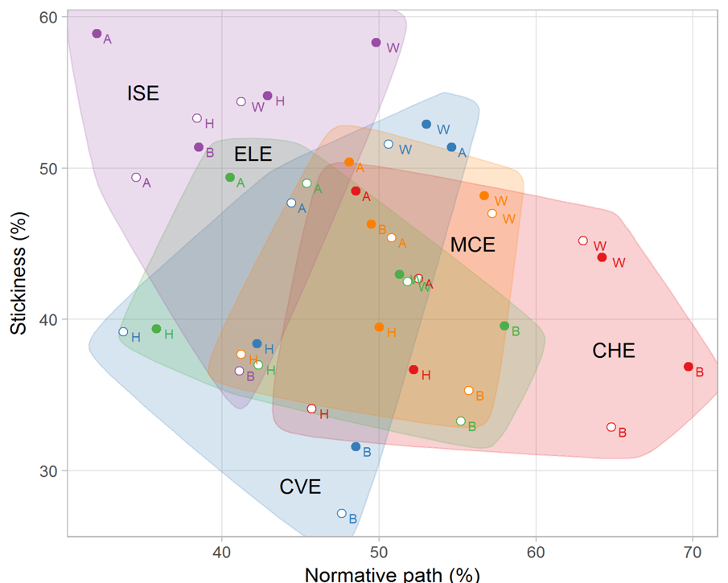

visualizing data
================

447 / 547 Visualizing Data. An introductory course by Richard Layton at
Rose-Hulman Institute of Technology.

Introduction

  - [About the course](cm/cm002-course-about.md#about-the-course)  
  - [Syllabus](cm/cm001-course-syllabus.md#syllabus)  
  - [License](LICENSE.md#licenses)

Frequent links

  - [Portfolio document
    requirements](cm/cm300-report-portfolio-reqts.md#portfolio-document-requirements)
  - [Portfolio data
    requirements](cm/cm301-report-display-reqts.md#portfolio-data-requirements)  
  - [Data and functions index](cm/cm906-software-function-index.md)  
  - [Data sources](cm/cm108-data-sources.md#data-sources)  
  - [Readings](#readings)  
  - [Index](#index)  
  - [Help](cm/cm003-getting-help.md)

## calendar

 paper reprint, with permission  
 e-copy on Moodle, with permission  
 suggested reading in *R for Data Science*
(Wickham and Grolemund,
[2017](#ref-Wickham+Grolemund:2017))

| w  | d | agenda & assignments                                                                                                                                                                                                                                                                                                                                                                                                                                                                                                                                                                                                                                                                                                                                                                                                                                            | milestones                                                                                                          | due                                                                                                                                      |
| :- | :- | :-------------------------------------------------------------------------------------------------------------------------------------------------------------------------------------------------------------------------------------------------------------------------------------------------------------------------------------------------------------------------------------------------------------------------------------------------------------------------------------------------------------------------------------------------------------------------------------------------------------------------------------------------------------------------------------------------------------------------------------------------------------------------------------------------------------------------------------------------------------- | :------------------------------------------------------------------------------------------------------------------ | :--------------------------------------------------------------------------------------------------------------------------------------- |
| 1  | M | Course goals and outcomes \[[slides](slides/sd011-course-welcome.pdf)\] [Sign-out two reprints](cm/cm401-rhetoric-reprints.md#signout-reprints)  [1.1 What you will learn](https://r4ds.had.co.nz/introduction.html#what-you-will-learn)                                                                                                                                                                                                                                                                                                                                                                                                                                                                                                                                                                                      |                                                                                                                     |                                                                                                                                          |
|    | T | Limitations of common graphs \[[slides](slides/sd012-limitations-common-graphs.pdf)\] Calendar, [syllabus](cm/cm001-course-syllabus.md#syllabus), [portfolio](cm/cm301-report-display-reqts.md#portfolio-display-requirements) [Install software](cm/cm901-software-install.md#install-software)  [1.4 Prerequisites](https://r4ds.had.co.nz/introduction.html#prerequisites)                                                                                                                                                                                                                                                                                                                                                                                                                                              |                                                                                                                     |                                                                                                                                          |
|    | R | Relating data structure to graph design  Doumont ([2009](#ref-Doumont:2009:Ch.4)) Designing the graph                                                                                                                                                                                                                                                                                                                                                                                                                                                                                                                                                                                                                                                                                                                        |                                                                                                                     |                                                                                                                                          |
|    | F | [Software studio](cm/cm902-software-studio.md#software-studio) [R basics](cm/cm903-software-R-basics.md#R-basics) \[[exercises](cm/cm903-software-R-basics.md#exercises)\]  [4.1 Coding basics](https://r4ds.had.co.nz/workflow-basics.html#coding-basics)  [4.2 What’s in a name?](https://r4ds.had.co.nz/workflow-basics.html#whats-in-a-name)  [4.3 Calling functions](https://r4ds.had.co.nz/workflow-basics.html#calling-functions)                                                                                                                                                                                                                                                                                                                        | Software setup complete                                                                                             |                                                                                                                                          |
| 2  | M | [Graph basics](cm/cm201-graph-basics.md#graph-basics) \[[exercises](cm/cm201-graph-basics.md#exercises)\]  [3.10 The layered grammar of graphics](https://r4ds.had.co.nz/data-visualisation.html#the-layered-grammar-of-graphics)                                                                                                                                                                                                                                                                                                                                                                                                                                                                                                                                                                                                | wk1 lab complete                                                                                                    |                                                                                                                                          |
|    | T |  Tufte ([1997](#ref-Tufte:1997)) Decision to launch Challenger                                                                                                                                                                                                                                                                                                                                                                                                                                                                                                                                                                                                                                                                                                                                                                  |                                                                                                                     | [Reading prompts 1](reports/reading-prompts-1.Rmd)                                                                                       |
|    | R | [Data basics](cm/cm101-data-basics.md#data-basics) \[[slides](slides/sd021-data-basics.pdf)\] \[[exercises](cm/cm101-data-basics.md#exercises)\]                                                                                                                                                                                                                                                                                                                                                                                                                                                                                                                                                                                                                                                                                                                |                                                                                                                     |                                                                                                                                          |
|    | F | [Data studio](cm/cm102-data-studio.md#data-studio) [Data sources](cm/cm108-data-sources.md#data-sources)  [Managing files](cm/cm501-proj-m-manage-files.md#file-management) \[[slides](slides/sd034-proj-m-manage-files.pdf)\] [Interacting with R](cm/cm101b-interacting-with-R.md#interacting-with-R) Return reprints  [6.1 Running code](https://r4ds.had.co.nz/workflow-scripts.html)  [6.2 RStudio diagnostics](https://r4ds.had.co.nz/workflow-scripts.html)                                                                                                                                                                                                                                                                                                                    | Start acquiring data [Portfolio data requirements](cm/cm301-report-display-reqts.md#portfolio-data-requirements) |                                                                                                                                          |
| 3  | M | [Markdown basics](cm/cm305-report-rmd-basics.md) \[[slides](slides/sd031-rmd-basics.pdf)\] [RStudio tips](cm/cm905-software-RStudio-tips.md#rstudio-tips)                                                                                                                                                                                                                                                                                                                                                                                                                                                                                                                                                                                                                                                                                                    | wk2 lab, tutorials, & exercises                                                                                     |                                                                                                                                          |
|    | T | [Design basics](cm/cm402-rhetoric-design-basics.md#design-basics)  Robbins ([2013](#ref-Robbins:2013:Ch.6)[a](#ref-Robbins:2013:Ch.6)) General design principles                                                                                                                                                                                                                                                                                                                                                                                                                                                                                                                                                                                                                                                               |                                                                                                                     |                                                                                                                                          |
|    | R | [D1 requirements:](cm/cm301-report-display-reqts.md#D1-distributions) Distributions [Strip plot](cm/cm202-graph-strip-plot.md#strip-plot) \[[exercises](cm/cm202-graph-strip-plot.md#exercises)\] [Box plot](cm/cm203-graph-boxplot.md#box-plots) \[[exercises](cm/cm203-graph-boxplot.md#exercises)\]                                                                                                                                                                                                                                                                                                                                                                                                                                                                                                                                                    | D1 data acquired                                                                                                    |                                                                                                                                          |
|    | F | [Portfolio studio](cm/cm302-report-portfolio-studio.md#portfolio-studio) [Sample portfolio skeleton](https://github.com/graphdr/portfolio-sample) [Document design](cm/cm304-report-document-design.md#document-design) [Document requirements](cm/cm300-report-portfolio-reqts.md#portfolio-document-requirements) [Data requirements](cm/cm301-report-display-reqts.md#portfolio-data-requirements)  Sample portfolio entries and critiques  [27.2 R Markdown basics](https://r4ds.had.co.nz/r-markdown.html#r-markdown-basics)  [27.3 Text formatting with Markdown](https://r4ds.had.co.nz/r-markdown.html#text-formatting-with-markdown)  [27.4 Code chunks](https://r4ds.had.co.nz/r-markdown.html#code-chunks) |                                                                                                                     |                                                                                                                                          |
| 4  | M | [Reshaping data](cm/cm103-data-reshaping.md#reshaping-data) \[[exercises](cm/cm103-data-reshaping.md#exercises)\]  [12.2 Tidy data](https://r4ds.had.co.nz/tidy-data.html#tidy-data-1)  [12.4 Separating and uniting](https://r4ds.had.co.nz/tidy-data.html#separating-and-uniting)  [12.7 Non-tidy data](https://r4ds.had.co.nz/tidy-data.html#non-tidy-data)                                                                                                                                                                                                                                                                                                                                                                                                     | wk3 lab, tutorials, & exercises                                                                                     |                                                                                                                                          |
|    | T |  Wainer ([2014](#ref-Wainer:2014:Sec.2.9)) 15 displays about one thing                                                                                                                                                                                                                                                                                                                                                                                                                                                                                                                                                                                                                                                                                                                                                            |                                                                                                                     | [Reading prompts 2](reports/reading-prompts-2.Rmd)                                                                                       |
|    | R | [D2 requirements:](cm/cm301-report-display-reqts.md#D2-multiway) Multiways [Multiway dot plot](cm/cm204-graph-multiway.md#multiway-dot-plot) \[[exercises](cm/cm204-graph-multiway.md#exercises)\]                                                                                                                                                                                                                                                                                                                                                                                                                                                                                                                                                                                                                                                           | D2 data acquired                                                                                                    |                                                                                                                                          |
|    | F | Presentations, practice, & portfolio studio                                                                                                                                                                                                                                                                                                                                                                                                                                                                                                                                                                                                                                                                                                                                                                                                                     |                                                                                                                     | D1 graph & prose [Presentation prompts](reports/presentation-prompts.Rmd)                                                             |
| 5  | M | [Introducing factors](cm/cm106-data-nature-of-factors.md) [Working with factors](cm/cm107-data-working-with-factors.md) \[[exercises](cm/cm107-data-working-with-factors.md#exercises)\]  [15.2 Creating factors](https://r4ds.had.co.nz/factors.html#creating-factors)  [15.4 Modifying factor order](https://r4ds.had.co.nz/factors.html#modifying-factor-order)  [15.5 Modifying factor levels](https://r4ds.had.co.nz/factors.html#modifying-factor-levels)                                                                                                                                                                                                                                                                                                 | wk4 tutorials & exercises                                                                                           |                                                                                                                                          |
|    | T | [Discovering stories](cm/cm403-rhetoric-discovering-stories.md#discovering-stories) \[[reading](cm/cm403-rhetoric-discovering-stories.md#reading)\] \[[reflection](cm/cm403-rhetoric-discovering-stories.md#reflection-on-rhetoric)\]                                                                                                                                                                                                                                                                                                                                                                                                                                                                                                                                                                                                                           |                                                                                                                     |                                                                                                                                          |
|    | R | [D3 requirements:](cm/cm301-report-display-reqts.md#D3-correlations) Exploring correlations [Scatterplot](cm/cm205-graph-scatterplot.md#scatterplot) [\[exercises\]](cm/cm205-graph-scatterplot.md#exercises)  [28.2 Label](https://r4ds.had.co.nz/graphics-for-communication.html#label)                                                                                                                                                                                                                                                                                                                                                                                                                                                                                                                                     | D3 data acquired                                                                                                    |                                                                                                                                          |
|    | F | Presentations, practice, & portfolio studio                                                                                                                                                                                                                                                                                                                                                                                                                                                                                                                                                                                                                                                                                                                                                                                                                     |                                                                                                                     | D2 graph & prose [Presentation prompts](reports/presentation-prompts.Rmd) [Reflection on rhetoric](reports/video-reflection-1.Rmd) |
| 6  | M | [Data carpentry with joins](cm/cm105-data-joins.md#data-carpentry-with-joins) \[[exercises](cm/cm105-data-joins.md#exercises)\]                                                                                                                                                                                                                                                                                                                                                                                                                                                                                                                                                                                                                                                                                                                                 | wk5 tutorials & exercises                                                                                           |                                                                                                                                          |
|    | T | [D4 requirements:](cm/cm301-report-display-reqts.md#D4-injuries-or-fatalities) Graph injuries/fatalities ethically [Dot plot](cm/cm206-graph-dot-plot.md#dot-plot) \[[exercises](cm/cm206-graph-dot-plot.md#exercises)\] Line graph \[exercises\]  Dragga and Voss ([2001](#ref-Dragga+Voss:2001)) Cruel pies                                                                                                                                                                                                                                                                                                                                                                                                                                                                                                            |                                                                                                                     | [Reading prompts 3](reports/reading-prompts-3.Rmd)                                                                                       |
|    | R | Data carpentry                                                                                                                                                                                                                                                                                                                                                                                                                                                                                                                                                                                                                                                                                                                                                                                                                                                  | D4 data acquired                                                                                                    |                                                                                                                                          |
|    | F | Presentations, practice, & portfolio studio                                                                                                                                                                                                                                                                                                                                                                                                                                                                                                                                                                                                                                                                                                                                                                                                                     |                                                                                                                     | D3 graph & prose [Presentation prompts](reports/presentation-prompts.Rmd)                                                             |
| 7  | M | Visual lies  Wainer ([2000](#ref-Wainer:2000:Ch.1)) How to display data badly                                                                                                                                                                                                                                                                                                                                                                                                                                                                                                                                                                                                                                                                                                                                                  | wk6 tutorials & exercises                                                                                           |                                                                                                                                          |
|    | T | [D5 requirements:](cm/cm301-report-display-reqts.md#D5-redesign-a-graphical-lie) Redesign a graphical lie Time series \[exercises\] Using constant dollars \[exercises\]  [16.2 Creating date/times](https://r4ds.had.co.nz/dates-and-times.html#creating-datetimes)  [16.3 Date-time components](https://r4ds.had.co.nz/dates-and-times.html#date-time-components)  [16.4 Time spans](https://r4ds.had.co.nz/dates-and-times.html#time-spans)                                                                                                                                                                                                                                                                                                               |                                                                                                                     |                                                                                                                                          |
|    | R | Scales \[exercises\]  Robbins ([2013](#ref-Robbins:2013:Ch.7)[b](#ref-Robbins:2013:Ch.7)) Scales  [28.4 Scales](https://r4ds.had.co.nz/graphics-for-communication.html#scales)                                                                                                                                                                                                                                                                                                                                                                                                                                                                                                                                                                                                                  | D5 data acquired                                                                                                    |                                                                                                                                          |
|    | F | Presentations, practice, & portfolio studio                                                                                                                                                                                                                                                                                                                                                                                                                                                                                                                                                                                                                                                                                                                                                                                                                     |                                                                                                                     | D4 graph & prose [Presentation prompts](reports/presentation-prompts.Rmd)                                                             |
| 8  | M | [D6 requirements:](cm/cm301-report-display-reqts.md#D6-multivariate) Multivariate data Co-plot \[exercises\] Scatterplot matrix \[exercises\] Parallel coordinate \[exercises\]                                                                                                                                                                                                                                                                                                                                                                                                                                                                                                                                                                                                                                                                        | wk7 tutorials & exercises                                                                                           |                                                                                                                                          |
|    | T |  Kostelnick ([2007](#ref-Kostelnick:2007)) Conundrum of clarity                                                                                                                                                                                                                                                                                                                                                                                                                                                                                                                                                                                                                                                                                                                                                                   |                                                                                                                     | [Reading prompts 4](reports/reading-prompts-4.Rmd)                                                                                       |
|    | R | Color \[exercises\]                                                                                                                                                                                                                                                                                                                                                                                                                                                                                                                                                                                                                                                                                                                                                                                                                                             | D6 data acquired                                                                                                    |                                                                                                                                          |
|    | F | Presentations, practice, & portfolio studio                                                                                                                                                                                                                                                                                                                                                                                                                                                                                                                                                                                                                                                                                                                                                                                                                     |                                                                                                                     | D5 graph & prose [Presentation prompts](reports/presentation-prompts.Rmd)                                                             |
| 9  | M | [D7 requirements:](cm/cm301-report-display-reqts.md#D7-self-taught) Learn a display on your own Cycle plot \[example\] Mosaic plot \[example\] Financial (OHLC) plot \[example\] Diverging stacked bar \[example\] Linked micromaps \[example\] Proportional symbol map \[example\] Dot density map \[example\]                                                                                                                                                                                                                                                                                                                                                                                                                                                                                                                            | wk8 tutorials & exercises                                                                                           |                                                                                                                                          |
|    | T | Revising portfolio entries Reading                                                                                                                                                                                                                                                                                                                                                                                                                                                                                                                                                                                                                                                                                                                                                                                                                       |                                                                                                                     |                                                                                                                                          |
|    | R | Data tables \[exercises\] Rendering multiple files \[exercises\]                                                                                                                                                                                                                                                                                                                                                                                                                                                                                                                                                                                                                                                                                                                                                                                             | D7 data acquired                                                                                                    |                                                                                                                                          |
|    | F | Presentations, practice, & portfolio studio                                                                                                                                                                                                                                                                                                                                                                                                                                                                                                                                                                                                                                                                                                                                                                                                                     |                                                                                                                     | D6 graph & prose [Presentation prompts](reports/presentation-prompts.Rmd)                                                             |
| 10 | M | Graph design improvisation [ggplot extensions](http://www.ggplot2-exts.org/gallery/)                                                                                                                                                                                                                                                                                                                                                                                                                                                                                                                                                                                                                                                                                                                                                                         | wk9 tutorials & exercises                                                                                           |                                                                                                                                          |
|    | T |  Spence ([2006](#ref-Spence:2006)) Playfair & psychology of graphs                                                                                                                                                                                                                                                                                                                                                                                                                                                                                                                                                                                                                                                                                                                                                                |                                                                                                                     | [Reading prompts 5](reports/reading-prompts-5.Rmd)                                                                                       |
|    | R | Work in class Course evaluations                                                                                                                                                                                                                                                                                                                                                                                                                                                                                                                                                                                                                                                                                                                                                                                                                             |                                                                                                                     |                                                                                                                                          |
|    | F | [Portfolio final editing](cm/cm307-report-final-editing.md) Presentations, practice, & portfolio studio                                                                                                                                                                                                                                                                                                                                                                                                                                                                                                                                                                                                                                                                                                                                                      |                                                                                                                     | D7 graph & prose [Presentation prompts](reports/presentation-prompts.Rmd)                                                             |
| 11 | M | Finals week, no class [The portfolio after the term](cm/cm306-report-edit-after-term.md) [Updating the R habitat](cm/cm904-software-R-update.md#updating-the-R-habitat)                                                                                                                                                                                                                                                                                                                                                                                                                                                                                                                                                                                                                                                                                   |                                                                                                                     | Portfolio                                                                                                                                |

<a href="#top">▲ top of page</a>

# index

<small> <i>Index</i>, free clip art from
<a href="http://clipartstockphotos.com/">Clickartstockphotos</a>  </small>

[course management](#course-management)  
[R & RStudio](#r-rstudio)  
[data](#data)  
[graphs](#graphs)  
[portfolio](#portfolio)  
[visual rhetoric and graph design](#visual-rhetoric-and-graph-design)  
[project management](#project-management)  
[software](#software)  
[readings](#readings)

## course management

  - [Introductory slides](slides/sd001-course-welcome.pdf)  
  - [About the course](cm/cm002-course-about.md#about-the-course)
  - [Syllabus](cm/cm001-course-syllabus.md#syllabus)  
  - [Calendar](#calendar)
  - [Help links](cm/cm003-getting-help.md)
  - [License](LICENSE.md)

## R & RStudio

  - [R basics](cm/cm903-software-R-basics.md#R-basics)
  - [Interacting with
    R](cm/cm101b-interacting-with-R.md#interacting-with-R)  
  - [RStudio tips](cm/cm905-software-RStudio-tips.md#rstudio-tips)  
  - [Updating the R
    habitat](cm/cm904-software-R-update.md#updating-the-R-habitat)  
  - [Color names in
    R](http://www.stat.columbia.edu/~tzheng/files/Rcolor.pdf)
  - [R functions in
    tutorials](cm/cm906-software-function-index.md#functions)

## data

[Data sources](cm/cm108-data-sources.md#data-sources)  
[Data links](cm/cm102-data-studio.md#data-links)

Basics

  - [Data basics slides](../slides/sd021-data-basics.pdf)  
  - [Four basic data
    skills](cm/cm101-data-basics.md#four-basic-data-skills)  
  - [Data in base R and in R
    packages](cm/cm101-data-basics.md#data-in-base-R-and-in-R-package)  
  - [Reading raw data
    files](cm/cm101-data-basics.md#reading-raw-data-files)  
  - [Web download using
    import()](cm/cm103-data-reshaping.md#web-download-using-import)
  - [Data directory write and
    read](cm/cm101-data-basics.md#data-directory-write-and-read)  
  - [all R objects have
    types](cm/cm106-data-nature-of-factors.md#all-R-objects-have-types)  
  - [some R objects have
    attributes](cm/cm106-data-nature-of-factors.md#)  
  - [all R objects have
    class](cm/cm106-data-nature-of-factors.md#all-R-objects-have-class)  
  - [Datasets in tutorials](cm/cm906-software-function-index.md#data)

Factors

  - [factor type and
    attributes](cm/cm106-data-nature-of-factors.md#factor-type-and-attributes)  
  - [factor
    definition](cm/cm106-data-nature-of-factors.md#factor-definition)  
  - [creating a factor
    variable](cm/cm107-data-working-with-factors.md#creating-a-factor-variable)  
  - [reorder factor levels
    manually](cm/cm107-data-working-with-factors.md#reorder-factor-levels-manually)  
  - [reorder factor levels by a date
    variable](cm/cm107-data-working-with-factors.md#reorder-factor-levels-by-a-date-variable)  
  - [reorder factor levels by a quantitative
    variable](cm/cm107-data-working-with-factors.md#reorder-factor-levels-by-a-quantitative-variable)  
  - [reorder factor levels by frequency of
    levels](cm/cm107-data-working-with-factors.md#reorder-factor-levels-by-frequency-of-levels)  
  - [recode factor
    levels](cm/cm107-data-working-with-factors.md#recode-factor-levels)  
  - [remove unused
    levels](cm/cm107-data-working-with-factors.md#remove-unused-levels)  
  - [reverse factor level
    order](cm/cm107-data-working-with-factors.md#reverse-factor-level-order)

Data studio

  - [Classify your data
    structure](cm/cm102-data-studio.md#classify-your-data-structure)  
  - [Use Notepad for CSV
    files](cm/cm102-data-studio.md#use-notepad-for-csv-files)  
  - [Workflow basics](cm/cm102-data-studio.md#workflow-basics)  
  - [Data transformation](cm/cm102-data-studio.md#data-transformation)
    `filter()`, `arrange()`, `select()`, `mutate()`, `group_by()`, and
    `dplyr::summarize()`  
  - [Data import](cm/cm102-data-studio.md#data-import)  
  - [Data links](cm/cm102-data-studio.md#data-links)

<!-- Data tables  -->

<!-- - link -->

Data carpentry

  - [Data in row names](cm/cm103-data-reshaping.md#data-in-row-names)  
  - [Keys and values in coordinatized
    data](cm/cm103-data-reshaping.md#keys%20and-values-in-coordinatized-data)  
  - [rowrecs\_to\_blocks()](cm/cm103-data-reshaping.md#rowrecs_to_blocks)  
  - [blocks\_to\_rowrecs()](cm/cm103-data-reshaping.md#blocks_to_rowrecs)  
  - [WHO case study in data
    reshaping](cm/cm103-data-reshaping.md#WHO-case-study-in-data-reshaping)  
  - [Web download using
    import()](cm/cm103-data-reshaping.md#web-download-using-import)
  - [select with
    matches()](cm/cm103-data-reshaping.md#select-with-matches)  
  - [unpivot\_to\_blocks()](cm/cm103-data-reshaping.md#unpivot_to_blocks)  
  - [drop\_na()](cm/cm103-data-reshaping.md#drop_na)  
  - [str\_replace()](cm/cm103-data-reshaping.md#str_replace)  
  - [separate()](cm/cm103-data-reshaping.md#separate)  
  - [WHO group\_by() and
    summarize()](cm/cm103-data-reshaping.md#WHO-group_by\(\)-and-summarize)  
  - [WHO graphs](cm/cm103-data-reshaping.md#WHO-graphs)

Data exercises

  - [Data basics exercises](cm/cm101-data-basics.md#exercises)  
  - [4.4.1](https://r4ds.had.co.nz/workflow-basics.html#practice)
    workflow  
  - [4.4.2](https://r4ds.had.co.nz/workflow-basics.html#practice)
    workflow  
  - [4.4.3](https://r4ds.had.co.nz/workflow-basics.html#practice)
    workflow  
  - [5.2.4](https://r4ds.had.co.nz/transform.html#exercises-7)
    `filter()`  
  - [5.3.1](https://r4ds.had.co.nz/transform.html#exercises-8)
    `arrange()`  
  - [5.4.1](https://r4ds.had.co.nz/transform.html#exercises-9)
    `select()`  
  - [5.5.2](https://r4ds.had.co.nz/transform.html#exercises-10)
    `mutate()`  
  - [5.6.7](https://r4ds.had.co.nz/transform.html#exercises-11)
    `group_by()`  
  - [Data reshaping](cm/cm103-data-reshaping.md#exercises)
    `pivot_to_rowrecs()`, `unpivot_to_blocks()`, `rowrecs_to_blocks()`,
    and `blocks_to_rowrecs()`

[▲ index](README.md#index)

## graphs

Graph tutorials

  - [Graph basics](cm/cm201-graph-basics.md#graph-basics)  
  - [Strip plot](cm/cm202-graph-strip-plot.md#strip-plot)  
  - [Box plot](cm/cm203-graph-boxplot.md#box-plot)  
  - [Multiway dot plot](cm/cm204-graph-multiway.md#multiway-dot-plot)
  - [Scatterplot](cm/cm205-graph-scatterplot.md#scatterplot)
  - [Dot plot](cm/cm206-graph-dot-plot.md#dot-plot)  
  - Line graph  
  - Time series  
  - Constant dollars  
  - Co-plot  
  - Scatterplot matrix  
  - Parallel coordinate

Graph exercises

  - [Graph basics exercises](cm/cm201-graph-basics.md#exercises)
  - [Strip plot exercises](cm/cm202-graph-strip-plot.md#exercises)
  - [Box plot exercises](cm/cm203-graph-boxplot.md#exercises)  
  - [Multiway dot plot exercises](cm/cm204-graph-multiway.md#exercises)
  - [Scatterplot exercises](cm/cm205-graph-scatterplot.md#exercises)
  - [Dot plot exercises](cm/cm206-graph-dot-plot.md#exercises)  
  - Line graph exercises  
  - Time series exercises  
  - Constant dollars exercises  
  - Co-plot exercises  
  - Scatterplot matrix exercises  
  - Parallel coordinate exercises

[▲ index](README.md#index)

## portfolio

[Sample portfolio
skeleton](https://github.com/graphdr/portfolio-sample)  
[Document
requirements](cm/cm300-report-portfolio-reqts.md#portfolio-document-requirements)  
[Document design](cm/cm304-report-document-design.md#document-design)  
[Data
requirements](cm/cm301-report-display-reqts.md#portfolio-data-requirements)

  - [D1
    distributions](cm/cm301-report-display-reqts.md#D1-distributions)
  - [D2 multiway](cm/cm301-report-display-reqts.md#D2-multiway)
  - [D3 correlations](cm/cm301-report-display-reqts.md#D3-correlations)
  - [D4 injuries or
    fatalities](cm/cm301-report-display-reqts.md#D4-injuries-or-fatalities)
  - [D5 redesign a graphical
    lie](cm/cm301-report-display-reqts.md#D5-redesign-a-graphical-lie)
  - [D6 multivariate](cm/cm301-report-display-reqts.md#D6-multivariate)
  - [D7 self-taught](cm/cm301-report-display-reqts.md#D7-self-taught)

R Markdown basics

  - [Rmd basics](cm/cm305-report-rmd-basics.md)  
  - [create an Rmd
    script](cm/cm305-report-rmd-basics.md#create-an-Rmd-script)  
  - [set the Rmd output
    format](cm/cm305-report-rmd-basics.md#set-the-Rmd-output-format)  
  - [how to format
    text](cm/cm305-report-rmd-basics.m#how-to-format-text)  
  - [initialize a
    report](cm/cm305-report-rmd-basics.md#initialize-a-report)  
  - [initialize knitr](cm/cm305-report-rmd-basics.md)  
  - [introductory
    prose](cm/cm305-report-rmd-basics.md#initialize-knitr)  
  - [using code
    chunks](cm/cm305-report-rmd-basics.md#using-code-chunks)  
  - [source R
    scripts](cm/cm305-report-rmd-basics.md#source\(\)-R-cripts)  
  - [data table](cm/cm305-report-rmd-basics.md#data-able)  
  - [include
    graphics](cm/cm305-report-rmd-basics.md#include_graphics\(\))  
  - [spell check](cm/cm305-report-rmd-basics.md#spell-check)

Resources

  - [Setup reading
    responses](cm/cm902-software-studio.md#setup-reading-response)
  - [Document
    design](cm/cm304-report-document-design.md#document-design)
  - [Media](cm/cm304-report-document-design.md#media)  
  - [Fonts](cm/cm304-report-document-design.md#fonts)  
  - [Headings](cm/cm304-report-document-design.md#headingsn)  
  - [Text color](cm/cm304-report-document-design.md#text-color)  
  - [Emphasis](cm/cm304-report-document-design.md#emphasis)  
  - [Hyphens and
    dashes](cm/cm304-report-document-design.md#hyphens-and-dashes)
  - [Color names in
    R](http://www.stat.columbia.edu/~tzheng/files/Rcolor.pdf)  
  - [Portfolio final
    editing](cm/cm307-report-final-editing.md#final-editing)
  - [The portfolio after the
    term](cm/cm306-report-edit-after-term.md#the-portfolio-after-the-term)

Citations and references

  - [BiBTeX](cm/cm303-report-bibtex.md)  
  - [entry types](cm/cm303-report-bibtex.md#entry-types)
  - [citation keys](cm/cm303-report-bibtex.md#citation-keys)
  - [fields](cm/cm303-report-bibtex.md#fields)
  - [notes on usage](cm/cm303-report-bibtex.md#notes-on-usage)
  - [articles](cm/cm303-report-bibtex.md#articles)  
  - [books](cm/cm303-report-bibtex.md#books)
  - [in a book](cm/cm303-report-bibtex.md#in-a-book)
  - [in proceedings](cm/cm303-report-bibtex.md#in-proceedings)
  - [web pages](cm/cm303-report-bibtex.md#web-pages)
  - [software](cm/cm303-report-bibtex.md#software)
  - [summary of entry types](cm/cm303-report-bibtex.md#summary)

Portfolio studio

  - [Adding links to
    README](cm/cm302-report-portfolio-studio.md#adding-links-to-README)  
  - [Importing
    images](cm/cm302-report-portfolio-studio.md#importing-images)  
  - [Typesetting
    mathematics](cm/cm302-report-portfolio-studio.md#typesetting-mathematics)  
  - [Create the bib
    file](cm/cm302-report-portfolio-studio.md#create-the-bib-file)  
  - [BiBTeX entry types](cm/cm303-report-bibtex.md)  
  - [YAML bibliography
    argument](cm/cm302-report-portfolio-studio.md#YAML-bibliography-argument)  
  - [Add a
    citation](cm/cm302-report-portfolio-studio.md#add-a-citation)  
  - [Add a references
    heading](cm/cm302-report-portfolio-studio.md#add-a-references-heading)  
  - [Format the citations and
    references](cm/cm302-report-portfolio-studio.md#format-the-citations-and-references)  
  - [Reading
    responses](cm/cm302-report-portfolio-studio.md#reading-responses)
  - [Presentation
    responses](cm/cm302-report-portfolio-studio.md#presentation-responses)

[▲ index](README.md#index)

## visual rhetoric and graph design

  - [Color names in
    R](http://www.stat.columbia.edu/~tzheng/files/Rcolor.pdf)  
  - [Design basics](cm/cm402-rhetoric-design-basics.md#design-basics)  
  - [Discovering
    stories](cm/cm403-rhetoric-discovering-stories.md#discovering-stories)  
  - [Video links](cm/cm403-rhetoric-discovering-stories.md#video-links)

**Reading prompts** Copy and paste the Rmd markup into your own Rmd
file(s)

  - [Reading prompts 1](reports/reading-prompts-1.Rmd) Tufte (1997)
    Decision to launch Challenger  
  - [Reading prompts 2](reports/reading-prompts-2.Rmd) Wainer (2014) 15
    displays about one thing  
  - [Reading prompts 3](reports/reading-prompts-3.Rmd) Dragga and Voss
    (2001) Cruel pies  
  - [Reading prompts 4](reports/reading-prompts-4.Rmd) Kostelnick (2007)
    Conundrum of clarity  
  - [Reading prompts 5](reports/reading-prompts-5.Rmd) Spence (2006)
    Playfair & psychology of graphs  
  - [Reflection on
    rhetoric](cm/cm403-rhetoric-discovering-stories.md#reflection-on-rhetoric)

## project management

  - [Introductory slides](slides/sd021-proj-m-manage-files.pdf)  
  - [Managing files](cm/cm501-proj-m-manage-files.md#managing-files)  
  - [Planning the directory
    structure](cm/cm501-proj-m-manage-files.md#plan-the-directory-structure)  
  - [Hyphens and underscores in file
    names](cm/cm501-proj-m-manage-files.md#hyphens-and%20underscores-in-file-names)  
  - [Planning a file-naming
    scheme](cm/cm501-proj-m-manage-files.md#plan-a-file-naming-scheme)  
  - [Using relative
    paths](cm/cm501-proj-m-manage-files.md#using-relative-paths)  
  - [Searching files](cm/cm501-proj-m-manage-files.md#searching-files)

[▲ index](README.md#index)

## software

Getting started

  - [Install R and
    RStudio](cm/cm901-software-install.md#install-R-and-RStudio)
  - [Install git](cm/cm901-software-install.md#install-git)
  - [Create a library for
    packages](cm/cm901-software-install.md#create-a-library-for-packages)
  - [Test the initial
    installation](cm/cm901-software-install.md#test-the-installation)

Software studio

  - [Setup GitHub](cm/cm902-software-studio.md#setup-GitHub)
  - [Create a repo](cm/cm902-software-studio.md#create-a-repo)
  - [Invite
    collaborator](cm/cm902-software-studio.md#invite-collaborator)
  - [Create an Rproject](cm/cm902-software-studio.md#create-an-Rproject)
  - [Create the
    Renviron](cm/cm902-software-studio.md#create-the-Renviron)
  - [Setup directories](cm/cm902-software-studio.md#setup-directories)
  - [Edit gitignore](cm/cm902-software-studio.md#edit-gitignore)
  - [Setup README](cm/cm902-software-studio.md#setup-README)
  - [Setup reading
    responses](cm/cm902-software-studio.md#setup-reading-response)  
  - [Commits](cm/cm902-software-studio.md#commits)

[▲ index](README.md#index)

## readings

Doumont J-L (2009) Designing the graph. *Trees, maps, and theorems:
Effective communication for rational minds*. Principiae, Kraainem,
Belgium, 133–143 <http://www.treesmapsandtheorems.com/>

Dragga S and Voss D (2001) Cruel pies: The inhumanity of technical
illustrations. *Technical Communication* **48**(3), 265–274

Knaflic CN (2012a) Telling multiple stories (part 1).
<http://tinyurl.com/y4oz8vtv>

Knaflic CN (2012b) Telling multiple stories (part 2).
<http://tinyurl.com/y4jk4jjs>

Knaflic CN (2012c) And the winner is... <http://tinyurl.com/y462kkbz>

Knaflic CN (2013a) Logic in order. <http://tinyurl.com/yxf8gspl>

Knaflic CN (2013b) The right amount of detail.
<http://tinyurl.com/y24gn8o4>

Knaflic CN (2014) Multifaceted data and story.
<http://tinyurl.com/yxq8xuf2>

Kostelnick C (2007) The visual rhetoric of data displays: The conundrum
of clarity. *IEEE Transactions on Professional Communication* **50**(2),
280–294

Robbins N (2013a) General principles for creating effective graphs.
*Creating More Effective Graphs*. Chart House, Wayne, NJ, 154–225
<http://www.nbr-graphs.com/resources/recommended-books/>

Robbins N (2013b) Scales. *Creating More Effective Graphs*. Chart House,
Wayne, NJ, 226–291
<http://www.nbr-graphs.com/resources/recommended-books/>

Spence I (2006) William Playfair and the psychology of graphs. *IEEE
Transactions on Professional Communication*. American Statistical
Association, Alexandria, VA, 2426–2436 <http://tinyurl.com/y2njxrbv>

Tufte E (1997) The decision to launch the space shuttle Challenger.
*Visual and statistical thinking: Displays of evidence for making
decisions*. Graphics Press, Cheshire, CT, 16–31
<https://www.edwardtufte.com/tufte/books_textb>

Wainer H (2000) Graphical failures: How to display data badly. *Visual
revelations: Graphical tales of fate and deception from Napoleon
Bonaparte To Ross Perot*. Psychology Press, Mahwah, NJ, 11–40

Wainer H (2014) Fifteen displays about one thing. *Medical
illuminations: Using evidence, visualization, and statistical thinking
to improve healthcare*. Oxford University Press, Oxford, UK, 32–49

Wickham H and Grolemund G (2017) *R for Data Science.* O’Reilly Media,
Inc., Sebastopol, CA <https://r4ds.had.co.nz/>

<a href="#top">▲ top of page</a>  
[▲ calendar](README.md#calendar)  
[▲ index](README.md#index)
