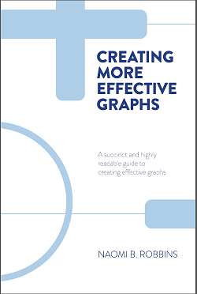

# syllabus

## description  

ME447/ME547 Visualizing Data (4R-0L-4C). 

The course is about creating truthful and compelling data visuals. We study elements of statistical analysis, programming in R, human perception, graphic design, and visual rhetoric and ethics. After successfully completing this course, students should be able to design effective and truthful data displays, credibly explain their design rationale, produce publication‐quality visuals, and credibly critique a data display. Prior experience with R is not required.

## prerequisites

447: Junior standing 
547: Instructor permission required. Graduate students only with a project underway generating quantitative data.    

## instructor

Richard Layton, Ph.D., P.E. 
Professor of Mechanical Engineering 
Moench Hall C-217 
layton@rose-hulman.edu 
812-877-8905    

## required textbook

Naomi Robbins, 2013, *Creating More Effective Graphs*, Chart House. Avoid the earlier Wiley editions (except printings 1--4).

    

## objectives

After successfully completing this course, students should be able to:

- Design effective and truthful data displays 
- Credibly explain their design rationale 
- Produce publication-quality visuals 
- Credibly critique a data display 

 
## grades

Grades are earned based on the [Institute standards](http://www.rose-hulman.edu/campus-life/student-services/registrar/rules-and-procedures/grades.html), for example, an "A" is an *honor grade*, a "B" is awarded for *thorough competence*, and a "C" indicates that *minimum standards have been met*.

The major deliverables and their relative weights are:

- (25%) Weekly submissions and class participation 
- (75%) You final portfolio of data graphics and written critiques  

 
## homework 

Success in this course depends on steady and productive weekly progress. Weekly assignments (see the [Calendar](cm/admin-02_calendar.pdf) for details) include 

- R tutorials (about 20 total). We will have some time in class to get started. Plan to finish current tutorials before the start of class on the following Monday. 
- Data graphics D1 through D8 plus written critiques. A minimum of 8  displays are expected in your portfolio; more than 8 is acceptable if necessary to meet the portfolio requirements. Each first draft is due at the beginning of class on its due date. Some are submitted to me for review and some are brought to class for round-table discussions. 
- Primary readings and written response forms (5 total), completed before class on the discussion date. 
- Assigned readings from the text (7 chapters total) and other primary sources (6 total). Unlike the written-response-readings, we will discuss these readings only as time permits. However, I expect your portfolio to reflect these readings in your data graphics, written critiques, and citations.    

## attendance

Attendance is required for periods in which we have in-class discussions and presentations (9 total, typically on Thursday). The penalty for missing more than two of these periods without a valid excuse is a one-letter-grade course grade reduction.

## valid excuses

Absences for professional interviews or conferences and Institute-sponsored activities are valid provided that 1) you have made every attempt to avoid missing major deadlines and activities and 2) you have provided me written notice (email is fine) at least one week in advance of the event. Illness and exceptional circumstances are valid excuses if you notify me within one week of the illness or circumstance.

## academic accommodations

I understand that "invisible" disabilities (learning and attention deficit disorders, chronic fatigue syndrome, clinical depression, etc.) can significantly affect a student's academic performance.  I strongly encourage students to document special academic needs with staff at the Office of Student Affairs, and then to contact me as soon as possible so that we can work together to provide recommended academic accommodations while protecting your privacy.  It is the student's responsibility to request any approved, documented academic accommodations at least *one week* in advance of the event. 

## academic integrity

Do your own work. Write your own scripts. Every draft and every revision reflects your thinking.  

Collaboration is still encouraged. Doing your own work does not mean that you work in isolation.

- An ethical author can *discuss ideas* with others. An ethical author does not have to be a lone genius working in isolation. 
- An ethical author can use code fragments or design ideas from *credible external sources* such as R blogs, books, or class materials. The R community provides abundant help. 
- An ethical author can teach others and learn from others. Help a classmate debug their code, but *view their code only*. 

Avoid peer-to-peer plagiarism. Teaching and learning are not the same as showing and copying. 

Do not compare one another's code line by line, do not share your files, do not copy another's code fragments, and do not represent someone else's work as your own. All are academic misconduct.

``Rose-Hulman expects its students to be responsible adults and to behave at all times with honor and integrity.'' ([RHIT Academic Rules and Procedures](http://www.rose-hulman.edu/campus-life/student-services/registrar/rules-and-procedures/discipline-and-suspension.html).)  It is my policy to follow the letter and intent of the Rules and Procedures regarding academic misconduct.    

## caveat

I reserve the right to modify the course content, schedule, policies, etc. outlined in this syllabus. I will do my best to give you adequate notice of revisions.  

---

[main page](../README.md)  
[topics page](README-by-topic.md)

