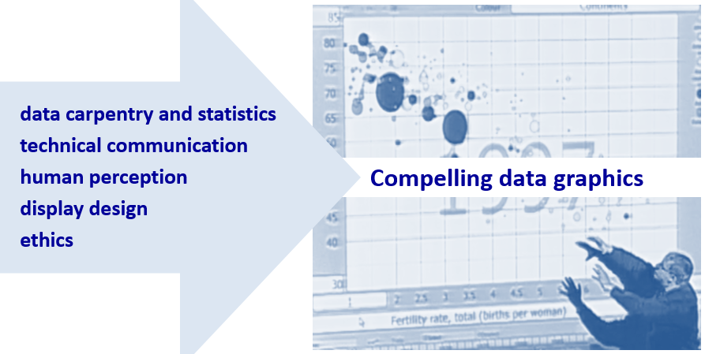

```{r include = FALSE}
library(knitr)
opts_knit$set(root.dir = "../")
opts_chunk$set(echo = FALSE, out.width = "80%")
```

# about the course

**What is data visualization?**

The course is about creating truthful and compelling data visuals. After successfully completing this course, students should be able to design effective and truthful data displays, credibly explain their design rationale, produce publication-quality visuals, and credibly critique a data display.

```{r out.width = "50%"}

```

Image from a TED talk by [Hans Rosling](https://www.ted.com/talks/hans_rosling_shows_the_best_stats_you_ve_ever_seen#t-270297)

We study elements of 

- data carpentry and statistics using R (prior experience not required)
- visual rhetoric and ethics 
- human perception 
- graphic design 

**Who might be interested in this course?** 

This is a course for anyone interested in presenting data in compelling and truthful ways. 

- Students from all disciplinary backgrounds are welcome 
- Juniors, seniors, and graduate students 


**What is  visual rhetoric?** 

The following example of redesigning a purposefully deceptive data graphic illustrates what I mean by "creating truthful and compelling data visuals."

In August 2015, in a Congressional hearing, Representative Jason Chaffetz used the following graph as part of his effort to defund Planned Parenthood, saying "In pink, that's the reduction in the breast exams, and the red is the increase in the abortions. That’s what's going on in your organization." 

```{r out.width = "50%"}
include_graphics("../images/lying-graphic-1.png")
```

This graph is *deliberately deceptive* (a charge Chaffetz denied). Cancer screenings and prevention services are plotted in millions, abortions are plotted in hundreds of thousands, and no scales are shown. The deceptive *visual rhetoric* forces a viewer to see a relationship that isn’t there. 

A different story emerges in my redesign of this graphic in which *all services* are shown to the same scale (in millions). Cancer screening has indeed dropped off (due to changing medical standards about who should be screened and how often) while abortion services have remained fairly constant. 


```{r out.width = "50%"}
include_graphics("../images/lying-graphic-2.png")
```

Showing all services provided by Planned Parenthood also puts the original *data in context*. For example, abortion services consistently represent about 3% of all services Planned Parenthood provides. Of course, it really doesn't matter if the fraction of abortion services is 3% or 93%---these services are both legal and in demand. 

The *bigger story*, perhaps, is the increasing number of STI-STD tests and treatments, potentially correlated to the opiod crisis. 

For a more detailed critique, see my [blog post](http://www.graphdoctor.com/archives/1248). 


