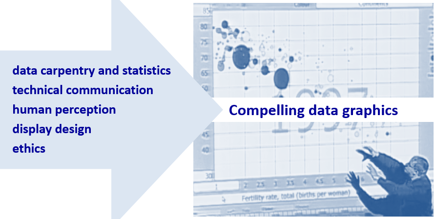

# about the course

```{r include = FALSE}
library(knitr)
opts_knit$set(root.dir = "../")
opts_chunk$set(echo = FALSE, out.width = "40%")
```


**What is data visualization?**

The course is about creating truthful and compelling data visuals. After successfully completing this course, students should be able to design effective and truthful data displays, credibly explain their design rationale, produce publication-quality visuals, and credibly critique a data display.

```{r out.width = "50%"}

```
<small><br>Image from a TED talk by [Hans Rosling](https://www.ted.com/talks/hans_rosling_shows_the_best_stats_you_ve_ever_seen#t-270297).</small>

We study elements of 

- data carpentry and statistics using R (no prior experience required)
- visual rhetoric and ethics 
- human perception 
- graphic design 


**Who might be interested in this course?** 

This is a course for anyone interested in presenting data in compelling and truthful ways. Students from all disciplinary backgrounds are welcome. 


**What is  visual rhetoric?** 

To illustrate what I mean by "creating truthful and compelling data visuals," I'll briefly describe the redesign of a lying data display.  If you would like to read about in more detail, see my [blog post](http://www.graphdoctor.com/archives/1248).

During  Congressional hearing in August 2015, Representative Jason Chaffetz used the following graph as part of his effort to defund Planned Parenthood, stating, "In pink, that's the reduction in the breast exams, and the red is the increase in the abortions. That’s what's going on in your organization."    

```{r}
include_graphics("../resources/images/lying-graphic-1.png")
```
<br>Source: Americans United for Life &nbsp;[^1]

[^1]:This graph was crafted by Americans United for Life (AUL), an organization dedicated to [restricting women’s reproductive rights](https://www.theatlantic.com/politics/archive/2015/07/what-pro-life-activists-really-want/398297/) in the US and abroad. AUL has deleted the original webpage, we can still [view it](https://web.archive.org/web/20151005054733/http://www.aul.org/new-leviathan/) using the wayback machine.


This graph is deliberately deceptive (a charge Chaffetz [denied](https://talkingpointsmemo.com/livewire/jason-chaffetz-planned-parenthood-cnn)). Cancer screenings and prevention services are plotted in millions, abortions are plotted in hundreds of thousands, and no scales are shown. The use of *deceptive visual rhetoric* forces a viewer to see a relationship that isn’t there. 

A different story emerges in my redesign of this graphic in which all services  are shown to the same scale and on a per capita basis. Cancer screening has indeed dropped off (due to changing medical standards for cancer screening as well as the passage of the ACA in 2010) while abortion services have remained fairly constant. 

```{r}
include_graphics("../resources/images/lying-graphic-2.png")
```

Showing all services provided by Planned Parenthood puts the original data *in context*. Abortion-related services consistently represent about 3% of all   Planned Parenthood services.  The *visual argument* of the original graph---that Planned Parenthood is predominantly a “life-destructive” organization---is contradicted by the very data they used.

In addition, a different story about a different public health problem emerges: STI-STD tests and treatments have been steadily and dramatically increasing, probably correlated to the opiod crisis coupled with a 40% reduction in state and local STD budgets since 2003.&nbsp;[^2] 

[^2]: National Coalition of STD directors (2018--08--28) [STDs hit record highs again, threatening millions of America lives](http://www.ncsddc.org/stds-hit-record-highs-again-threatening-millions-of-american-lives/)
 

## notes

