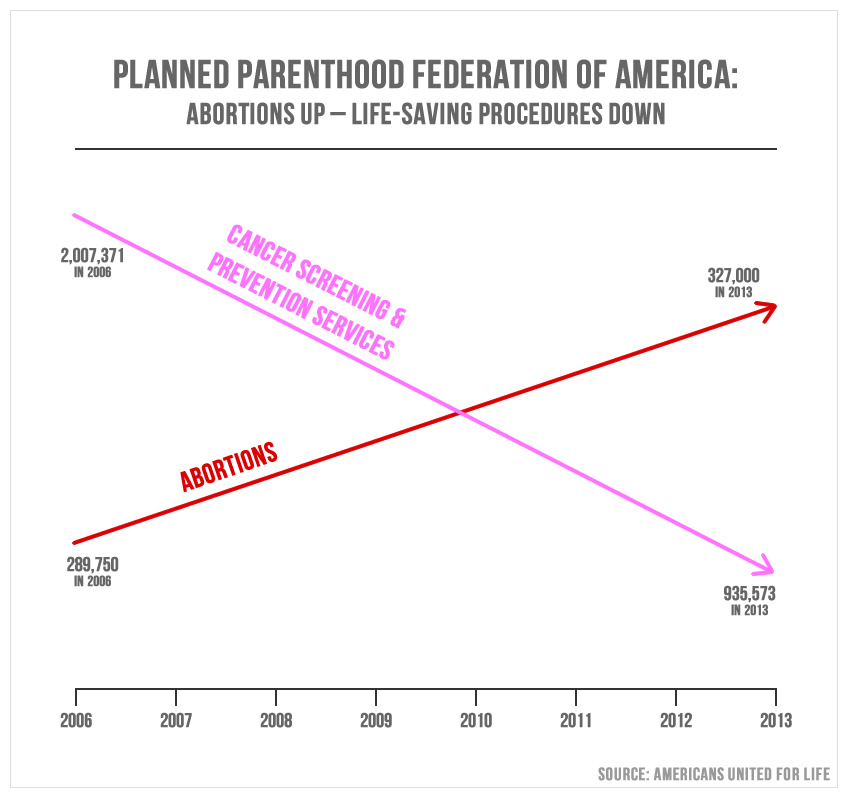
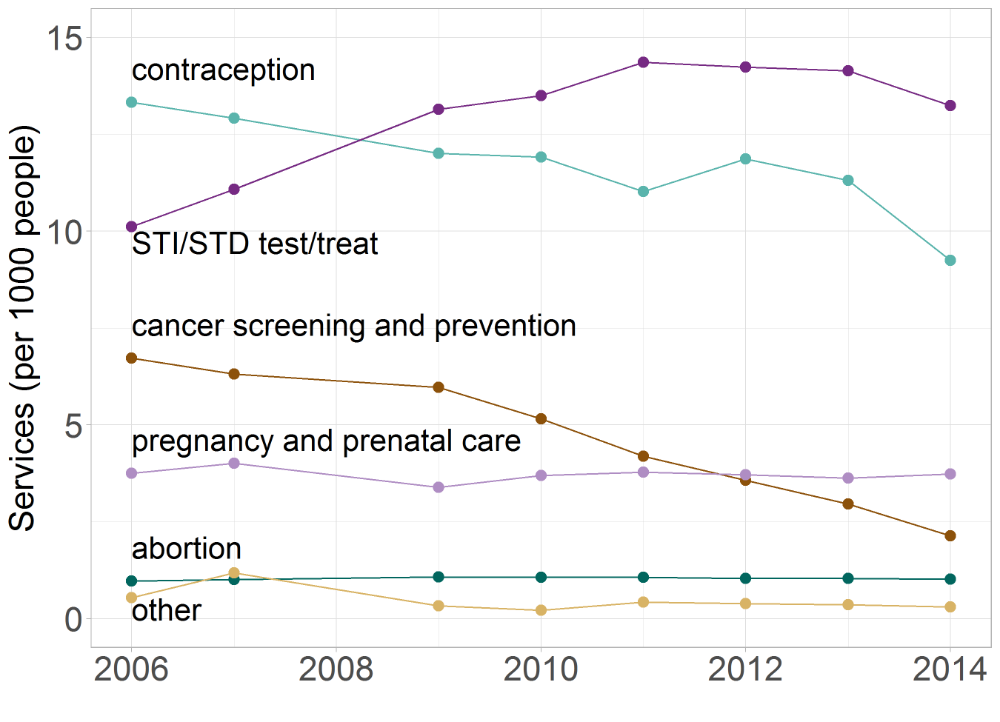

about the course
================

The course is about creating truthful and compelling data visuals.
Students from all disciplinary backgrounds are welcome.

 <small> Image from a
TED talk by [Hans
Rosling](https://www.ted.com/talks/hans_rosling_shows_the_best_stats_you_ve_ever_seen#t-270297).</small>

After successfully completing this course, students should be able to
design effective and truthful data displays, credibly explain their
design rationale, produce publication-quality visuals, and credibly
critique a data display. We study elements of

  - data carpentry and statistics using R (no prior experience required)
  - visual rhetoric and ethics
  - human perception
  - graphic design

## why R?

R is an open source language and environment for statistical computing
and graphics (R Core Team, [2018](#ref-R:2018)), ranked by IEEE in 2018
as the 7th most popular programming language (Python, C++, and Java are
the top three) (Cass, [2018](#ref-Cass:2018)). If you are new to R, some
of its best features, paraphrasing Wickham ([2014](#ref-Wickham:2014)),
are:

  - R is free, open source, and available on every major platform,
    making it easy for others to replicate your work.
  - The variety of R packages—13548 R packages as of 2018-12-24—many of
    them cutting edge tools.
  - R packages provide deep-seated support for data analysis, e.g.,
    missing values, data frames, and subsetting.
  - R packages provide powerful tools for communicating results via
    html, pdf, docx, or interactive websites.
  - It is easy to get help from experts in the R community.

RStudio, an integrated development environment (IDE) for R, includes a
console, editor, and tools for plotting, history, debugging, and
workspace management as well as access to GitHub for collaboration and
version control (RStudio Team, [2016](#ref-RStudio:2016)).

  <a href="#top">▲ top of page</a>

## an introduction to visual rhetoric

To illustrate what I mean by “creating truthful and compelling data
visuals,” I briefly outline below my redesign of a graphical lie.

During Congressional hearing in August 2015, Representative Jason
Chaffetz used the following graph as part of his effort to defund
Planned Parenthood, stating, “In pink, that’s the reduction in the
breast exams, and the red is the increase in the abortions. That’s
what’s going on in your organization.”

This graph \[1\] is deliberately deceptive—a charge Chaffetz
[denied](https://talkingpointsmemo.com/livewire/jason-chaffetz-planned-parenthood-cnn).
Cancer screenings and prevention services are plotted in millions,
abortions are plotted in hundreds of thousands, and no scales are shown.
The use of deceptive visual rhetoric forces a viewer to see a
relationship that isn’t there.

A different story emerges in my redesign of this graphic in which all
services are shown to the same scale and on a per capita basis \[2\].
Cancer screening has indeed dropped off (due to changing medical
standards for cancer screening as well as the passage of the ACA in
2010) while abortion services have remained fairly constant.

Showing all services provided by Planned Parenthood puts the original
data in context. Abortion-related services consistently represent about
3% of all Planned Parenthood services. The visual argument of the
original graph—that Planned Parenthood is predominantly a
“life-destructive” organization—is contradicted by the very data they
used.

In addition, a different story about a different public health problem
emerges: STI-STD tests and treatments have been steadily and
dramatically increasing, probably correlated to the opioid crisis
coupled with a 40% reduction in state and local STD budgets since
2003 \[3\].

  <a href="#top">▲ top of page</a>

## references

Cass S (2018) The 2018 top programming languages. *IEEE Spectrum*
<https://spectrum.ieee.org/at-work/innovation/the-2018-top-programming-languages>

R Core Team (2018) *R: A Language and Environment for Statistical
Computing.* R Foundation for Statistical Computing, Vienna, Austria
<https://www.R-project.org>

RStudio Team (2016) *RStudio: Integrated Development Environment for R.*
RStudio, Inc., Boston, MA <http://www.rstudio.com/>

Wickham H (2014) *Advanced R.* CRC Press, Taylor & Francis Group, Boca
Raton, FL <http://adv-r.had.co.nz/>

<a href="#top">▲ top of page</a>  
[◁ calendar](../README.md#calendar)  
[◁ index](../README.md#index)

## notes

1.  This graph was crafted by Americans United for Life (AUL), an
    organization dedicated to [restricting women’s reproductive
    rights](https://www.theatlantic.com/politics/archive/2015/07/what-pro-life-activists-really-want/398297/)
    in the US and abroad. AUL has deleted the original webpage, we can
    still [view
    it](https://web.archive.org/web/20151005054733/http://www.aul.org/new-leviathan/)
    using the wayback machine.

2.  See my [blog post](http://www.graphdoctor.com/archives/1248) for an
    in-depth discussion of the visual rhetoric of this graphical lie and
    its redesign.

3.  National Coalition of STD directors (2018–08–28) [STDs hit record
    highs again, threatening millions of America
    lives](http://www.ncsddc.org/stds-hit-record-highs-again-threatening-millions-of-american-lives/)
