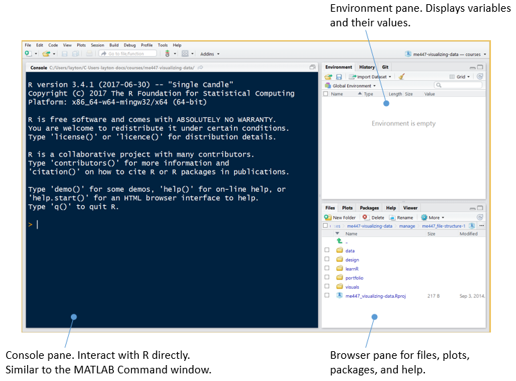

## interacting with R in the console

Start RStudio. The start up panel is shown below. The Console pane is where we can interact with or query R directly.

 

Press `Ctrl-L` to clear the console window.

In the console, a command line is indicated by a prompt `>`. The
simplest interaction with R is to type an expression at the prompt
and press Enter. R evaluates the expression and prints the result.

Code that you type is shown without prompts (making it easy for you to copy and paste code to your own Console or script). The R comment character is a single hash `#`. 

```
# type this code in your Console to create a vector
x <- 1:10
print(x)
```

The results of running the code (the output) is denoted with a double-hash: 

```{r echo = FALSE}
x <- 1:10
print(x)
```

Input and output together look like this:

```{r collapse = TRUE}
# type this in your Console
y <- seq(5, 100, by = 5)
print(y)
```

In the output, a number in brackets is the row number of the first element displayed in that line of output. For example,

`[1]` indicates that 5 is the 1st element of array *y*<br> 
`[18]` indicates that 90 is the the 18th element of *y*

## your turn

Type the following expressions in the R console and view the results. (Your results should match mine except for the double hash mark I use to indicate a line of output.)

```{r collapse = TRUE}
# type this in your Console
2 + 3

2 ^ 3

abs(-4)
```

The exponential function is `exp()`. 

```{r collapse = TRUE}
# type this in your Console
exp(2)
```

The base *e* logarithm function is `log()`.

```{r collapse = TRUE}
# type this in your Console
log(10)

log(exp(2))
```

Base 10 logarithm is `log10()`.


```{r collapse = TRUE}
# type this in your Console
log10(10)

log10(1e4)
```

The R assignment operators are `<-` or `=`,

```{r results = FALSE}
# type this in your Console
x <- pi/6
```

or equivalently,

```{r results = FALSE}
x = pi/6
```

Conventional usage is `<-`. As Robert Kabakoff explains [^2], 

> R allows the = sign to be used for object assignments. However, you won't find many programs written that way because it's not standard syntax, there are some situations in which it won’t work, and R programmers will make fun of you.

[^2]: Robert Kabakoff (2011) *R in Action: Data analysis and graphics with R*, Manning Publications.

If you use = and it works, I will not make fun of you.

When making assignments, no output appears in the console. To
see the value of the variable, type its name,

```{r collapse = TRUE}
# type this in your Console
x
```

or use `print()`


```{r collapse = TRUE}
# type this in your Console
print(x)
```

The default unit for angular measure is radians.


```{r collapse = TRUE}
# type this in your Console
y <- sin(x)
y
```

R recognizes four types of variables: numeric, character, logical,
and complex.

```{r results = FALSE}
# type this in your Console
name <- "John"
test <- TRUE
z    <- 0 + 2i
```

The RStudio Environment pane lists the variables in the workspace
and their values.

 

In the corner of the Environment pane, use the pull-down menu to
change ”List” to ”Grid” to list the variable names, values, and types.

 

To list variables using the console, use `ls()`,

```{r collapse = TRUE}
# type this in your Console
ls()
```

To list the variables, values, and types, use `ls.str()`

```{r collapse = TRUE}
# type this in your Console
ls.str()
```

Variable names in R must start with a letter (A-Z) or (a-z). Names can include letters, digits (0-9), dots (.), and underscores (_). R is case-sensitive.

In the typeface used in R and RStudio, a lowercase ell, `l`, and the number one, `1`, can be hard to distinguish. I suggest that if a variable name begins with an ell, consider using the full word or the capital letter. For example, the variable names  `length` or `L` would be preferable to `l`.

To wrap up our visit in the R Console, a quick tour of R graph types.

```
# type this in your Console
demo(graphics)
```

Press *Enter* twice to bring up the first graph. RStudio should automatically switch the Browser pane view from the Files tab to the Plots tab. Repeat pressing Enter to see all the graphs in the demo. 

To see more graph examples, try any of these: 

```
example(plot)
example(boxplot)
example(dotchart)
example(coplot)
example(persp)
```

Next tutorial: [Interacting with R using scripts](cm012_using-scripts.md) 


---

[main page](../README.md)<br> 
[topics page](cm001_org-by-topic.md)
