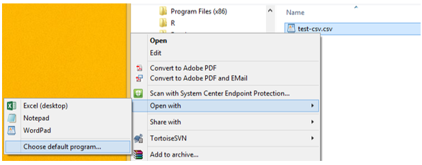

## in Windows, use Notepad for CSV files

We regularly store data in CSV files. On a Windows machine, MSExcel is typically the default software for opening CSV files. Unfortunately, Excel can alter the data in unexpected ways, so we need to change the default.

Open Excel. Use Save As... and select the CSV option. 

In the *data* directory, save the empty file as *test.csv* using CSV (Comma delimited) (*.csv) from the menu.

Close the Excel file. In Explorer, find the file. Right-click and select
*Open with...*, then *Choose default program ...*. In the dialog box, select
*Notepad* or any other text-only package.

From now on, when you open a CSV file, it will default to Notepad,
and not alter the data. You can still open the CSV in Excel if you wish
with a right-click on the file, open with, and choose Excel.

---

[main page](../README.md)  
[topics page](cm001_org-by-topic.md)
