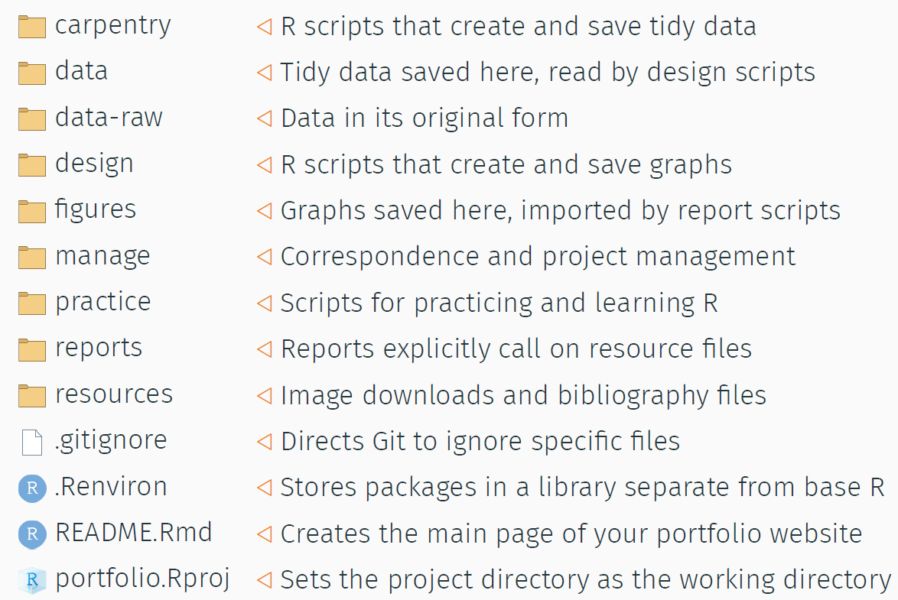

# data lab

<small> *Migrant Pea Picker’s Makeshift Home, Nipomo, California* is
licensed under
[CC0 1.0](https://creativecommons.org/publicdomain/zero/1.0/legalcode)
</small>

## contents

[file management](#file-management)  
[know your desired data structure](#know-your-desired-data-structure)  
[practice data sets in R](#practice-data-sets-in-r)  
[begin acquiring data](#begin-acquiring-data)  
[classify your data](#classify-your-data)

## file management

[Basic elements of file management](../slides/s034_file-management.pdf)
(slides)

Summary of the planned file structure  

## know your desired data structure

Every graph in your portfolio has a specific data structure, summarized
in the [portfolio data
summary](cm301_portfolio_display-reqts.md#portfolio-display-requirements).
As you look for data—both for practice and for the final display—know
the data structure you are looking for.

The elements of a prospective data set you should identfy include

  - the number of observations
  - the number of quantitative variables
  - the number of categorical variables and the number of levels of each

## practice data sets in R

We use the practice data sets available in R to practice getting the
data into the right form for the graph and for practice creating the
various graph types. Thus you can work ahead on learning to create the
various graph types before obtaining the final data sets used in the
portfolio.

To see the data sets included in your R workspace, use the *data()*
function. A tab will open in the RStudio pane that looks like this:

    Data sets in package 'datasets':
    
    AirPassengers      Monthly Airline Passenger Numbers 1949-1960
    BJsales            Sales Data with Leading Indicator
    BOD                Biochemical Oxygen Demand
    CO2                Carbon Dioxide Uptake in Grass Plants
    ChickWeight        Weight versus age of chicks on different diets
    ...etc

You can scroll down this list looking for interesting data. Some of
these datasets are used regularly by R folks to illustrate package
functionality.

Motor Trend car data. Type `?mtcars` in the Console to read more about
it.

    ## Observations: 32
    ## Variables: 11
    ## $ mpg  <dbl> 21.0, 21.0, 22.8, 21.4, 18.7, 18.1, 14.3, 24.4, 22.8, 19....
    ## $ cyl  <dbl> 6, 6, 4, 6, 8, 6, 8, 4, 4, 6, 6, 8, 8, 8, 8, 8, 8, 4, 4, ...
    ## $ disp <dbl> 160.0, 160.0, 108.0, 258.0, 360.0, 225.0, 360.0, 146.7, 1...
    ## $ hp   <dbl> 110, 110, 93, 110, 175, 105, 245, 62, 95, 123, 123, 180, ...
    ## $ drat <dbl> 3.90, 3.90, 3.85, 3.08, 3.15, 2.76, 3.21, 3.69, 3.92, 3.9...
    ## $ wt   <dbl> 2.620, 2.875, 2.320, 3.215, 3.440, 3.460, 3.570, 3.190, 3...
    ## $ qsec <dbl> 16.46, 17.02, 18.61, 19.44, 17.02, 20.22, 15.84, 20.00, 2...
    ## $ vs   <dbl> 0, 0, 1, 1, 0, 1, 0, 1, 1, 1, 1, 0, 0, 0, 0, 0, 0, 1, 1, ...
    ## $ am   <dbl> 1, 1, 1, 0, 0, 0, 0, 0, 0, 0, 0, 0, 0, 0, 0, 0, 0, 1, 1, ...
    ## $ gear <dbl> 4, 4, 4, 3, 3, 3, 3, 4, 4, 4, 4, 3, 3, 3, 3, 3, 3, 4, 4, ...
    ## $ carb <dbl> 4, 4, 1, 1, 2, 1, 4, 2, 2, 4, 4, 3, 3, 3, 4, 4, 4, 1, 2, ...

Three species of iris (the flower). Type `?iris` in the Console to read
more about it.

    ## Observations: 150
    ## Variables: 5
    ## $ Sepal.Length <dbl> 5.1, 4.9, 4.7, 4.6, 5.0, 5.4, 4.6, 5.0, 4.4, 4.9,...
    ## $ Sepal.Width  <dbl> 3.5, 3.0, 3.2, 3.1, 3.6, 3.9, 3.4, 3.4, 2.9, 3.1,...
    ## $ Petal.Length <dbl> 1.4, 1.4, 1.3, 1.5, 1.4, 1.7, 1.4, 1.5, 1.4, 1.5,...
    ## $ Petal.Width  <dbl> 0.2, 0.2, 0.2, 0.2, 0.2, 0.4, 0.3, 0.2, 0.2, 0.1,...
    ## $ Species      <fct> setosa, setosa, setosa, setosa, setosa, setosa, s...

Survival of passengers on the Titanic. Type `?Titanic` in the Console to
read more about it.

    ##  'table' num [1:4, 1:2, 1:2, 1:2] 0 0 35 0 0 0 17 0 118 154 ...
    ##  - attr(*, "dimnames")=List of 4
    ##   ..$ Class   : chr [1:4] "1st" "2nd" "3rd" "Crew"
    ##   ..$ Sex     : chr [1:2] "Male" "Female"
    ##   ..$ Age     : chr [1:2] "Child" "Adult"
    ##   ..$ Survived: chr [1:2] "No" "Yes"

Star Wars characters, from the *dplyr* package. Type `?starwars` in the
Console to read more about it.

    ## Observations: 87
    ## Variables: 13
    ## $ name       <chr> "Luke Skywalker", "C-3PO", "R2-D2", "Darth Vader", ...
    ## $ height     <int> 172, 167, 96, 202, 150, 178, 165, 97, 183, 182, 188...
    ## $ mass       <dbl> 77.0, 75.0, 32.0, 136.0, 49.0, 120.0, 75.0, 32.0, 8...
    ## $ hair_color <chr> "blond", NA, NA, "none", "brown", "brown, grey", "b...
    ## $ skin_color <chr> "fair", "gold", "white, blue", "white", "light", "l...
    ## $ eye_color  <chr> "blue", "yellow", "red", "yellow", "brown", "blue",...
    ## $ birth_year <dbl> 19.0, 112.0, 33.0, 41.9, 19.0, 52.0, 47.0, NA, 24.0...
    ## $ gender     <chr> "male", NA, NA, "male", "female", "male", "female",...
    ## $ homeworld  <chr> "Tatooine", "Tatooine", "Naboo", "Tatooine", "Alder...
    ## $ species    <chr> "Human", "Droid", "Droid", "Human", "Human", "Human...
    ## $ films      <list> [<"Revenge of the Sith", "Return of the Jedi", "Th...
    ## $ vehicles   <list> [<"Snowspeeder", "Imperial Speeder Bike">, <>, <>,...
    ## $ starships  <list> [<"X-wing", "Imperial shuttle">, <>, <>, "TIE Adva...

US economic time series, from the *ggplot2* package. Type `?economics`
in the Console to read more about it.

    ## Observations: 574
    ## Variables: 6
    ## $ date     <date> 1967-07-01, 1967-08-01, 1967-09-01, 1967-10-01, 1967...
    ## $ pce      <dbl> 507.4, 510.5, 516.3, 512.9, 518.1, 525.8, 531.5, 534....
    ## $ pop      <int> 198712, 198911, 199113, 199311, 199498, 199657, 19980...
    ## $ psavert  <dbl> 12.5, 12.5, 11.7, 12.5, 12.5, 12.1, 11.7, 12.2, 11.6,...
    ## $ uempmed  <dbl> 4.5, 4.7, 4.6, 4.9, 4.7, 4.8, 5.1, 4.5, 4.1, 4.6, 4.4...
    ## $ unemploy <int> 2944, 2945, 2958, 3143, 3066, 3018, 2878, 3001, 2877,...

## begin acquiring data

If you find other sites you find useful or entertaining, please let me
know and I’ll add them to the lists.

Data sites

  - [National snow and ice data center](https://nsidc.org/)
  - [Visualizing obesity across United States by using data from
    Wikipedia](https://datascienceplus.com/visualizing-obesity-across-united-states-by-using-data-from-wikipedia/)
  - [Extracting tables from PDFs in R using the tabulizer
    package](https://datascienceplus.com/extracting-tables-from-pdfs-in-r-using-the-tabulizer-package/)
  - [Pulling data out of census spreadsheets using
    R](https://datascienceplus.com/pulling-data-out-of-census-spreadsheets-using-r/)
  - [Gapminder: Time series data about the
    world](http://www.gapminder.org/data/)
  - [rOpenSci packages](https://ropensci.org/packages/#data_access)
  - [Using data.gov APIs in
    R](http://data.library.virginia.edu/using-data-gov-apis-in-r/)
  - [Datasets for data mining and data
    science](http://www.kdnuggets.com/datasets/index.html)
  - [US Census](https://www.census.gov/data.html)

Articles about interesting data

  - [Assault deaths
    to 2015](https://kieranhealy.org/blog/archives/2017/10/02/assault-deaths-to-2015/)
  - [Pirating pirate data for pirate
    day](http://blog.revolutionanalytics.com/2017/09/pirating-pirate-data-for-pirate-day.html)
    Yes, it really is about 21st century pirates
  - [Exploratory data analysis of tropical storms in
    R](https://www.stoltzmaniac.com/exploratory-data-analysis-of-tropical-storms-in-r/)
  - [Fun data for teaching
    R](https://bartomeuslab.com/2016/01/21/fun-data-for-teaching-r/)
    blog  
  - [Discovering good data
    packages](https://ropenscilabs.github.io/data-packages/) repo  
  - [R packages for data
    access](http://blog.revolutionanalytics.com/2016/08/r-packages-data-access.html)
    blog  
  - [19 free public data sets for your first data science
    project](https://www.springboard.com/blog/free-public-data-sets-data-science-project/)

Data tutorials from other authors

  - [Getting data from the web
    part 1](https://github.com/STAT545-UBC/STAT545-UBC.github.io/blob/master/webdata02_activity.md)
    tutorial from Stat 545 by Jenny Bryan  
  - [Getting data from the web
    part 2](https://github.com/STAT545-UBC/STAT545-UBC.github.io/blob/master/webdata03_activity.md)
    tutorial from Stat 545 by Jenny Bryan  
  - [This R data import tutorial is everything you need,
    part 1](https://www.datacamp.com/community/tutorials/r-data-import-tutorial/#gs.DdZtwPI)
    from Data Camp  
  - [Importing data into R,
    part 2](https://www.datacamp.com/community/tutorials/importing-data-r-part-two#gs.uCsWBZE)
    from Data Camp

## classify your data

When you think you have a data set suitable for a particular graph type,
summarize its features, for example,

  - the number of observations
  - name, number, and range of quantitative variables  
  - name, number, and discrete levels of categorical variables
  - other features relevant to the particular display type

State specifically how each data requirements has been met. This summary
will be part of the prose description that accompanies each graph in the
portfolio.

## references

-----

<a href="#top">Top of page</a>  
[Calendar](../README.md#calendar)  
[Index](../README.md#index)
