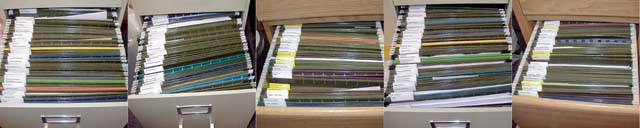
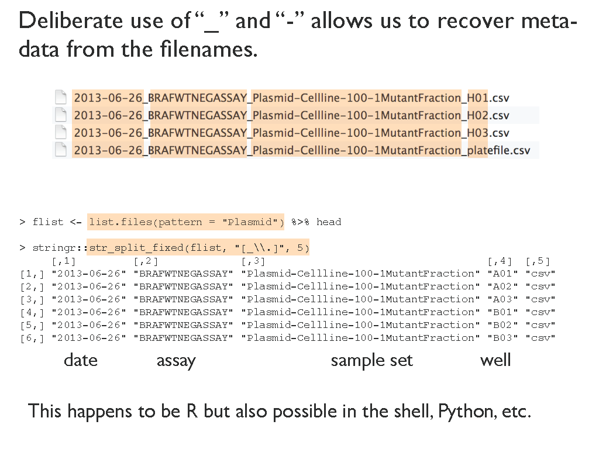
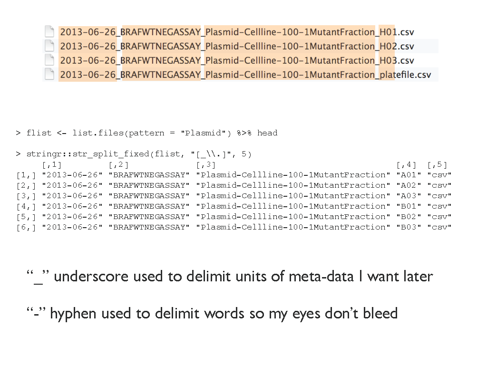
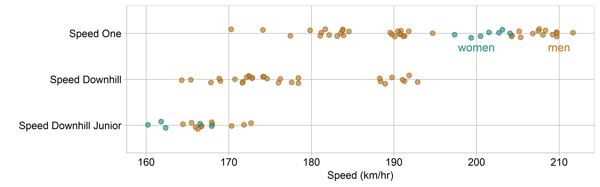

managing files
================



<small><br> *Files* by Mitch Barrie is licensed under [CC
BY-SA 2.0](https://creativecommons.org/licenses/by-sa/2.0/) </small><br>

## contents

[plan the directory structure](#plan-the-directory-structure)  
[plan a file-naming scheme](#plan-a-file-naming-scheme)  
[using relative paths](#using-relative-paths)  
[searching files](#searching-files)  
[references](#references)

## plan the directory structure

As shown in the [slides](../slides/wk03-4-file-management.pdf), the top
level of the portfolio project has the following folders and files.

 carpentry  
 data  
 data-raw  
 design  
 figures  
 manage  
 practice  
 reports  
 resources  

.gitignore  
 .Renviron  
 README.Rmd  
 README.md  
 portfolio.Rproj

Workflow directories (files that create the portfolio)

  - **`data-raw/`**  
    Data in their original form, never edited manually  
    R scripts for web-scraping or downloading raw data  
    Version control optional
  - **`carpentry/`**  
    R scripts that turn raw data into tidy data  
    Reads from `data-raw/`  
    Writes CSV or RDS to `data/`
  - **`data/`**  
    Data files ready for graphs or analysis
  - **`design/`**  
    R scripts that create and save graphs  
    Reads CSV or RDS from `data/`  
    Writes PNG to `figures/`
  - **`figures/`**  
    Publication-ready graphs
  - **`reports/`**  
    Rmd scripts that present and critique displays  
    One report per required display  
    Runs the R scripts in `carpentry/` and `design/`  
    Inputs the graphs from `figures/`
  - **`resources/`**  
    Other files used to create the reports  
    Bibliography and CSL files  
    Image downloads
  - **`README.Rmd`**  
    Creates the main page of the portfolio website  
    Provides explicit links to every report

Administrative files

  - **`portfolio.Rproj`**  
    Sets the current working directory to the project directory
  - **`.gitignore`**  
    Directs Git to ignore specific files, excusing them from version
    control
  - **`.Renviron`**  
    Stores packages in a library separate from the base R installation

Non-workflow directories, excused from version control

  - **`manage/`**  
    Correspondence and project management  
    Project-related files sent by others
  - **`practice/`**  
    R scripts for exercises and learning R  
    R scripts fpor practicing new techniques

Alternative opinions on directory structure

  - Mira Céline Klein (2017) [A meaningful file structure for R
    projects](https://www.inwt-statistics.com/read-blog/a-meaningful-file-structure-for-r-projects.html)  
  - Chris von Csefalvay (2018) [Structuring R
    projects](https://chrisvoncsefalvay.com/structuring-r-projects/)  
  - The Carpentries (n.d.) [Project management with
    RStudio](https://swcarpentry.github.io/r-novice-gapminder/02-project-intro/)
  - Karl Broman (n.d.) [Organize your data and
    code](https://kbroman.org/steps2rr/pages/organize.html)

<br> <a href="#top">▲ top of page</a>

## plan a file-naming scheme

Carefully consider your file naming scheme when you write your first
script.

PRO TIP: Write out a set of file names for each directory you think may
contribute to a particular report and stick to it. It is really
time-consuming and error-prone to change a file-naming scheme after
several files are written.

To illustrate a potential scheme, as a suggestion only, suppose for
portfiolio display D1, we design a strip plot to display `speedski`
data. My file naming plan might be:

    carpentry/ d1-stripplot-speedski-carpentry.R
    data/      d1-stripplot-speedski.rds
    design/    d1-stripplot-speedski-design.R
    figures/   d1-stripplot-speedski.png 
    reports/   d1-stripplot-speedski.Rmd

  - Every file starts with the display number `d1`  
  - Followed by the graph type `-stripplot`  
  - Then the data set `-speedski`  
  - I am likely to have at least two R scripts (carpentry and design),
    so I add it’s category `-carpentry.R` or `-design.R`

If I need more than one script of the same type in a directory, I’ll add
a sequential number to the file name. e.g.,

    carpentry/ d1-stripplot-speedski-carpentry-01.R
    carpentry/ d1-stripplot-speedski-carpentry-02.R

This file-naming scheme is a suggestion only

  - You may design your own  
  - You are also likely to change your approach with every project.  
  - But pick a scheme and use it\!

Underscores "\_" in filenames are particularly useful if the file name
contains meta-data such as the file date. Use a hyphen “-” to separate
words for ease of reading. Jenny Bryan offers this example of mixing
underscores and hyphens to identify the date, assay, sample set, and
“well” (Bryan, [2015](#ref-Bryan:2015))
,



<br> <a href="#top">▲ top of page</a>

## using relative paths

Explicitly link files using relative file paths. For example, report
script

    reports/d1-stripplot-speedski.Rmd

contains the text of the report interleaved with code chunks that run
every R script,

    source("carpentry/d1-stripplot-speedski-carpentry.R")
    source("design/d1-stripplot-speedski-design.R")

import data to print a data table,

    readRDS("data/d1-stripplot-speedski.rds")

and import figures.

    

<br> <a href="#top">▲ top of page</a>

## searching files

The advantage of planning this file naming scheme at the beginning of
the work is that it supports machine readability. For example, I can use
the `list.files()` function to search for all file names that include
`stripplot`

``` r
this_path <- "."
list.files(path = this_path, pattern = "stripplot", recursive = TRUE, ignore.case = TRUE)
#> [1] "carpentry/d1-stripplot-speedski-carpentry.R"
#> [2] "cm/figures/d1-stripplot-speedski.png"       
#> [3] "data/d1-stripplot-speedski.rds"             
#> [4] "design/d1-stripplot-speedski-design.R"      
#> [5] "figures/d1-stripplot-speedski.png"          
#> [6] "practice/d1-stripplot-speedski-tutorial.R"  
#> [7] "slides/d1-stripplot-speedski-slides.png"
```

Or for all file names that include
`speedski`

``` r
list.files(path = this_path, pattern = "speedski", recursive = TRUE, ignore.case = TRUE)
#>  [1] "carpentry/d1-stripplot-speedski-carpentry.R"
#>  [2] "cm/figures/cm201_speedski-design-1-1.png"   
#>  [3] "cm/figures/cm201_speedski-design-2-1.png"   
#>  [4] "cm/figures/cm201_speedski-design-3-1.png"   
#>  [5] "cm/figures/cm201_speedski-design-4-1.png"   
#>  [6] "cm/figures/cm201_speedski-design-5-1.png"   
#>  [7] "cm/figures/cm201_speedski-design-6-1.png"   
#>  [8] "cm/figures/cm201_speedski-explore-1-1.png"  
#>  [9] "cm/figures/cm201_speedski-explore-2-1.png"  
#> [10] "cm/figures/cm201_speedski-explore-3-1.png"  
#> [11] "cm/figures/cm201_speedski-explore-4-1.png"  
#> [12] "cm/figures/cm201_speedski-explore-5-1.png"  
#> [13] "cm/figures/cm201_speedski-explore-6-1.png"  
#> [14] "cm/figures/d1-stripplot-speedski.png"       
#> [15] "data/d1-stripplot-speedski.rds"             
#> [16] "design/d1-stripplot-speedski-design.R"      
#> [17] "figures/d1-stripplot-speedski.png"          
#> [18] "practice/d1-stripplot-speedski-tutorial.R"  
#> [19] "slides/d1-stripplot-speedski-slides.png"
```

Or for all file names that start with `d1` and end with `.png`. Here we
see that I created one set of images for the course website and another
set for the lecture slides.

``` r
intersect(
  list.files(path = this_path, pattern = "^d1", recursive = TRUE, ignore.case = TRUE),     
  list.files(path = this_path, pattern = "\\.png$", recursive = TRUE, ignore.case = TRUE)
    )
#> [1] "cm/figures/d1-stripplot-speedski.png"   
#> [2] "figures/d1-boxplot-nontrad.png"         
#> [3] "figures/d1-stripplot-speedski.png"      
#> [4] "slides/d1-boxplot-nontrad-slides.png"   
#> [5] "slides/d1-stripplot-speedski-slides.png"
```

## references

<div id="refs">

<div id="ref-Bryan:2015">

Bryan J (2015) Naming things.
<https://speakerdeck.com/jennybc/how-to-name-files>

</div>

</div>

***
<a href="#top">&#9650; top of page</a>    
[&#9665; calendar](../README.md#calendar)    
[&#9665; index](../README.md#index)
