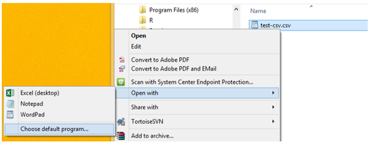

data studio
================

 <small>
  <i>Migrant Pea Picker’s Makeshift Home, Nipomo, California</i> is
licensed under
<a href="https://creativecommons.org/publicdomain/zero/1.0/legalcode">CC0
1.0</a>   </small>

## contents

[prerequisites](#prerequisites)  
[classify your data structure](#classify-your-data-structure)  
[data basics](#data-basics)  
[use Notepad for CSV files](#use-notepad-for-csv-files)  
[workflow basics](#workflow-basics)  
[data transformation](#data-transformation)  
[data import](#data-import)  
[begin acquiring data](#begin-acquiring-data)  
[references](#references)

## prerequisites

  - Start every work session by launching `portfolio.Rproj`  
  - Your [project directory
    structure](cm501-proj-m-manage-files.md#plan-the-directory-structure)
    satisfies the course requirements

The following packages are used in this workshop. If any are not yet
installed on your machine, please install them.

  - tidyverse  
  - nycflights13

  <a href="#top">▲ top of page</a>

## classify your data structure

Every graph in your portfolio has a specific data structure, summarized
in the [portfolio data
summary](cm301-report-display-reqts.md#portfolio-display-requirements).
As you look for data—both for practice and for the final display—know
the data structure you are looking for.

When you think you have a data set suitable for a particular graph type,
classify its structure, i.e.,

  - determine the number of observations  
  - determine the number of variables  
  - classify every variable as quantitative or categorical  
  - determine the number of levels in every categorical variable  
  - classify every categorical variables as ordinal or nominal  
  - classify every quantitative variable as continuous or discrete  
  - other features, if any, relevant to the particular display type, for
    example, a Sankey diagram requires identification of nodes and links

State specifically how each data requirements has been met. This summary
will be part of the prose description that accompanies each graph in the
portfolio.

  <a href="#top">▲ top of page</a>

## data basics

The link to the [data basics](../slides/sd021-data-basics.pdf) material
we covered in a previous session, for reference.

## use Notepad for CSV files

We regularly store data in CSV files.

On a Windows machine, MSExcel is typically the default software for
opening CSV files. Unfortunately, Excel can alter the data in unexpected
ways, so we need to change the default.

**Assignment**

Open Excel. Use Save As… and select the CSV option.

In the `data-raw` directory, save the empty file as `test.csv` using CSV
(Comma delimited) (\*.csv) from the menu.

Close the Excel file. In Explorer, find the file. Right-click and select
*Open with…*, then *Choose default program …*. In the dialog box, select
*Notepad* or any other text-only package.

From now on, when you open a CSV file, it will default to Notepad, and
not alter the data. You can still open the CSV in Excel if you wish with
a right-click on the file, open with, and choose Excel.

  <a href="#top">▲ top of page</a>

## workflow basics

From the text (Wickham and Grolemund,
[2017](#ref-Wickham+Grolemund:2017)), read the following sections and do
the exercises indicated

[4.1 Coding
basics](https://r4ds.had.co.nz/workflow-basics.html#coding-basics)  
[4.2 What’s in a
name?](https://r4ds.had.co.nz/workflow-basics.html#whats-in-a-name)  
[4.3 Calling
functions](https://r4ds.had.co.nz/workflow-basics.html#calling-functions)

  - Exercise
    [4.4.1](https://r4ds.had.co.nz/workflow-basics.html#practice)  
  - Exercise
    [4.4.2](https://r4ds.had.co.nz/workflow-basics.html#practice)  
  - Exercise
    [4.4.3](https://r4ds.had.co.nz/workflow-basics.html#practice)

## data transformation

From the text, read the following sections and do the exercises
indicated

[5.1 Data
transformation](https://r4ds.had.co.nz/transform.html#introduction-2)  
[5.2
filter()](https://r4ds.had.co.nz/transform.html#filter-rows-with-filter)

  - Exercise [5.2.4](https://r4ds.had.co.nz/transform.html#exercises-7)

[5.3
arrange()](https://r4ds.had.co.nz/transform.html#arrange-rows-with-arrange)

  - Exercise [5.3.1](https://r4ds.had.co.nz/transform.html#exercises-8)
    problems 2, 3, 4

[5.4 select()](https://r4ds.had.co.nz/transform.html#select)

  - Exercise [5.4.1](https://r4ds.had.co.nz/transform.html#exercises-9)

[5.5
mutate()](https://r4ds.had.co.nz/transform.html#add-new-variables-with-mutate)

  - Exercise [5.5.2](https://r4ds.had.co.nz/transform.html#exercises-10)

[5.6
groupby()](https://r4ds.had.co.nz/transform.html#grouped-summaries-with-summarise)

  - Exercise [5.6.7](https://r4ds.had.co.nz/transform.html#exercises-11)

  <a href="#top">▲ top of page</a>

## data import

From the text, skim the following sections.

[11.1 Data
import](https://r4ds.had.co.nz/data-import.html#getting-started)  
[11.2 Getting
started](https://r4ds.had.co.nz/data-import.html#getting-started)  
[11.5 Writing to a
file](https://r4ds.had.co.nz/data-import.html#writing-to-a-file)  
[11.6 Other types of
data](https://r4ds.had.co.nz/data-import.html#other-types-of-data)

## begin acquiring data

If you find other sites you find useful or entertaining, please let me
know and I’ll add them to the lists.

Data sites

  - [FiveThirtyEight](https://data.fivethirtyeight.com/)  
  - [US government](https://www.data.gov/)  
  - [NOAA climate data](https://www.ncdc.noaa.gov/cdo-web/)  
  - [Publications for which code and/or data are
    available](https://reproducibleresearch.net/reproducible-material/)  
  - [National snow and ice data center](https://nsidc.org/)  
  - [Visualizing obesity across United States by using data from
    Wikipedia](https://datascienceplus.com/visualizing-obesity-across-united-states-by-using-data-from-wikipedia/)
  - [Extracting tables from PDFs in R using the tabulizer
    package](https://datascienceplus.com/extracting-tables-from-pdfs-in-r-using-the-tabulizer-package/)
  - [Pulling data out of census spreadsheets using
    R](https://datascienceplus.com/pulling-data-out-of-census-spreadsheets-using-r/)
  - [Gapminder: Time series data about the
    world](http://www.gapminder.org/data/)
  - [rOpenSci packages](https://ropensci.org/packages/#data_access)
  - [Using data.gov APIs in
    R](http://data.library.virginia.edu/using-data-gov-apis-in-r/)
  - [Datasets for data mining and data
    science](http://www.kdnuggets.com/datasets/index.html)
  - [US Census](https://www.census.gov/data.html)

Articles about interesting data

  - [Assault deaths
    to 2015](https://kieranhealy.org/blog/archives/2017/10/02/assault-deaths-to-2015/)
  - [Pirating pirate data for pirate
    day](http://blog.revolutionanalytics.com/2017/09/pirating-pirate-data-for-pirate-day.html)
    Yes, it really is about 21st century pirates
  - [Exploratory data analysis of tropical storms in
    R](https://www.stoltzmaniac.com/exploratory-data-analysis-of-tropical-storms-in-r/)
  - [Fun data for teaching
    R](https://bartomeuslab.com/2016/01/21/fun-data-for-teaching-r/)
    blog  
  - [Discovering good data
    packages](https://ropenscilabs.github.io/data-packages/) repo  
  - [R packages for data
    access](http://blog.revolutionanalytics.com/2016/08/r-packages-data-access.html)
    blog  
  - [19 free public data sets for your first data science
    project](https://www.springboard.com/blog/free-public-data-sets-data-science-project/)

Data tutorials from other authors

  - [Getting data from the web
    part 1](https://github.com/STAT545-UBC/STAT545-UBC.github.io/blob/master/webdata02_activity.md)
    tutorial from Stat 545 by Jenny Bryan  
  - [Getting data from the web
    part 2](https://github.com/STAT545-UBC/STAT545-UBC.github.io/blob/master/webdata03_activity.md)
    tutorial from Stat 545 by Jenny Bryan  
  - [This R data import tutorial is everything you need,
    part 1](https://www.datacamp.com/community/tutorials/r-data-import-tutorial/#gs.DdZtwPI)
    from Data Camp  
  - [Importing data into R,
    part 2](https://www.datacamp.com/community/tutorials/importing-data-r-part-two#gs.uCsWBZE)
    from Data Camp

  <a href="#top">▲ top of page</a>

## references

Wickham H and Grolemund G (2017) *R for Data Science.* O’Reilly Media,
Inc., Sebastopol, CA <https://r4ds.had.co.nz/>

***
<a href="#top">&#9650; top of page</a>    
[&#9665; calendar](../README.md#calendar)    
[&#9665; index](../README.md#index)
