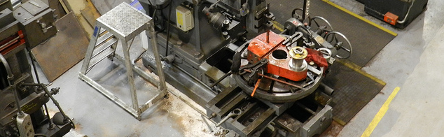
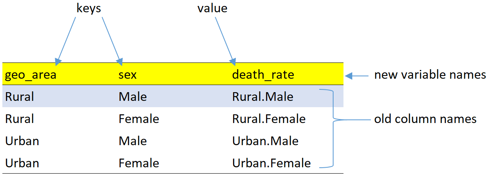

reshaping data
================

 <small> <br>
<i>NRM Shaper</i> by KillamarshianUK is licensed under
<a href="https://creativecommons.org/licenses/by/2.0/legalcode">CC BY
2.0</a> <br> </small>

## contents

[prerequisites](#prerequisites)  
[data in row names](#data-in-row-names)  
[records, rows, and blocks](#records-rows-and-blocks)  
[rowrecs\_to\_blocks()](#rowrecs_to_blocks)  
[blocks\_to\_rowrecs()](#blocks_to_rowrecs)  
[reshaping case study](#reshaping-case-study)  
[exercises](#exercises)  
[references](#references)

## prerequisites

  - Start every work session by launching `portfolio.Rproj`  
  - Your [project directory
    structure](cm501-proj-m-manage-files.md#plan-the-directory-structure)
    satisfies the course requirements  
  - If the any of the following packages are not yet installed on your
    machine, please [install
    them](cm902-software-studio.md#install-packages)
      - tidyverse  
      - cdata  
      - wrapr

Create a new script `explore/0401-data-reshape-VADeaths.R` for today’s
work, write a minimal header and load the packages:

``` r
# reshape VA deaths data   
# your name
# date

# load packages
library("tidyverse")
library("cdata")
library("wrapr")
```

<br> <a href="#top">▲ top of page</a>

## data in row names

We’ll revisit the `VADeaths` dataset, part of the base R installation.

``` r
# load the data
data(VADeaths)

# what nature of R object is it? 
class(VADeaths)
#> [1] "matrix"

# print it
print(VADeaths)
#>       Rural Male Rural Female Urban Male Urban Female
#> 50-54       11.7          8.7       15.4          8.4
#> 55-59       18.1         11.7       24.3         13.6
#> 60-64       26.9         20.3       37.0         19.3
#> 65-69       41.0         30.9       54.6         35.1
#> 70-74       66.0         54.3       71.1         50.0
```

The data are in a matrix (not a data frame) and it looks like the age
groups are in the row names. To check, use `row.names()`.

``` r
row.names(VADeaths)
#> [1] "50-54" "55-59" "60-64" "65-69" "70-74"
```

Having data saved in the row names is something to watch out for when
dealing with data in base R or in R packages. When you find such data,
one of your first steps is to move the data stored in the row names to a
new column in the data frame.

As you know, we work almost exclusively with data frames (or tibbles),
so we will want to convert this matrix to a tibble. However, if we do,
we lose the information in the row names

``` r
as_tibble(VADeaths) %>% 
    print()
#> # A tibble: 5 x 4
#>   `Rural Male` `Rural Female` `Urban Male` `Urban Female`
#>          <dbl>          <dbl>        <dbl>          <dbl>
#> 1         11.7            8.7         15.4            8.4
#> 2         18.1           11.7         24.3           13.6
#> 3         26.9           20.3         37             19.3
#> 4         41             30.9         54.6           35.1
#> 5         66             54.3         71.1           50
```

Instead, we convert the matrix to a data frame using the base R
`data.frame()` function, which conserves the data in the row names,

``` r
VA_deaths <- data.frame(VADeaths) %>% 
    print()
#>       Rural.Male Rural.Female Urban.Male Urban.Female
#> 50-54       11.7          8.7       15.4          8.4
#> 55-59       18.1         11.7       24.3         13.6
#> 60-64       26.9         20.3       37.0         19.3
#> 65-69       41.0         30.9       54.6         35.1
#> 70-74       66.0         54.3       71.1         50.0
```

Then create a new variable for the row names using
`tibble::rownames_to_column()`.

``` r
VA_deaths <- VA_deaths %>% 
    rownames_to_column("age_group") %>% 
    print()
#>   age_group Rural.Male Rural.Female Urban.Male Urban.Female
#> 1     50-54       11.7          8.7       15.4          8.4
#> 2     55-59       18.1         11.7       24.3         13.6
#> 3     60-64       26.9         20.3       37.0         19.3
#> 4     65-69       41.0         30.9       54.6         35.1
#> 5     70-74       66.0         54.3       71.1         50.0
```

The row names have been replaced with the conventional integers. Note
also that the spaces in the columns names are replaced with periods.

## records, rows, and blocks

[John Mount and Nina
Zumel](http://winvector.github.io/FluidData/FluidDataReshapingWithCdata.html)
argue that we should distinguish between data layout and data semantics:

**data layout**: whether data is organized in rows, columns, or even
separate tables  
**data semantics**: which items of data logically belong together

Understanding the difference can help us convert between one layout and
another. The reshaping we will most often encounter converts data
between row-oriented and column-oriented layouts.

Consider the VA deaths data frame. The first row shows all data values
for people in the 50–54 age group. Subsequent rows are organized by
successive age groups. Each row is a row-record—information that
logically belongs together.

    #>   age_group Rural.Male Rural.Female Urban.Male Urban.Female
    #> 1     50-54       11.7          8.7       15.4          8.4
    #> 2     55-59       18.1         11.7       24.3         13.6
    #> 3     60-64       26.9         20.3       37.0         19.3
    #> 4     65-69       41.0         30.9       54.6         35.1
    #> 5     70-74       66.0         54.3       71.1         50.0

To graph these data using ggplot2, we need the data in tidy form. This
is a case of an algorithm (ggplot2) that is “sensitive to how data is
arranged in rows and columns, so there is a need to convert between
representations” (Mount and Zumel, [2019](#ref-Mount+Zumel:2019)). To
reshape the data into tidy form, we:

  - add two new categorical variables `sex` (levels: male and female)
    and `geo_area` (levels: rural and urban)  
  - collect the numerical death rates in a single quantitative variable
    `death_rate`  
  - repeat the age groups as many as times as necessary

<!-- end list -->

    #>    age_group geo_area    sex death_rate
    #> 1      50-54    Rural   Male       11.7
    #> 2      50-54    Rural Female        8.7
    #> 3      50-54    Urban   Male       15.4
    #> 4      50-54    Urban Female        8.4
    #> 5      55-59    Rural   Male       18.1
    #> 6      55-59    Rural Female       11.7
    #> 7      55-59    Urban   Male       24.3
    #> 8      55-59    Urban Female       13.6
    #> 9      60-64    Rural   Male       26.9
    #> 10     60-64    Rural Female       20.3
    #> 11     60-64    Urban   Male       37.0
    #> 12     60-64    Urban Female       19.3
    #> 13     65-69    Rural   Male       41.0
    #> 14     65-69    Rural Female       30.9
    #> 15     65-69    Urban   Male       54.6
    #> 16     65-69    Urban Female       35.1
    #> 17     70-74    Rural   Male       66.0
    #> 18     70-74    Rural Female       54.3
    #> 19     70-74    Urban   Male       71.1
    #> 20     70-74    Urban Female       50.0

The original row-record of each age group is now laid out as a block of
rows. For example, the original 50-54 row record is now laid out in the
first four rows of the reshaped data frame.

This layout also highlights that we have three **key** columns—age,
geographical area, and sex—that together uniquely identify a death rate
**value**. Unique combinations of the keys are the “coordinates” of
unique data values.

These data are **coordinatized** regardless of the layout. Look again at
the original data frame. Every death rate has the same coordinates
(keys) as in the tidy layout. A unique combination of age, area, and sex
still identify a unique data value. Thus we can think of the concept of
*coordinatized data* as being invariant across layout transformations.

    #>   age_group Rural.Male Rural.Female Urban.Male Urban.Female
    #> 1     50-54       11.7          8.7       15.4          8.4
    #> 2     55-59       18.1         11.7       24.3         13.6
    #> 3     60-64       26.9         20.3       37.0         19.3
    #> 4     65-69       41.0         30.9       54.6         35.1
    #> 5     70-74       66.0         54.3       71.1         50.0

Summary of new concepts

  - keys and values in coordinatized data
  - records in rows (row-oriented layout)
  - records in blocks (column-oriented layout)

## rowrecs\_to\_blocks()

We will use `rowrecs_to_blocks()` function from the cdata package to
reshape data from row-oriented to column oriented layout.
`rowrecs_to_blocks()` is similar to `tidyr::gather()`, but generalized.

For reference, let’s view the row-oriented data layout we created
earlier,

``` r
VA_deaths
#>   age_group Rural.Male Rural.Female Urban.Male Urban.Female
#> 1     50-54       11.7          8.7       15.4          8.4
#> 2     55-59       18.1         11.7       24.3         13.6
#> 3     60-64       26.9         20.3       37.0         19.3
#> 4     65-69       41.0         30.9       54.6         35.1
#> 5     70-74       66.0         54.3       71.1         50.0
```

We have to design the layout we want, that is,

  - a new column called `geo_area` that will contain the values (levels
    of the category) `Rural` and `Urban`
  - a new column called `sex` that will contain the values (levels of
    the category) `Female` and `Male`
  - a new column called `death_rate` to contain the quantitative death
    rate data



One row is highlighted to show how the levels of the two categories
(`Rural` and `Male`) are the coordinates of the data value
(`Rural.Male`) from the original data frame. The table has four rows
because there are four combinations of keys that point to the original
column names `Rural.Male`, `Rural.Female`, etc. The `age_group` variable
is not shown because it is already a key column; its entries will get
repeated but not otherwise transformed when we reshape the layout.

This table is the *control table* for reshaping the data; we create it
using the `wrapr::build_frame()` function.

``` r
control_table <- wrapr::build_frame(
    "geo_area",  "sex",     "death_rate"   |
    "Rural",     "Male",    "Rural.Male"   |
    "Rural",     "Female",  "Rural.Female" |
    "Urban",     "Male",    "Urban.Male"   |
    "Urban",     "Female",  "Urban.Female"
   )
```

The control table is one of the arguments in the
`cdata::rowrecs_to_blocks()` function.

``` r
VA_tall <- rowrecs_to_blocks(
  wideTable        = VA_deaths,
  controlTable     = control_table,
  controlTableKeys = c("geo_area", "sex"),
  columnsToCopy    = c("age_group")
  )
```

Arguments:

  - `wideTable` data frame to be reshaped  
  - `controlTable` table that specifies the reshaping  
  - `controlTableKeys` column names of the control table that are keys  
  - `columnsToCopy` column names (keys) in the original data frame that
    are copied

The output `VA_tall` is the reshaped (tidy) data frame with its records
in blocks.

``` r
kable(VA_tall)
```

| age\_group | geo\_area | sex    | death\_rate |
| :--------- | :-------- | :----- | ----------: |
| 50-54      | Rural     | Male   |        11.7 |
| 50-54      | Rural     | Female |         8.7 |
| 50-54      | Urban     | Male   |        15.4 |
| 50-54      | Urban     | Female |         8.4 |
| 55-59      | Rural     | Male   |        18.1 |
| 55-59      | Rural     | Female |        11.7 |
| 55-59      | Urban     | Male   |        24.3 |
| 55-59      | Urban     | Female |        13.6 |
| 60-64      | Rural     | Male   |        26.9 |
| 60-64      | Rural     | Female |        20.3 |
| 60-64      | Urban     | Male   |        37.0 |
| 60-64      | Urban     | Female |        19.3 |
| 65-69      | Rural     | Male   |        41.0 |
| 65-69      | Rural     | Female |        30.9 |
| 65-69      | Urban     | Male   |        54.6 |
| 65-69      | Urban     | Female |        35.1 |
| 70-74      | Rural     | Male   |        66.0 |
| 70-74      | Rural     | Female |        54.3 |
| 70-74      | Urban     | Male   |        71.1 |
| 70-74      | Urban     | Female |        50.0 |

## blocks\_to\_rowrecs()

The transformation can be reversed using the same control table and the
`cdata::blocks_to_rowrecs()` function. `blocks_to_rowrecs()` is similar
to `tidyr::spread()` but generalized.

``` r
VA_wide <- blocks_to_rowrecs(
  tallTable        = VA_tall,
  controlTable     = control_table,
  controlTableKeys = c("geo_area", "sex"), 
  keyColumns       = c("age_group")
)
```

The new arguments:

  - `tallTable` data frame to be reshaped  
  - `keyColumns` column that defines the new row groups

The result:

``` r
kable(VA_wide)
```

| age\_group | Rural.Male | Rural.Female | Urban.Male | Urban.Female |
| :--------- | ---------: | -----------: | ---------: | -----------: |
| 50-54      |       11.7 |          8.7 |       15.4 |          8.4 |
| 55-59      |       18.1 |         11.7 |       24.3 |         13.6 |
| 60-64      |       26.9 |         20.3 |       37.0 |         19.3 |
| 65-69      |       41.0 |         30.9 |       54.6 |         35.1 |
| 70-74      |       66.0 |         54.3 |       71.1 |         50.0 |

To confirm that we have indeed recaptured the original form, compare the
the original data frame `VA_deaths` and the new `VA_wide` data frame
using `dplyr::all_equal()`.

``` r
dplyr::all_equal(VA_deaths, VA_wide)
#> [1] TRUE
```

## reshaping case study

Create a new script `explore/0401-data-reshape-who-TB.R`, write a
minimal header and load the packages:

``` r
# reshape World Health Organization tuberculosis data   
# your name
# date

# load packages
library("tidyverse")
library("cdata")
library("wrapr")
```

## exercises

**1. Check your earlier work**

In an earlier [exercise](cm101-data-basics.md#exercises) you manually
tidied the VA deaths data. Open that xlsx file and compare your answer
to the `VA_tall` data frame above. The variable names and row order
might be different but the variables and number of rows should be the
same.

If not, revisit the earlier assignment and manually edit the xlsx file
to obtain the tidy form. This is a usefgul exercise to help you
visualize what `rowrecs_to_blocks()` is doing.

**2. Information in row names**

  - Load the `mtcars` data set from base R
  - Create a new column to capture the information contained in the row
    names
  - Convert the data frame to a tibble

## references

<div id="refs">

<div id="ref-Mount+Zumel:2019">

Mount J and Zumel N (2019) *Coordinatized data: A fluid data
specification.* Win Vector LLC
<http://winvector.github.io/FluidData/RowsAndColumns.html>

</div>

</div>

***
<a href="#top">&#9650; top of page</a>    
[&#9665; calendar](../README.md#calendar)    
[&#9665; index](../README.md#index)
