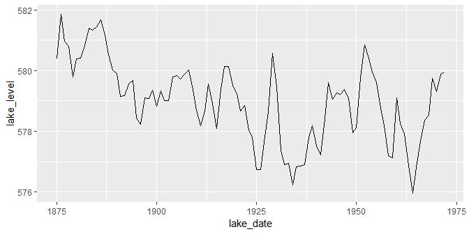

time series data
================


<small> <br> <i>Time Adjustments</i> by Bill Smith is licensed under
<a href="https://creativecommons.org/licenses/by/2.0/legalcode">CC BY
2.0</a> <br> </small>

## contents

[introduction](#introduction)  
[prerequisites](#prerequisites)  
[time series in Date class](#time-series-in-date-class)  
[time series in ts class](#time-series-in-ts-class)  
[separate ts variables](#separate-ts-variables)  
[references](#references)

## introduction

In time series data, dates and times are the typically independent
variable and the quantitative observation is the dependent variable.

In many cases, the quantitative variables IA a column in a data frame
encoded as class `Date` or `POSIXct` (these classes are discussed in the
[time and dates](cm109-data-time-dates.md) tutorial). In other cases,
the quantitative variable is a vector encoded as an R `Time-Series`
object. I will use “time series” (lowercase) to denote time-dependent
data in general and “Time-Series” to denote the R object of class `ts`.

<br> <a href="#top">▲ top of page</a>

## prerequisites

Project setup

  - Start every work session by launching the RStudio Project file for
    the course, e.g., `portfolio.Rproj`  
  - Ensure your [project directory
    structure](cm501-proj-m-manage-files.md#planning-the-directory-structure)
    satisfies the course requirements

Ensure you have installed the following packages. See [install
packages](cm902-software-studio.md#install-packages) for instructions if
needed.

  - tidyverse  
  - lubridate

Scripts to initialize

    explore/     0603-time-series-explore.R 

And start with a minimal header

``` r
# your name
# date

# load packages
library("tidyverse")
library("lubridate")
```

## time series in Date class

Consider the `economics` data set that comes bundled with ggplot2. It
has five quantitative variables and one date variable of class `Date`.
View the data help page by running `? economics`.

``` r
data(economics, package = "ggplot2")
economics
#> # A tibble: 574 x 6
#>    date         pce    pop psavert uempmed unemploy
#>    <date>     <dbl>  <int>   <dbl>   <dbl>    <int>
#>  1 1967-07-01  507. 198712    12.5     4.5     2944
#>  2 1967-08-01  510. 198911    12.5     4.7     2945
#>  3 1967-09-01  516. 199113    11.7     4.6     2958
#>  4 1967-10-01  513. 199311    12.5     4.9     3143
#>  5 1967-11-01  518. 199498    12.5     4.7     3066
#>  6 1967-12-01  526. 199657    12.1     4.8     3018
#>  7 1968-01-01  532. 199808    11.7     5.1     2878
#>  8 1968-02-01  534. 199920    12.2     4.5     3001
#>  9 1968-03-01  545. 200056    11.6     4.1     2877
#> 10 1968-04-01  545. 200208    12.2     4.6     2709
#> # ... with 564 more rows

class(economics$date)
#> [1] "Date"
```

In this form, we can go right to the graph. I’ll graph the number of
unemployed (in 1000s) by date.

``` r
ggplot(data = economics, mapping = aes(x = date, y = unemploy)) +
    geom_line()
```


## time series in ts class

Class `ts` is fundamentally different from date-time classes `Date` and
`POSIXct`. The date-time classes represent date and time values. The
`ts` class represents Time-Series objects, typically numeric data
vectors, that are observed at equally-spaced time intervals in time.

Examples of possible Time-Series objects: unemployment rate observed
every month, CO<sub>2</sub> levels observed every day, temperature
observed every hour, etc.

For illustrating the `ts` class, we’ll examine the `LakeHuron` data
set—a time series in base R, recording annual measurements of the lake
level, in feet, from 1875 to 1972.

``` r
data(LakeHuron)
```

Printing Time-Series shows the data vector plus additional information
that identifies the object as a Time-Series. “Frequency = 1” indicates
that the constant interval between observations is 1 year; the start and
end years are also printed. Note that time is not printed as a vector.

``` r
print(LakeHuron)
#> Time Series:
#> Start = 1875 
#> End = 1972 
#> Frequency = 1 
#>  [1] 580.38 581.86 580.97 580.80 579.79 580.39 580.42 580.82 581.40 581.32
#> [11] 581.44 581.68 581.17 580.53 580.01 579.91 579.14 579.16 579.55 579.67
#> [21] 578.44 578.24 579.10 579.09 579.35 578.82 579.32 579.01 579.00 579.80
#> [31] 579.83 579.72 579.89 580.01 579.37 578.69 578.19 578.67 579.55 578.92
#> [41] 578.09 579.37 580.13 580.14 579.51 579.24 578.66 578.86 578.05 577.79
#> [51] 576.75 576.75 577.82 578.64 580.58 579.48 577.38 576.90 576.94 576.24
#> [61] 576.84 576.85 576.90 577.79 578.18 577.51 577.23 578.42 579.61 579.05
#> [71] 579.26 579.22 579.38 579.10 577.95 578.12 579.75 580.85 580.41 579.96
#> [81] 579.61 578.76 578.18 577.21 577.13 579.10 578.25 577.91 576.89 575.96
#> [91] 576.80 577.68 578.38 578.52 579.74 579.31 579.89 579.96
```

The structure reveals that the vector is a Time-Series object.

``` r
str(LakeHuron) 
#>  Time-Series [1:98] from 1875 to 1972: 580 582 581 581 580 ...
```

The class is `ts`. The `tsp` attribute gives the start time in time
units, the end time, and the frequency (the number of observations per
unit of time). Run `? tsp` for its help page.

``` r
attributes(LakeHuron)
#> $tsp
#> [1] 1875 1972    1
#> 
#> $class
#> [1] "ts"
```

The data are numeric.

``` r
typeof(LakeHuron)
#> [1] "double"
```

We could use the base R `plot()` function to graph the data. This will
not be our usual procedure, but it makes the point that Time-Series
objects do actually encode both a data value and a time value.

``` r
plot(LakeHuron)
```


## separate ts variables

To use our usual ggplot functions, we need the data in a data frame. If
you have a `ts` class object, you can use the base R `time()` function
to extract the time data, then a lubridate function to convert it to a
`Date` class.

  - extract the time data from the `ts` object. We have a vector of
    years, but it is still class `ts`

<!-- end list -->

``` r
(lake_date <- time(LakeHuron))
#> Time Series:
#> Start = 1875 
#> End = 1972 
#> Frequency = 1 
#>  [1] 1875 1876 1877 1878 1879 1880 1881 1882 1883 1884 1885 1886 1887 1888
#> [15] 1889 1890 1891 1892 1893 1894 1895 1896 1897 1898 1899 1900 1901 1902
#> [29] 1903 1904 1905 1906 1907 1908 1909 1910 1911 1912 1913 1914 1915 1916
#> [43] 1917 1918 1919 1920 1921 1922 1923 1924 1925 1926 1927 1928 1929 1930
#> [57] 1931 1932 1933 1934 1935 1936 1937 1938 1939 1940 1941 1942 1943 1944
#> [71] 1945 1946 1947 1948 1949 1950 1951 1952 1953 1954 1955 1956 1957 1958
#> [85] 1959 1960 1961 1962 1963 1964 1965 1966 1967 1968 1969 1970 1971 1972
class(lake_date)
#> [1] "ts"
```

  - `unclass()` to remove the `ts` class

<!-- end list -->

``` r
(lake_date <- unclass(lake_date))
#>  [1] 1875 1876 1877 1878 1879 1880 1881 1882 1883 1884 1885 1886 1887 1888
#> [15] 1889 1890 1891 1892 1893 1894 1895 1896 1897 1898 1899 1900 1901 1902
#> [29] 1903 1904 1905 1906 1907 1908 1909 1910 1911 1912 1913 1914 1915 1916
#> [43] 1917 1918 1919 1920 1921 1922 1923 1924 1925 1926 1927 1928 1929 1930
#> [57] 1931 1932 1933 1934 1935 1936 1937 1938 1939 1940 1941 1942 1943 1944
#> [71] 1945 1946 1947 1948 1949 1950 1951 1952 1953 1954 1955 1956 1957 1958
#> [85] 1959 1960 1961 1962 1963 1964 1965 1966 1967 1968 1969 1970 1971 1972
#> attr(,"tsp")
#> [1] 1875 1972    1
class(lake_date)
#> [1] "numeric"
```

  - convert it to `Date` class

<!-- end list -->

``` r
lake_date <- make_date(lake_date)
class(lake_date)
#> [1] "Date"
```

  - convert the quantitative variable to numeric

<!-- end list -->

``` r
lake_level <- as.numeric(LakeHuron)
```

  - assemble the data frame

<!-- end list -->

``` r
df <- tibble(lake_date, lake_level) %>% 
    glimpse()
#> Observations: 98
#> Variables: 2
#> $ lake_date  <date> 1875-01-01, 1876-01-01, 1877-01-01, 1878-01-01, 18...
#> $ lake_level <dbl> 580.38, 581.86, 580.97, 580.80, 579.79, 580.39, 580...
```

In the graph, we assign the date to the x-scale.

``` r
ggplot(data = df, mapping = aes(x = lake_date, y = lake_level)) +
    geom_line()
```



## references

<div id="refs">

<div id="ref-Wickham+Grolemund:2017">

Wickham H and Grolemund G (2017) *R for Data Science.* O’Reilly Media,
Inc., Sebastopol, CA <https://r4ds.had.co.nz/>

</div>

</div>

***
<a href="#top">&#9650; top of page</a>    
[&#9665; calendar](../README.md#calendar)    
[&#9665; index](../README.md#index)
