<a name="top"></a>

# strip plot

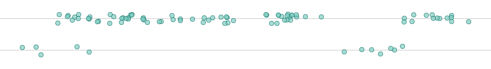

## contents

[overview](#overview)  
[data](#data)  
[exploration](#exploration)  
[ordering](#ordering)  
[data table](#data-table)  
[publication](#publication)  
[exercises](#exercises)  
[references](#references)

## overview

This graph type satisfies the portfolio requirements for [D1
Distributions](cm301_portfolio_display-reqts.md#d1-distributions).

A *strip plot*, also called a strip chart, a univariate scatterplot, or
a jitter plot, is designed for displaying the distribution of a single
quantitative variable.

Data can be grouped by one or more categorical variables and are often
jittered to avoid overprinting. However, as Naomi Robbons
([2013](#ref-Robbins:2013), 85) explains, “Even with jittering, the
plots will become indecipherable for a large number of observations with
a small range of values. In such a case, box-and-whisker plots are
better for comparing distributions.”

Strip plot characteristics:

  - displays distributions of a single quantitative variable
  - shows all the data values, not a summary  
  - shows range, outliers, and clusters
  - often jittered to avoid overprinting
  - different rows or data markers can be used to distinguish different
    levels of a category

<a href="#top">Top of page</a>

## data

A tidy data frame for a strip plot contains one column for the
quantitative variable and a separate column for each categorical
variable (if any).

For example, consider the speed ski data included in the graphclassmate
package—a subset of speed skiing data from the GDAdata package (Antony
Unwin, [2015](#ref-Unwin:2015:package)).

Speed is the quantitative, continuous variable, with 91 observations.

``` r
library("tidyverse")
library("graphclassmate")

speed_ski
#> # A tibble: 91 x 3
#>   event     sex   speed
#>   <chr>     <chr> <dbl>
#> 1 Speed One Male   212.
#> 2 Speed One Male   210.
#> 3 Speed One Male   210.
#> 4 Speed One Male   210.
#> 5 Speed One Male   209.
#> 6 Speed One Male   208.
#> 7 Speed One Male   208.
#> 8 Speed One Male   208.
#> # ... with 83 more rows
```

The statistical description of speed is provided by `summary()` and
yields a range, median, and quartiles.

``` r
summary(speed_ski$speed)
#>    Min. 1st Qu.  Median    Mean 3rd Qu.    Max. 
#>   160.2   171.8   183.1   184.1   192.3   211.7
```

We can see the levels of two categories by applying `unique()` to each
column.

``` r
unique(speed_ski$event)
#> [1] "Speed One"             "Speed Downhill"        "Speed Downhill Junior"
unique(speed_ski$sex)
#> [1] "Male"   "Female"
```

<a href="#top">Top of page</a>

## exploration

For our first view of the data, we’ll look at the distribution of speeds
for all events. We don’t have a variable for “all events” so we can add
one,

``` r
speed_ski <- speed_ski %>% 
    mutate(allevents = "All events")
```

Now we can use `speed` as the x-variable and `allevents` as the
y-variable in the plot.

``` r
ggplot(speed_ski, aes(x = speed, y = allevents)) +
    geom_point()
```

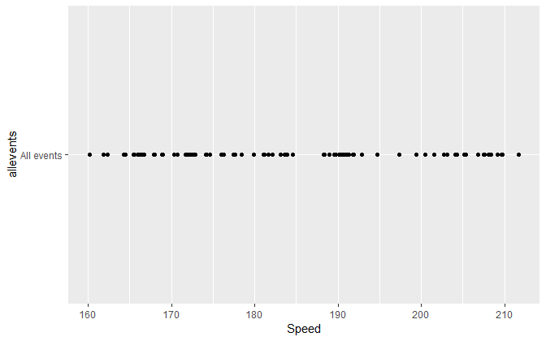

We can reduce the amount of overprinting to better see the data by using
`geom_jitter()`. We can also omit the redundant y-axis label and add
units of speed to the x-axis label.

``` r
ggplot(speed_ski, aes(x = speed, y = allevents)) +
    geom_jitter(height = 0.1) +
    labs(x = "Speed (km/hr)", y = "")
```

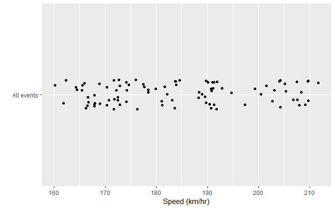

One approach to grouping data is by adding a color argument to the main
`aes()` function. Grouping by event yields

``` r
ggplot(speed_ski, aes(x = speed, y = allevents, color = event)) +
    geom_jitter(height = 0.1) +
    labs(x = "Speed (km/hr)", y = "")
```

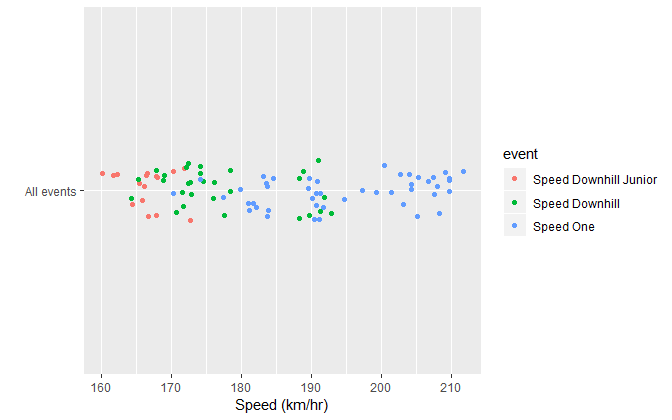

Grouping by sex yields,

``` r
ggplot(speed_ski, aes(x = speed, y = allevents, color = sex)) +
    geom_jitter(height = 0.1) +
    labs(x = "Speed (km/hr)", y = "")
```

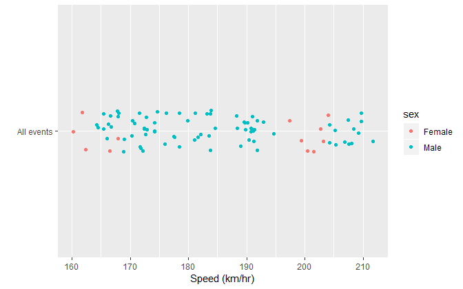

With two categorical variables however, the graph is more informative if
the y-variable is assigned to one of the categories. For example, if
color designates the event, then the y-variable could be sex,

``` r
ggplot(speed_ski, aes(x = speed, y = sex, color = event)) +
    geom_jitter(height = 0.1) +
    labs(x = "Speed (km/hr)", y = "")
```

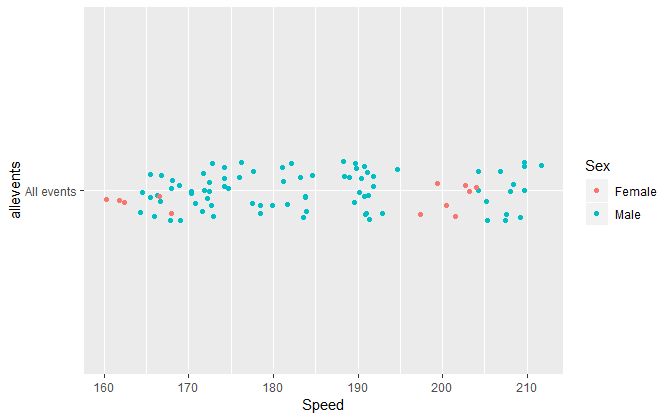

Swapping the roles of event and sex yields

``` r
ggplot(speed_ski, aes(x = speed, y = event, color = sex)) +
    geom_jitter(height = 0.1) +
    labs(x = "Speed (km/hr)", y = "")
```


This one tells an interesting story. Speed One is the fastest event and
the women competing in Speed One have little variance in speed and are
faster than most (but not all) of the men competing in this event.
Additionally, we see that no women compete in Downhill, and there is
little variation among the Juniors.

I think I’ll use this design going forward.

## ordering

The event rows are ordered alphabetically from bottom to top by default.
Nominal categorical data should generally be ordered by the data values,
in this case the median speed of each row. One approach to achieving
this is to reorder the
y-variable

``` r
ggplot(speed_ski, aes(x = speed, y = reorder(event, speed), color = sex)) +
    geom_jitter(height = 0.1) +
    labs(x = "Speed (km/hr)", y = "")
```


Alternatively, we can convert the event variable from type “character”
to type “factor” and order its levels by speed.

``` r
speed_ski <- speed_ski %>% 
    mutate(event = as_factor(event)) %>% 
    mutate(event = fct_reorder(event, speed))
```

Having ordered the levels of the factor, we no longer need to reorder
the y-variable in the `aes()` argument.

``` r
ggplot(speed_ski, aes(x = speed, y = event, color = sex)) +
    geom_jitter(height = 0.1) +
    labs(x = "Speed (km/hr)", y = "")
```

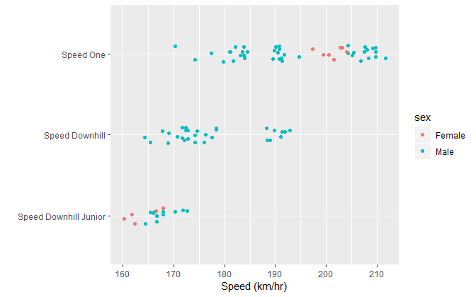

<a href="#top">Top of page</a>

## data table

Univariate data with two categories is easily summarized in a two-way
table.

First we count the numbers of competitors by event and sex,

``` r
speed_ski_table <- speed_ski %>% 
  count(event, sex) %>% 
  print() 
#> # A tibble: 5 x 3
#>   event                 sex        n
#>   <fct>                 <chr>  <int>
#> 1 Speed Downhill Junior Female     5
#> 2 Speed Downhill Junior Male      11
#> 3 Speed Downhill        Male      29
#> 4 Speed One             Female     7
#> 5 Speed One             Male      39
```

Then use `spread()` to make put the table into the form of a two-way
table. The row names are the levels of one category, the column names
are the levels of the second category, the table entries are the count
or frequency of people in each cell.

``` r
speed_ski_table %>% 
  spread(sex, n) %>% 
  rename(Event = event) %>% 
  kable()
```

| Event                 | Female | Male |
| :-------------------- | -----: | ---: |
| Speed Downhill Junior |      5 |   11 |
| Speed Downhill        |     NA |   29 |
| Speed One             |      7 |   39 |

<a href="#top">Top of page</a>

## publication

For formatting the graph, the `theme_graphclass()` is a good starting
point.

``` r
ggplot(speed_ski, aes(x = speed, y = event, color = sex)) +
    geom_jitter(height = 0.1) +
    labs(x = "Speed (km/hr)", y = "") +
    theme_graphclass()
```

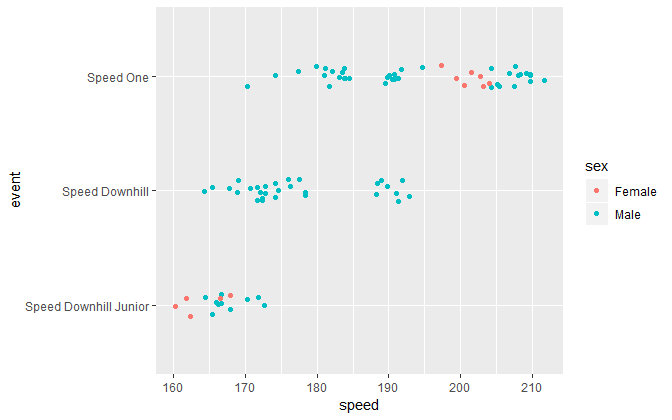

To manually control the data marker color, we use
`scale_color_manual()`. We are also using the `rcb()` function to
consistently assign named colors from the RColorBrewer package.

``` r
ggplot(speed_ski, aes(x = speed, y = event, color = sex)) +
    geom_jitter(height = 0.1) +
    labs(x = "Speed (km/hr)", y = "") +
    theme_graphclass() +
    scale_color_manual(values = c(rcb("dark_BG"), rcb("dark_Br")))
```

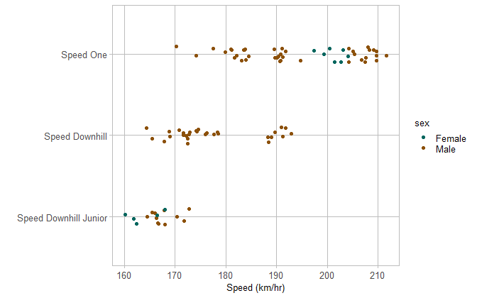

If we change the data marker to a circle with a separate fill color
(`shape = 21`), we use `scale_fill_manual()` and add a `fill` argument
to the `aes()` function.

``` r
ggplot(speed_ski, aes(x = speed, y = event, color = sex, fill = sex)) +
    geom_jitter(height = 0.1, shape = 21) +
    labs(x = "Speed (km/hr)", y = "") +
    theme_graphclass() +
    scale_color_manual(values = c(rcb("dark_BG"), rcb("dark_Br"))) +
    scale_fill_manual(values = c(rcb("mid_BG"), rcb("mid_Br")))
```

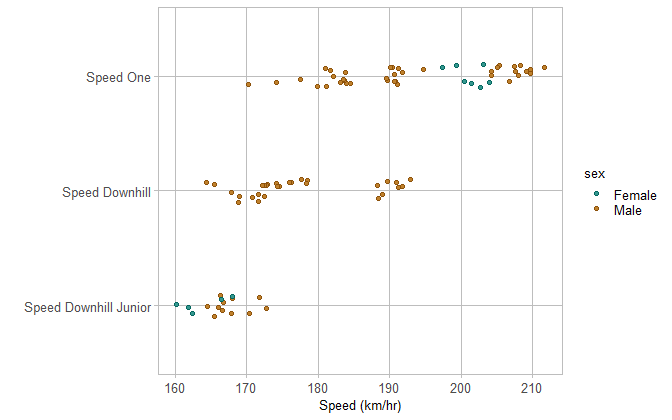

We can edit the data markers further by adding a `size` argument and
make the data marker partially transparent using an `alpha` argument.

``` r
ggplot(speed_ski, aes(x = speed, y = event, color = sex, fill = sex)) +
    geom_jitter(height = 0.1, shape = 21, size = 2, alpha = 0.7) +
    labs(x = "Speed (km/hr)", y = "") +
    theme_graphclass() +
    scale_color_manual(values = c(rcb("dark_BG"), rcb("dark_Br"))) +
    scale_fill_manual(values = c(rcb("mid_BG"), rcb("mid_Br")))
```

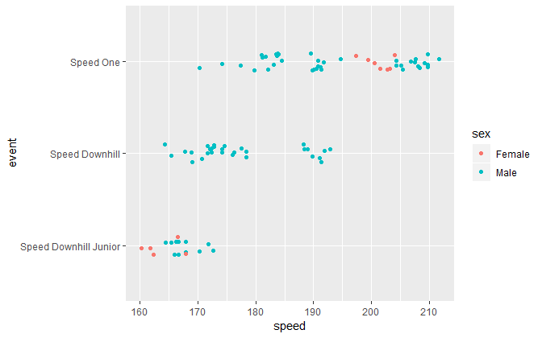

We can label the data directly using `geom_text()`, manually selecting
the coordinates of the text and matching the text color by sex. Then the
legend can be omitted using the `legend.position` argument.

``` r
ggplot(speed_ski, aes(x = speed, y = event, color = sex, fill = sex)) +
    geom_jitter(height = 0.1, shape = 21, size = 2, alpha = 0.7) +
    labs(x = "Speed (km/hr)", y = "") +
    theme_graphclass() +
    scale_color_manual(values = c(rcb("dark_BG"), rcb("dark_Br"))) +
    scale_fill_manual(values = c(rcb("mid_BG"), rcb("mid_Br"))) +
    geom_text(aes(x = 200, y = 2.7, label = "women"), color = rcb("mid_BG")) +
    geom_text(aes(x = 210, y = 2.7, label = "men"), color = rcb("mid_Br")) +
    theme(legend.position = "none") 
```

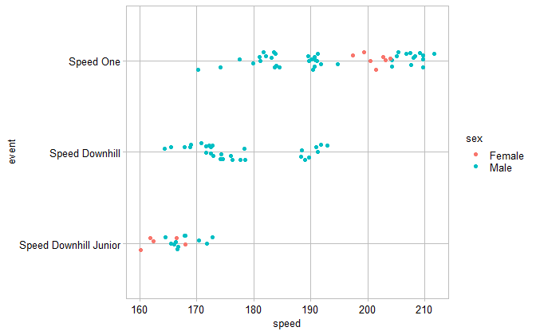

Using `ggsave()` to control the figure dimensions, we can control the
aspect ratio and dpi to produce the final version.

``` r
ggsave(filename = "d1-01-stripchart-speed-ski.png",
             path     = "figures",
             device   = "png",
             width    = 8,
             height   = 2.5,
             units    = "in",
             dpi      = 600
)
```

<a name="completed-strip-chart"></a> *Publication-ready strip
plot*

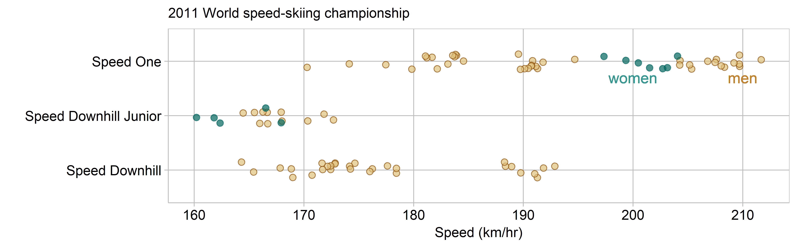

<a href="#top">Top of page</a>

## exercises

1.  Museum exhibits

<!-- end list -->

  - Examine the `museum_exhibits` data in graphclassmate.
  - Create a strip plot that compares distributions.
  - Order the rows by the median duration of visit. mat using
    `theme_graphclass()`
  - Edit axis labels
  - Optional: Add other formatting that improves the presentation.  
  - Create a data table of the count of visitors at each exhibit (a
    one-way table)

## references

<div id="refs">

<div id="ref-Unwin:2015:package">

Antony Unwin (2015) *GDAdata: Datasets for the book Graphical Data
Analysis with R.* R package version 0.93
<https://CRAN.R-project.org/package=GDAdata>

</div>

<div id="ref-Robbins:2013">

Robbins N (2013) *Creating More Effective Graphs.* Chart House, Wayne,
NJ

</div>

</div>

-----

<a href="#top">Top of page</a>  
[Calendar](../README.md#calendar)  
[Index](../README.md#index)

  - For
