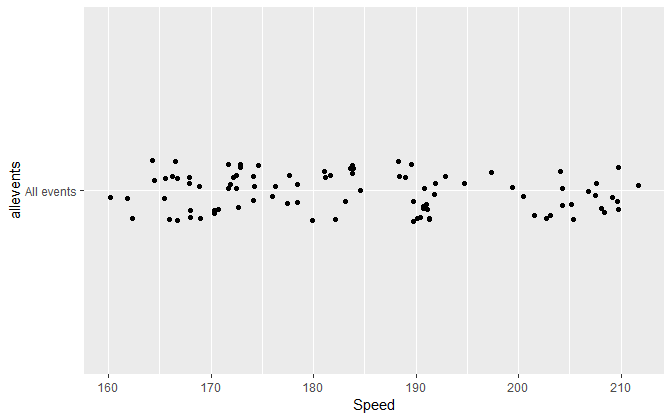
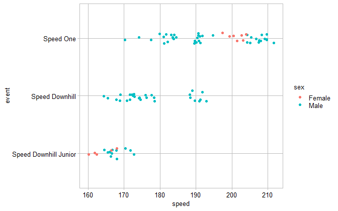

<a name="top"></a>

# strip plot


## contents

[overview](#overview)  
[data](#data)  
[exploration](#exploration)  
[publication](#publication)  
[exercise](#exercise)  
[references](#references)

## overview

This graph type satisfies the portfolio requirements for [D1
Distributions](cm301_portfolio_display-reqts.md#d1-distributions).

A *strip plot*, also called a strip chart, a univariate scatterplot, or
a jitter plot, is designed for displaying the distribution of a single
quantitative variable. Data can be grouped by one or more categorical
variables.

Strip plot characteristics:

  - displays distributions
  - shows all the data values, not a summary  
  - shows range, outliers, and clusters
  - often jittered to avoid overprinting
  - different rows or data markers can be used to distinguish different
    levels of a category

<a href="#top">Top of page</a>

## data

A tidy data frame for a strip plot contains one column for the
quantitative variable and a separate column for each categorical
variable (if any).

For example, consider the speed ski data included in the graphclassmate
package—a subset of speed skiing data from the GDAdata package (Antony
Unwin, [2015](#ref-Unwin:2015:package)).

Speed is the quantitative, continuous variable, with 91 observations.

``` r
library("tidyverse")
library("graphclassmate")

speed_ski
#> # A tibble: 91 x 3
#>   event     sex   speed
#>   <chr>     <chr> <dbl>
#> 1 Speed One Male   212.
#> 2 Speed One Male   210.
#> 3 Speed One Male   210.
#> 4 Speed One Male   210.
#> 5 Speed One Male   209.
#> 6 Speed One Male   208.
#> 7 Speed One Male   208.
#> 8 Speed One Male   208.
#> # ... with 83 more rows
```

The statistical description of speed is provided by `summary()` and
yields a range, median, and quartiles.

``` r
summary(speed_ski$speed)
#>    Min. 1st Qu.  Median    Mean 3rd Qu.    Max. 
#>   160.2   171.8   183.1   184.1   192.3   211.7
```

We can see the levels of two categories by applying `unique()` to each
column.

``` r
unique(speed_ski$event)
#> [1] "Speed One"             "Speed Downhill"        "Speed Downhill Junior"
unique(speed_ski$sex)
#> [1] "Male"   "Female"
```

<a href="#top">Top of page</a>

## exploration

For our first view of the data, we’ll look at the distribution of speeds
for all events. We don’t have a variable for “all events” so we can add
one,

``` r
speed_ski <- speed_ski %>% 
    mutate(allevents = "All events")
```

Now we can use `speed` as the x-variable and `allevents` as the
y-variable in the plot.

``` r
ggplot(speed_ski, aes(x = speed, y = allevents)) +
    geom_point()
```


We can reduce the amount of overprinting to better see the data by
switching changing to `geom_jitter()`. We can also omit the redundant
y-axis label and add units of speed to the x-axis label.

``` r
ggplot(speed_ski, aes(x = speed, y = allevents)) +
    geom_jitter(height = 0.1) +
    labs(x = "Speed (km/hr)", y = "")
```


One approach to grouping data is by adding a color argument to the main
`aes()` function. Grouping by event yields

``` r
ggplot(speed_ski, aes(x = speed, y = allevents, color = event)) +
    geom_jitter(height = 0.1) +
    labs(x = "Speed (km/hr)", y = "")
```



Grouping by sex yields,

``` r
ggplot(speed_ski, aes(x = speed, y = allevents, color = sex)) +
    geom_jitter(height = 0.1) +
    labs(x = "Speed (km/hr)", y = "")
```


With two categorical variables however, the graph is more informative if
the y-variable is assigned to one of the categories. For example, if
color designates the event, then the y-variable could be sex,

``` r
ggplot(speed_ski, aes(x = speed, y = sex, color = event)) +
    geom_jitter(height = 0.1) +
    labs(x = "Speed (km/hr)", y = "")
```


Swapping the roles of event and sex yields

``` r
ggplot(speed_ski, aes(x = speed, y = event, color = sex)) +
    geom_jitter(height = 0.1) +
    labs(x = "Speed (km/hr)", y = "")
```


This last one seems to tell an interesting story. The rows are by
default ordered alphabetically from bottom to top. Nominal categorical
data should generally be ordered by he data values, in this case the
median speed of each row.

One approach to achieving this is to reorder the
y-variable

``` r
ggplot(speed_ski, aes(x = speed, y = reorder(event, speed), color = sex)) +
    geom_jitter(height = 0.1) +
    labs(x = "Speed (km/hr)", y = "")
```


Alternatively, we can convert the event variable from type “character”
to type “factor” order its levels by speed.

``` r
speed_ski <- speed_ski %>% 
    mutate(event = as_factor(event)) %>% 
    mutate(event = fct_reorder(event, speed))
```

Having opdered the levels of the factor, we no longer need to reorder
the y-variable in the `aes()` argument.

``` r
ggplot(speed_ski, aes(x = speed, y = event, color = sex)) +
    geom_jitter(height = 0.1) +
    labs(x = "Speed (km/hr)", y = "")
```


<a href="#top">Top of page</a>

## publication

We start with a data table. For this particular data set, a two-way
table is appropriate for displaying the data. First we count the numbers
of competitors by event and sex,

``` r
speed_ski_table <- speed_ski %>% 
  count(event, sex) %>% 
  print() 
#> # A tibble: 5 x 3
#>   event                 sex        n
#>   <fct>                 <chr>  <int>
#> 1 Speed Downhill Junior Female     5
#> 2 Speed Downhill Junior Male      11
#> 3 Speed Downhill        Male      29
#> 4 Speed One             Female     7
#> 5 Speed One             Male      39
```

Then use `spread()` to make put the table into a form that the reader
will find easy to read—which also highlights that there are no women in
one of the events. The table also lists for us the levels of the two
categories.

``` r
speed_ski_table %>% 
  spread(sex, n) %>% 
    rename(Event = event) %>% 
  kable()
```

| Event                 | Female | Male |
| :-------------------- | -----: | ---: |
| Speed Downhill Junior |      5 |   11 |
| Speed Downhill        |     NA |   29 |
| Speed One             |      7 |   39 |

For formatting the graph, we start with `theme_graphclass()` as a good
starting point.

``` r
ggplot(speed_ski, aes(x = speed, y = event, color = sex)) +
    geom_jitter(height = 0.1) +
    labs(x = "Speed (km/hr)", y = "") +
    theme_graphclass()
```


To manually control the data marker color, we use `scale_color_manual()`

``` r
ggplot(speed_ski, aes(x = speed, y = event, color = sex)) +
    geom_jitter(height = 0.1) +
    labs(x = "Speed (km/hr)", y = "") +
    theme_graphclass() +
    scale_color_manual(values = c(rcb("dark_BG"), rcb("dark_Br")))
```


If we change the data marker to a circle with a separate fill color
(`shape = 21`), we use `scale_fill_manual()` and add a `fill` argument
to the `aes()` function.

``` r
ggplot(speed_ski, aes(x = speed, y = event, color = sex, fill = sex)) +
    geom_jitter(height = 0.1, shape = 21) +
    labs(x = "Speed (km/hr)", y = "") +
    theme_graphclass() +
    scale_color_manual(values = c(rcb("dark_BG"), rcb("dark_Br"))) +
    scale_fill_manual(values = c(rcb("mid_BG"), rcb("mid_Br")))
```


We can edit the data markers further by adding a `size` argument and
make the data marker more transparent using an `alpha` argument.

``` r
ggplot(speed_ski, aes(x = speed, y = event, color = sex, fill = sex)) +
    geom_jitter(height = 0.1, shape = 21, size = 2, alpha = 0.7) +
    labs(x = "Speed (km/hr)", y = "") +
    theme_graphclass() +
    scale_color_manual(values = c(rcb("dark_BG"), rcb("dark_Br"))) +
    scale_fill_manual(values = c(rcb("mid_BG"), rcb("mid_Br")))
```


We can label the data directly using `geom_text()`, manualling selecting
te coordinates of the text and matching the text color by sex. Then the
legend can be omitted using the `legend.position` argument.

``` r
ggplot(speed_ski, aes(x = speed, y = event, color = sex, fill = sex)) +
    geom_jitter(height = 0.1, shape = 21, size = 2, alpha = 0.7) +
    labs(x = "Speed (km/hr)", y = "") +
    theme_graphclass() +
    scale_color_manual(values = c(rcb("dark_BG"), rcb("dark_Br"))) +
    scale_fill_manual(values = c(rcb("mid_BG"), rcb("mid_Br"))) +
    geom_text(aes(x = 200, y = 2.7, label = "women"), color = rcb("mid_BG")) +
    geom_text(aes(x = 210, y = 2.7, label = "men"), color = rcb("mid_Br")) +
    theme(legend.position = "none") 
```



Using `ggsave()` to control the figure dimensions, we can control the
aspect ratio and dpi,

``` r
ggsave(filename = "d1-01-stripchart-speed-ski.png",
             path     = "figures",
             device   = "png",
             width    = 8,
             height   = 2.5,
             units    = "in",
             dpi      = 600
)
```

producing a final image suitable for a
portfolio.


<a href="#top">Top of page</a>

## exercise

Use some data and create a graph

## references

<div id="refs">

<div id="ref-Unwin:2015:package">

Antony Unwin (2015) *GDAdata: Datasets for the book Graphical Data
Analysis with R.* R package version 0.93
<https://CRAN.R-project.org/package=GDAdata>

</div>

</div>

-----

<a href="#top">Top of page</a>  
[Calendar](../README.md#calendar)  
[Index](../README.md#index)
