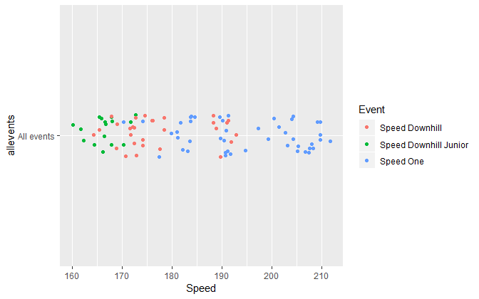
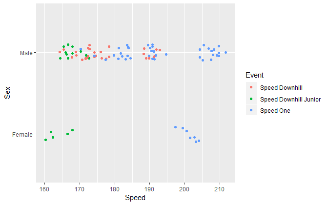
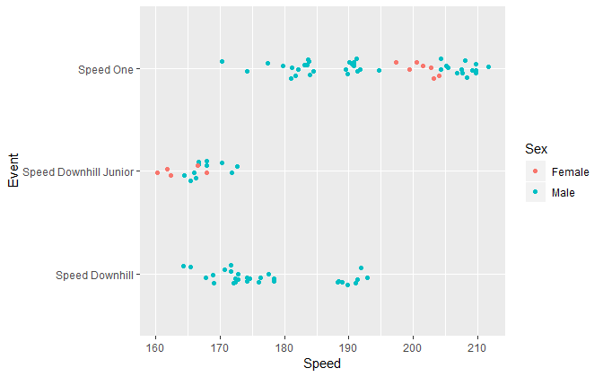
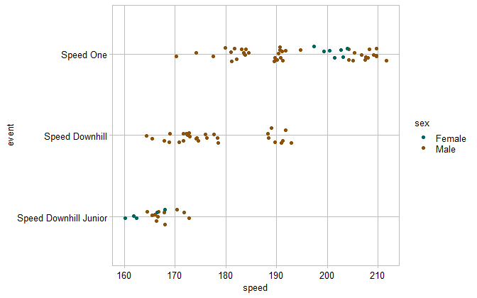
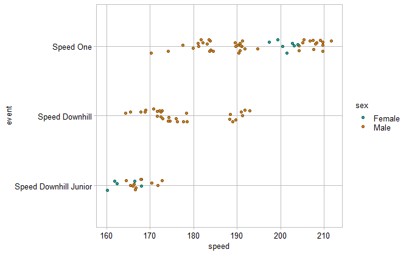

<a name="top"></a>

# strip plot


## contents

[introduction](#introduction)  
[prerequisites](#prerequisites)  
[explore](#explore)  
[carpentry](#carpentry)  
[design](#design)  
[exercises](#exercises)  
[references](#references)

## introduction

A *strip plot*—also called a strip chart, a univariate scatterplot, or a
jitter plot—is designed for displaying the distribution of a single
quantitative variable.

Data characteristics in tidy form

  - One quantitative variable in one column, values are numerical,
    continuous or discrete  
  - One categorical variable (if any) per column, values are the
    category levels, nominal or ordinal

Graph characteristics

  - Displays distributions of a single quantitative variable
  - Shows all the data values, not a summary  
  - Shows range, outliers, and clusters

Data can be grouped by one or more categorical variables and are often
jittered to avoid overprinting. However, as Robbins
([2013](#ref-Robbins:2013), 85) explains, “Even with jittering, the
plots will become indecipherable for a large number of observations with
a small range of values. In such a case,
[box-and-whisker](cm202_boxplot.md#boxplot) plots are better for
comparing distributions.”

<a href="#top">Top of page</a>

## prerequisites

  - [directory structure](cm101_data-lab.md#file-management) has been
    set up  
  - tidyverse package installed  
  - GDAdata package installed  
  - graphclassmate package installed

<a href="#top">Top of page</a>

## explore

Create the R file `practice/d1_tutorial_stripplot_speedski.R`

``` r
library("tidyverse")
library("GDAdata")
library("graphclassmate")
```

We will use the `SpeedSki` data set from GDAdata (Unwin,
[2015](#ref-Unwin:2015:package)). Run `? SpeedSki` to open the help page
for the data set.

For exploring the data, I assign it a new name, leaving the original
data frame unaltered.

``` r
explore <- SpeedSki
glimpse(explore)
#> Observations: 91
#> Variables: 10
#> $ Rank       <int> 1, 2, 3, 4, 5, 6, 7, 8, 9, 10, 11, 12, 13, 14, 15, ...
#> $ Bib        <int> 61, 59, 66, 57, 69, 75, 67, 58, 62, 56, 81, 80, 93,...
#> $ FIS.Code   <int> 7039, 7078, 190130, 7178, 510089, 7204, 7053, 7170,...
#> $ Name       <fct> ORIGONE Simone, ORIGONE Ivan, MONTES Bastien, SCHRO...
#> $ Year       <int> 1979, 1987, 1985, 1979, 1970, 1993, 1975, 1991, 198...
#> $ Nation     <fct> ITA, ITA, FRA, AUT, SUI, FRA, SWE, FRA, CZE, SWE, P...
#> $ Speed      <dbl> 211.67, 209.70, 209.69, 209.67, 209.19, 208.33, 208...
#> $ Sex        <fct> Male, Male, Male, Male, Male, Male, Male, Male, Mal...
#> $ Event      <fct> Speed One, Speed One, Speed One, Speed One, Speed O...
#> $ no.of.runs <int> 4, 4, 4, 4, 4, 4, 4, 4, 4, 4, 4, 4, 4, 4, 4, 4, 4, ...
```

The data set has 91 observations. The variables of interest are `Speed`,
`Sex`, and `Event`. Speed is numeric (`<dbl>`) and sex and event are
both factors (`<fct>`).

Speed (in km/hr) is the quantitative, continuous variable. The
statistical range, median, and quartiles are obtained using `summary()`,

``` r
# summarize the quantitative variable 
summary(explore$Speed)
#>    Min. 1st Qu.  Median    Mean 3rd Qu.    Max. 
#>   160.2   171.8   183.1   184.1   192.3   211.7
```

When categorical variables are encoded as factors, their levels are
found with `levels()`. The output indicates that the factor levels are
ordered alphabetically.

``` r
# view the categorical variables and the order of their levels 
levels(explore$Event)
#> [1] "Speed Downhill"        "Speed Downhill Junior" "Speed One"
levels(explore$Sex)
#> [1] "Female" "Male"
```

We use `count()` to assess the number of people in each combination of
category levels.

``` r
explore %>% 
    count(Event, Sex)
#> # A tibble: 5 x 3
#>   Event                 Sex        n
#>   <fct>                 <fct>  <int>
#> 1 Speed Downhill        Male      29
#> 2 Speed Downhill Junior Female     5
#> 3 Speed Downhill Junior Male      11
#> 4 Speed One             Female     7
#> 5 Speed One             Male      39
```

For our first graph of the data, we’ll look at the distribution of
speeds for all events. We don’t have a variable for “all events” so we
can add one,

``` r
# add a new category with one level
explore <- explore %>%
    mutate(allevents = "All events")
```

Now we can plot using `x = Speed, y = allevents`.

``` r
# examine the full distribution 
ggplot(explore, aes(x = Speed, y = allevents)) +
    geom_point()
```


We reduce the amount of overprinting by replacing `geom_point()` with
`geom_jitter()`. So that subsequent data markers appear in the same
jittered locations we set the random number seed as well.

``` r
# full distribution, jittered
set.seed(20181216)
ggplot(explore, aes(x = Speed, y = allevents)) +
    geom_jitter(width = 0, height = 0.1)
```



One approach to grouping data is by adding a color argument to the main
`aes()` function. For example, adding the argument `color = Event` shows
that the Speed One event has the largest number of competitors.

``` r
# group by event
ggplot(explore, aes(x = Speed, y = allevents, color = Event)) +
    geom_jitter(width = 0, height = 0.1) 
```


Changing the grouping to `color = Sex` shows that men significantly
outnumber women.

``` r
# group by sex
ggplot(explore, aes(x = Speed, y = allevents, color = Sex)) +
    geom_jitter(width = 0, height = 0.1) 
```



We have two categorical variables however, so assigning one to the
y-variable and one to the color argument may be more informative. For
example, assigning `y = Sex` and `color = Event` shows that men
outnumber women and that women competed in only two of the three events.

``` r
# group by sex and event, with sex on the rows
ggplot(SpeedSki, aes(x = Speed, y = Sex, color = Event)) +
    geom_jitter(width = 0, height = 0.1) 
```



Swapping the category assignments to `y = Event` and `color = Sex`
yields a display that tells (perhaps) the most interesting story.

``` r
# with event on the rows
ggplot(SpeedSki, aes(x = Speed, y = Event, color = Sex)) +
    geom_jitter(width = 0, height = 0.1)
```


We see here that

  - Speed One is the fastest event  
  - Women competing in Speed One have little variance in speed and are
    faster than most (but not all) of the men competing in this event  
  - No women compete in Speed Downhill  
  - There is little variation among the Juniors

This concludes our initial exploration. This final graph will be the
starting point for the final design.

<a href="#top">Top of page</a>

## carpentry

A data carpentry file typically begins by reading the source data file.
In this case, the data are loaded with the GDAdata package.

``` r
library("GDAdata")
```

For data carpentry, I assign a new name, leaving the original data frame
unaltered.

``` r
speed_ski <- SpeedSki
```

Select speed, event, and sex. Convert to a tibble.

``` r
speed_ski <- speed_ski %>% 
    select(Event, Sex, Speed) %>% 
    as_tibble()
```

This data set is already tidy, but I prefer lower case variable names,

``` r
speed_ski <- speed_ski %>%
    rename(event = Event, sex = Sex, speed = Speed) %>% 
    glimpse()
#> Observations: 91
#> Variables: 3
#> $ event <fct> Speed One, Speed One, Speed One, Speed One, Speed One, S...
#> $ sex   <fct> Male, Male, Male, Male, Male, Male, Male, Male, Male, Ma...
#> $ speed <dbl> 211.67, 209.70, 209.69, 209.67, 209.19, 208.33, 208.03, ...
```

From the exploration, I know I’ll want to order the event levels by the
median speeds, so I convert event to a factor and order its levels by
speed.

``` r
speed_ski <- speed_ski %>% 
    mutate(event = as_factor(event)) %>% 
    mutate(event = fct_reorder(event, speed))
```

A data carpentry file typically concludes by saving the data frame.

``` r
saveRDS(speed_ski, "data/d1_tutorial_stripplot-speedski.rds")
```

<a href="#top">Top of page</a>

## design

Graph design is usually performed in a separate R script in the
`design/` directory. For the tutorial, however, we can simply continue
the same `practice/` R script we started above.

A design file typically starts by reading the tidy data file.

``` r
speed_ski <- readRDS("data/d1_tutorial_stripplot-speedski.rds") %>% 
    glimpse()
#> Observations: 91
#> Variables: 3
#> $ event <fct> Speed One, Speed One, Speed One, Speed One, Speed One, S...
#> $ sex   <fct> Male, Male, Male, Male, Male, Male, Male, Male, Male, Ma...
#> $ speed <dbl> 211.67, 209.70, 209.69, 209.67, 209.19, 208.33, 208.03, ...
```

Draw the graph with the reordered event levels and the data increases
from left to right and from bottom to top.

``` r
p <- ggplot(speed_ski, aes(x = speed, y = event, color = sex)) +
    geom_jitter(width = 0, height = 0.1)
p
```


For formatting the graph, the `theme_graphclass()` is a good starting
point.

``` r
p <- p + 
    theme_graphclass()
p
```



To manually control the data marker color, we use
`ggplot2::scale_color_manual()`. We are also using the
`graphclassmate::rcb()` function to consistently assign named colors
from the RColorBrewer package.

``` r
p <- p +
    scale_color_manual(values = c(rcb("dark_BG"), rcb("dark_Br")))
p
```



We can assign a separate fill color to a data marker by using `shape
= 21`, adding `fill = sex` to the `aes()` function, then using
`scale_fill_manual()` to assign the fill color. To do this, we redraw
the figure instead of adding a
layer,

``` r
p <- ggplot(speed_ski, aes(x = speed, y = event, color = sex, fill = sex)) +
    geom_jitter(width = 0, height = 0.1, shape = 21) +
    theme_graphclass() +
    scale_color_manual(values = c(rcb("dark_BG"), rcb("dark_Br"))) +
    scale_fill_manual(values = c(rcb("mid_BG"), rcb("mid_Br")))
p
```


We can edit the data markers further by adding a `size` and `alpha`
argument to
`geom_jitter()`.

``` r
p <- ggplot(speed_ski, aes(x = speed, y = event, color = sex, fill = sex)) +
    geom_jitter(width = 0, height = 0.1, shape = 21, size = 2, alpha = 0.7) +
    theme_graphclass() +
    scale_color_manual(values = c(rcb("dark_BG"), rcb("dark_Br"))) +
    scale_fill_manual(values = c(rcb("mid_BG"), rcb("mid_Br")))
p
```


We can label the data directly using `geom_text()`, manually selecting
the coordinates of the text and matching the text color by sex. Then the
legend can be omitted using the `legend.position` argument. We can also
edit the axis labels.

``` r
p <- p +
    geom_text(aes(x = 200, y = 2.7, label = "women"), color = rcb("mid_BG")) +
    geom_text(aes(x = 210, y = 2.7, label = "men"), color = rcb("mid_Br")) +
    theme(legend.position = "none")  +
    labs(x = "Speed (km/hr)", y = "") 
p
```


A design file typically concludes by saving the graph to the `figures/`
directory. Using `ggsave()` to control the figure dimensions, we can
control the aspect ratio and dpi to produce the final version.

``` r
ggsave(filename = "d1-01-stripchart-speed-ski.png",
       path     = "figures",
       device   = "png",
       width    = 8,
       height   = 2.5,
       units    = "in",
       dpi      = 600)
```

<a name="completed-strip-chart"></a> *Publication-ready strip
plot*


<a href="#top">Top of page</a>

## exercises

**1. Museum exhibits**

Create `practice/d1_exercise_stripplot-museum.R`

  - Examine the `museum_exhibits` data from the graphclassmate package  
  - Explore the data, identify the number, type, and levels of
    variables, create exploratory graphs to compare distributions  
  - Save a tidy data frame to `data/d1_exercise_stripplot-museum.csv`  
  - Read the tidy data, make the appropriate categorical variable a
    factor, and order its levels  
  - Create the final graph with ordered rows, use `theme_graphclass()`,
    edit axis labels, and add additional formatting you think suitable
    for publication.

**2. Ozone readings**

Create `practice/d1_exercise_stripplot-ozone.R`

  - Examine the `airquality` data in base R  
  - Explore the ozone readings using month as the categorical variable,
    identify the number, type, and levels of variables, create
    exploratory graphs to compare distributions  
  - Save a tidy data frame to `data/d1_exercise_stripplot-ozone.csv`  
  - Read the tidy data, make the appropriate categorical variable a
    factor, and order its levels

As a time series, we would conventionally assign months to the x-scale
and ozone measurements to the y-scale.

  - Create the final graph, use `theme_graphclass()`, edit axis labels,
    and add additional formatting you think suitable for publication.

<a href="#top">Top of page</a>

## references

<div id="refs">

<div id="ref-Robbins:2013">

Robbins N (2013) *Creating More Effective Graphs.* Chart House, Wayne,
NJ

</div>

<div id="ref-Unwin:2015:package">

Unwin A (2015) *GDAdata: Datasets for the book Graphical Data Analysis
with R.* R package version 0.93
<https://CRAN.R-project.org/package=GDAdata>

</div>

</div>

-----

<a href="#top">Top of page</a>  
[Calendar](../README.md#calendar)  
[Index](../README.md#index)
