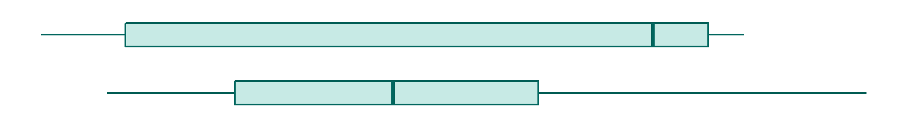

<a name="top"></a>

# box plot



## contents

[introduction](#introduction)  
[prerequisites](#prerequisites)  
[explore](#explore)  
[carpentry](#carpentry)  
[design](#design)  
[exercises](#exercises)  
[references](#references)

## introduction

A *box-and-whisker plot* (or box plot), like [strip
plots](cm201_strip-plot.md#strip-plot), is designed for displaying the
distribution of a single quantitative variable. Box plots are superior
to strip plots for large numbers of observations with a small range of
values (Robbins, [2013](#ref-Robbins:2013), 85).

Data characteristics in tidy form

  - One quantitative variable in one column, values are numerical,
    continuous or discrete  
  - One categorical variable (if any) per column, values are the
    category levels, nominal or ordinal

Graph characteristics

  - displays distributions of a single quantitative variable  
  - shows a 5-point statistical summary  
  - shows range, outliers, and data symmetry or skew about the median  
  - data can be grouped by one or more categorical variables
  - a horizontal layout can make it easier to read category
labels


Reading a boxplot. Figure adapted from (Zhao and Bryan,
[2016](#ref-Zhao+Bryan:2016)).

  - The box shows the inter-quartile range (IQR), the distance between
    the lower quartile (25th percentile) and upper quartile (75th
    percentile)  
  - The median (50th percentile) is the straight line inside the box  
  - The upper whisker extends to the largest value no greater than 1.5
    IQR from the upper quartile  
  - The lower whisker extends to the smallest value no less than 1.5 IQR
    from the lower quartile  
  - Data beyond the whiskers are “outlying” points and are plotted
    individually

Alternative versions of the box plot extend the whiskers to the min/max
values or to the 10th and 90th percentiles.

## prerequisites

The tutorial assumes you have set up the course [directory
structure](cm101_data-lab.md#file-management).

The packages used in this tutorial can be installed with the following
commands.

``` r
# install packages only once
install.packages("tidyverse")
devtools::install_github("graphdr/graphclassmate")
```

Create new R scripts in the directories indicated.

``` 
practice/d1_tutorial_boxplot-diamonds.R  
```

<a href="#top">Top of page</a>

## explore

An initial exploration involves both the data and some exploratory
graphs. Such files are typically not part of the workflow for
publication, so we save such R scripts in the `practice/` directory.

  - Open `practice/d1_tutorial_boxplot-diamonds.R`  
  - One code chunk at a time, copy or type a code chunk into the R
    script  
  - After adding new lines of code, save, run, and examine the result

Start by loading the packages. We will use the `diamonds` data set from
ggplot2 (Wickham, [2016](#ref-Wickham:2016)).

``` r
library("tidyverse")
```

<a href="#top">Top of page</a>

## carpentry

Data gathering and tidying is usually performed in a separate R script
in the `carpentry/` directory. For the tutorial, however, we can simply
continue the same `practice/` R script we started above.

A data carpentry file typically begins by reading the source data file.
In this case, the data are loaded with the GDAdata package.

``` r
library("tidyverse")
```

A data carpentry file typically concludes by saving the data frame.

``` r
write_csv(diamonds, "data/d1_tutorial_boxplot-diamonds.csv")
```

<a href="#top">Top of page</a>

## design

Graph design is usually performed in a separate R script in the
`design/` directory. For the tutorial, however, we can simply continue
the same `practice/` R script we started above.

A design file typically starts by reading the tidy data file.

``` r
diamonds <- read_csv("data/d1_tutorial_boxplot-diamonds.csv") %>% 
    glimpse()
```

A design file typically concludes by saving the graph to the `figures/`
directory. Using `ggsave()` to control the figure dimensions, we can
control the aspect ratio and dpi to produce the final version.

<a href="#top">Top of page</a>

## exercises

**1. Exercise**

**2. Exercise**

<a href="#top">Top of page</a>

## references

<div id="refs">

<div id="ref-Robbins:2013">

Robbins N (2013) *Creating More Effective Graphs.* Chart House, Wayne,
NJ

</div>

<div id="ref-Wickham:2016">

Wickham H (2016) *ggplot2: Elegant Graphics for Data Analysis.*
Springer-Verlag, New York <http://ggplot2.org>

</div>

<div id="ref-Zhao+Bryan:2016">

Zhao J and Bryan J (2016) R Graph Catalog.
<https://github.com/jennybc/r-graph-catalog>

</div>

</div>

-----

<a href="#top">Top of page</a>  
[Calendar](../README.md#calendar)  
[Index](../README.md#index)
