<a name="top"></a>

# box plot


## contents

[introduction](#introduction)  
[prerequisites](#prerequisites)  
[explore](#explore)  
[carpentry](#carpentry)  
[design](#design)  
[exercises](#exercises)  
[references](#references)

## introduction

A *box-and-whisker plot* (or box plot), like a [strip
plot](cm201_strip-plot.md#strip-plot), is designed for displaying the
distribution of a single quantitative variable.

Data characteristics in tidy form

  - One quantitative variable in one column, values are numerical,
    continuous or discrete  
  - One categorical variable (if any) per column, values are the
    category levels, nominal or ordinal

Graph characteristics

  - displays distributions of a single quantitative variable  
  - shows a 5-point statistical summary  
  - shows range, outliers, and data symmetry or skew about the median  
  - data can be grouped by one or more categorical variables
  - a horizontal layout can make it easier to read category
labels


<br>

Reading a box plot. Figure adapted from (Zhao and Bryan,
[2016](#ref-Zhao+Bryan:2016)).

  - The box shows the inter-quartile range (IQR), the distance between
    the lower quartile (25th percentile) and upper quartile (75th
    percentile)  
  - The median (50th percentile) is the straight line inside the box  
  - The upper whisker extends to the largest value no greater than 1.5
    IQR from the upper quartile  
  - The lower whisker extends to the smallest value no less than 1.5 IQR
    from the lower quartile  
  - Data beyond the whiskers are “outlying” points and are plotted
    individually. Alternative versions of the box plot extend the
    whiskers to the min/max values or to the 10th and 90th percentiles.

Box plots are superior to strip plots for large numbers of observations
with a small range of values (Robbins, [2013](#ref-Robbins:2013), 85).
Later in the tutorial, we create box plots to visualize the
`nontraditional` data set (in graphclassmate). The same data in a strip
plot is shown below—with nearly 270,000 observations over a range of
roughly 6 years, the strip plot is not visually
informative.


## prerequisites

  - [directory structure](cm101_data-lab.md#file-management) has been
    set up  
  - tidyverse package installed
  - graphclassmate package installed

## explore

Create the R file `practice/d1_tutorial_boxplot_nontraditional.R`.

``` r
library("tidyverse")
library("graphclassmate")
```

We will use the `nontraditional` data set from graphclassmate. To learn
more about the data, run `?nontraditional` to open its help page.

For exploring the data, I assign it a new name, leaving the original
data frame unaltered.

``` r
# examine data 
explore <- nontraditional
glimpse(explore)
#> Observations: 269,057
#> Variables: 5
#> $ sex      <chr> "Female", "Female", "Male", "Female", "Male", "Female...
#> $ race     <chr> "White", "White", "White", "White", "White", "White",...
#> $ path     <chr> "Traditional", "Traditional", "Traditional", "Traditi...
#> $ SAT      <dbl> 1400, 610, 1030, 870, 920, 1200, 1400, 1560, 880, 830...
#> $ enrolled <dbl> 1.7, 2.7, 1.7, 2.7, 2.7, 2.7, 2.7, 2.3, 4.4, 3.9, 4.8...
```

The number of years enrolled is the quantitative, continuous variable
for our example. The statistical range, median, and quartiles are
obtained using `summary()`.

``` r
# summarize the quantitative variable 
summary(explore$enrolled)
#>    Min. 1st Qu.  Median    Mean 3rd Qu.    Max. 
#>   0.700   3.700   4.000   4.072   4.700   5.700
```

Sex and path are two categories we might like to examine. Both a
character variables (`<chr>`) with two levels each.

``` r
unique(explore$sex)
#> [1] "Female" "Male"
unique(explore$path)
#> [1] "Traditional"    "Nontraditional"
```

Using `count()` we see that the numbers of observations by sex are
fairly close and that we have about 3 times as many traditional students
as nontraditional students.

``` r
explore %>% 
    count(path, sex)
#> # A tibble: 4 x 3
#>   path           sex         n
#>   <chr>          <chr>   <int>
#> 1 Nontraditional Female  27773
#> 2 Nontraditional Male    30414
#> 3 Traditional    Female 104688
#> 4 Traditional    Male   106182
```

For the first box plot, let’s compare traditional to nontraditional
students. Assigning the quantitative years enrolled to the x-scale, we
get an unexpected result.

``` r
ggplot(explore, aes(x = enrolled, y = path))+
    geom_boxplot()
```

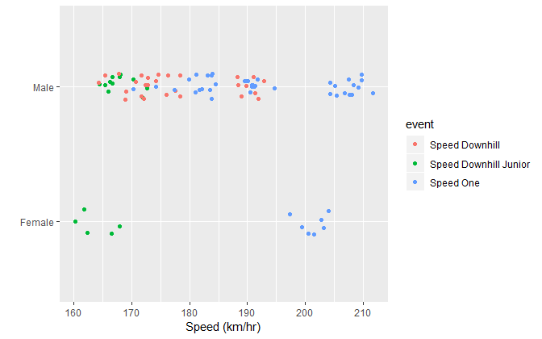

The boxplot geom default is for the distributed variable along the
y-scale and the category on the x-scale. Our first observation is that
the median years enrolled is less for nontraditional students than for
traditional studts.

``` r
ggplot(explore, aes(y = enrolled, x = path))+
    geom_boxplot()
```

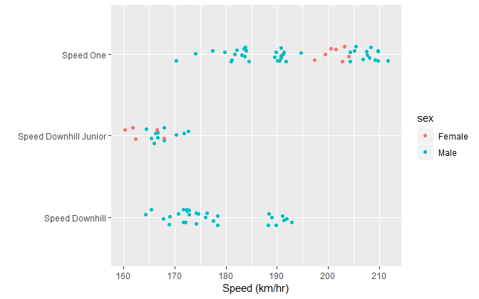

Using the second category, sex, we find that the median years enrolled
is less for women than for men.

``` r
ggplot(explore, aes(y = enrolled, x = sex))+
    geom_boxplot()
```

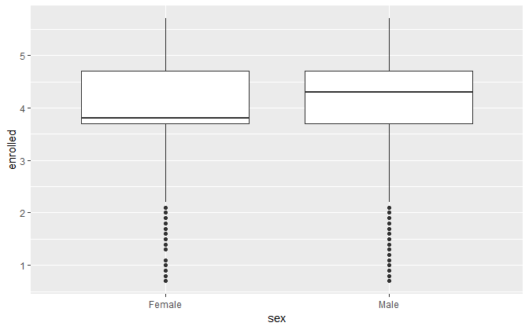

We can view both categories by adding a fill argument,

``` r
ggplot(explore, aes(y = enrolled, x = sex, fill = path))+
    geom_boxplot()
```

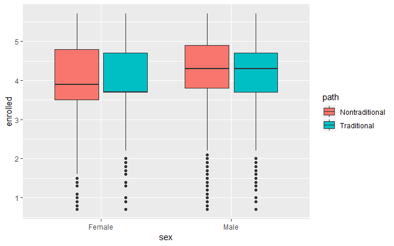

The IQRs are fairly consistent. The trend, if any, appears to be the
median value. To order the box plots in order of increasing median, we
create a new categorical variable that merges sex and path, then order
the levels by years enrolled.

``` r
explore <- explore %>% 
    mutate(sex_path = str_c(sex, path, sep = " ")) %>% 
    mutate(sex_path = fct_reorder(sex_path, enrolled))

ggplot(explore, aes(y = enrolled, x = sex_path))+
    geom_boxplot()
```

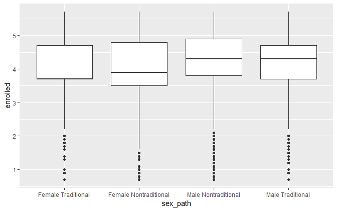

In this version, you can see the increasing median and that women in bot
traditional and nontradiotnal paths are enrolled fewer years than men.

<a href="#top">Top of page</a>

## carpentry

A data carpentry file typically begins by reading the source data file.
In this case, the data have already been loaded with the graphclassmate
package.

From the exploration, I’ll be using the years enrolled as the
quantitative variable. I’ll create the new categorical variable
`sex_path` and order it by the years enrolled.

``` r
nontrad <- nontraditional %>% 
  mutate(sex_path = str_c(sex, path, sep = " ")) %>% 
  mutate(sex_path = fct_reorder(sex_path, enrolled))
```

A data carpentry file typically concludes by saving the data frame.

``` r
saveRDS(nontrad, "data/d1_tutorial_boxplot-nontraditional.rds")
```

<a href="#top">Top of page</a>

## design

A graph design file typically starts by reading the tidy data file.

``` r
nontrad <- readRDS("data/d1_tutorial_boxplot-nontraditional.rds") %>%  
  glimpse()
#> Observations: 269,057
#> Variables: 6
#> $ sex      <chr> "Female", "Female", "Male", "Female", "Male", "Female...
#> $ race     <chr> "White", "White", "White", "White", "White", "White",...
#> $ path     <chr> "Traditional", "Traditional", "Traditional", "Traditi...
#> $ SAT      <dbl> 1400, 610, 1030, 870, 920, 1200, 1400, 1560, 880, 830...
#> $ enrolled <dbl> 1.7, 2.7, 1.7, 2.7, 2.7, 2.7, 2.7, 2.3, 4.4, 3.9, 4.8...
#> $ sex_path <fct> Female Traditional, Female Traditional, Male Traditio...
```

Start with the basic box plot and make it easier to read the category
labels by swapping the axes with `coord_flip()`.

``` r
p <- ggplot(nontrad, aes(y = enrolled, x = sex_path))+
  geom_boxplot() +
  coord_flip()
p
```

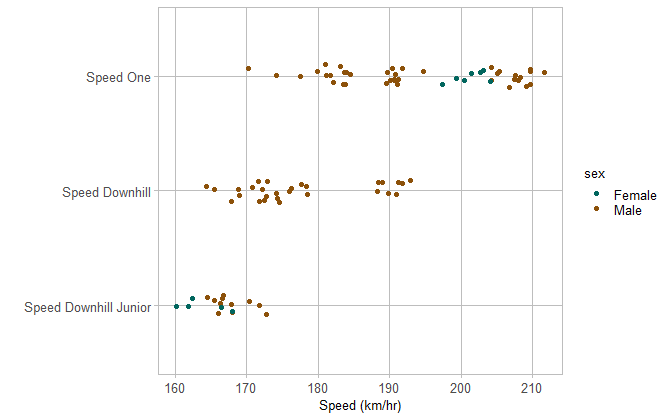

Edit labels and apply the class theme,

``` r
p <- p  +
  labs(y = "Years enrolled", x = "", title = "Graduating students") +
  theme_graphclass()
p
```


We can further distiguish between traditional and nontraditional by
adding a fill argument to `aes()` and `scale_fill_manual()` to select
colors.

``` r
p <- p +
  aes(fill = path) +
  scale_fill_manual(values = c(rcb("light_BG"), rcb("light_Br")))
p
```

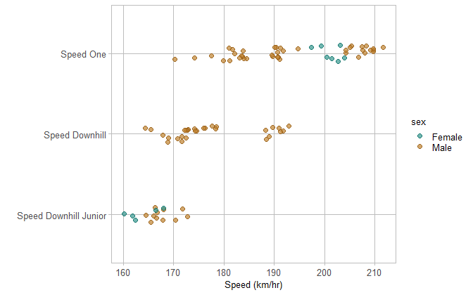

Edit the color of the box outlines and the outliers by adding a color
argument to `aes()` and `scale_color_manual()` to select colors.

``` r
p <- p +
  aes(color = path)+
  scale_color_manual(values = c(rcb("dark_BG"), rcb("dark_Br")))
p
```


We can omit the legend title using `guides()`. We set `color = "none"`
to avoid printing a second legend.

``` r
p <- p +
  guides(fill  = guide_legend(title = NULL), 
         color = "none")
p
```

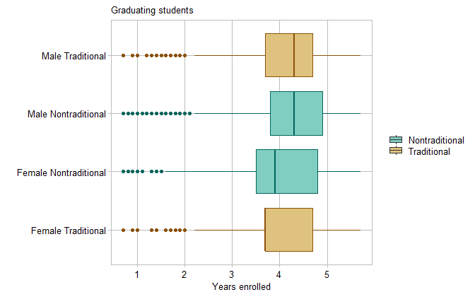

Lastly, I’d like to do something about the outliers. As drawn, it
appears that there are only a few, but because of overprinting, there
are actually a lot more than the visual image suggests.

To edit the outlier visual, we

  - create a new data frame with the outliers in a a separate column  
  - omit showing outliers with the boxplot geom  
  - use a point geom to draw the outliers as a layer on top of the
    boxplot and jitter them

First, create a new variable for the outliers

``` r
nontrad2 <- nontrad %>%
    group_by(sex_path) %>%
    mutate(outlier = enrolled < median(enrolled) - IQR(enrolled) * 1.5) %>%
    ungroup()
```

Next, graph the box plot using the revised data frame, but with outliers
omitted from the boxplot geom. I’ve also added a alpha and width
argument to the box and increased the legend symbols
slightly.

``` r
p <- ggplot(nontrad2, aes(y = enrolled, x = sex_path, color = path, fill = path))+
    geom_boxplot(width = 0.45, alpha = 0.75, outlier.shape = NA) +
    coord_flip() +
    labs(y = "Years enrolled", x = "", title = "Graduating students") +
    theme_graphclass() +
    scale_color_manual(values = c(rcb("dark_BG"), rcb("dark_Br"))) +
    scale_fill_manual(values = c(rcb("light_BG"), rcb("light_Br"))) +
    guides(fill = guide_legend(title = NULL, reverse = TRUE, keyheight = 2), color = "none") 
p
```

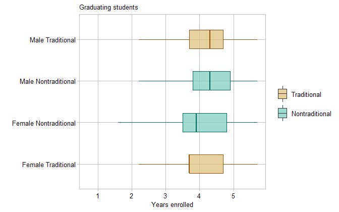

Now add the outliers as jittered points.

``` r
p <- p + 
    geom_jitter(data = function(x)
        dplyr::filter_(x, ~outlier),
        width = 0.05, height = 0.2, alpha = 0.25, shape = 21)
p
```

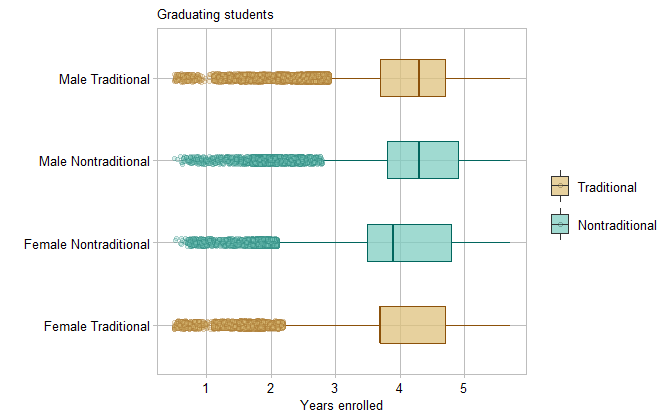

And the figure is ready to save, using width and height to control the
aspect ratio.

``` r
ggsave(filename = "d1-04-boxplot-nontraditional.png",
             path     = "figures",
             device   = "png",
             width    = 8,
             height   = 2.5,
             units    = "in",
             dpi      = 600
)
```

<a name="completed-boxplot"></a> *Publication-ready
boxplot*

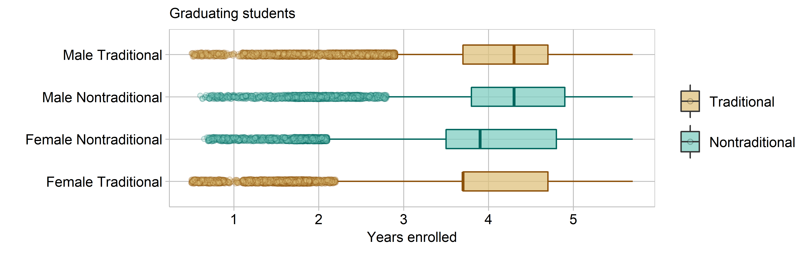

<a href="#top">Top of page</a>

## exercises

**1. Speed ski**

Create `practice/d1_exercise_boxplot-speedski.R`

Use a box plot design to reproduce the [final publication
graph](cm201_strip-plot.md#completed-strip-chart) from the [strip plot
tutorial](cm201_strip-plot.md#top).

**2. Exercise**

<a href="#top">Top of page</a>

## references

<div id="refs">

<div id="ref-Robbins:2013">

Robbins N (2013) *Creating More Effective Graphs.* Chart House, Wayne,
NJ

</div>

<div id="ref-Zhao+Bryan:2016">

Zhao J and Bryan J (2016) R Graph Catalog.
<https://github.com/jennybc/r-graph-catalog>

</div>

</div>

-----

<a href="#top">Top of page</a>  
[Calendar](../README.md#calendar)  
[Index](../README.md#index)
