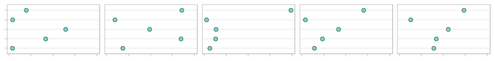
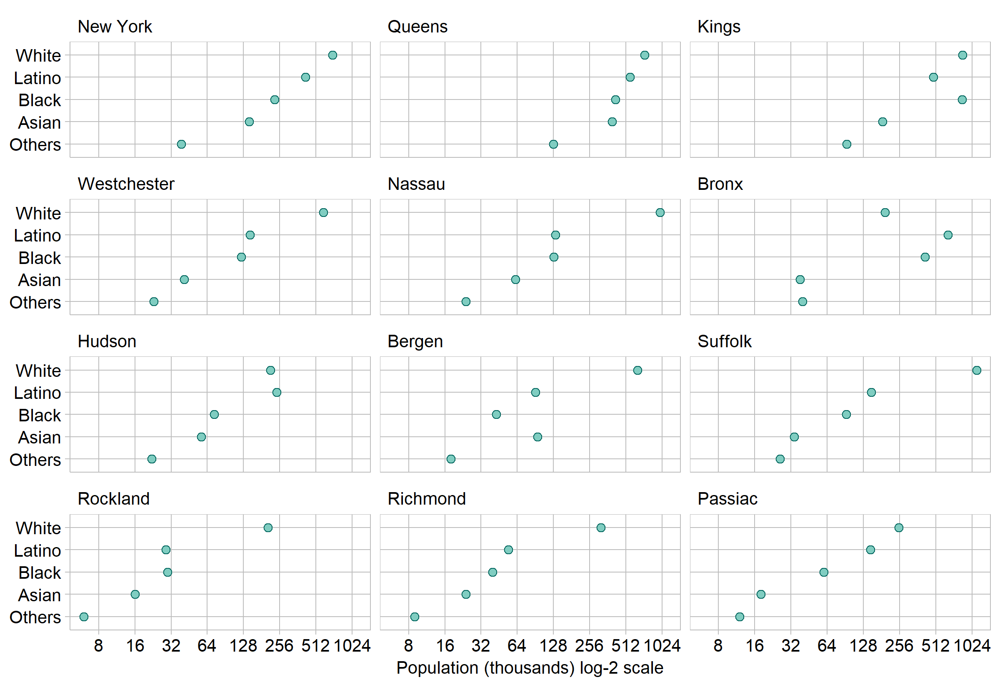
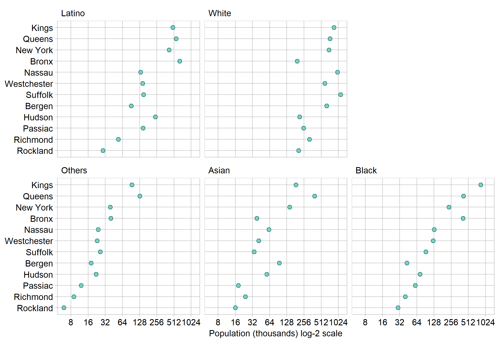

multiway dot plot
================



## contents

[introduction](#introduction)  
[prerequisites](#prerequisites)  
[explore](#explore)  
[carpentry](#carpentry)  
[design](#design)  
[report](#report)  
[exercises](#exercises)  
[references](#references)

## introduction

A *multiway dot plot* is a set of graphs of a single quantitative
variable (or response) dependent on two categorical variables. As
Cleveland explains ([1993](#ref-Cleveland:1993)),

> What distinguishes multiway data is the cross-classification of the
> categorical variables; there is a value of the response for each
> combination of levels of the two categorical variables.

Data characteristics in tidy form

  - First categorical variable with *m* levels in a column with *m* ×
    *n* observations
  - Second categorical variable with *n* levels in a column with *m* ×
    *n* observations
  - One quantitative variable in a column with *m* × *n* observations,
    values are numerical, often an integer count

Graph characteristics

  - The levels of one category are the row labels and the levels of the
    other category are the panel labels, thus a multiway has either *m*
    panels with *n* rows, or *n* panels with *m* rows  
  - A data marker in every panel for every row  
  - The rows and panels are ordered by a statistical measure, often the
    median

Reading a multiway graph

  - We can more effectively compare values within a panel than between
    panels.  
  - Because rows are ordered, one expects a generally increasing trend
    within a panel. A response greater or smaller than expected creates
    a visual asymmetry. The interesting stories are often in these
    visual anomalies.  
  - To explore the comparison between panels, we swap the row and panel
    categories, creating the *dual* multiway.

<br> <a href="#top">▲ top of page</a>

## prerequisites

  - [directory structure](cm101_data-lab.md#file-management) has been
    set up  
  - tidyverse package installed
  - graphclassmate package installed

<br> <a href="#top">▲ top of page</a>

## explore

Create the R file `practice/dx-graphtype-data-tutorial.R`.

``` r
library("tidyverse")
library("graphclassmate")
```

We will use the `xxx` data set from xxx. Run `? xxx` to open the help
page for the data set.

For exploring the data, I assign it a new name, leaving the original
data frame unaltered.

``` r
# examine data 
# explore <- xxx
# glimpse(explore)
```

Summarize data and discuss

Explore graph and discuss

<br> <a href="#top">▲ top of page</a>

## carpentry

A data carpentry file typically begins by reading the source data file.
In this case, the data are loaded with the graphclassmate package.

From the exploration, I’ll be using what quantitative, what categorical

``` r
# carpentry
metro_pop <- metro_pop %>% 
    mutate(county = factor(county)) %>% 
    mutate(race = factor(race)) %>% 
    mutate(county = fct_reorder(county, population)) %>% 
    mutate(race   = fct_reorder(race, population))
```

A data carpentry file typically concludes by saving the data frame.

``` r
# saveRDS(xxx, "data/dx-plot-data.rds")
```

<br> <a href="#top">▲ top of page</a>

## design

A graph design file typically starts by reading the tidy data file.

``` r
# xxx <- readRDS("data/dx-plot-data.rds") %>%  
#   glimpse()
```

Create the graph design

``` r
ggplot(metro_pop, aes(x = population / 1000, y = race)) +
    geom_point(size = 2, shape = 21, color = rcb("dark_BG"), fill = rcb("light_BG")) +
    facet_wrap(vars(county), ncol = 3, as.table = FALSE) +
    labs(y = NULL, x = expression(paste("Population (thousands) ", log[2], " scale"))) +
    scale_x_continuous(trans = 'log2', breaks = 2^seq(2, 10)) +
    theme_graphclass()
```


And the figure is ready to save, using width and height to control the
aspect ratio.

``` r
ggsave(filename = "d2-multiway-metropop-01.png",
             path     = "figures",
             device   = "png",
             width    = 8,
             height   = 5,
             units    = "in",
             dpi      = 600
)
```

Dual

``` r
ggplot(metro_pop, aes(x = population / 1000, y = county)) +
    geom_point(size = 2, shape = 21, color = rcb("dark_BG"), fill = rcb("light_BG")) +
    facet_wrap(vars(race), ncol = 3, as.table = FALSE) +
    labs(y = NULL, x = expression(paste("Population (thousands) ", log[2], " scale"))) +
    scale_x_continuous(trans = 'log2', breaks = 2^seq(2, 10)) +
    theme_graphclass()
```


Dual

``` r
ggsave(filename = "d2-multiway-metropop-02.png",
             path     = "figures",
             device   = "png",
             width    = 8,
             height   = 5,
             units    = "in",
             dpi      = 600
)
```

<br> <a href="#top">▲ top of page</a>

## report

In an Rmd report document, we include a code chunk to run the carpentry
file and the design file using `source()`. (These commands are shown to
illustrate the process only—we did not create these files for the
tutorial.)

``` r
# do not run this code chunk
# source("carpentry/dx-plot-data-carpentry.R")
# source("design/dx-plot-data-design.R")
```

We import the final figure into the report using
`knitr::include_graphics()`.

``` r

```


Dual

``` r

```


<br> <a href="#top">▲ top of page</a>

## exercises

**1. exercise**

Create `practice/dx-plot-data-exercise.R`

  - After tidying the data, save it to `data/dx-plot-data-exercise.rds`
  - When the graph is complete, save it to
    `figures/dx-plot-data-exercise.png`

## references

<div id="refs">

<div id="ref-Cleveland:1993">

Cleveland WS (1993) *Visualizing Data.* Hobart Press, Summit, NJ

</div>

</div>

***
<a href="#top">&#9650; top of page</a>    
[&#9665; calendar](../README.md#calendar)    
[&#9665; index](../README.md#index)
