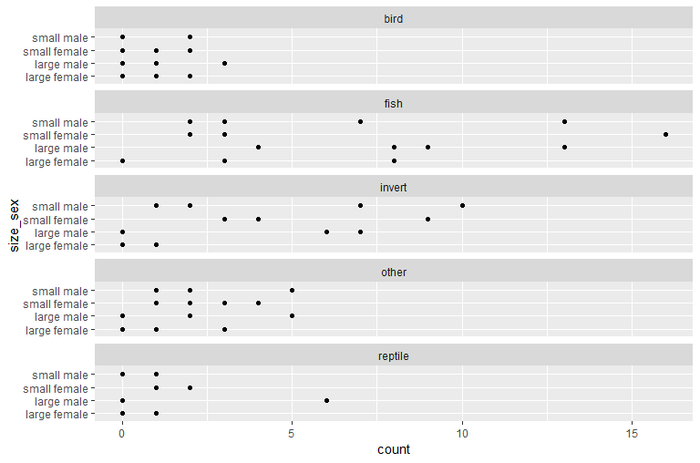
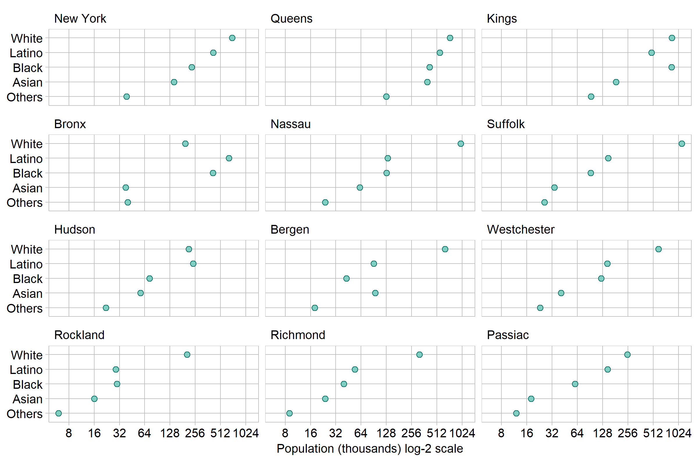

multiway dot plot
================


## contents

[introduction](#introduction)  
[prerequisites](#prerequisites)  
[explore](#explore)  
[carpentry](#carpentry)  
[design](#design)  
[report](#report)  
[exercises](#exercises)  
[references](#references)

## introduction

A *multiway dot plot* is a set of graphs of a single quantitative
variable (or response) dependent on two categorical variables. As
Cleveland explains ([1993](#ref-Cleveland:1993)),

> What distinguishes multiway data is the cross-classification of the
> categorical variables; there is a value of the response for each
> combination of levels of the two categorical variables.

Data characteristics in tidy form

  - First categorical variable with *m* levels in a column with *m* ×
    *n* observations
  - Second categorical variable with *n* levels in a column with *m* ×
    *n* observations
  - One quantitative variable in a column with *m* × *n* observations,
    values are numerical, often an integer count

Graph characteristics

  - The levels of one category are the row labels and the levels of the
    other category are the panel labels, thus a multiway has either *m*
    panels with *n* rows, or *n* panels with *m* rows  
  - A data marker in every panel for every row  
  - The rows and panels are ordered by a statistical measure, often the
    median

Reading a multiway graph

  - We can more effectively compare values within a panel than between
    panels.  
  - Because rows are ordered, one expects a generally increasing trend
    within a panel. A response greater or smaller than expected creates
    a visual asymmetry. The interesting stories are often in these
    visual anomalies.  
  - To explore the comparison between panels, we swap the row and panel
    categories, creating the *dual* multiway.

<br> <a href="#top">▲ top of page</a>

## prerequisites

  - Start every work session by launching `portfolio.Rproj`  
  - Your [project directory
    structure](cm501-proj-m-manage-files.md#plan-the-directory-structure)
    satisfies the course requirements  
  - tidyverse package installed
  - graphclassmate package installed

<br> <a href="#top">▲ top of page</a>

## explore

Create the R file `explore/0402-multiway-metropop-explore.R`. Start by
loading the packages.

``` r
library("tidyverse")
library("graphclassmate")
```

We are using `metro_pop` data from the graphclassmate package (Layton,
[2019](#ref-Layton:2019:graphclassmate)). If you want to learn more
about the data set, open its help page by running `? metro_pop`.

For exploring the data, I assign it a new name, leaving the original
data frame unaltered. Using `glimpse()` we find that the data have 60
observations of 3 variables.

``` r
# examine data 
explore <- metro_pop %>% 
    glimpse()
#> Observations: 60
#> Variables: 3
#> $ race       <chr> "White", "Latino", "Black", "Asian", "Others", "Whi...
#> $ county     <chr> "Bronx", "Bronx", "Bronx", "Bronx", "Bronx", "Kings...
#> $ population <dbl> 194000, 645000, 415000, 38000, 40000, 855000, 48800...
```

The population count is the quantitative, continuous variable. Its
statistical range, median, and quartiles are obtained using `summary()`.
We find a nearly three orders-of-magnitude difference between the
minimum and maximum values.

``` r
# summarize the quantitative variable 
explore %>% 
    select(population) %>% 
    summary()
#>    population     
#>  Min.   :   6000  
#>  1st Qu.:  38750  
#>  Median : 125500  
#>  Mean   : 232517  
#>  3rd Qu.: 335750  
#>  Max.   :1118000
```

For categorical variables, we can see the levels with `unique()`. We
find that race has 5 levels and county has 12 levels.

``` r
# unique levels of categorical variables 
explore %>% 
    select(race) %>%
    unique() %>% 
    arrange(race)
#> # A tibble: 5 x 1
#>   race  
#>   <chr> 
#> 1 Asian 
#> 2 Black 
#> 3 Latino
#> 4 Others
#> 5 White

explore %>% 
    select(county) %>%
    unique() %>% 
    arrange(county)
#> # A tibble: 12 x 1
#>    county     
#>    <chr>      
#>  1 Bergen     
#>  2 Bronx      
#>  3 Hudson     
#>  4 Kings      
#>  5 Nassau     
#>  6 New York   
#>  7 Passiac    
#>  8 Queens     
#>  9 Richmond   
#> 10 Rockland   
#> 11 Suffolk    
#> 12 Westchester
```

The data frame is complete, i.e., a count for every combination of race
(5 levels) and county (12 levels), with 5 × 12 = 60 observations.

Explore the data graphically. Use a strip plot to examine the
distribution of population counts.

``` r
ggplot(explore, aes(x = population, y = race)) +
  geom_point()
```



With the numbers in the hundreds of thousands, let’s divide the
population by 1000.

``` r
ggplot(explore, aes(x = population / 1000, y = race)) +
  geom_point() +
  scale_x_continuous(breaks = seq(0, 1100, 100))
```


When a range of values spans orders of magnitude, a logarithmic scale
can be useful. I’ll start with a base-10 scale,

``` r
ggplot(explore, aes(x = population / 1000, y = race)) +
  geom_point() +
  scale_x_continuous(trans = 'log10')
```


Try base-2. This works for these data. Each grid line represents a
doubling of the previous grid line.

``` r
ggplot(explore, aes(x = population / 1000, y = race)) +
  geom_point() +
  scale_x_continuous(trans = 'log2')
```


Summary: we’ll divide the population by 1000 and use a log-base-2 scale.

<br> <a href="#top">▲ top of page</a>

## carpentry

A data carpentry file typically begins by reading the source data file.
In this case, the data are loaded with the graphclassmate package.

From the exploration, population is the quantitative variable and race
and county are the two categorical variables. For ordering the rows and
panels, we’ll want the categories converted to factors and ordered by
population median. Create the R file
`carpentry/0402-multiway-metropop-data.R`. Start by loading the
packages.

``` r
# start the carpentry
data(metro_pop, package = "graphclassmate")

# convert categories to factors orderd by population 
metro_pop <- metro_pop %>% 
    mutate(county = factor(county)) %>% 
    mutate(county = fct_reorder(county, population)) %>% 
    mutate(race = factor(race)) %>% 
    mutate(race   = fct_reorder(race, population)) %>% 
    mutate(population = population / 1000)
```

A data carpentry file typically concludes by saving the data frame.

``` r
saveRDS(metro_pop, "data/0402-multiway-metropop-data.rds")
```

<br> <a href="#top">▲ top of page</a>

## design

Create the R file `design/0402-multiway-metropop.R`. Start by loading
the packages.

``` r
library("tidyverse")
library("graphclassmate")
```

A design file typically starts by reading the tidy data file.

``` r
# start the graph design 
metro_pop <- readRDS("data/0402-multiway-metropop-data.rds") %>%  
    glimpse()
#> Observations: 60
#> Variables: 3
#> $ race       <fct> White, Latino, Black, Asian, Others, White, Latino,...
#> $ county     <fct> Bronx, Bronx, Bronx, Bronx, Bronx, Kings, Kings, Ki...
#> $ population <dbl> 194, 645, 415, 38, 40, 855, 488, 845, 184, 93, 703,...
```

Create the basic multiway dot plot. The `as.table = FALSE` argument
orders the panels like a plot with the highest value at the top-right.

``` r
p <- ggplot(metro_pop, aes(x = population, y = race)) +
    geom_point() +
    facet_wrap(vars(county), as.table = FALSE)
p
```


Add the log-base-2 scale

``` r
p <- p +
    scale_x_continuous(trans = 'log2', breaks = 2^seq(2, 10))
p
```


Add a theme and labels.

``` r
p <- p +
    theme_graphclass() +
    labs(y = NULL, x = "Population (thousands) log-2 scale")
p
```


Finally, edit `geom_point()` for size and color of the data markers and
edit `facet_wrap()` to change the number of columns to reduce
overprinting the scale text.

``` r
ggplot(metro_pop, aes(x = population, y = race)) +
    geom_point(size = 2, shape = 21, color = rcb("dark_BG"), fill = rcb("light_BG")) +
    facet_wrap(vars(county), as.table = FALSE, ncol = 3) +
    scale_x_continuous(trans = 'log2', breaks = 2^seq(2, 10)) +
    theme_graphclass() +
    labs(y = NULL, x = "Population (thousands) log-2 scale")    
```


And the figure is ready to save, using width and height to control the
aspect ratio.

``` r
ggsave(filename = "0402-multiway-metropop-01.png",
       path     = "figures",
       width    = 8,
       height   = 5.5,
       units    = "in",
       dpi      = 300
       )
```

In the dual multiway, we swap the rows and panels by setting `y =
county` and `facet_wrap(vars(race))`.

``` r
ggplot(metro_pop, aes(x = population, y = county)) +
    geom_point(size = 2, shape = 21, color = rcb("dark_BG"), fill = rcb("light_BG")) +
    facet_wrap(vars(race), as.table = FALSE, ncol = 3) +
    scale_x_continuous(trans = 'log2', breaks = 2^seq(2, 10)) +
    theme_graphclass() +
    labs(y = NULL, x = "Population (thousands) log-2 scale")
```


And write to file.

``` r
ggsave(filename = "0402-multiway-metropop-02.png",
       path     = "figures",
       width    = 8,
       height   = 5.5,
       units    = "in",
       dpi      = 300
       )
```

<br> <a href="#top">▲ top of page</a>

## report

If we were to include this graph in a report, the Rmd script would
include a `knitr::include_graphics()` function

``` r

```


Import the dual. In the final portfolio, it is possible that only one of
the two final graphs is shown, depending on which one tells the most
interesting story.

``` r
include_graphics("../figures/0402-multiway-metropop-02.png")
```


<br> <a href="#top">▲ top of page</a>

## exercises

**1. exercise**

Create `explore/0403-multiway-dataname-explore.R`

**2. exercise**

Create `explore/0404-multiway-dataname-explore.R`

## references

<div id="refs">

<div id="ref-Cleveland:1993">

Cleveland WS (1993) *Visualizing Data.* Hobart Press, Summit, NJ

</div>

<div id="ref-Layton:2019:graphclassmate">

Layton R (2019) *graphclassmate: Companion materials for a course in
data visualization.* R package version 0.1.0.9000
<https://github.com/graphdr/graphclassmate>

</div>

</div>

***
<a href="#top">&#9650; top of page</a>    
[&#9665; calendar](../README.md#calendar)    
[&#9665; index](../README.md#index)
