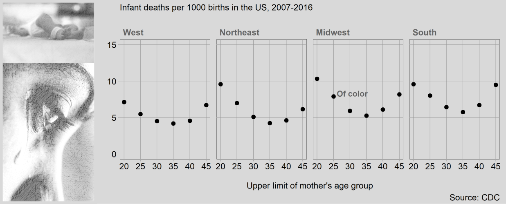

dot plot
================

Notes: introduce the idea of using a separate data frame to add lines,
with a data argument and aes() argument in the geom layer instead of the
plot layer.

## contents

[introduction](#introduction)  
[prerequisites](#prerequisites)  
[explore](#explore)  
[carpentry](#carpentry)  
[design](#design)  
[report](#report)  
[exercises](#exercises)  
[references](#references)

## introduction

<br> <a href="#top">▲ top of page</a>

## prerequisites

<br> <a href="#top">▲ top of
page</a>

## explore

<!-- MEDIAN INCOME IN THE PAST 12 MONTHS (IN 2016 INFLATION-ADJUSTED DOLLARS) BY GEOGRAPHICAL MOBILITY IN THE PAST YEAR FOR CURRENT RESIDENCE IN THE UNITED STATES -->

<!-- Universe: Population 15 years and over in the United States with income  more information -->

<!-- 2016 American Community Survey 1-Year Estimates -->

``` r
library("tidyverse")

cdc_infant_death_record <- function(cdc_file) {
    df <- read_tsv(cdc_file) %>% 
    select("Census Region Code", "County Code", "Hispanic Origin", "Race", "Age of Mother Code", "Deaths", "Births") %>%
        na.omit(.) %>% 
    dplyr::rename("region"   = "Census Region Code", 
                    "county"   = "County Code", 
                                "hispanic" = "Hispanic Origin", 
                  "race_ethnicity"     = "Race", 
                  "age"      = "Age of Mother Code", 
                  "deaths"   = "Deaths", 
                  "births"   = "Births") %>% 
        mutate(county = as.character(county))

    df <- df %>% 
        mutate(hispanic = recode(hispanic, 
            "Central or South American" = "Hispanic", 
            "Cuban" = "Hispanic",  
            "Mexican" = "Hispanic",  
            "Other and Unknown Hispanic" = "Hispanic",  
            "Puerto Rican" = "Hispanic" 
            )) %>% 
        mutate(race_ethnicity = recode(race_ethnicity, 
            "American Indian or Alaska Native" = "Amerind", 
            "Black or African American" = "Black", 
            "Asian or Pacific Islander" = "Asian/PI"))
        
    df$race_ethnicity[df$hispanic == "Hispanic"] <- "Hispanic"
    
  grouping_variables <- c("region", "county", "race_ethnicity", "age")
  df <- df %>% 
    seplyr::group_summarise(grouping_variables, 
                                                    deaths = sum(deaths), 
                                                    births = sum(births)) %>% 
    ungroup() %>% 
    arrange(region, county, race_ethnicity, age) 
}

# sort(unique(df$hispanic))
# [1] "Central or South American"   
# [2] "Cuban"                       
# [3] "Mexican"                     
# [4] "Non-Hispanic Black"          
# [5] "Non-Hispanic other races"    
# [6] "Non-Hispanic White"          
# [7] "Origin unknown or not stated"
# [8] "Other and Unknown Hispanic"  
# [9] "Puerto Rican" 


cdc_file <- "data-raw/2007-2016-cdc-infant-death-records.txt"
cdc       <- cdc_infant_death_record(cdc_file)

glimpse(cdc)
#> Observations: 3,361
#> Variables: 6
#> $ region         <chr> "CENS-R1", "CENS-R1", "CENS-R1", "CENS-R1", "CE...
#> $ county         <chr> "09001", "09001", "09001", "09001", "09001", "0...
#> $ race_ethnicity <chr> "Black", "Black", "Black", "Black", "Black", "B...
#> $ age            <chr> "15-19", "20-24", "25-29", "30-34", "35-39", "4...
#> $ deaths         <dbl> 13, 38, 19, 38, 25, 10, 31, 28, 25, 10, 10, 29,...
#> $ births         <dbl> 1083, 3023, 3307, 3051, 1826, 550, 4719, 5506, ...

sort(unique(cdc$region))
#> [1] "CENS-R1" "CENS-R2" "CENS-R3" "CENS-R4"
sort(unique(cdc$county))
#>   [1] "01073" "01089" "01097" "01999" "02020" "02999" "04013" "04019"
#>   [9] "04021" "04999" "05119" "05999" "06001" "06013" "06019" "06029"
#>  [17] "06037" "06047" "06053" "06059" "06061" "06065" "06067" "06071"
#>  [25] "06073" "06075" "06077" "06081" "06083" "06085" "06087" "06095"
#>  [33] "06097" "06099" "06107" "06111" "06999" "08001" "08005" "08013"
#>  [41] "08031" "08041" "08059" "08069" "08123" "08999" "09001" "09003"
#>  [49] "09009" "09011" "09999" "10003" "10999" "11001" "12009" "12011"
#>  [57] "12021" "12031" "12033" "12057" "12069" "12071" "12073" "12081"
#>  [65] "12083" "12086" "12095" "12099" "12101" "12103" "12105" "12115"
#>  [73] "12117" "12127" "12999" "13051" "13063" "13067" "13089" "13121"
#>  [81] "13135" "13999" "15003" "15999" "16001" "16999" "17031" "17043"
#>  [89] "17089" "17097" "17111" "17119" "17163" "17197" "17201" "17999"
#>  [97] "18003" "18057" "18089" "18097" "18141" "18999" "19153" "19999"
#> [105] "20091" "20173" "20999" "21067" "21111" "21999" "22017" "22033"
#> [113] "22051" "22071" "22999" "23005" "23999" "24003" "24005" "24031"
#> [121] "24033" "24510" "24999" "25005" "25009" "25013" "25017" "25021"
#> [129] "25023" "25025" "25027" "25999" "26049" "26065" "26081" "26099"
#> [137] "26125" "26139" "26161" "26163" "26999" "27003" "27037" "27053"
#> [145] "27123" "27999" "28049" "28999" "29077" "29095" "29183" "29189"
#> [153] "29510" "29999" "30999" "31055" "31109" "31999" "32003" "32031"
#> [161] "32999" "33011" "33015" "33999" "34001" "34003" "34005" "34007"
#> [169] "34013" "34015" "34017" "34021" "34023" "34025" "34027" "34029"
#> [177] "34031" "34035" "34039" "34999" "35001" "35999" "36001" "36005"
#> [185] "36027" "36029" "36047" "36055" "36059" "36061" "36067" "36071"
#> [193] "36081" "36085" "36087" "36103" "36119" "36999" "37051" "37063"
#> [201] "37067" "37081" "37119" "37183" "37999" "38999" "39017" "39035"
#> [209] "39049" "39061" "39093" "39095" "39099" "39113" "39151" "39153"
#> [217] "39999" "40027" "40109" "40143" "40999" "41005" "41039" "41047"
#> [225] "41051" "41067" "41999" "42003" "42011" "42017" "42029" "42043"
#> [233] "42045" "42049" "42071" "42077" "42079" "42091" "42095" "42101"
#> [241] "42129" "42133" "42999" "44007" "44999" "45019" "45045" "45051"
#> [249] "45063" "45079" "45083" "45999" "46999" "47037" "47065" "47093"
#> [257] "47149" "47157" "47999" "48027" "48029" "48061" "48085" "48113"
#> [265] "48121" "48141" "48157" "48167" "48201" "48215" "48245" "48339"
#> [273] "48355" "48439" "48453" "48479" "48491" "48999" "49011" "49035"
#> [281] "49049" "49999" "50999" "51041" "51059" "51087" "51153" "51810"
#> [289] "51999" "53011" "53033" "53035" "53053" "53061" "53063" "53067"
#> [297] "53999" "54999" "55025" "55079" "55133" "55999" "56999"
sort(unique(cdc$race_ethnicity))
#> [1] "Amerind"  "Asian/PI" "Black"    "Hispanic" "White"
sort(unique(cdc$age))
#> [1] "15"    "15-19" "20-24" "25-29" "30-34" "35-39" "40-44" "45-49"

kable(head(cdc, n = 10L))
```

| region  | county | race\_ethnicity | age   | deaths | births |
| :------ | :----- | :-------------- | :---- | -----: | -----: |
| CENS-R1 | 09001  | Black           | 15-19 |     13 |   1083 |
| CENS-R1 | 09001  | Black           | 20-24 |     38 |   3023 |
| CENS-R1 | 09001  | Black           | 25-29 |     19 |   3307 |
| CENS-R1 | 09001  | Black           | 30-34 |     38 |   3051 |
| CENS-R1 | 09001  | Black           | 35-39 |     25 |   1826 |
| CENS-R1 | 09001  | Black           | 40-44 |     10 |    550 |
| CENS-R1 | 09001  | Hispanic        | 20-24 |     31 |   4719 |
| CENS-R1 | 09001  | Hispanic        | 25-29 |     28 |   5506 |
| CENS-R1 | 09001  | Hispanic        | 30-34 |     25 |   5031 |
| CENS-R1 | 09001  | Hispanic        | 35-39 |     10 |   2159 |

``` r
kable(tail(cdc, n = 10L))
```

| region  | county | race\_ethnicity | age   | deaths | births |
| :------ | :----- | :-------------- | :---- | -----: | -----: |
| CENS-R4 | 53999  | White           | 35-39 |     92 |  17503 |
| CENS-R4 | 53999  | White           | 40-44 |     20 |   3582 |
| CENS-R4 | 56999  | Amerind         | 20-24 |     12 |    913 |
| CENS-R4 | 56999  | Hispanic        | 20-24 |     13 |   1998 |
| CENS-R4 | 56999  | Hispanic        | 25-29 |     12 |   1658 |
| CENS-R4 | 56999  | White           | 15-19 |     56 |   4746 |
| CENS-R4 | 56999  | White           | 20-24 |    112 |  16984 |
| CENS-R4 | 56999  | White           | 25-29 |     96 |  20456 |
| CENS-R4 | 56999  | White           | 30-34 |     50 |  13593 |
| CENS-R4 | 56999  | White           | 35-39 |     26 |   5025 |

``` r
# county median income
acs_file <- "data-raw/ACS_16_1YR_B07011_with_ann.csv"
acs <- read_csv(acs_file) 

# names(acs)
# [1] "GEO.id"            "GEO.id2"          
# [3] "GEO.display-label" "HD01_VD02"        
# [5] "HD02_VD02"         "HD01_VD07"        
# [7] "HD02_VD07" 

acs <- acs %>% 
    select(GEO.id2, HD01_VD02) %>% 
    dplyr::rename("county" = "GEO.id2", "income" = "HD01_VD02") %>% 
    arrange(county)

glimpse(acs)
#> Observations: 816
#> Variables: 2
#> $ county <chr> "01003", "01015", "01043", "01049", "01051", "01055", "...
#> $ income <dbl> 30178, 21802, 22263, 20571, 26924, 22136, 21984, 26303,...
```

``` r
df <- left_join(cdc, acs, by = "county") %>% 
    filter(complete.cases(.))

glimpse(df)
#> Observations: 2,652
#> Variables: 7
#> $ region         <chr> "CENS-R1", "CENS-R1", "CENS-R1", "CENS-R1", "CE...
#> $ county         <chr> "09001", "09001", "09001", "09001", "09001", "0...
#> $ race_ethnicity <chr> "Black", "Black", "Black", "Black", "Black", "B...
#> $ age            <chr> "15-19", "20-24", "25-29", "30-34", "35-39", "4...
#> $ deaths         <dbl> 13, 38, 19, 38, 25, 10, 31, 28, 25, 10, 10, 29,...
#> $ births         <dbl> 1083, 3023, 3307, 3051, 1826, 550, 4719, 5506, ...
#> $ income         <dbl> 37039, 37039, 37039, 37039, 37039, 37039, 37039...
kable(head(df, n = 10L))
```

| region  | county | race\_ethnicity | age   | deaths | births | income |
| :------ | :----- | :-------------- | :---- | -----: | -----: | -----: |
| CENS-R1 | 09001  | Black           | 15-19 |     13 |   1083 |  37039 |
| CENS-R1 | 09001  | Black           | 20-24 |     38 |   3023 |  37039 |
| CENS-R1 | 09001  | Black           | 25-29 |     19 |   3307 |  37039 |
| CENS-R1 | 09001  | Black           | 30-34 |     38 |   3051 |  37039 |
| CENS-R1 | 09001  | Black           | 35-39 |     25 |   1826 |  37039 |
| CENS-R1 | 09001  | Black           | 40-44 |     10 |    550 |  37039 |
| CENS-R1 | 09001  | Hispanic        | 20-24 |     31 |   4719 |  37039 |
| CENS-R1 | 09001  | Hispanic        | 25-29 |     28 |   5506 |  37039 |
| CENS-R1 | 09001  | Hispanic        | 30-34 |     25 |   5031 |  37039 |
| CENS-R1 | 09001  | Hispanic        | 35-39 |     10 |   2159 |  37039 |

``` r
kable(tail(df, n = 10L))
```

| region  | county | race\_ethnicity | age   | deaths | births | income |
| :------ | :----- | :-------------- | :---- | -----: | -----: | -----: |
| CENS-R4 | 53061  | White           | 20-24 |     45 |  11111 |  36937 |
| CENS-R4 | 53061  | White           | 25-29 |     73 |  19909 |  36937 |
| CENS-R4 | 53061  | White           | 30-34 |     63 |  18519 |  36937 |
| CENS-R4 | 53061  | White           | 35-39 |     35 |   8102 |  36937 |
| CENS-R4 | 53063  | White           | 15-19 |     23 |   3170 |  27579 |
| CENS-R4 | 53063  | White           | 20-24 |     77 |  12530 |  27579 |
| CENS-R4 | 53063  | White           | 25-29 |     72 |  16800 |  27579 |
| CENS-R4 | 53063  | White           | 30-34 |     53 |  12360 |  27579 |
| CENS-R4 | 53063  | White           | 35-39 |     27 |   4874 |  27579 |
| CENS-R4 | 53067  | White           | 25-29 |     11 |   2284 |  33757 |

``` r
df <- df %>% 
    mutate(rate = deaths / births)
```

``` r

df <- df %>% 
    mutate(whiteornot = ifelse(race_ethnicity == "White", "White", "Of color")) %>% 
    filter(age != "15") %>% 
    filter(age != "45-49") 


# age_levels <- c("-19", "-24", "-29", "-34", "-39", "-44")
grouping_variables <- c("whiteornot", "age", "region")
df <- df %>% 
    seplyr::group_summarise(grouping_variables, 
                                                    deaths = sum(deaths), 
                                                    births = sum(births)) %>% 
    mutate(rate = deaths / births * 1000) %>% 
    mutate(region = recode(region, 
                 "CENS-R1" = "Northeast", 
                 "CENS-R2" = "Midwest",
                 "CENS-R3" = "South",
                 "CENS-R4" = "West")) %>% 
    as.data.frame() %>%
    mutate(region = fct_reorder(region, rate)) %>% 
    mutate(surv_rate = 100 - rate) %>% 
  mutate(age = str_sub(age, 4, 5))  %>% 
    mutate(age = as.integer(age) + 1)


                

    
p <- ggplot(df, aes(x = age, y = rate, fill = whiteornot)) +
    geom_point(size = 2.5, shape = 21, color = "black") +
    facet_wrap(vars(region), as.table = FALSE, ncol = 4) +
    theme_graphclass(line_color = rcb("mid_Gray"), 
                                     font_color = "black", 
                                     font_size = 12) +
    theme(legend.position = "none", 
                panel.background = element_rect(fill = rcb("pale_Gray")), 
                plot.background = element_rect(color = NA, 
                                                                             fill = rcb("pale_Gray")), 
                panel.spacing = unit(3, "mm"), 
                # top, right, bottom, and left margins
                plot.margin = unit(c(2, 3, 1, 0), "mm"), 
                panel.border = element_rect(color = rcb("pale_Gray"), fill = NA), 
                panel.grid.minor = element_blank(), 
                axis.line = element_line(colour = rcb("pale_Gray")), 
                strip.background = element_rect(color = rcb("pale_Gray"), 
                                                                                fill = rcb("pale_Gray")), 
                strip.text = element_text(color = rcb("dark_Gray"), 
                                                                    face = "bold")
                ) +
    # scale_y_continuous(breaks = seq(0, 100, by = 0.5), limits = c(98.5, 100)) +
        scale_y_continuous(breaks = seq(0, 100, by = 5), limits = c(0, 15)) +
    labs(x = "\nUpper limit of mother's age group", y = "", title = "Infant deaths per 1000 births in the US, 2007-2016\n", caption = "Source: CDC") +
    # guides(color = guide_legend(title = "Race", 
    #                                                       title.position = "left", 
    #                                                       direction = "vertical", 
    #                                                       reverse = TRUE)) +
    scale_fill_manual(values = c("black", rcb("pale_Gray"))) 
# +
#   coord_fixed(ratio = 7)

# annotation df

df_note <- df %>% 
    filter(region == "Midwest") %>% 
    filter(age == 25) %>% 
    select(age, whiteornot, rate, surv_rate, region)

df_note
#>   age whiteornot      rate surv_rate  region
#> 1  25   Of color 10.964545  89.03545 Midwest
#> 2  25      White  6.495592  93.50441 Midwest

fct_drop(df_note$region)
#> [1] Midwest Midwest
#> Levels: Midwest
    
    


p <- p +
    geom_text(data = df_note, 
                        aes(x = age, y = rate, label = whiteornot), 
                        hjust    = 0, 
                        nudge_x  = 1, 
                        vjust    = 0, 
                        nudge_y  = 0, 
                        size     = 4, 
                        color    = rcb("dark_Gray"), 
                        fontface = "bold")


ggsave(filename = "cm206-cdc.png",
             plot = p,
        path    = "cm/images",
        width   = 8,
        height  = 4,
        units   = "in",
        dpi     = 300)
```



<br> <a href="#top">▲ top of page</a>

## carpentry

<br> <a href="#top">▲ top of page</a>

## design

<br> <a href="#top">▲ top of page</a>

## report

<br> <a href="#top">▲ top of page</a>

## exercises

**1. xxx**

Scripts to initialize

    explore/     wwdd-nextgraphtype-dataset-explore.R  
    carpentry/   wwdd-nextgraphtype-dataset-data.R   
    design/      wwdd-nextgraphtype-dataset.R 

Data:

Explore script: Carpentry script

Design script

## references

<div id="refs">

<div id="ref-Wickham+Grolemund:2017">

Wickham H and Grolemund G (2017) *R for Data Science.* O’Reilly Media,
Inc., Sebastopol, CA <https://r4ds.had.co.nz/>

</div>

</div>

***
<a href="#top">&#9650; top of page</a>    
[&#9665; calendar](../README.md#calendar)    
[&#9665; index](../README.md#index)
