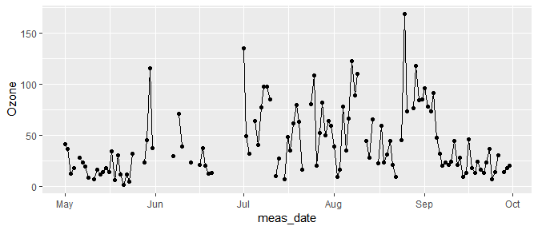

dates and line graphs
================

Notes: introduce the idea of using a separate data frame to add lines,
with a data argument and aes() argument in the geom layer instead of the
plot
layer.

## contents

[introduction](#introduction)  
[prerequisites](#prerequisites)  
[explore](#explore)  
[carpentry](#carpentry)  
[design](#design)  
[report](#report)  
[exercises](#exercises)  
[references](#references)

<http://homepage.stat.uiowa.edu/~luke/classes/STAT4580/timeseries.html#time-series-objects>

## introduction

Line graphs and time series go together.

<br> <a href="#top">▲ top of page</a>

## prerequisites

  - lubridate

<!-- end list -->

``` r
library("tidyverse")
library("lubridate")
```

<br> <a href="#top">▲ top of page</a>

## explore

From the help page (`? airquality`) we find that these data were
obatained in 1973, and the month and day are in separate columns.

``` r
glimpse(airquality)
#> Observations: 153
#> Variables: 6
#> $ Ozone   <int> 41, 36, 12, 18, NA, 28, 23, 19, 8, NA, 7, 16, 11, 14, ...
#> $ Solar.R <int> 190, 118, 149, 313, NA, NA, 299, 99, 19, 194, NA, 256,...
#> $ Wind    <dbl> 7.4, 8.0, 12.6, 11.5, 14.3, 14.9, 8.6, 13.8, 20.1, 8.6...
#> $ Temp    <int> 67, 72, 74, 62, 56, 66, 65, 59, 61, 69, 74, 69, 66, 68...
#> $ Month   <int> 5, 5, 5, 5, 5, 5, 5, 5, 5, 5, 5, 5, 5, 5, 5, 5, 5, 5, ...
#> $ Day     <int> 1, 2, 3, 4, 5, 6, 7, 8, 9, 10, 11, 12, 13, 14, 15, 16,...
```

We use the lubridate package to create a variable of class “Date”.

``` r
df <- airquality %>% 
    mutate(Year = 1973L) %>% 
    mutate(meas_date = lubridate::make_date(year = Year, month = Month, day = Day)) %>% 
    glimpse()
#> Observations: 153
#> Variables: 8
#> $ Ozone     <int> 41, 36, 12, 18, NA, 28, 23, 19, 8, NA, 7, 16, 11, 14...
#> $ Solar.R   <int> 190, 118, 149, 313, NA, NA, 299, 99, 19, 194, NA, 25...
#> $ Wind      <dbl> 7.4, 8.0, 12.6, 11.5, 14.3, 14.9, 8.6, 13.8, 20.1, 8...
#> $ Temp      <int> 67, 72, 74, 62, 56, 66, 65, 59, 61, 69, 74, 69, 66, ...
#> $ Month     <int> 5, 5, 5, 5, 5, 5, 5, 5, 5, 5, 5, 5, 5, 5, 5, 5, 5, 5...
#> $ Day       <int> 1, 2, 3, 4, 5, 6, 7, 8, 9, 10, 11, 12, 13, 14, 15, 1...
#> $ Year      <int> 1973, 1973, 1973, 1973, 1973, 1973, 1973, 1973, 1973...
#> $ meas_date <date> 1973-05-01, 1973-05-02, 1973-05-03, 1973-05-04, 197...
```

graph the time series

``` r
ggplot(df, aes(x = meas_date, y = Ozone)) + 
    geom_line() + 
    geom_point()
```



omit missing values

``` r
df <- df %>%
    drop_na()

# x <- df$meas_date
# y <- df$Ozone
# 
# ratio <- ggthemes::bank_slopes(x = as.numeric(x), y = y, method = "ms")

ggplot(df, aes(x = meas_date, y = Solar.R)) + 
    geom_line() + 
    geom_point() +
    coord_fixed(ratio = 1/20)
```


<br> <a href="#top">▲ top of page</a>

## carpentry

<br> <a href="#top">▲ top of page</a>

## design

<br> <a href="#top">▲ top of page</a>

## report

<br> <a href="#top">▲ top of page</a>

## exercises

**1. xxx**

Scripts to initialize

    explore/     wwdd-nextgraphtype-dataset-explore.R  
    carpentry/   wwdd-nextgraphtype-dataset-data.R   
    design/      wwdd-nextgraphtype-dataset.R 

Data:

Explore script:

Carpentry script

Design script

## references

<div id="refs">

<div id="ref-Wickham+Grolemund:2017">

Wickham H and Grolemund G (2017) *R for Data Science.* O’Reilly Media,
Inc., Sebastopol, CA <https://r4ds.had.co.nz/>

</div>

</div>

***
<a href="#top">&#9650; top of page</a>    
[&#9665; calendar](../README.md#calendar)    
[&#9665; index](../README.md#index)
