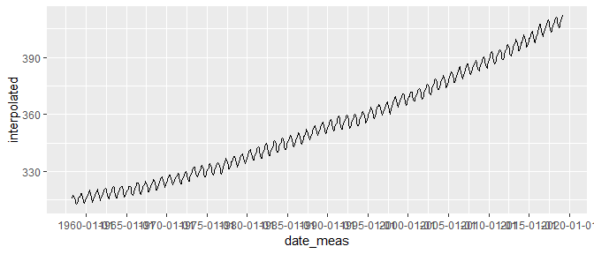

line graphs and dates
================


Notes: introduce the idea of using a separate data frame to add lines,
with a data argument and aes() argument in the geom layer instead of the
plot layer.

## contents

[introduction](#introduction)  
[prerequisites](#prerequisites)  
[date type and attributes](#date-type-and-attributes)  
[creating
dates](#creating-dates)  
[explore](#explore)  
[carpentry](#carpentry)  
[design](#design)  
[report](#report)  
[exercises](#exercises)  
[references](#references)

<http://homepage.stat.uiowa.edu/~luke/classes/STAT4580/timeseries.html#time-series-objects>

## introduction

“Dates and times are hard because they have to reconcile two physical
phenomena (the rotation of the Earth and its orbit around the sun) with
a whole raft of geopolitical phenomena including months, time zones, and
Daylight Savings Time” (Wickham and Grolemund,
[2017](#ref-Wickham+Grolemund:2017),
[Ch. 16](https://r4ds.had.co.nz/dates-and-times.html)). Adding to these
inherent difficulties, data are often mssing, intervals may be
irregular, and different organizations use different formats, e.g.,
“2019-04-16”, “16 Apr 2019”, “04/16/2019”

To add to the complexity, there are many [time series
classes](https://cran.r-project.org/web/views/TimeSeries.html) in R. I
will adhere primarily to the `Date` class, though we may have to deal
with the `ts` (time series) and `POSIXct`
([POSIX](https://en.wikipedia.org/wiki/POSIX) calendar time) classes
from time to time.

Being able to deal with dates is important, however, becuase so much
data is collected with date or time variables, for example, economic
indicators, climate data, medical research data, etc.

Time series data is often graphed with lines (using `geom_line`) with or
without data markers (`geom_point`). Thus, this tutorial on line graphs
is paired with an introduction to dates, times, and the lubridate
package.

<br> <a href="#top">▲ top of page</a>

## prerequisites

  - lubridate

<!-- end list -->

``` r
library("tidyverse")
library("lubridate")
```

<br> <a href="#top">▲ top of page</a>

## date type and attributes

Like factors, the `Date` class are displayed as character strings but
are encoded as numeric values. In this example, I start with a chacter
vector, convert it to a Date using `lubridate::ymd()`,

``` r
x <- c("2019-03-01", "2019-06-01", "2019-09-01", "2019-12-01")
typeof(x)
#> [1] "character"

x_date <- ymd(x)
x_date
#> [1] "2019-03-01" "2019-06-01" "2019-09-01" "2019-12-01"

typeof(x_date)
#> [1] "double"
attributes(x_date)
#> $class
#> [1] "Date"
```

The Date class in base R are internally stored as the number of days
since 1970-01-01. If we `unclass()` the variable, we remove the class
and reveal the hidden numbers.

``` r
x_date <- ymd("1971-01-01")
x_date
#> [1] "1971-01-01"
unclass(x_date)
#> [1] 365

x_date <- ymd("1970-01-01")
x_date
#> [1] "1970-01-01"
unclass(x_date)
#> [1] 0

x_date <- ymd("1969-01-01")
x_date
#> [1] "1969-01-01"
unclass(x_date)
#> [1] -365

# leap years are accounted for
x_date <- ymd("1968-01-01")
x_date
#> [1] "1968-01-01"
unclass(x_date)
#> [1] -731
```

Because of these hidden numbers, dates are always ordered.

<br> <a href="#top">▲ top of page</a>

## creating dates

Lubridate has some simple functions for converting the most common date
strings into `Date` objects.

  - `ymd()` for a string “2017-01-31”

<!-- end list -->

``` r
(x <- "2017-01-31")
#> [1] "2017-01-31"
(z <- ymd(x))
#> [1] "2017-01-31"

class(z)
#> [1] "Date"
attributes(z)
#> $class
#> [1] "Date"
unclass(z)
#> [1] 17197
```

  - `mdy()` for a string “January 31st, 2017” or “01/31/17”

<!-- end list -->

``` r
x <- "January 31st, 2017"
mdy(x)
#> [1] "2017-01-31"

class(x)
#> [1] "character"
class(ymd(x))
#> [1] "Date"


x <- "01/31/2017"
mdy(x)
#> [1] "2017-01-31"

class(x)
#> [1] "character"
class(mdy(x))
#> [1] "Date"
```

  - `dmy()` for a string “31-Jan-2017”

<!-- end list -->

``` r
x <- "31-Jan-2017"
dmy(x)
#> [1] "2017-01-31"

class(x)
#> [1] "character"
class(dmy(x))
#> [1] "Date"
```

  - `make_date()` when the year, month, and day are separate variables,
    like you might find in a data frame. The variables can be character
    or numeric.

<!-- end list -->

``` r
yyyy <- "2017" 
mm   <- "1"
dd   <- "31" 
z    <- make_date(year = yyyy, month = mm, day = dd)
z
#> [1] "2017-01-31"
class(z)
#> [1] "Date"

yyyy <- 2017 
mm   <- 1
dd   <- 31 
z    <- make_date(year = yyyy, month = mm, day = dd)
z
#> [1] "2017-01-31"
class(z)
#> [1] "Date"
```

For more on creating dates, read [16.2 Creating
date/times](https://r4ds.had.co.nz/dates-and-times.html#creating-datetimes)
in the text.

``` r
z <- ymd("1969-01-01")
attributes(z)
#> $class
#> [1] "Date"
unclass(z)
#> [1] -365
```

<br> <a href="#top">▲ top of page</a>

## explore

From the help page (`? airquality`) we find that these data were
obatained in 1973, and the month and day are in separate columns.

``` r
glimpse(airquality)
#> Observations: 153
#> Variables: 6
#> $ Ozone   <int> 41, 36, 12, 18, NA, 28, 23, 19, 8, NA, 7, 16, 11, 14, ...
#> $ Solar.R <int> 190, 118, 149, 313, NA, NA, 299, 99, 19, 194, NA, 256,...
#> $ Wind    <dbl> 7.4, 8.0, 12.6, 11.5, 14.3, 14.9, 8.6, 13.8, 20.1, 8.6...
#> $ Temp    <int> 67, 72, 74, 62, 56, 66, 65, 59, 61, 69, 74, 69, 66, 68...
#> $ Month   <int> 5, 5, 5, 5, 5, 5, 5, 5, 5, 5, 5, 5, 5, 5, 5, 5, 5, 5, ...
#> $ Day     <int> 1, 2, 3, 4, 5, 6, 7, 8, 9, 10, 11, 12, 13, 14, 15, 16,...
```

We use the lubridate package to create a variable of class “Date”.

``` r
df <- airquality %>% 
    mutate(Year = 1973L) %>% 
    mutate(meas_date = lubridate::make_date(year = Year, month = Month, day = Day)) %>% 
    glimpse()
#> Observations: 153
#> Variables: 8
#> $ Ozone     <int> 41, 36, 12, 18, NA, 28, 23, 19, 8, NA, 7, 16, 11, 14...
#> $ Solar.R   <int> 190, 118, 149, 313, NA, NA, 299, 99, 19, 194, NA, 25...
#> $ Wind      <dbl> 7.4, 8.0, 12.6, 11.5, 14.3, 14.9, 8.6, 13.8, 20.1, 8...
#> $ Temp      <int> 67, 72, 74, 62, 56, 66, 65, 59, 61, 69, 74, 69, 66, ...
#> $ Month     <int> 5, 5, 5, 5, 5, 5, 5, 5, 5, 5, 5, 5, 5, 5, 5, 5, 5, 5...
#> $ Day       <int> 1, 2, 3, 4, 5, 6, 7, 8, 9, 10, 11, 12, 13, 14, 15, 1...
#> $ Year      <int> 1973, 1973, 1973, 1973, 1973, 1973, 1973, 1973, 1973...
#> $ meas_date <date> 1973-05-01, 1973-05-02, 1973-05-03, 1973-05-04, 197...


class(df$meas_date)
#> [1] "Date"
```

graph the time series

``` r
ggplot(df, aes(x = meas_date, y = Ozone)) + 
    geom_line() + 
    geom_point()+
    coord_fixed(ratio = 2/20)
```


omit missing values

``` r
df <- df %>%
    drop_na()

# x <- df$meas_date
# y <- df$Ozone
# 
# ratio <- ggthemes::bank_slopes(x = as.numeric(x), y = y, method = "ms")

ggplot(df, aes(x = meas_date, y = Solar.R)) + 
    geom_line() + 
    geom_point() +
    coord_fixed(ratio = 1/20)
```


``` r
library(lubridate)
url <- "ftp://aftp.cmdl.noaa.gov/products/trends/co2/co2_mm_mlo.txt"

if (! file.exists("data/co2new.dat") ||
    now() > file.mtime("data/co2new.dat") + weeks(4))
    {download.file(url, "data/co2new.dat")}


co2new <- read.table("data/co2new.dat")

names(co2new) <- c("year", "month", "decimal_data", "average",
                   "interpolated", "trend", "ndays")

glimpse(co2new)
#> Observations: 733
#> Variables: 7
#> $ year         <int> 1958, 1958, 1958, 1958, 1958, 1958, 1958, 1958, 1...
#> $ month        <int> 3, 4, 5, 6, 7, 8, 9, 10, 11, 12, 1, 2, 3, 4, 5, 6...
#> $ decimal_data <dbl> 1958.208, 1958.292, 1958.375, 1958.458, 1958.542,...
#> $ average      <dbl> 315.71, 317.45, 317.50, -99.99, 315.86, 314.93, 3...
#> $ interpolated <dbl> 315.71, 317.45, 317.50, 317.10, 315.86, 314.93, 3...
#> $ trend        <dbl> 314.62, 315.29, 314.71, 314.85, 314.98, 315.94, 3...
#> $ ndays        <int> -1, -1, -1, -1, -1, -1, -1, -1, -1, -1, -1, -1, -...
co2new <- mutate(co2new, average = ifelse(average < -90, NA, average))

co2new <- co2new %>% 
    mutate(yyyymmdd = date_decimal(decimal_data)) %>% 
    glimpse()
#> Observations: 733
#> Variables: 8
#> $ year         <int> 1958, 1958, 1958, 1958, 1958, 1958, 1958, 1958, 1...
#> $ month        <int> 3, 4, 5, 6, 7, 8, 9, 10, 11, 12, 1, 2, 3, 4, 5, 6...
#> $ decimal_data <dbl> 1958.208, 1958.292, 1958.375, 1958.458, 1958.542,...
#> $ average      <dbl> 315.71, 317.45, 317.50, NA, 315.86, 314.93, 313.2...
#> $ interpolated <dbl> 315.71, 317.45, 317.50, 317.10, 315.86, 314.93, 3...
#> $ trend        <dbl> 314.62, 315.29, 314.71, 314.85, 314.98, 315.94, 3...
#> $ ndays        <int> -1, -1, -1, -1, -1, -1, -1, -1, -1, -1, -1, -1, -...
#> $ yyyymmdd     <dttm> 1958-03-17 22:04:49, 1958-04-17 13:55:12, 1958-0...

ggplot(co2new, aes(x = yyyymmdd, y = interpolated)) +
    geom_line()
```


``` r
library("HistData")
data(Nightingale, package = "HistData")
head(Nightingale)
#>         Date Month Year  Army Disease Wounds Other Disease.rate
#> 1 1854-04-01   Apr 1854  8571       1      0     5          1.4
#> 2 1854-05-01   May 1854 23333      12      0     9          6.2
#> 3 1854-06-01   Jun 1854 28333      11      0     6          4.7
#> 4 1854-07-01   Jul 1854 28722     359      0    23        150.0
#> 5 1854-08-01   Aug 1854 30246     828      1    30        328.5
#> 6 1854-09-01   Sep 1854 30290     788     81    70        312.2
#>   Wounds.rate Other.rate
#> 1         0.0        7.0
#> 2         0.0        4.6
#> 3         0.0        2.5
#> 4         0.0        9.6
#> 5         0.4       11.9
#> 6        32.1       27.7

library(tidyr)
nd <- gather(Nightingale, series, value, 8:10)
glimpse(nd)
#> Observations: 72
#> Variables: 9
#> $ Date    <date> 1854-04-01, 1854-05-01, 1854-06-01, 1854-07-01, 1854-...
#> $ Month   <ord> Apr, May, Jun, Jul, Aug, Sep, Oct, Nov, Dec, Jan, Feb,...
#> $ Year    <int> 1854, 1854, 1854, 1854, 1854, 1854, 1854, 1854, 1854, ...
#> $ Army    <int> 8571, 23333, 28333, 28722, 30246, 30290, 30643, 29736,...
#> $ Disease <int> 1, 12, 11, 359, 828, 788, 503, 844, 1725, 2761, 2120, ...
#> $ Wounds  <int> 0, 0, 0, 0, 1, 81, 132, 287, 114, 83, 42, 32, 48, 49, ...
#> $ Other   <int> 5, 9, 6, 23, 30, 70, 128, 106, 131, 324, 361, 172, 57,...
#> $ series  <chr> "Disease.rate", "Disease.rate", "Disease.rate", "Disea...
#> $ value   <dbl> 1.4, 6.2, 4.7, 150.0, 328.5, 312.2, 197.0, 340.6, 631....

ggplot(nd, aes(Date, value)) + geom_line() +
    facet_wrap(vars(series), ncol = 1) # scales = "free_y", 
```



``` r
library(nsRFA)
data(hydroSIMN)
annualflows <- mutate(annualflows, cod = factor(cod))

ggplot(annualflows, aes(anno, dato, group = cod)) +
  geom_line() + 
    facet_wrap(vars(cod))
```


<br> <a href="#top">▲ top of page</a>

## carpentry

<br> <a href="#top">▲ top of page</a>

## design

<br> <a href="#top">▲ top of page</a>

## report

<br> <a href="#top">▲ top of page</a>

## exercises

**1. xxx**

Scripts to initialize

    explore/     wwdd-nextgraphtype-dataset-explore.R  
    carpentry/   wwdd-nextgraphtype-dataset-data.R   
    design/      wwdd-nextgraphtype-dataset.R 

Data:

Explore script:

Carpentry script

Design script

## references

<div id="refs">

<div id="ref-Wickham+Grolemund:2017">

Wickham H and Grolemund G (2017) *R for Data Science.* O’Reilly Media,
Inc., Sebastopol, CA <https://r4ds.had.co.nz/>

</div>

</div>

***
<a href="#top">&#9650; top of page</a>    
[&#9665; calendar](../README.md#calendar)    
[&#9665; index](../README.md#index)
