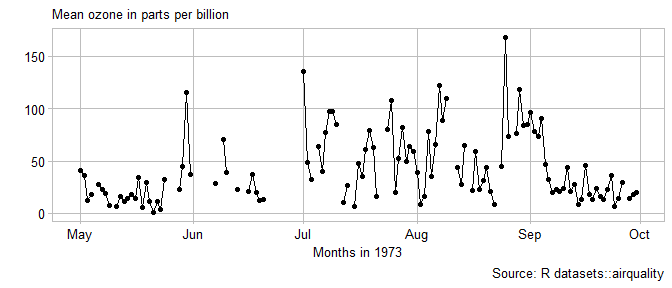

line graphs and dates
================


Notes: introduce the idea of using a separate data frame to add lines,
with a data argument and aes() argument in the geom layer instead of the
plot
layer.

## contents

[introduction](#introduction)  
[prerequisites](#prerequisites)  
\[\]  
\[\]  
\[\]  
\[\]  
\[\]  
[references](#references)

<http://homepage.stat.uiowa.edu/~luke/classes/STAT4580/timeseries.html#time-series-objects>

## introduction

Line graphs are often used for time-series data, thus this tutorial is
paired with an introduction to dates, times, and the lubridate package.

<br> <a href="#top">▲ top of page</a>

## prerequisites

Project setup

  - Start every work session by launching the RStudio Project file for
    the course, e.g., `portfolio.Rproj`  
  - Ensure your [project directory
    structure](cm501-proj-m-manage-files.md#planning-the-directory-structure)
    satisfies the course requirements

Ensure you have installed the following packages. See [install
packages](cm902-software-studio.md#install-packages) for instructions if
needed.

  - tidyverse  
  - lubridate

Scripts to initialize

``` 
explore/     0603-line-graph-explore.R  
```

And start with a minimal header

``` r
# your name
# date

# load packages
library("tidyverse")
library("lubridate")
```

Duplicate the lines of code in the session one chunk at a time. Save,
Source, and compare your results to the results shown.

<br> <a href="#top">▲ top of page</a>

## explore

From the help page (`? airquality`) we find that these data were
obatained in 1973, and the month and day are in separate columns.

``` r
glimpse(airquality)
#> Observations: 153
#> Variables: 6
#> $ Ozone   <int> 41, 36, 12, 18, NA, 28, 23, 19, 8, NA, 7, 16, 11, 14, ...
#> $ Solar.R <int> 190, 118, 149, 313, NA, NA, 299, 99, 19, 194, NA, 256,...
#> $ Wind    <dbl> 7.4, 8.0, 12.6, 11.5, 14.3, 14.9, 8.6, 13.8, 20.1, 8.6...
#> $ Temp    <int> 67, 72, 74, 62, 56, 66, 65, 59, 61, 69, 74, 69, 66, 68...
#> $ Month   <int> 5, 5, 5, 5, 5, 5, 5, 5, 5, 5, 5, 5, 5, 5, 5, 5, 5, 5, ...
#> $ Day     <int> 1, 2, 3, 4, 5, 6, 7, 8, 9, 10, 11, 12, 13, 14, 15, 16,...
```

We use the lubridate package to create a variable of class “Date”.

``` r
df <- airquality %>% 
    mutate(Year = 1973L) %>% 
    mutate(meas_date = lubridate::make_date(year = Year, month = Month, day = Day)) %>% 
    glimpse()
#> Observations: 153
#> Variables: 8
#> $ Ozone     <int> 41, 36, 12, 18, NA, 28, 23, 19, 8, NA, 7, 16, 11, 14...
#> $ Solar.R   <int> 190, 118, 149, 313, NA, NA, 299, 99, 19, 194, NA, 25...
#> $ Wind      <dbl> 7.4, 8.0, 12.6, 11.5, 14.3, 14.9, 8.6, 13.8, 20.1, 8...
#> $ Temp      <int> 67, 72, 74, 62, 56, 66, 65, 59, 61, 69, 74, 69, 66, ...
#> $ Month     <int> 5, 5, 5, 5, 5, 5, 5, 5, 5, 5, 5, 5, 5, 5, 5, 5, 5, 5...
#> $ Day       <int> 1, 2, 3, 4, 5, 6, 7, 8, 9, 10, 11, 12, 13, 14, 15, 1...
#> $ Year      <int> 1973, 1973, 1973, 1973, 1973, 1973, 1973, 1973, 1973...
#> $ meas_date <date> 1973-05-01, 1973-05-02, 1973-05-03, 1973-05-04, 197...


class(df$meas_date)
#> [1] "Date"
```

graph the time series

``` r
ggplot(df, aes(x = meas_date, y = Ozone)) + 
    geom_line() + 
    geom_point()+
    coord_fixed(ratio = 2/20)
```


omit missing values

``` r
df <- df %>%
    drop_na()

# x <- df$meas_date
# y <- df$Ozone
# 
# ratio <- ggthemes::bank_slopes(x = as.numeric(x), y = y, method = "ms")

ggplot(df, aes(x = meas_date, y = Solar.R)) + 
    geom_line() + 
    geom_point() +
    coord_fixed(ratio = 1/20)
```


``` r
library(lubridate)
co2_ftp <- "ftp://aftp.cmdl.noaa.gov/products/trends/co2/co2_mm_mlo.txt"
co2_file <- "data/noaa_co2.txt"

# update file if more than 4 weeks since last download
if (!file.exists(co2_file) | now() > file.mtime(co2_file) + weeks(4)) {
    download.file(co2_ftp, co2_file)
}
```

If you open the text file, you see that missing data are encoded using
-99.99 and the column names are
    shown.

    # CO2 expressed as a mole fraction in dry air, micromol/mol, abbreviated as ppm
    #
    #  (-99.99 missing data;  -1 no data for #daily means in month)
    #
    #            decimal     average   interpolated    trend    #days
    #             date                             (season corr)
    1958   3    1958.208      315.71      315.71      314.62     -1
    1958   4    1958.292      317.45      317.45      315.29     -1
    1958   5    1958.375      317.50      317.50      314.71     -1
    1958   6    1958.458      -99.99      317.10      314.85     -1

``` r
co2 <- read.table(co2_file)
names(co2) <- c("year", "month", "decimal_data", "average",
                   "interpolated", "trend", "ndays")

glimpse(co2)
#> Observations: 733
#> Variables: 7
#> $ year         <int> 1958, 1958, 1958, 1958, 1958, 1958, 1958, 1958, 1...
#> $ month        <int> 3, 4, 5, 6, 7, 8, 9, 10, 11, 12, 1, 2, 3, 4, 5, 6...
#> $ decimal_data <dbl> 1958.208, 1958.292, 1958.375, 1958.458, 1958.542,...
#> $ average      <dbl> 315.71, 317.45, 317.50, -99.99, 315.86, 314.93, 3...
#> $ interpolated <dbl> 315.71, 317.45, 317.50, 317.10, 315.86, 314.93, 3...
#> $ trend        <dbl> 314.62, 315.29, 314.71, 314.85, 314.98, 315.94, 3...
#> $ ndays        <int> -1, -1, -1, -1, -1, -1, -1, -1, -1, -1, -1, -1, -...
co2 <- co2 %>% 
    mutate(average = ifelse(average < -90, NA, average)) %>% 
    mutate(ndays = ifelse(ndays == -1, NA, ndays))

co2 <- co2 %>% 
    mutate(co2_date = date_decimal(decimal_data)) %>% 
    glimpse()
#> Observations: 733
#> Variables: 8
#> $ year         <int> 1958, 1958, 1958, 1958, 1958, 1958, 1958, 1958, 1...
#> $ month        <int> 3, 4, 5, 6, 7, 8, 9, 10, 11, 12, 1, 2, 3, 4, 5, 6...
#> $ decimal_data <dbl> 1958.208, 1958.292, 1958.375, 1958.458, 1958.542,...
#> $ average      <dbl> 315.71, 317.45, 317.50, NA, 315.86, 314.93, 313.2...
#> $ interpolated <dbl> 315.71, 317.45, 317.50, 317.10, 315.86, 314.93, 3...
#> $ trend        <dbl> 314.62, 315.29, 314.71, 314.85, 314.98, 315.94, 3...
#> $ ndays        <int> NA, NA, NA, NA, NA, NA, NA, NA, NA, NA, NA, NA, N...
#> $ co2_date     <dttm> 1958-03-17 22:04:49, 1958-04-17 13:55:12, 1958-0...

ggplot(co2, aes(x = co2_date, y = interpolated)) +
    geom_line()
```



``` r
library("HistData")
data(Nightingale, package = "HistData")
head(Nightingale)
#>         Date Month Year  Army Disease Wounds Other Disease.rate
#> 1 1854-04-01   Apr 1854  8571       1      0     5          1.4
#> 2 1854-05-01   May 1854 23333      12      0     9          6.2
#> 3 1854-06-01   Jun 1854 28333      11      0     6          4.7
#> 4 1854-07-01   Jul 1854 28722     359      0    23        150.0
#> 5 1854-08-01   Aug 1854 30246     828      1    30        328.5
#> 6 1854-09-01   Sep 1854 30290     788     81    70        312.2
#>   Wounds.rate Other.rate
#> 1         0.0        7.0
#> 2         0.0        4.6
#> 3         0.0        2.5
#> 4         0.0        9.6
#> 5         0.4       11.9
#> 6        32.1       27.7

library(tidyr)
nd <- gather(Nightingale, series, value, 8:10)
glimpse(nd)
#> Observations: 72
#> Variables: 9
#> $ Date    <date> 1854-04-01, 1854-05-01, 1854-06-01, 1854-07-01, 1854-...
#> $ Month   <ord> Apr, May, Jun, Jul, Aug, Sep, Oct, Nov, Dec, Jan, Feb,...
#> $ Year    <int> 1854, 1854, 1854, 1854, 1854, 1854, 1854, 1854, 1854, ...
#> $ Army    <int> 8571, 23333, 28333, 28722, 30246, 30290, 30643, 29736,...
#> $ Disease <int> 1, 12, 11, 359, 828, 788, 503, 844, 1725, 2761, 2120, ...
#> $ Wounds  <int> 0, 0, 0, 0, 1, 81, 132, 287, 114, 83, 42, 32, 48, 49, ...
#> $ Other   <int> 5, 9, 6, 23, 30, 70, 128, 106, 131, 324, 361, 172, 57,...
#> $ series  <chr> "Disease.rate", "Disease.rate", "Disease.rate", "Disea...
#> $ value   <dbl> 1.4, 6.2, 4.7, 150.0, 328.5, 312.2, 197.0, 340.6, 631....

ggplot(nd, aes(Date, value)) + geom_line() +
    facet_wrap(vars(series), ncol = 1) # scales = "free_y", 
```


``` r
library(nsRFA)
data(hydroSIMN)
annualflows <- mutate(annualflows, cod = factor(cod))

ggplot(annualflows, aes(anno, dato, group = cod)) +
  geom_line() + 
    facet_wrap(vars(cod))
```


<br> <a href="#top">▲ top of page</a>

## references

<div id="refs">

<div id="ref-Wickham+Grolemund:2017">

Wickham H and Grolemund G (2017) *R for Data Science.* O’Reilly Media,
Inc., Sebastopol, CA <https://r4ds.had.co.nz/>

</div>

</div>

***
<a href="#top">&#9650; top of page</a>    
[&#9665; calendar](../README.md#calendar)    
[&#9665; index](../README.md#index)
