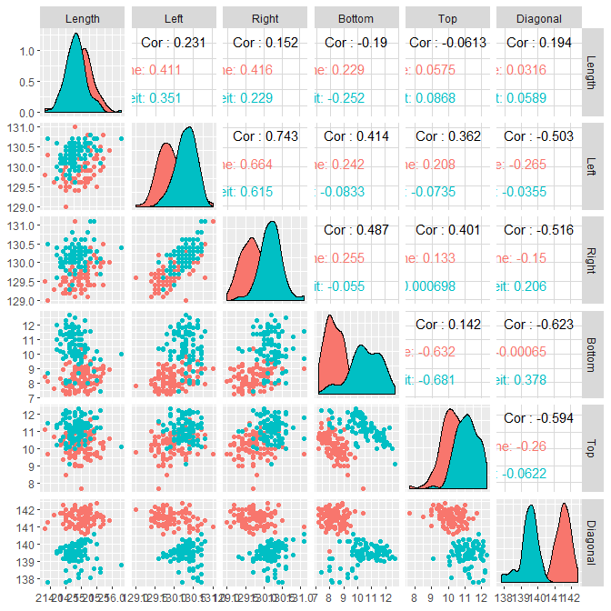

conditioning plot
================

## contents

[introduction](#introduction)  
[prerequisites](#prerequisites)  
[explore](#explore)  
[exercises](#exercises)  
[references](#references)

## introduction

intro

Data characteristics

  - x quantitative variables  
  - x or more categorical variables (optional or not)  
  - A key variable if data are not coordinatized

Graph characteristics

  - x
  - x

[Dx graph type](link) data and graph requirements

<br> <a href="#top">▲ top of page</a>

## prerequisites

Project setup

  - Start every work session by launching the RStudio Project file for
    the course, e.g., `portfolio.Rproj`  
  - Ensure your [project directory
    structure](cm501-proj-m-manage-files.md#planning-the-directory-structure)
    satisfies the course requirements

Ensure you have installed the following packages. See [install
packages](cm902-software-studio.md#install-packages) for instructions if
needed.

  - tidyverse  
  - graphclassmate

Scripts to initialize

    explore/     0xxx-graphtype-dataname-explore.R  
    carpentry/   0xxx-graphtype-dataname-data.R   
    design/      0xxx-graphtype-dataname.R 

And start each file with a minimal header

``` r
# your name
# date

# load packages
library("tidyverse")
```

Duplicate the lines of code in the session one chunk at a time. Save,
Source, and compare your results to the results shown.

<br> <a href="#top">▲ top of page</a>

## explore

Open the explore script you initialized earlier. Load the package that
has the data.

Conditioning plot, made with lattice

<https://homepage.divms.uiowa.edu/~luke/classes/STAT4580/threenum.html#conditioning-plots-coplots>

`coplot()` is a base R graphics function

``` r
soil <- read.table("http://homepage.divms.uiowa.edu/~luke/data/soil.dat")

coplot(resistivity ~ northing | easting, 
             data = soil)
```


With 4 variables

``` r
data(airquality)
```

``` r
coplot(Ozone ~ Solar.R | Temp * Wind, 
        data = airquality, 
        panel = function(x,y,...) {
                panel.smooth(x, y, span = .8, iter = 5, ...)
            }
             )
```



    #> 
    #>  Missing rows: 5, 6, 10, 11, 25, 26, 27, 32, 33, 34, 35, 36, 37, 39, 42, 43, 45, 46, 52, 53, 54, 55, 56, 57, 58, 59, 60, 61, 65, 72, 75, 83, 84, 96, 97, 98, 102, 103, 107, 115, 119, 150

## exercises

## references

<div id="refs">

<div id="ref-Wickham+Grolemund:2017">

Wickham H and Grolemund G (2017) *R for Data Science.* O’Reilly Media,
Inc., Sebastopol, CA <https://r4ds.had.co.nz/>

</div>

</div>

***
<a href="#top">&#9650; top of page</a>    
[&#9665; calendar](../README.md#calendar)    
[&#9665; index](../README.md#index)
