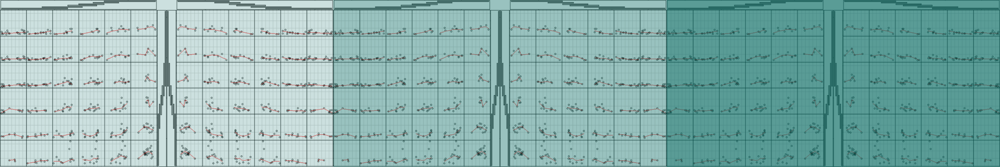
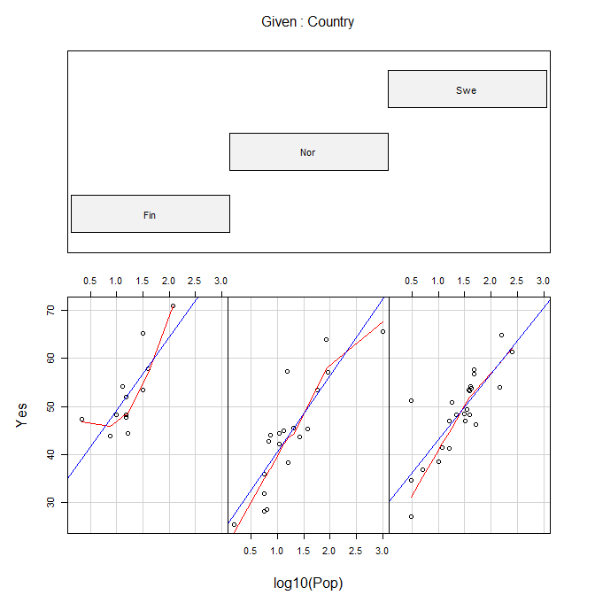
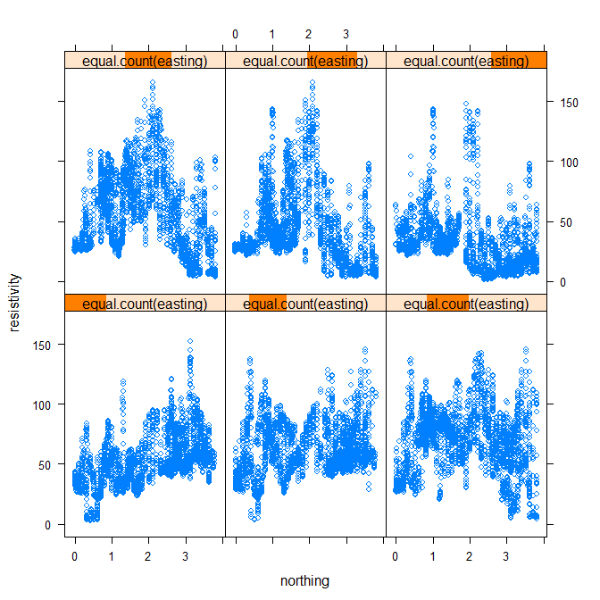

conditioning plot
================



## contents

[introduction](#introduction)  
[prerequisites](#prerequisites)  
[explore](#explore)  
[exercises](#exercises)  
[references](#references)

## introduction

A scatterplot matrix, while suitable for any number of quantitative
variables, shows the dependence of only two variables at a time. To see
the dependence of three or four quantitative variables simultaneously,
we use a conditioning plot (or coplot).

Data characteristics

  - 3 or 4 quantitative variables  
  - No categorical variables

Graph characteristics

  - A matrix of scatterplots
  - Each panel depends on a specified range of one or two other
    quantitative variables
  - Optional: loess or other smooth fit per panel

[D6 Multivariate](cm301-report-display-reqts.md#D6-multivariate) data
and graph requirements

<br> <a href="#top">▲ top of page</a>

## prerequisites

Project setup

  - Start every work session by launching the RStudio Project file for
    the course, e.g., `portfolio.Rproj`  
  - Ensure your [project directory
    structure](cm501-proj-m-manage-files.md#planning-the-directory-structure)
    satisfies the course requirements

Ensure you have installed the following packages. See [install
packages](cm902-software-studio.md#install-packages) for instructions if
needed.

  - tidyverse

Scripts to initialize

``` 
explore/     0801-conditioning-plot-explore.R  
```

And start the file with a minimal header

``` r
# your name
# date

# load packages
library("tidyverse")
```

Duplicate the lines of code in the session one chunk at a time. Save,
Source, and compare your results to the results shown.

<br> <a href="#top">▲ top of page</a>

## explore

Open the explore script you initialized earlier.

`coplot()` is a base R graphics function

``` r
soil <- read.table("http://homepage.divms.uiowa.edu/~luke/data/soil.dat")
glimpse(soil)
#> Observations: 8,641
#> Variables: 5
#> $ northing    <dbl> 0.0180, 0.0178, 0.0176, 0.0174, 0.0171, 0.0169, 0....
#> $ easting     <dbl> 0.0160, 0.0252, 0.0345, 0.0437, 0.0529, 0.0621, 0....
#> $ resistivity <dbl> 34.15, 34.81, 35.65, 36.44, 37.10, 37.53, 37.58, 3...
#> $ is.ns       <lgl> FALSE, FALSE, FALSE, FALSE, FALSE, FALSE, FALSE, F...
#> $ track       <int> 1, 1, 1, 1, 1, 1, 1, 1, 1, 1, 1, 1, 1, 1, 1, 1, 1,...
```

``` r
coplot(resistivity ~ northing | easting, data = soil)
```



With 4 variables

``` r
data(airquality)
glimpse(airquality)
#> Observations: 153
#> Variables: 6
#> $ Ozone   <int> 41, 36, 12, 18, NA, 28, 23, 19, 8, NA, 7, 16, 11, 14, ...
#> $ Solar.R <int> 190, 118, 149, 313, NA, NA, 299, 99, 19, 194, NA, 256,...
#> $ Wind    <dbl> 7.4, 8.0, 12.6, 11.5, 14.3, 14.9, 8.6, 13.8, 20.1, 8.6...
#> $ Temp    <int> 67, 72, 74, 62, 56, 66, 65, 59, 61, 69, 74, 69, 66, 68...
#> $ Month   <int> 5, 5, 5, 5, 5, 5, 5, 5, 5, 5, 5, 5, 5, 5, 5, 5, 5, 5, ...
#> $ Day     <int> 1, 2, 3, 4, 5, 6, 7, 8, 9, 10, 11, 12, 13, 14, 15, 16,...
```

``` r
coplot(Ozone ~ Solar.R | Temp * Wind, data = airquality, 
        panel = function(x, y, ...) {
                panel.smooth(x, y, span = .8, iter = 5, ...)
        }
)
```



    #> 
    #>  Missing rows: 5, 6, 10, 11, 25, 26, 27, 32, 33, 34, 35, 36, 37, 39, 42, 43, 45, 46, 52, 53, 54, 55, 56, 57, 58, 59, 60, 61, 65, 72, 75, 83, 84, 96, 97, 98, 102, 103, 107, 115, 119, 150

The aesthetics of the graph would be edited using base R graphics
functions (which I will illustrate if I can fins some time).

## exercises

TBD

## references

<div id="refs">

<div id="ref-Wickham+Grolemund:2017">

Wickham H and Grolemund G (2017) *R for Data Science.* O’Reilly Media,
Inc., Sebastopol, CA <https://r4ds.had.co.nz/>

</div>

</div>

***
<a href="#top">&#9650; top of page</a>    
[&#9665; calendar](../README.md#calendar)    
[&#9665; index](../README.md#index)
