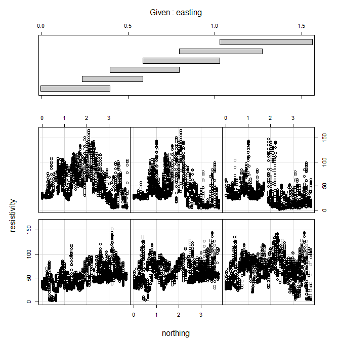

conditioning plot
================

Notes: introduce the idea of using a separate data frame to add lines,
with a data argument and aes() argument in the geom layer instead of the
plot layer.

## contents

[introduction](#introduction)  
[prerequisites](#prerequisites)  
[explore](#explore)  
\[carpentry\]  
\[design\]  
\[report\]  
[exercises](#exercises)  
[references](#references)

## introduction

intro

Data characteristics

  - x quantitative variables  
  - x or more categorical variables (optional or not)  
  - A key variable if data are not coordinatized

Graph characteristics

  - x
  - x

[Dx graph type](link) data and graph requirements

<br> <a href="#top">▲ top of page</a>

## prerequisites

Project setup

  - Start every work session by launching the RStudio Project file for
    the course, e.g., `portfolio.Rproj`  
  - Ensure your [project directory
    structure](cm501-proj-m-manage-files.md#planning-the-directory-structure)
    satisfies the course requirements

Ensure you have installed the following packages. See [install
packages](cm902-software-studio.md#install-packages) for instructions if
needed.

  - tidyverse  
  - graphclassmate

Scripts to initialize

    explore/     0xxx-graphtype-dataname-explore.R  
    carpentry/   0xxx-graphtype-dataname-data.R   
    design/      0xxx-graphtype-dataname.R 

And start each file with a minimal header

``` r
# your name
# date

# load packages
library("tidyverse")
```

Duplicate the lines of code in the session one chunk at a time. Save,
Source, and compare your results to the results shown.

<br> <a href="#top">▲ top of page</a>

## explore

Open the explore script you initialized earlier. Load the package that
has the data.

Conditioning plot, made with lattice

<https://homepage.divms.uiowa.edu/~luke/classes/STAT4580/threenum.html#conditioning-plots-coplots>

``` r
library(lattice)
scanvote <- read.csv("data-raw/scanvote.csv")
glimpse(scanvote)
#> Observations: 55
#> Variables: 4
#> $ District <fct> Uusimaa, Turku ja Pori, Hame, Kymi, Ahvenanmaa, Mikke...
#> $ Yes      <dbl> 70.8, 53.4, 57.8, 65.2, 51.9, 54.2, 48.3, 44.4, 47.7,...
#> $ Pop      <dbl> 117.5, 32.0, 39.5, 31.8, 15.4, 12.8, 15.4, 16.7, 15.2...
#> $ Country  <fct> Fin, Fin, Fin, Fin, Fin, Fin, Fin, Fin, Fin, Fin, Fin...
```

``` r
coplot(Yes ~ log10(Pop) | Country, 
             data = scanvote, 
             columns = 3,
       panel = function(x, y, ...) {
          panel.smooth(x, y, span = .8, iter = 5, ...)
          abline(lm(y ~ x), col = "blue")})
```



## exercises

## references

<div id="refs">

<div id="ref-Wickham+Grolemund:2017">

Wickham H and Grolemund G (2017) *R for Data Science.* O’Reilly Media,
Inc., Sebastopol, CA <https://r4ds.had.co.nz/>

</div>

</div>

***
<a href="#top">&#9650; top of page</a>    
[&#9665; calendar](../README.md#calendar)    
[&#9665; index](../README.md#index)
