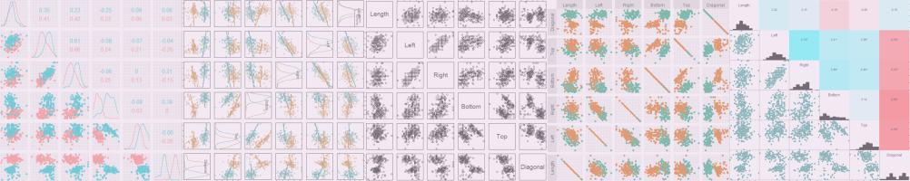
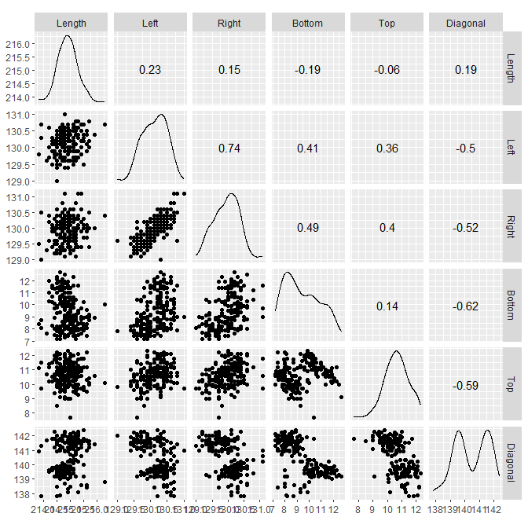
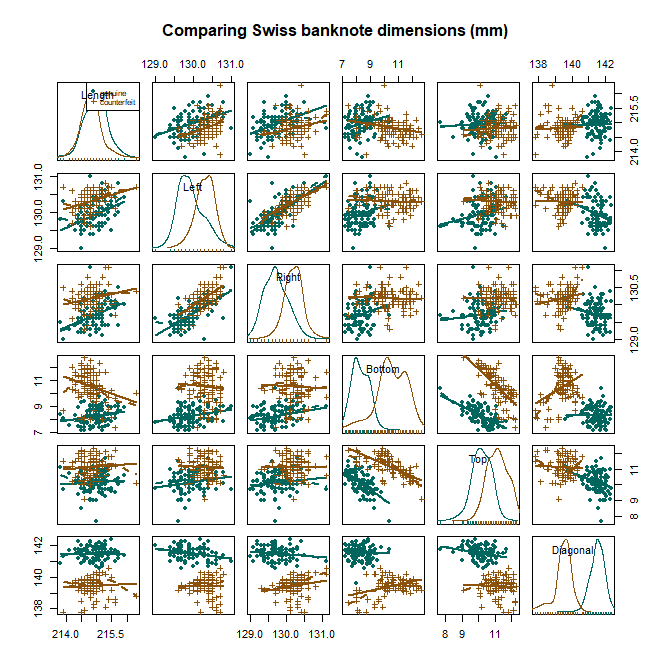
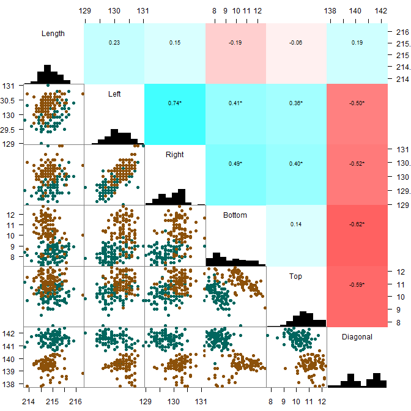
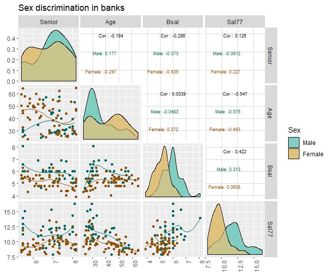

scatterplot matrix
================



## contents

[introduction](#introduction)  
[prerequisites](#prerequisites)  
[data](#data)  
[pairs()](#pairs)  
[ggscatmat()](#ggscatmat)  
[ggpairs()](#ggpairs)  
[gpairs()](#gpairs)  
[spm()](#spm)  
[PairPlot()](#pairplot) [exercises](#exercises)  
[references](#references)

## introduction

A scatterplot matrix is a graph design for visualizing three or more
quantitative variables and (possibly) categorical variables. The graph
consists of a matrix of panels; each panel is a scatterplot of one pair
of variables.

Data characteristics

  - 3 or more quantitative variables  
  - 1 or more categorical variables (optional). Some packages do not
    allow categorical variables.  
  - A key variable if data are not coordinatized

Graph characteristics

  - A matrix of scatterplots
  - The variable names are the labels of the rows and the columns of the
    matrix
  - Optional: loess or other smooth fit
  - Optional: the matrix diagonal shows a statistical summary of the
    variable
  - Optional: pair-wise correlation coefficients

[D6 Multivariate](cm301-report-display-reqts.md#D6-multivariate) data
and graph requirements

<br> <a href="#top">▲ top of page</a>

## prerequisites

Project setup

  - Start every work session by launching the RStudio Project file for
    the course, e.g., `portfolio.Rproj`  
  - Ensure your [project directory
    structure](cm501-proj-m-manage-files.md#planning-the-directory-structure)
    satisfies the course requirements

Ensure you have installed the following packages. See [install
packages](cm902-software-studio.md#install-packages) for instructions if
needed.

  - tidyverse  
  - graphclassmate
  - gclus

Scripts to initialize

``` 
explore/     0801-scatmat-explore.R  
```

And start each file with a minimal header

``` r
# your name
# date

# load packages
library("tidyverse")
library("graphclassmate")
```

Duplicate the lines of code in the session one chunk at a time. Save,
Source, and compare your results to the results shown.

<br> <a href="#top">▲ top of page</a>

## data

Open the explore script you initialized earlier. Load the package that
has the data. These data are measurements made of genuine and
counterfeit Swiss bamk notes.

``` r
library("gclus")
data(bank, package = "gclus")
glimpse(bank)
#> Observations: 200
#> Variables: 7
#> $ Status   <int> 0, 0, 0, 0, 0, 0, 0, 0, 0, 0, 0, 0, 0, 0, 0, 0, 0, 0,...
#> $ Length   <dbl> 214.8, 214.6, 214.8, 214.8, 215.0, 215.7, 215.5, 214....
#> $ Left     <dbl> 131.0, 129.7, 129.7, 129.7, 129.6, 130.8, 129.5, 129....
#> $ Right    <dbl> 131.1, 129.7, 129.7, 129.6, 129.7, 130.5, 129.7, 129....
#> $ Bottom   <dbl> 9.0, 8.1, 8.7, 7.5, 10.4, 9.0, 7.9, 7.2, 8.2, 9.2, 7....
#> $ Top      <dbl> 9.7, 9.5, 9.6, 10.4, 7.7, 10.1, 9.6, 10.7, 11.0, 10.0...
#> $ Diagonal <dbl> 141.0, 141.7, 142.2, 142.0, 141.8, 141.4, 141.6, 141....
```

The status variable is an integer, where 0 = a genuine bank note and 1 =
a counterfeit bank note. To condition the graphs by status, we convert
the variable to a factor with the levels “genuine” and “counterfeit.”

``` r
bank <- bank %>%
  mutate(Status = factor(Status, labels = c("genuine", "counterfeit")))
```

In the following graphs, I’ll use the scatterplot matrix function in
several packages. Each has a somewhat different look and feel. Some are
easier than others to edit.

I’ll be using the same color scheme in each case, so I’ll assign a
couple of color vecctors here.

``` r
my_color <- c(rcb("dark_BG"), rcb("dark_Br"))
my_fill  <- c(rcb("pale_BG"), rcb("pale_Br"))
```

## pairs()

I’ll start with the base R function `pairs()` as a baseline against
which we can compare the alternatives.

``` r
pairs(bank[ , 2:7])
```



<br> Include the Status category and edit the aesthetics

``` r
pairs(~ Length + Left + Right + Bottom + Top + Diagonal, 
        data = bank, 
        pch  = c(21, 21)[bank$Status],
        col  = my_color[bank$Status],
        bg   = my_fill[bank$Status],
        gap  = 0, 
        cex.labels = 1, 
        upper.panel = NULL, 
        las = 2
)
legend("topright", 
       legend = levels(bank$Status), 
       inset = 0.2)
```


## ggscatmat()

Package GGally

``` r
library("GGally")
ggscatmat(bank, columns = 2:7)
```


<br> Include the Status category and edit the aesthetics. Is compatible
with ggplot2 functions such as `theme()`

``` r
ggscatmat(bank, 
          columns = 2:7, 
          color = "Status", 
          alpha = 0.8) +
  theme(legend.position = "top")
```


## ggpairs()

Package GGally

``` r
library("GGally")
ggpairs(bank, columns = 2:7)
```


<br> Include the Status category and edit the aesthetics

``` r
ggpairs(bank, 
        columns = 2:7, 
        mapping = aes(color = Status))
```



## gpairs()

Package gpairs

``` r
library("gpairs")
gpairs(bank[ , 2:7],
       lower.pars = list(scatter = "points"), 
       upper.pars = list(scatter = 'stats'), 
       scatter.pars = list(pch = 16, 
                           size = unit(5, "pt"), 
                           col  = rcb("mid_BG"), 
                           frame.fill = NULL, 
                           border.col = "gray50"), 
       stat.pars = list(verbose = FALSE), 
       gap = 0
       )
```



## spm()

Package car

``` r
library("car")
spm(~ Length + Left + Right + Bottom + Top + Diagonal | Status, 
        data = bank, 
        col  = c(rcb("mid_BG"), rcb("mid_Br")), 
        fill = c(rcb("light_BG"), rcb("light_Br")), 
        pch  = c(21, 21), 
        cex  = 0.75 * c(1, 1), 
        cex.axis = 1, 
        cex.labels = 1, 
        cex.main = 1)
```


## PairPlot()

Package WVPlots

``` r
library("WVPlots")
PairPlot(bank, colnames(bank)[2:7], title = "Bank", group_var = "Status")
```



<!-- ```{r} -->

<!-- library("car") -->

<!-- spm(~ palmitic + palmitoleic + stearic + oleic + linoleic + linolenic + arachidic + eicosenoic | Region, data = olives) -->

<!-- ``` -->

<!-- ```{r} -->

<!-- library("gpairs") -->

<!-- gpairs(olives[ , 3:10], -->

<!--        lower.pars = list(scatter = "points"),  -->

<!--        upper.pars = list(scatter = 'stats'),  -->

<!--        # diagonal = "other", -->

<!--        scatter.pars = list(pch = 21,  -->

<!--                            size = unit(5, "pt"),  -->

<!--                            col  = rcb("dark_BG"),  -->

<!--                            fill = rcb("mid_BG"),  -->

<!--                            frame.fill = NULL,  -->

<!--                            border.col = "gray50"),  -->

<!--        stat.pars = list(verbose = FALSE),  -->

<!--        gap = 0.02 -->

<!--        ) -->

<!-- ``` -->

<!-- Made with GGally, http://ggobi.github.io/ggally/index.html  -->

<!-- library("extracat") -->

<!-- data(olives) -->

<!-- glimpse(olives) -->

<!-- ```{r} -->

<!-- library(GGally) -->

<!-- data(flea, package = "GGally") -->

<!-- glimpse(flea) -->

<!-- ``` -->

<!-- ```{r} -->

<!-- ggscatmat(flea, columns = 2:4, color = "species", alpha = 0.8) -->

<!-- ``` -->

<!-- ```{r} -->

<!-- data(airquality) -->

<!-- names(airquality) -->

<!-- ggscatmat(airquality, columns = 1:4) -->

<!-- ``` -->

<!-- ```{r} -->

<!-- library(foreign) -->

<!-- af <- read.dta("http://data.princeton.edu/wws509/datasets/afMentalHealth.dta") -->

<!-- glimpse(af) -->

<!-- ggscatmat(af, columns = 1:3) -->

<!-- ``` -->

<!-- ```{r} -->

<!-- library("gclus") -->

<!-- data(bank, package = "gclus") -->

<!-- glimpse(bank) -->

<!-- bank <- bank %>%  -->

<!--   mutate(Status = factor(Status, labels = c("genuine", "counterfeit"))) -->

<!-- ggscatmat(bank, columns = 2:7, color = "Status") -->

<!-- ``` -->

<!-- ```{r} -->

<!-- library("extracat") -->

<!-- data(olives) -->

<!-- glimpse(olives) -->

<!-- ggscatmat(olives, columns = 3:10, color = "Region") -->

<!-- ``` -->

<!-- ```{r} -->

<!-- library("DAAG") -->

<!-- data(leafshape) -->

<!-- glimpse(leafshape) -->

<!-- leafshape <- leafshape %>%  -->

<!--   mutate(arch = factor(arch, labels = c("plagiotropic", "orthotropic"))) %>%  -->

<!--   glimpse() -->

<!-- ggscatmat(leafshape, columns = 1:3, color = "arch", alpha = 0.5) -->

<!-- ``` -->

<!-- ```{r} -->

<!-- library("car") -->

<!-- x <- leafshape[ , 1:3] -->

<!-- x <- olives[ , 3:10] -->

<!-- spm(x) -->

<!-- ``` -->

<!-- ```{r} -->

<!-- library(gpairs) -->

<!-- x <- leafshape[ , 1:3] -->

<!-- x <- olives[ , 3:10] -->

<!-- gpairs(x, -->

<!--        lower.pars = list(scatter = "points"),  -->

<!--        upper.pars = list(scatter = 'stats'),  -->

<!--        diagonal = "other", -->

<!--        scatter.pars = list(pch = 21,  -->

<!--                            size = unit(5, "pt"),  -->

<!--                            col  = rcb("dark_BG"),  -->

<!--                            fill = rcb("mid_BG"),  -->

<!--                            frame.fill = NULL,  -->

<!--                            border.col = "gray50"),  -->

<!--        stat.pars = list(verbose = FALSE),  -->

<!--        gap = 0.02 -->

<!--        ) -->

<!-- ``` -->

<br> <a href="#top">▲ top of page</a>

## carpentry

Open the carpentry script you initialized earlier.

A data carpentry file typically begins by reading the source data file.

``` r
library("tidyverse")
```

A data carpentry file typically concludes by saving the data frame.

``` r
saveRDS(df, "data/0xxx-graphtype-dataname-data.rds")
```

<br> <a href="#top">▲ top of page</a>

## design

Open the design script you initialized earlier.

A design file typically begins by reading the data prepared by the
carpentry script.

``` r
library("tidyverse")
```

And write to file.

``` r
# ggsave(filename = "0xxx-graphtype-dataname.png",
#         path    = "figures",
#         width   = 8,
#         height  = 16,
#         units   = "in",
#         dpi     = 300)
```

<br> <a href="#top">▲ top of page</a>

## report

If we were to include this graph in a report, we would insert the
following code chunk in the Rmd script.

    ```{r}
    library("knitr")
    include_graphics("../figures/0xxx-graphtype-dataname.png")
    ```

<br> <a href="#top">▲ top of page</a>

## exercises

**1. xxx**

Script: `explore/wwdd-graphtype-dataname-explore.R`

Data: name from source

  - Explore: Identify the number of observations and the number and type
    and class of variables. Determine the type of date variable.

  - Carpentry: something

  - Design: Graph something

*Answer*

## references

<div id="refs">

<div id="ref-Wickham+Grolemund:2017">

Wickham H and Grolemund G (2017) *R for Data Science.* O’Reilly Media,
Inc., Sebastopol, CA <https://r4ds.had.co.nz/>

</div>

</div>

***
<a href="#top">&#9650; top of page</a>    
[&#9665; calendar](../README.md#calendar)    
[&#9665; index](../README.md#index)
