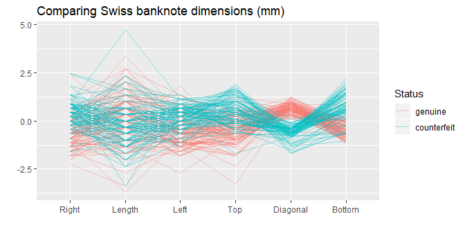

parallel coordinate
================


## contents

[introduction](#introduction)  
[prerequisites](#prerequisites)  
[explore](#explore)  
[exercises](#exercises)  
[references](#references)

## introduction

“With a scatterplot, the x and y axes are perpendicular to one another.
In a parallel coordinate plot all axes are parallel to one another. Each
variable has its own individual vertical axis (or alternatively all the
axes are horizontal) and the axis is usually scaled from the minimum to
the maximum case values for the variable, so that the full range of each
axis is used. The values of each case \[each observation\] are joined by
lines, so that a polygonal line across all axes defines a case \[an
observation\].” (Unwin, [2015](#ref-Unwin:2015:Ch.6))

Data characteristics

  - Any number of quantitative variables  
  - One or more categorical variables (optional)  
  - A key variable if data are not coordinatized

Graph characteristics

  - Axes are parallel
  - One axis per variable, usually scaled from the minimum to the
    maximum
  - One line per observation, running from point to point on the
    parallel axes

[D6 Multivariate](cm301-report-display-reqts.md#D6-multivariate) data
and graph requirements

<br> <a href="#top">▲ top of page</a>

## prerequisites

Project setup

  - Start every work session by launching the RStudio Project file for
    the course, e.g., `portfolio.Rproj`  
  - Ensure your [project directory
    structure](cm501-proj-m-manage-files.md#planning-the-directory-structure)
    satisfies the course requirements

Ensure you have installed the following packages. See [install
packages](cm902-software-studio.md#install-packages) for instructions if
needed.

  - tidyverse  
  - graphclassmate
  - GGally
  - gclus
  - scagnositcs

Scripts to initialize

``` 
explore/     0801-parallel-coord-explore.R  
```

And start the file with a minimal header

``` r
# your name
# date

# load packages
library("tidyverse")
library("graphclassmate")
library("GGally")
```

Duplicate the lines of code in the session one chunk at a time. Save,
Source, and compare your results to the results shown.

<http://ggobi.github.io/ggally/rd.html#ggparcoord>

<br> <a href="#top">▲ top of page</a>

## explore

Open the explore script you initialized earlier. Load the package that
has the data.

``` r
library("gclus")
data(bank, package = "gclus")

bank <- as_tibble(bank) %>% 
  glimpse()
#> Observations: 200
#> Variables: 7
#> $ Status   <int> 0, 0, 0, 0, 0, 0, 0, 0, 0, 0, 0, 0, 0, 0, 0, 0, 0, 0,...
#> $ Length   <dbl> 214.8, 214.6, 214.8, 214.8, 215.0, 215.7, 215.5, 214....
#> $ Left     <dbl> 131.0, 129.7, 129.7, 129.7, 129.6, 130.8, 129.5, 129....
#> $ Right    <dbl> 131.1, 129.7, 129.7, 129.6, 129.7, 130.5, 129.7, 129....
#> $ Bottom   <dbl> 9.0, 8.1, 8.7, 7.5, 10.4, 9.0, 7.9, 7.2, 8.2, 9.2, 7....
#> $ Top      <dbl> 9.7, 9.5, 9.6, 10.4, 7.7, 10.1, 9.6, 10.7, 11.0, 10.0...
#> $ Diagonal <dbl> 141.0, 141.7, 142.2, 142.0, 141.8, 141.4, 141.6, 141....
```

Baisx parallel coordinate plot.

``` r
ggparcoord(bank, columns = 2:7)
```


``` r
my_color <- c(rcb("dark_BG"),  rcb("dark_Br"))
my_fill  <- c(rcb("light_BG"), rcb("light_Br"))
my_title <- "Comparing Swiss banknote dimensions (mm)"
```

``` r
bank <- bank %>%
  mutate(Status = factor(Status, labels = c("genuine", "counterfeit"))) %>% 
  drop_na() %>% 
  glimpse()
#> Observations: 200
#> Variables: 7
#> $ Status   <fct> genuine, genuine, genuine, genuine, genuine, genuine,...
#> $ Length   <dbl> 214.8, 214.6, 214.8, 214.8, 215.0, 215.7, 215.5, 214....
#> $ Left     <dbl> 131.0, 129.7, 129.7, 129.7, 129.6, 130.8, 129.5, 129....
#> $ Right    <dbl> 131.1, 129.7, 129.7, 129.6, 129.7, 130.5, 129.7, 129....
#> $ Bottom   <dbl> 9.0, 8.1, 8.7, 7.5, 10.4, 9.0, 7.9, 7.2, 8.2, 9.2, 7....
#> $ Top      <dbl> 9.7, 9.5, 9.6, 10.4, 7.7, 10.1, 9.6, 10.7, 11.0, 10.0...
#> $ Diagonal <dbl> 141.0, 141.7, 142.2, 142.0, 141.8, 141.4, 141.6, 141....
```

``` r
library("scagnostics")
ggparcoord(data = bank, columns = 2:7, 
           groupColumn  = "Status", 
           scale        = "robust", 
           # scaleSummary = "median", # with scale == “center”
           # centerObsID  = 1,      # with scale == “centerObs”
           missing      = "exclude", 
           order        = "Skinny", # scagnostic measures 
           alphaLines   = 0.4, 
           mapping      = NULL, 
           title        = my_title) +
  labs(x = "", y = "")
```



<br> <a href="#top">▲ top of page</a>

## exercises

## references

<div id="refs">

<div id="ref-Unwin:2015:Ch.6">

Unwin A (2015) Investigating multivariate continuous data. *Graphical
Data Analysis with R*. CRC Press, Taylor & Francis, Boca Raton, FL,
99–130 <http://www.gradaanwr.net/>

</div>

<div id="ref-Wickham+Grolemund:2017">

Wickham H and Grolemund G (2017) *R for Data Science.* O’Reilly Media,
Inc., Sebastopol, CA <https://r4ds.had.co.nz/>

</div>

</div>

***
<a href="#top">&#9650; top of page</a>    
[&#9665; calendar](../README.md#calendar)    
[&#9665; index](../README.md#index)
