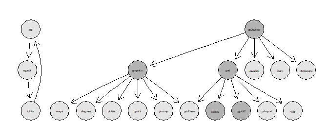

learn a display
================

## contents

[introduction](#introduction)  
[prerequisites](#prerequisites)  
\[\]  
\[\]  
\[\]  
\[\]  
\[\]  
[references](#references)

## introduction

We’ve arrived at the final graphical challenge: to learn on your own to
construct a graph type that we haven’t covered in detail. You have the
basic skills; demonstrate that you can apply those skills to learn
something new.

You are required to select at least one of the following graph types and
create a display for your portfolio. Data and graph characteristics are
described on the portfolio data requirements page.

  - [cycle plot](cm301-report-display-reqts.md#cycle-plot)
  - [multivariate bar](cm301-report-display-reqts.md#multivariate-bar)
  - [financial (OHLC)
    plot](cm301-report-display-reqts.md#financial-\(OHLC\)-plot)
  - [diverging stacked
    bar](cm301-report-display-reqts.md#diverging-stacked-bar)
  - [micromap](cm301-report-display-reqts.md#micromap)
  - [proportional symbol
    map](cm301-report-display-reqts.md#proportional-symbol-map)
  - [dot density map](cm301-report-display-reqts.md#dot-density-map)

Unlike our earlier display types, this page is not a tutorial because
you must learn how to create the data graphix on your own. Instead, we
show some representative graphs and some references to get you started.

Some of the displays might require you to learn a graphics system syntax
other than ggplot2. I would expect that if you have to learn a new
graphics syntax it would be in the top two layers—lattice, maps,
graphics, or grid.

    #> NULL

 R Guide
Index  
UO Data Science  
Fall 2017  
<https://uodatascience.github.io/R_Guide/plotting.html#r-graphics-structure>

  <a href="#top">▲ top of page</a>

## prerequisites

  <a href="#top">▲ top of page</a>

## cycle plot

  <a href="#top">▲ top of page</a>

## multivariate bar graph

  <a href="#top">▲ top of page</a>

## Financial (OHLC) plot

  <a href="#top">▲ top of page</a>

## Diverging stacked bar

  <a href="#top">▲ top of page</a>

## Linked micromaps

  <a href="#top">▲ top of page</a>

## Proportional symbol map

  <a href="#top">▲ top of page</a>

## dot density map

  <a href="#top">▲ top of page</a>

## references

Wickham H and Grolemund G (2017) *R for Data Science.* O’Reilly Media,
Inc., Sebastopol, CA <https://r4ds.had.co.nz/>

***
<a href="#top">&#9650; top of page</a>    
[&#9665; calendar](../README.md#calendar)    
[&#9665; index](../README.md#index)
