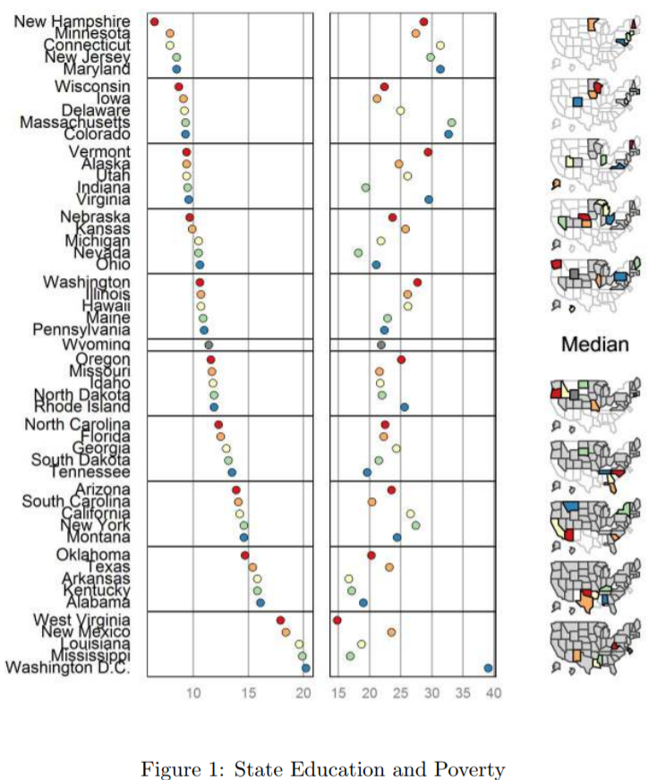

learn a display
================

## contents

[introduction](#introduction)  
[cycle plot](#cycle-plot)  
[multivariate bar graph](#multivariate-bar-graph)  
[financial (OHLC) plot](#financial-ohlc-plot)  
[diverging stacked bar](#diverging-stacked-bar)  
[micromaps](#micromaps)  
[proportional symbol map](#proportional-symbol-map)  
[dot density map](#dot-density-map)  
[references](#references)

## introduction

We’ve arrived at the final graphical challenge: to learn on your own to
construct a graph type that we haven’t covered in detail. You may find
that you have to learn the syntax of a graphics system other than
ggplot2. The structure of the R graphics system is illustrated in the
figure.

 <small>  
<i>Figure 1.14 The structure of the R graphics system</i> by Paul
Murrell ([2011](#ref-Murrell:2011))   </small>

Working at a lower level—grid, graphics, or grDevices—can be quite a
challenge. I would expect that if you have to learn a new graphics
syntax it would be in the top layers, e.g., lattice, vcd, maps, etc.

You are required to select at least one of the following graph types and
create a display for your portfolio. Unlike our earlier display types,
this page is not a tutorial because you must learn how to create the
data graphic on your own. Instead, we show some representative graphs
and some references to get you started.

  <a href="#top">▲ top of page</a>

## cycle plot

Resources

  - [Data requirements](cm301-report-display-reqts.md#cycle-plot)  
  - [monthplot()](https://www.rdocumentation.org/packages/stats/versions/3.6.0/topics/monthplot)
    in base R

<https://stackoverflow.com/questions/5826703/how-to-replicate-a-monthly-cycle-chart-in-r>

stl, monthplot, seasonplot

<https://www.statmethods.net/advstats/timeseries.html>

convert time series to tidt DF (tibbletime)
<https://business-science.github.io/tibbletime/index.html>

  Example

  Example

  Example

  References

  <a href="#top">▲ top of page</a>

## multivariate bar graph

Resources

  - [Data requirements](cm301-report-display-reqts.md#multivariate-bar)

  Example

References

  <a href="#top">▲ top of page</a>

## financial (OHLC) plot

A financial plot, or OHLC (open-high-low-close) plot, represents a time
series of market behavior.

The categorical variable is the date.

The quantitative variables are the opening value, high value, low value,
and closing value of a financial metric, e.g., the Dow Jones Industrial
Average (DJIA).

Resources

  - [Data
    requirements](cm301-report-display-reqts.md#financial-\(OHLC\)-plot)

  Example

  Example

  <a href="#top">▲ top of page</a>

## diverging stacked bar

Diverging stacked bar charts are the primary graphical display technique
for reporting survey data. Respondents are typically asked to choose one
response from a discrete number of options such as Strongly Disagree,
Disagree, No Opinion, Agree, Strongly Agree.

Resources

  - [Data
    requirements](cm301-report-display-reqts.md#diverging-stacked-bar)  
  - [HH package](https://cran.r-project.org/web/packages/HH/index.html)
    `likert()` function  
  - Heiberger and Robbins ([2014](#ref-Heiberger+Robbins:2014))

  Example

Example

  Example

  <a href="#top">▲ top of page</a>

## micromaps

Resources

  - [Data requirements](cm301-report-display-reqts.md#micromap)

  Example

  Example

  <a href="#top">▲ top of page</a>

## proportional symbol map

Resources

  - [Data
    requirements](cm301-report-display-reqts.md#proportional-symbol-map)

  Example

  Example

  Example

  <a href="#top">▲ top of page</a>

## dot density map

Resources

  - [Data requirements](cm301-report-display-reqts.md#dot-density-map)

  Example

  Example

  <a href="#top">▲ top of page</a>

## references

Heiberger RM and Robbins NB (2014) Design of diverging stacked bar
charts for Likert scales and other applications. *Journal of Statistical
Software* **57**(5) <http://tinyurl.com/y5yg2pze>

Murrell P (2011) *R Graphics.*, 2nd edn. CRC Press, Boca Raton, FL
<https://www.stat.auckland.ac.nz/~paul/RG2e/>

Wickham H and Grolemund G (2017) *R for Data Science.* O’Reilly Media,
Inc., Sebastopol, CA <https://r4ds.had.co.nz/>

***
<a href="#top">&#9650; top of page</a>    
[&#9665; calendar](../README.md#calendar)    
[&#9665; index](../README.md#index)
