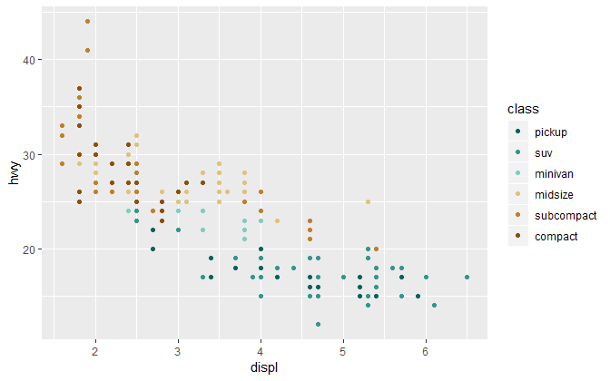
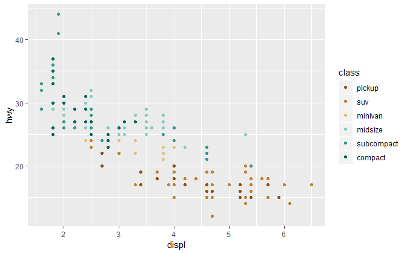
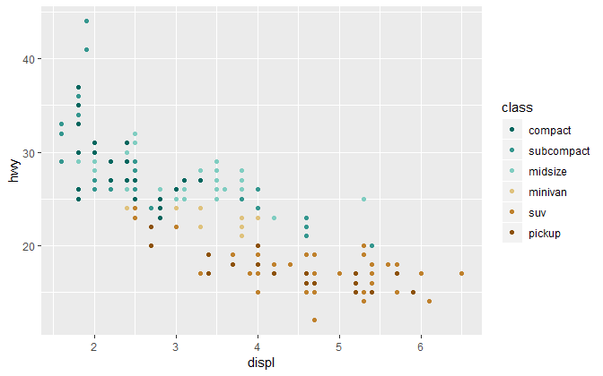
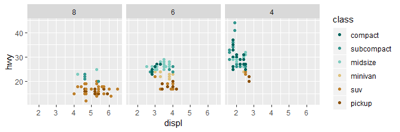
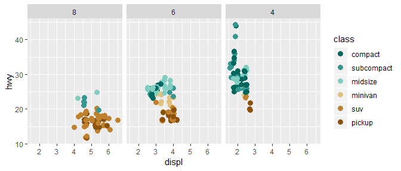

graph edit and annotate
================

<!-- edit symbols and lines  -->

<!-- - color  -->

<!-- - size  -->

<!-- - shape  -->

<!-- - replace a data marker with text  -->

<!-- adding extra text, points, lines  -->

<!-- - vline, hline, abline  -->

<!-- - regression lines  -->

<!-- - selected labels  -->

<!-- - selected panel then annotate   -->

<!-- - similar annotations all panels  -->

<!-- - math in annotation  -->

<!-- theme -->

<!-- - edit font and font size  -->

<!-- - edit line size, type, and color  -->

<!-- - change panel spacing  -->

<!-- - other themes  -->

## contents

[introduction](#introduction)  
[symbol color](#symbol-color)  
[symbol size and shape](#symbol-size-and-shape)  
\[\]  
\[\]  
\[\]  
\[\]  
\[\]  
[references](#references)

## introduction

Here, we illustrate techniques for editing graphical elements and
annotating graph panels. Some items were seen in previous tutorials. The
list is not exhaustive, but does cover the most frequently requested
editing and annotating tasks.

## symbol color

Color, size, and shape are the characteristics you are most likely to
want to edit.

``` r
library("tidyverse")
library("seplyr")
```

We’ll use the `mpg` dataset from ggplot2

``` r
ggplot2::mpg
#> # A tibble: 234 x 11
#>    manufacturer model displ  year   cyl trans drv     cty   hwy fl    class
#>    <chr>        <chr> <dbl> <int> <int> <chr> <chr> <int> <int> <chr> <chr>
#>  1 audi         a4      1.8  1999     4 auto~ f        18    29 p     comp~
#>  2 audi         a4      1.8  1999     4 manu~ f        21    29 p     comp~
#>  3 audi         a4      2    2008     4 manu~ f        20    31 p     comp~
#>  4 audi         a4      2    2008     4 auto~ f        21    30 p     comp~
#>  5 audi         a4      2.8  1999     6 auto~ f        16    26 p     comp~
#>  6 audi         a4      2.8  1999     6 manu~ f        18    26 p     comp~
#>  7 audi         a4      3.1  2008     6 auto~ f        18    27 p     comp~
#>  8 audi         a4 q~   1.8  1999     4 manu~ 4        18    26 p     comp~
#>  9 audi         a4 q~   1.8  1999     4 auto~ 4        16    25 p     comp~
#> 10 audi         a4 q~   2    2008     4 manu~ 4        20    28 p     comp~
#> # ... with 224 more rows
```

Simple graph

``` r
ggplot(data = mpg, mapping = aes(x = displ, y = hwy)) + 
  geom_point()
```


If we want all the dots the same color, we change color in the geom.

``` r
ggplot(data = mpg, mapping = aes(x = displ, y = hwy)) + 
  geom_point(color = rcb("mid_BG"))
```


If we use color to distinguish between cars with different class, we
assign the color in the `aes()`.

``` r
# how many in each class?
mpg %>% count(class)
#> # A tibble: 7 x 2
#>   class          n
#>   <chr>      <int>
#> 1 2seater        5
#> 2 compact       47
#> 3 midsize       41
#> 4 minivan       11
#> 5 pickup        33
#> 6 subcompact    35
#> 7 suv           62

# let's omit the 2seater
mpg <- mpg %>% 
    filter(class != "2seater")

# graph
ggplot(data = mpg, mapping = aes(x = displ, y = hwy, color = class)) + 
  geom_point()
```


To change these colors, we add

``` r
my_color <- c(rcb("dark_BG"), rcb("mid_BG"), rcb("light_BG"), rcb("light_Br"), rcb("mid_Br"), rcb("dark_Br"))

ggplot(data = mpg, mapping = aes(x = displ, y = hwy, color = class)) + 
  geom_point() +
    scale_color_manual(values = my_color)
```


The classes should be ordered, so group and summarize by mileage and
class, then convert class to a factor ordered by mileage.

``` r
grouping_variables <- c("class")
df <- mpg %>% 
    select(hwy, class) %>% 
    seplyr::group_summarise(., grouping_variables, 
                                                    med_hwy = median(hwy)) %>% 
    arrange(med_hwy)

df
#> # A tibble: 6 x 2
#>   class      med_hwy
#>   <chr>        <dbl>
#> 1 pickup        17  
#> 2 suv           17.5
#> 3 minivan       23  
#> 4 subcompact    26  
#> 5 compact       27  
#> 6 midsize       27

mpg <- left_join(mpg, df, by = "class") 

mpg  <-  mpg %>% 
    mutate(class = fct_reorder(class, med_hwy))

ggplot(data = mpg, mapping = aes(x = displ, y = hwy, color = class)) + 
  geom_point() +
    scale_color_manual(values = my_color)
```


I want the colors assigned in the reverse order,

``` r
my_color <- rev(my_color)

ggplot(data = mpg, mapping = aes(x = displ, y = hwy, color = class)) + 
  geom_point() +
    scale_color_manual(values = my_color)
```



And I want the order of the legend reversed

``` r
ggplot(data = mpg, mapping = aes(x = displ, y = hwy, color = class)) + 
  geom_point() +
    scale_color_manual(values = my_color) +
    guides(color = guide_legend(reverse = TRUE))
```



If we facet the graph on the same variable, the assigned colors remain

``` r
ggplot(data = mpg, mapping = aes(x = displ, y = hwy, color = class)) + 
  geom_point() +
    scale_color_manual(values = my_color) +
    guides(color = guide_legend(reverse = TRUE)) +
    facet_wrap(vars(class), as.table = FALSE)
```



If we facet on a different varable, the assigned colors are ture.

``` r
mpg <- mpg %>% 
    filter(cyl != 5) %>% 
    mutate(cyl = fct_reorder(factor(cyl), hwy)) 

p <- ggplot(data = mpg, mapping = aes(x = displ, y = hwy, color = class)) + 
  geom_point() +
    scale_color_manual(values = my_color) +
    guides(color = guide_legend(reverse = TRUE)) +
    facet_wrap(vars(cyl), as.table = FALSE) 
p
```


## symbol size and shape

To uniformly change the size of all data markers, use size in the geom.

``` r
p <- p +
    geom_point(size = 3)
p
```



If size is assigned to a variable, we assign it in the aes()

``` r
ggplot(data = mpg, mapping = aes(x = displ, y = hwy, color = class, size = cyl)) + 
  geom_point() +
    scale_color_manual(values = my_color) +
    guides(color = guide_legend(reverse = TRUE)) +
    facet_wrap(vars(cyl), as.table = FALSE) 
```



## lines

<br> <a href="#top">▲ top of page</a>

## references

<div id="refs">

<div id="ref-Wickham+Grolemund:2017">

Wickham H and Grolemund G (2017) *R for Data Science.* O’Reilly Media,
Inc., Sebastopol, CA <https://r4ds.had.co.nz/>

</div>

</div>

***
<a href="#top">&#9650; top of page</a>    
[&#9665; calendar](../README.md#calendar)    
[&#9665; index](../README.md#index)
