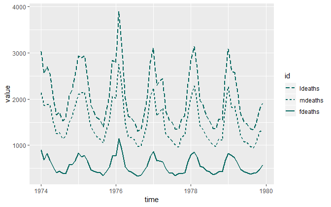

reference lines
================

 <small> <br>
<i>Lines</i> by jurek.d is licensed under
<a href="https://creativecommons.org/licenses/by-nc/2.0/legalcodee">CC
BY-NC 2.0</a> <br> </small>

## contents

[introduction](#introduction)  
[vertical lines](#vertical-lines)  
[horizontal lines](#horizontal-lines)  
[sloped lines](#sloped-lines)  
[exercises](#exercises)  
[references](#references)

## introduction

Here we add graphical primitives suach as points, lines, or text, to
specific locations in a graph or facet.

``` r
library("tidyverse")
library("seplyr")
library("graphclassmate")
```

## vertical lines

The `geom_vline()` draws a vertical line at a specified `xintercept`.

Start with a basic scatterplot.

``` r
# diamonds dataset from ggplot2
df <- diamonds %>% 
        filter(carat <= 1 & price <= 4000) %>% 
        drop_na()

ggplot(data = df, aes(x = carat, y = price)) +
        geom_jitter(alpha = 0.3)
```


<br> `xintercept` is arbitrary

``` r
ggplot(data = df, aes(x = carat, y = price)) +
        geom_jitter(alpha = 0.3) + 
        geom_vline(xintercept = 0.69,  
                color = rcb("dark_PR"), 
                size  = 1)
```


<br> `xintercept` depends on the data. Note that the `data` and
`mapping` arguments appear in `geom_vline()`

``` r
ggplot(data = df, aes(x = carat, y = price)) +
        geom_jitter(alpha = 0.3) + 
        geom_vline(data = df, 
                mapping = aes(xintercept = median(carat)), 
                color = rcb("dark_PR"), 
                size  = 1)
```


<br> `xintercept` is the same in every facet if we use the same
`geom_vline()` arguments as above

``` r
ggplot(data = df, aes(x = carat, y = price)) +
        geom_jitter(alpha = 0.3) + 
        geom_vline(data = df, 
                mapping = aes(xintercept = median(carat)), 
                color = rcb("dark_PR"), 
                size  = 1) +
        facet_wrap(vars(cut), as.table = FALSE, ncol = 1)
```


<br> To get the vertical line to represent the median in every panel, we
construct a new variable, `med_carat`, grouped by `cut` because that’s
what we are faceting on.

``` r
grouping_variables <- c("cut")
find_medians <- df %>% 
        group_summarize(grouping_variables, 
                med_carat = median(carat), 
                med_price = median(price)) %>% 
        glimpse()
#> Observations: 5
#> Variables: 3
#> $ cut       <ord> Fair, Good, Very Good, Premium, Ideal
#> $ med_carat <dbl> 0.71, 0.51, 0.50, 0.42, 0.41
#> $ med_price <dbl> 2117, 1351, 1213, 1087, 1075

df <- left_join(df, find_medians, by = "cut")
```

``` r
ggplot(data = df, aes(x = carat, y = price)) +
        geom_jitter(alpha = 0.3) + 
        geom_vline(data = df, 
                mapping = aes(xintercept = med_carat), 
                color = rcb("dark_PR"), 
                size  = 1) +
        facet_wrap(vars(cut), as.table = FALSE, ncol = 1)
```


<br> <a href="#top">▲ top of page</a>

## horizontal lines

The `geom_hline()` draws a horiontal line at a specified `yintercept`.

<br> `yintercept` is arbitrary

``` r
ggplot(data = df, aes(x = carat, y = price)) +
        geom_jitter(alpha = 0.3) + 
        geom_hline(yintercept = 3000,  
                color = rcb("dark_PR"), 
                size  = 1)
```


<br> `xintercept` depends on the data. Note that the `data` and
`mapping` arguments appear in `geom_vline()`

``` r
ggplot(data = df, aes(x = carat, y = price)) +
        geom_jitter(alpha = 0.3) + 
        geom_hline(data = df, 
                mapping = aes(yintercept = median(price)), 
                color = rcb("dark_PR"), 
                size  = 1)
```


<br> `yintercept` is the same in every facet if we use the same
`geom_hline()` arguments as above

``` r
ggplot(data = df, aes(x = carat, y = price)) +
        geom_jitter(alpha = 0.3) + 
        geom_hline(data = df, 
                mapping = aes(yintercept = median(price)), 
                color = rcb("dark_PR"), 
                size  = 1) +
        facet_wrap(vars(cut), as.table = FALSE, ncol = 5)
```


<br> To get the horizontal line to represent the median in every panel,
we use the `med_price` variable we constructed earlier.

``` r
ggplot(data = df, aes(x = carat, y = price)) +
        geom_jitter(alpha = 0.3) + 
        geom_hline(data = df, 
                mapping = aes(yintercept = med_price), 
                color = rcb("dark_PR"), 
                size  = 1) +
        facet_wrap(vars(cut), as.table = FALSE, ncol = 5)
```



<br> <a href="#top">▲ top of page</a>

## sloped lines

Lines of any slope are constructed using `geom_abline()` which requires
two arguments: `slope` and `intercept`.

``` r
grouping_variables <- c("race", "path", "sex")
df <- nontraditional  %>% 
        seplyr::group_summarize(grouping_variables, 
                enrolled = mean(enrolled))
df
#> # A tibble: 16 x 4
#>    race     path           sex    enrolled
#>    <chr>    <chr>          <chr>     <dbl>
#>  1 Asian    Nontraditional Female     4.06
#>  2 Asian    Nontraditional Male       4.22
#>  3 Asian    Traditional    Female     4.14
#>  4 Asian    Traditional    Male       4.27
#>  5 Black    Nontraditional Female     4.14
#>  6 Black    Nontraditional Male       4.33
#>  7 Black    Traditional    Female     4.08
#>  8 Black    Traditional    Male       4.28
#>  9 Hispanic Nontraditional Female     3.95
#> 10 Hispanic Nontraditional Male       4.13
#> 11 Hispanic Traditional    Female     4.04
#> 12 Hispanic Traditional    Male       4.26
#> 13 White    Nontraditional Female     3.84
#> 14 White    Nontraditional Male       4.14
#> 15 White    Traditional    Female     3.93
#> 16 White    Traditional    Male       4.19
```

I’d like to plot compare traditional students to nontraditional students
by having one on each axis of a scatterplot, so I need to reshape the
data frame to create two new variables `trad` and `nontrad`.

``` r
df <- cdata::pivot_to_rowrecs(df,
        columnToTakeKeysFrom   = "path",
        columnToTakeValuesFrom = "enrolled",
        rowKeyColumns          = c("race", "sex")) 

 knitr::kable(df)
```

| race     | sex    | Nontraditional | Traditional |
| :------- | :----- | -------------: | ----------: |
| Asian    | Female |       4.057262 |    4.143750 |
| Asian    | Male   |       4.215313 |    4.272284 |
| Black    | Female |       4.136124 |    4.084110 |
| Black    | Male   |       4.330957 |    4.282462 |
| Hispanic | Female |       3.948345 |    4.042273 |
| Hispanic | Male   |       4.125917 |    4.257056 |
| White    | Female |       3.839782 |    3.925950 |
| White    | Male   |       4.138989 |    4.193669 |

The point was to plot Nontraditional students on one axis and
Traditional students on the other.

``` r
ggplot(data = df, mapping = aes(x = Traditional, y = Nontraditional)) +
        geom_point()
```


To which I can add a 45-degree line using `geom_abline()`. Points below
the line indiacte groups for which Traditional students take more years
to graduate.

``` r
ggplot(data = df, mapping = aes(x = Traditional, y = Nontraditional)) +
        geom_abline(slope = 1, intercept = 0, color = rcb("light_Gray")) +
        geom_point()
```


Add `coord_fixed()` to ensure the line is at 45 degrees.

``` r
p <- ggplot(data = df, mapping = aes(x = Traditional, y = Nontraditional)) +
        geom_abline(slope = 1, intercept = 0, color = rcb("light_Gray")) +
        geom_point() +
        coord_fixed(ratio = 1)
p
```


The graph tells us that for most groups by race and sex, traditional
students on average take longer to graduate than nontraditional
students.

Try a facet,

``` r
ggplot(data = df, mapping = aes(x = Traditional, y = Nontraditional)) +
        geom_abline(slope = 1, intercept = 0, color = rcb("light_Gray")) +
        geom_point() +
        coord_fixed(ratio = 1) +
        facet_wrap(vars(sex), as.table = FALSE, ncol = 2)
```


We might add horizontal and vertical lines reference lines at 4 years.

``` r
ggplot(data = df, mapping = aes(x = Traditional, y = Nontraditional)) +
          geom_hline(yintercept = 4, color = rcb("light_Gray")) +
            geom_vline(xintercept = 4, color = rcb("light_Gray")) +
        geom_abline(slope = 1, intercept = 0, color = rcb("light_Gray")) +
        geom_point() +
        coord_fixed(ratio = 1) +
        facet_wrap(vars(sex), as.table = FALSE, ncol = 2)
```


Only women are graduating on average in under 4 years. Of course, these
are means.

## exercises

**1. nontraditional**

Edit this graph (developed earlier) to that the data markers are
replaced with a letter to represent race and that sex is encoded using
color.


## references

<div id="refs">

<div id="ref-Wickham+Grolemund:2017">

Wickham H and Grolemund G (2017) *R for Data Science.* O’Reilly Media,
Inc., Sebastopol, CA <https://r4ds.had.co.nz/>

</div>

</div>

***
<a href="#top">&#9650; top of page</a>    
[&#9665; calendar](../README.md#calendar)    
[&#9665; index](../README.md#index)
