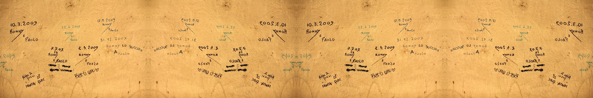

\`— title:next output: github\_document link-citations: yes nocite: |
Wickham and Grolemund (2017) —

 <small>  
<i>Annotations</i> by Nicolas Nova is licensed under
<a href="https://creativecommons.org/licenses/by-nc/2.0/legalcodee">CC
BY-NC 2.0</a>   </small>

<!-- adding extra text, points -->

<!-- - selected labels  -->

<!-- - selected panel then annotate   -->

<!-- - similar annotations all panels  -->

<!-- - math in annotation  -->

<!-- theme -->

<!-- - edit font and font size  -->

<!-- - edit line size, type, and color  -->

<!-- - change panel spacing  -->

<!-- - other themes  -->

<!-- Data sets in package ‘graphclassmate’: -->

<!-- county_income      Median income by US county in 2016 -->

<!-- infant_mortality   Infant mortality in the US, 2007-2016 -->

<!-- metro_pop          Population in the NY metro area -->

<!-- museum_exhibits    Visit duration at museum exhibitions -->

<!-- nontraditional     Nontraditional and traditional undergraduates -->

<!-- ucb_admit          Student admissions at UC Berkeley -->

## contents

[introduction](#introduction)  
\[\]  
\[\]  
\[\]  
\[\]  
[references](#references)

## introduction

## references

Wickham H and Grolemund G (2017) *R for Data Science.* O’Reilly Media,
Inc., Sebastopol, CA <https://r4ds.had.co.nz/>

***
<a href="#top">&#9650; top of page</a>    
[&#9665; calendar](../README.md#calendar)    
[&#9665; index](../README.md#index)
