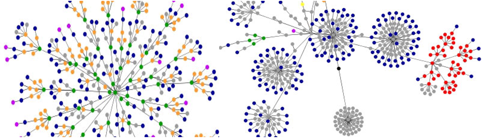

portfolio data requirements
================

<small>   <i>dennisyang.com DOM graph</i> by Dennis Yang is licensed
under <a href="https://creativecommons.org/licenses/by/2.0/">CC BY
2.0</a>    </small>

See a sample of a portfolio skeleton at
<https://github.com/graphdr/portfolio-sample>.  
The table summarizes the basic data structure for all portfolio
graphs.  
More detailed requirements are provided
below.

<!-- Quantitative variables are typically continuous. If you encounter a quantitative variable (other than time) that is discrete rather than continuous, please consult with me on its suitability for your graph.   -->

| display                                                     | type                                                                                               | quantitative  | categorical   |
| :---------------------------------------------------------- | :------------------------------------------------------------------------------------------------- | :------------ | :------------ |
| [D1 distributions](#d1-distributions)                       | [strip plot](cm202-graph-strip-plot.md#strip-plot) or [box plot](cm203-graph-boxplot.md#box-plots) | one           | one or two    |
| [D2 multiway](#d2-multiway)                                 | [multiway](cm204-graph-multiway.md#multiway-dot-plot)                                              | one           | two           |
| [D3 correlations](#d3-correlations)                         | [scatterplot](cm205-graph-scatterplot.md#scatterplot)                                              | two           | one or two    |
| [D4 injuries or fatalities](#d4-injuries-or-fatalities)     | dot plot                                                                                           | one           | one or more   |
|                                                             | line graph or scatterplot                                                                          | two           | optional      |
| [D5 redesign a graphical lie](#d5-redesign-a-graphical-lie) | dot plot                                                                                           | one           | optional      |
|                                                             | line graph or scatterplot                                                                          | two           | optional      |
| [D6 multivariate](#d6-multivariate)                         | conditioning plot                                                                                  | three or four |               |
|                                                             | scatterplot matrix or parallel coordinate                                                          | four or more  |               |
| [D7 self-taught](#d7-self-taught)                           | [cycle plot](#cycle-plot)                                                                          | one           | two           |
|                                                             | [mosaic plot](#mosaic-plot)                                                                        | one           | three or more |
|                                                             | [financial (OHLC) plot](#financial-ohlc-plot)                                                      | four          | one           |
|                                                             | [diverging stacked bar](#diverging-stacked-bar)                                                    | one           | one           |
|                                                             | [linked micromaps](#linked-micromaps)                                                              | one           |               |
|                                                             | [proportional symbol map](#proportional-symbol-map)                                                |               |               |
|                                                             | [dot density map](#dot-density-map)                                                                |               |               |

## D1 distributions

Univariate data are measurements of a single quantitative variable. The
data can be separated into groups by a categorical variable, creating
one distribution for each level of the category for comparison.

We will use two prospective graph designs for comparing distributions.
Include only one of these graph types in your portfolio. Select the
design that best conveys the stories in your data.

Data requirements

  - Minimum 200 observations of one quantitative variable  
  - One or two categorical variables  
  - Time is excluded as a variable

Categorical variables

  - If one category is used, it must have at least three levels for a
    minimum of three comparisons.  
  - If two categories are used, they must have at least two levels each
    for a minimum of four comparisons.

Tutorials and samples

  - [Strip plot tutorial](cm202-graph-strip-plot.md#strip-plot)
  - [Sample strip plot: Speed
    skiing](../figures/0302-strip-plot-speedski.png)
  - [Box plot tutorial](cm203-graph-boxplot.md#box-plots)
  - [Sample box plot: Nontraditional students graduation
    rates](../figures/0303-boxplot-nontrad.png)

  <a href="#top">▲ top of page</a>

## D2 multiway

The distinguishing characteristic of multiway data is that there is a
quantitative value associated with every combination of levels of two
independent categorical variables.

  - 2019: For those students who discussed it with me in lab, we will
    accept time as an ordinal categorical variable in a multiway graph  
  - 2020: Time as a categorical variable: Though time can be considered
    an ordinal categorical variable, time series data are more commonly
    displayed using line graphs or spark charts where the dots can be
    connected. We would not expect to connect the dots in a multiway
    graph, thus we avoid using date and time as one of the two
    independent categories.

Graph both the original multiway and its dual (swapping rows and
panels). Include only one of these graphs in your portfolio. Select the
design that best conveys the stories in your data.

Data requirements

  - One quantitative variable with a minimum of 24 observations
  - Two independent categorical variables with minimum numbers of levels
    as follows
      - 3 levels in category 1 and at least 8 levels in category 2
      - 4 levels in category 1 and at least 6 levels in category 2  
      - 5 levels in category 1 and at least 5 levels in category 2

Tutorials and samples

  - [Multiway tutorial](cm204-graph-multiway.md#multiway-dot-plot)
  - [Sample multiway: NY population, panels by
    county](../figures/0402-multiway-metropop-01.png)
  - [Sample multiway: NY population, panels by
    race/ethnicity](../figures/0402-multiway-metropop-02.png)

  <a href="#top">▲ top of page</a>

## D3 correlations

A two-dimensional scatterplot reveals the strength of the relationship
between two quantitative variables. When you condition on a categorical
variable try two approaches and select the design that communicates most
effectively.

  - map the levels to data marker color or shape all in one panel
  - use the categorical variable as the facet argument with one panel
    for each level

Data requirements

  - Minimum 100 observations  
  - Two quantitative variables  
  - One or two categorical variables
  - Time is excluded as a variable

Categorical variables

  - The first category must have at least 5 levels.  
  - If a second category is used, it must have at least two levels.

Tutorials and samples

  - [Scatterplot tutorial](cm205-graph-scatterplot.md#scatterplot)
  - [Sample scatterplot: 2012 Summer Olympic athlete height and
    weight](../figures/0503-scatterplot-oly12.png)

  <a href="#top">▲ top of page</a>

## D4 injuries or fatalities

The data must convey information about human injury or fatality similar
to the data in *Cruel Pies* (Dragga and Voss,
[2001](#ref-Dragga+Voss:2001)). Consult with me on your data
selection—the graph type depends on the data. Finding a “cruel pie” in
a publication and redesigning it is an acceptable submission.

If you redesign a published graph, include the original in your
portfolio and discuss its shortcomings in your critique. The redesigned
graphs are often dot plots or line graphs (especially for time series).

Data requirements

  - Minimum 10 observations  
  - One quantitative variable conveying information about human injury
    or fatality  
  - One or two categorical variables, one of which can be time (time
    series)  
  - If you display a time series, consider whether or not the data
    should be normalized. For example, graphing injuries per capita may
    be more truthful than graphing the raw number of injuries.

Dot plot example  
Line graph example

  <a href="#top">▲ top of page</a>

## D5 redesign a graphical lie

Consult with me on your data selection—the graph type depends on the
data. The two graph types shown are the most commonly encountered.

Time series example  
Constant dollars example

  <a href="#top">▲ top of page</a>

## D6 multivariate

We use the term *multivariate* for data comprising 3 or more
quantitative variables per observation.

We use three graph designs for exploring multivariate data.

  - conditioning plot
  - scatterplot matrix
  - parallel coordinate plot

Include only one of these graph types in your portfolio. Select the
design that best conveys the stories in your data.

Data requirements

  - Minimum 20 observations  
  - Three or more quantitative variables  
  - Time is excluded as a variable  
  - No categorical variables

Use a conditioning plot (coplot) for three or four variables.

For four or more variables, use a scatterplot matrix or a parallel
coordinate plot.

Conditioning plot example  
Scatterplot matrix example  
Parallel coordinate example

  <a href="#top">▲ top of page</a>

## D7 self-taught

This is a graph type you learn to construct on your own. Select one only
from the list and include it in the portfolio.

  - [cycle plot](#cycle-plot)
  - [mosaic plot](#mosaic-plot)  
  - [financial (OHLC) plot](#financial-ohlc-plot)
  - [diverging stacked bar](#diverging-stacked-bar)  
  - [linked micromaps](#linked-micromaps)  
  - [proportional symbol map](#proportional-symbol-map)  
  - [dot density map](#dot-density-map)

  <a href="#top">▲ top of
page</a>

<!-- ## q-q plot -->

<!-- The quantile-quantile (q-q) plot is a graphical technique for determining if two groups of data come from populations with a common distribution. Data requirements:  -->

<!-- - Two samples of one quantitative variable, min. 200 observations total.  -->

<!-- - One categorical variable that defines the two groups (two levels only)  -->

<!-- - The sample sizes of the two groups do not need to be equal  -->

<!-- For additional technical details, see @Filliben+Heckert:2018.  -->

## cycle plot

Description

Data requirements

For additional technical details, see

<!-- ## Sankey diagram   -->

<!-- For additional technical details, see  -->

## mosaic plot

Description

Data requirements

For additional technical details, see

## financial (OHLC) plot

A financial plot, or OHLC (open-high-low-close) plot, represents a time
series of market behavior.

The categorical variable is the date. Each day is one observation.

The quantitative variables are the opening value, high value, low value,
and closing value of a financial metric, e.g., the Dow Jones industrial
average.

Data requirements

For additional technical details, see

  <a href="#top">▲ top of page</a>

## diverging stacked bar

Diverging stacked bar charts are the primary graphical display technique
for reporting survey data. Respondents are typically asked to choose one
response from a discrete number of options such as Strongly Disagree,
Disagree, No Opinion, Agree, Strongly Agree.

Data requirements

For additional technical details, see Heiberger and Robbins
([2014](#ref-Heiberger+Robbins:2014)).

  <a href="#top">▲ top of page</a>

## linked micromaps

Description

Data requirements

For additional technical details, see

## proportional symbol map

Description

Data requirements

For additional technical details, see

## dot density map

Description

Data requirements

For additional technical details, see

## references

Dragga S and Voss D (2001) Cruel pies: The inhumanity of technical
illustrations. *Technical Communication* **48**(3), 265–274

Heiberger RM and Robbins NB (2014) Design of diverging stacked bar
charts for Likert scales and other applications. *Journal of Statistical
Software* **57**(5) <http://tinyurl.com/y5yg2pze>

Wickham H and Grolemund G (2017) *R for Data Science.* O’Reilly Media,
Inc., Sebastopol, CA <https://r4ds.had.co.nz/>

***
<a href="#top">&#9650; top of page</a>    
[&#9665; calendar](../README.md#calendar)    
[&#9665; index](../README.md#index)
