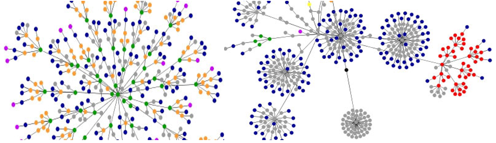

# portfolio display requirements

<small> *dennisyang.com DOM graph* by Dennis Yang is licensed under [CC
BY 2.0](https://creativecommons.org/licenses/by/2.0/)  
</small>

The table summarizes the basic data structure for all portfolio
graphs.  
Specific data requirements are provided
below.

<!-- Quantitative variables are typically continuous. If you encounter a quantitative variable (other than time) that is discrete rather than continuous, please consult with me on its suitability for your graph.   -->

| display                                                     | type                                      | quantitative  | categorical   |
| :---------------------------------------------------------- | :---------------------------------------- | :------------ | :------------ |
| [D1 distributions](#d1-distributions)                       | box plot, histogram, or density plot      | one           | one           |
| [D2 multiway](#d2-multiway)                                 | multiway                                  | one           | two           |
| [D3 correlations](#d3-correlations)                         | scatterplot                               | two           | one           |
| [D4 injuries or fatalities](#d4-injuries-or-fatalities)     | dot plot                                  | one           | optional      |
|                                                             | line graph or scatterplot                 | two           | optional      |
| [D5 redesign a graphical lie](#d5-redesign-a-graphical-lie) | dot plot                                  | one           | optional      |
|                                                             | line graph or scatterplot                 | two           | optional      |
| [D6 multivariate](#d6-multivariate)                         | conditioning plot                         | three or four |               |
|                                                             | scatterplot matrix or parallel coordinate | four or more  |               |
| [D7 self-taught](#d7-self-taught)                           | q-q                                       | one           | one           |
|                                                             | cycle plot                                | one           | two           |
|                                                             | Sankey diagram                            | one           | two or more   |
|                                                             | mosaic                                    | one           | three or more |
|                                                             | diverging stacked bar                     | one           | one           |
|                                                             | quantitative map                          | one           |               |
|                                                             | qualitative map                           |               | one           |

## D1 distributions

Univariate data are measurements of a single quantitative variable. The
data can be separated into groups by a categorical variable, creating
one distribution for each level of the category for comparison.

We will use three prospective graph designs for comparing distributions.
Include only one of these graph types in your portfolio. Select the
design that best conveys the stories in your data.

  - histograms
  - density plots
  - box plots

Data requirements

  - Minimum 200 observations of one quantitative variable  
  - One or two categorical variables  
  - No time-series

Categorical variables

  - If one category is used, it must have at least three levels for a
    minimum of three comparisons.  
  - If two categories are used, they must have at least two levels each
    for a minmum of four comparisons.

[Portfolio display requirements](#portfolio-display-requirements)

## D2 multiway

The distinguishing characteristic of multiway data is that there is a
quantitative value associated with every combination of levels of two
categorical variables.

Graph both the original multiway and its dual (swapping rows and
panels). Include only one of these graphs in your portfolio. Select the
design that best conveys the stories in your data.

Data requirements

  - One quantitative variable with a minimum of 24 observations
  - Two categorical variables with minimum numbers of levels as follows
      - 3 levels in category 1 and at least 8 levels in category 2
      - 4 levels in category 1 and at least 6 levels in category 2  
      - 5 levels in category 1 and at least 5 levels in category 2

[Portfolio display requirements](#portfolio-display-requirements)

## D3 correlations

[Portfolio display requirements](#portfolio-display-requirements)

## D4 injuries or fatalities

The data must convey information about human injury or fatality (similar
to the data in *Cruel Pies*). Consult with me on your data selection—the
graph type depends on the data. The two graph types shown are the most
commonly encountered.

[Portfolio display requirements](#portfolio-display-requirements)

## D5 redesign a graphical lie

Consult with me on your data selection—the graph type depends on the
data. The two graph types shown are the most commonly encountered.

[Portfolio display requirements](#portfolio-display-requirements)

## D6 multivariate

We use the term *multivariate* for data comprising 3 or more
quantitative variables per observation.

We use three graph designs for exploring multivariate data.

  - conditioning plot
  - scatterplot matrix
  - parallel coordinate plot

Include only one of these graph types in your portfolio. Select the
design that best conveys the stories in your data.

Data requirements

  - Minimum 20 observations  
  - Three or more quantitative variables  
  - No time-series data  
  - No categorical variables

Use a conditioning plot (coplot) for three or four variables.

For four or more variables, use a scatterplot matrix or a parallel
coordinate plot.

[Portfolio display requirements](#portfolio-display-requirements)

## D7 self-taught

This is a graph type you learn to construct on your own. Select one only
from the list and include it in the portfolio.

Counts

  - [q-q plot](#q-q-plot)  
  - [cycle plot](#cycle-plot)  
  - [Sankey diagram](#sankey-diagram)  
  - [mosaic](#mosaic)  
  - [diverging stacked bar](#diverging-stacked-bar)

Spatial data

  - [quantitative map](#quantitative-map)  
  - [qualitative map](#qualitative-map)

## q-q plot

The quantile-quantile (q-q) plot is a graphical technique for
determining if two groups of data come from populations with a common
distribution. Data requirements:

  - Two samples of one quantitative variable, min. 200 observations
    total.
  - One categorical variable that defines the two groups (two levels
    only)
  - The sample sizes of the two groups do not need to be equal

For additional technical details, see
(**???**).

## cycle plot

For additional technical details, see

## Sankey diagram

For additional technical details, see

## mosaic

## diverging stacked bar

Diverging stacked bar charts are the primary graphical display technique
for reporting survey data. Respondents are typically asked to choose one
response from a discrete number of options such as Strongly Disagree,
Disagree, No Opinion, Agree, Strongly Agree.

For additional technical details, see Heiberger & Robbins
([2014](#ref-HeibergerRobbins2014)).

## quantitative map

For additional technical details, see

## qualitative map

For additional technical details, see

[Portfolio display requirements](#portfolio-display-requirements)

## references

Heiberger, Richard M. & Naomi B. Robbins (2014) Design of diverging
stacked bar charts for Likert scales and other applications. *Journal of
Statistical Software* 57(5)
(<https://www.jstatsoft.org/article/view/v057i05/v57i05.pdf>).

-----

[Calendar](../README.md#calendar)  
[Index](../README.md#index)
