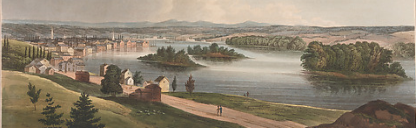

# portfolio lab

<small> *Troy from Mount Ida* (No. 11 of The Hudson River Portfolio) is
licensed under
[CC0 1.0](https://creativecommons.org/publicdomain/zero/1.0/legalcode/)
</small>

## contents

[media](#media)  
[preparation](#preparation)  
[organize the README file](#organize-the-readme-file)  
[importing images](#importing-images)  
[start a report](#start-a-report)  
[data tables](#data-tables)  
[create the bib file](#create-the-bib-file)  
[YAML bibliography argument](#yaml-bibliography-argument)  
[add a citation](#add-a-citation)  
[add a references heading](#add-a-references-heading)  
[format the citations and
references](#format-the-citations-and-references)  
[presentation prompts](#presentation-prompts)  
[reading prompts](#reading-prompts)

## media

Your portfolio is a website in the form of a GitHub repository. The repo
is private, accessible only to people you invite as collaborators.
However, your intended audience are your professional peers and
prospective employers.

[This sample](https://github.com/graphdr/portfolio-sample) shows the
basic layout of the portfolio website we are about to start building.

## preparation

Using an R Project sets the working directory to your portfolio folder,
making relative file paths easy to use.

  - Always start your work session by launching the `.Rproj` file you
    created for the portfolio.

## organize the README file

The README file is the main page of the website. README introduces the
reader to your portfolio and provides navigation links to your
individual display reports. The introduction and display reports are the
the main elements of a portfolio that you might eventually make public.

The responses to the prompts are essentially research material you use
to write the reports and that I use to assess your progress.

> Write instructions to begin editing the README. Section headings and a
> link to the first report. Some suggestions for editing the
> Introduction.

Instructions for the portfolio README file

  - Your portfolio cover art is your audience’s first interaction with
    your data display work. Use your best work here to attract the
    reader’s attention, pique their curiosity, and invite them to read
    further.

  - A portfolio documents your professional growth and competence by
    providing tangible evidence of your knowledge and skills in data
    visualization and visual rhetoric. The introduction is the reader’s
    first glimpse of your work; give them a reason to keep reading.

  - The words on the README should be yours. Add your own text where
    appropriate to present your portfolio. You may edit the section
    headings.

  - Even if your repo is private, treat the portfolio as if you intended
    to make it available to a prospective employer.

  - Each link in the displays section takes the reader to a stand-alone
    report about a specific display, its data, critique, and references.

  - In the displays section, give each report a descriptive title and
    indicate the type of graph used, e.g., dot plot, scatterplot,
    parallel coordinate plot, etc. While the course is in session,
    please leave the tags D1, D2, etc., for my convenience. When the
    course concludes, of course, you may edit these labels as you wish.

  - The discussion notes are from weekly small-group discussions in
    class that include the student’s own ideas and peer feedback. The
    purpose of the notes is to inform the critiques.

## importing images

All work is performed within RStudio with your `portfolio.Rproj` file
open.

> Instructions on saving any image to the resources folder. Then as an
> example, import to the README page as a placeholder.

## start a report

All work is performed within RStudio with your `portfolio.Rproj` file
open.

One Rmd report is written per display. Each report describes the data,
the graph design, and elements of visual rhetoric relevant to the story.

> Instructions for creating the first report template, `reports/d1.Rmd`.
> Push to github and test the link from README to the report.

## data tables

All work is performed within RStudio with your `portfolio.Rproj` file
open.

> In the sample report, show how to create a sample data table.
> Typically wide. Brief introduction to principles from Stephen few on
> table layout—adapted to the GitHub environment.

## create the bib file

All work is performed within RStudio with your `portfolio.Rproj` file
open.

The `.bib` file contains the complete list of references used in your
portfolio. It can contain more references than needed; only those
references actually cited will appear.

Create your bib file

  - RStudio *File \> New File \> Text File*
  - *Save As* `references.bib` in the `resources` directory
  - In `references.bib`, type this entry as your first reference:

<pre class="r"><code>@book{Wickham+Grolemund:2017,
  author    = {Hadley Wickham and Garrett Grolemund},
  year      = {2017},
  title     = {{R for Data Science}},
  edition   = {},
  publisher = {{O'Reilly Media, Inc.}},
  address   = {Sebastopol, CA},
  url       = {https://r4ds.had.co.nz/},
}</code></pre>

What the fields mean:

  - `@book{}` and its enclosing braces denotes the type of reference,
    e.g., a book, an article, a chapter in a book, etc.
  - `Wickham+Grolemund:2017` is the unique label I assigned to this
    reference. I use the label `Author:YYYY` for one author,
    `Author+Author:YYYY` for two authoirs, etc. You can use any style
    label as long as each reference label is unique.
  - The double braces, for example `title = {{R for Data Science}}` are
    used to preserve capitalization.

See our [BiBTeX page](cm303_portfolio_bibtex.md) for more details on the
types of entries and their required and optional fields.

## YAML bibliography argument

Open the report Rmd file you started earlier. Edit the YAML header to
specify the path and file name of the `.bib` file you just created.

<pre class="r"><code>---
output: github_document
bibliography: "../resources/references.bib"
---</code></pre>

Because the report Rmd script is in the reports directory, the relative
path goes up one level `../`, then down to the `resources/` folder and
there we find the `references.bib` file.

## add a citation

The syntax for a citation is `[@label]`, where the label is the label
you assigned in the `.bib` file.

  - In your report, add a sentence with a citation such
as:

<pre class="r"><code>Visualization is a great place to start with R programming, because the payoff is 
so clear: you get to make elegant and informative plots that help you understand 
data [@Wickham+Grolemund:2017]. 
</code></pre>

  - Knit the document. You should see output like this:

> Visualization is a great place to start with R programming, because
> the payoff is so clear: you get to make elegant and informative plots
> that help you understand data (Wickham and Grolemund,
> [2017](#ref-Wickham+Grolemund:2017)).

The software has found the reference in your `.bib` file and formatted
the citation using its default author-date format.

You will find the reference itself at the bottom of your document.

## add a references heading

At the end of the Rmd script, add a references section heading.

    ## References

Knit the document. The reference now appears after this heading.

To place the references section other than at the end of the document,
we use some HTML scripting as follows. Type the references heading where
you want the references to appear followed by the HTML`
` markup,

    ## References
    
    

## format the citations and references

Every organization or publisher requires that citations and references
be formatted in a specific way, for example, IEEE requires a numbered
citation and numbered references while an APA style uses an author-date
citation and an alphabetically-ordered bibliography.

In R Markdown, we can use a CSL file to override the default Rmd
citation/reference style. In your own work, you may select a CSL file
that suits you; in our class I require the CSL file used by the Journal
of Glaciology—not because I’m a glaciologist but because I like the
format.

  - Navigate to the [Zotero Style
    Repository](https://www.zotero.org/styles)  
  - In the Search box, type *Glaciology*  
  - Click on the link to download the `journal-of-glaciology.csl` file
    to your local machine  
  - Manually move the CSL file to your `portfolio/resources` directory  
  - Specify the CSL file in the YAML header

<pre class="r"><code>---
output: github_document
bibliography: "../resources/references.bib"
csl: "../resources/journal-of-glaciology.csl"
---</code></pre>

Knit your document and both the citation formatting and the references
formatting will change throughout the document.

## presentation prompts

All work is performed within RStudio with your `portfolio.Rproj` file
open.

Complete the prompts before the start of class on the day of the
presentation.

  - These points guide the small-group discussions.
  - Much of this work will be part of your portfolio critiques.

> Instructions on using the template file

## reading prompts

All work is performed within RStudio with your `portfolio.Rproj` file
open.

Complete the prompts before the start of class on the day of the reading
discussion.

Visual design and rhetorical decisions are expected to be supported by
evidence from our readings.

> Instructions on using the template file

<!-- portfolio checklist (revise)  -->

<!-- describe, discuss, and critique  -->

<!-- sample portfolio entries  -->

<!-- commit-pull-push  -->

## references

Wickham H and Grolemund G (2017) *R for Data Science.* O’Reilly Media,
Inc., Sebastopol, CA <https://r4ds.had.co.nz/>

-----

<a href="#top">Top of page</a>  
[Calendar](../README.md#calendar)  
[Index](../README.md#index)
