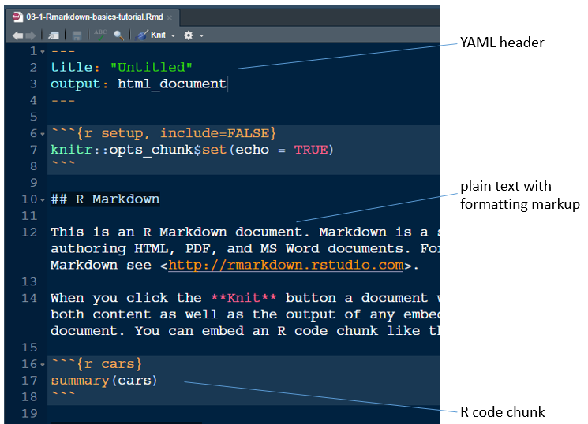
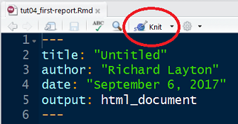
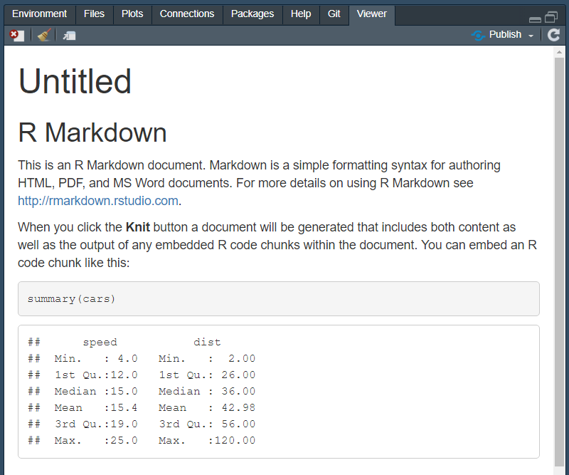
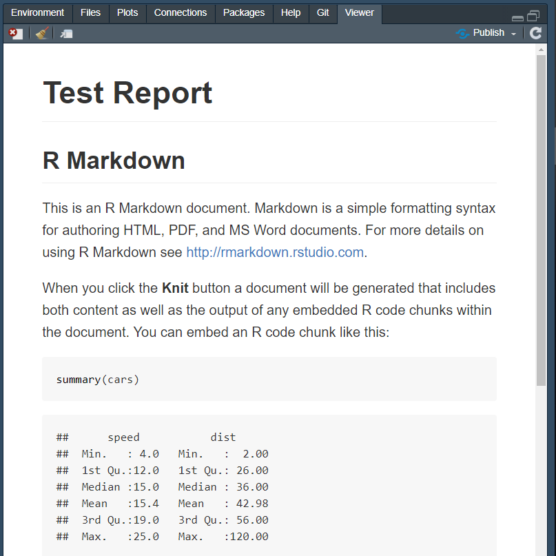
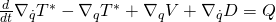
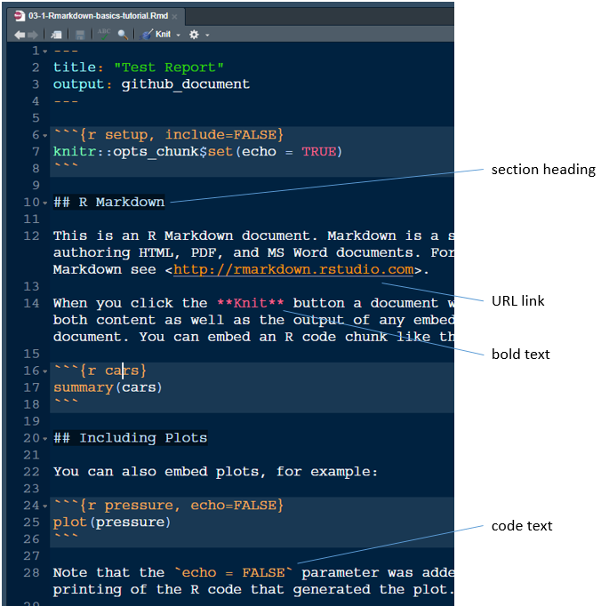
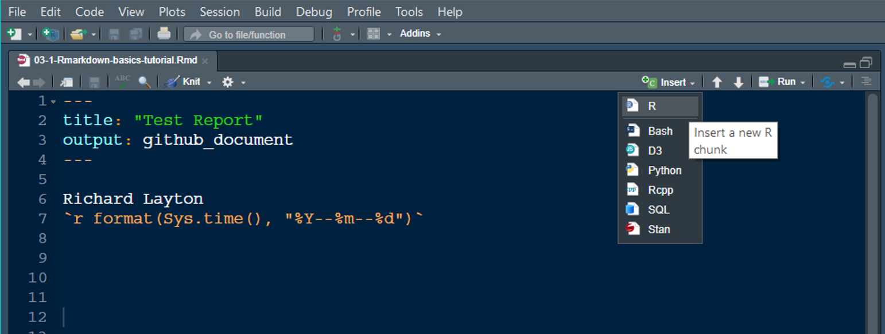
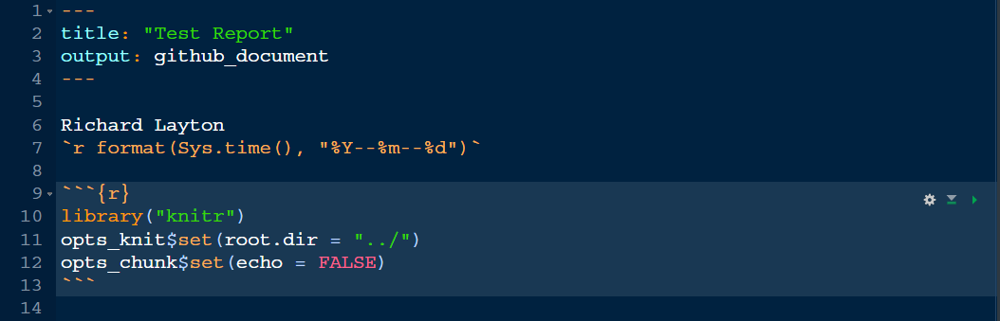

R markdown basics
================


<small> <br> <i>R Markdown flow</i> by RStudio from the
<a href="https://rmarkdown.rstudio.com/authoring_quick_tour.html">R
Markdown quick tour</a>. <br> </small>

## contents

[prerequisites](#prerequisites)  
[create an Rmd script](#create-an-rmd-script)  
[set the Rmd output format](#set-the-rmd-output-format)  
[YAML header arguments](#yaml-header-arguments)  
[how to format text](#how-to-format-text)  
[initialize a report](#initialize-a-report)  
[include\_graphics()](#include_graphics)  
[spell check](#spell-check)

## prerequisites

  - Start every work session by launching `portfolio.Rproj`  
  - Your [project directory
    structure](cm501-proj-m-manage-files.md#plan-the-directory-structure)
    satisfies the course requirements

If any of these packages have not yet been installed, they can be
installed using these commands,

    install.packages("knitr")
    install.packages("png")

## create an Rmd script

From RStudio, create a new R Markdown file *File \> New File \> R
Markdown…*

In the dialog box, leave all the default settings for now, select *OK*.

An untitled R Markdown file is created. Use *File \> Save As…* to save
the file to your `explore` directory with the filename

    explore/0301-rmd-basics-explore.Rmd

The Rmd script contains three types of content:

1.  A YAML header surrounded by dashes `---`
2.  Text mixed with simple text formatting like `# heading` and
    `_italics_`
3.  Chunks of R code surrounded by backticks ` ``` `



<br>To render the document, click the *Knit* button or use the pulldown
menu, *Knit \> Knit to HTML*



<br>The report appears in your RStudio viewer.



## set the Rmd output format

The header or front matter is in YAML (YAML Ain’t Markup Language)
syntax. The YAML header specifies how the file is rendered. The default
YAML is this:

``` yaml
---
title: "Untitled"
output: html_document
---
```

The knit pulldown menu shows three basic document types: HTML, PDF, and
Word. We won’t be using any of these regularly, but it is handy to know
they exist,

  - HTML is handy for draft documents viewed onscreen locally  
  - PDFs can only be created if you have TeX installed  
  - Word is very useful for collaborating with non-R users, but it
    requires that you have Word installed on your machine

We’ll be using a markdown variant specifically design to be used with
GitHub because that’s where you will post your portfolio. Change the
title to “Test Report” and the output type to `github_document`, then
knit,

``` yaml
---
title: "Test report"
output: github_document
---
```

The report appears in your RStudio viewer.



<br>If you take another look at the knit pulldown menu, its options have
changed.

## YAML header arguments

The only required argument in the YAML header is the output type. If you
wish you may omit all other arguments for a minimal header:

``` yaml
---
output: github_document
---
```

Some of the most commonly used arguments include title, author, date,
bibliography, and CSL for formatting citations. For example, the YAML
header for the course README file includes:

``` yaml
---
title: "visualizing data"
output: 
  github_document: 
    pandoc_args: "--webtex"
bibliography: "resources/references.bib"
csl: "resources/journal-of-glaciology.csl"
link-citations: yes
---
```

In Rmd documents, math expressions are typically typeset using a TeX
engine, producing beautiful mathematics. For example, the Rmd markup

    $$
    \tfrac{d}{dt}\nabla_{\dot{q}}T^* - \nabla_{q}T^* + \nabla_{q}V + \nabla_{\dot{q}} D = Q 
    $$

produces the output



However, GitHub does not yet support TeX in its Markdown documents.
Thus, if you write any mathematics in your portfolio prose, you must add
the `pandoc_args: "--webtex"` argument to the YAML header as shown
above.

## how to format text

Prose in Rmd files is plain text with markup syntax from Markdown to
produce

  - section headings
  - italic text
  - bold text
  - code text
  - superscripts and subscripts
  - lists
  - URL links

The default Rmd document, for example, illustrates several of these
markups,



<br> For the complete list of common markups, please read

  - [Text formatting with
    Markdown](https://r4ds.had.co.nz/r-markdown.html#text-formatting-with-markdown)
    (Wickham and Grolemund, [2017](#ref-Wickham+Grolemund:2017))

You may also wish to bookmark the RStudio cheat sheet for future
reference:

  - [R Markdown cheat
    sheet](https://www.rstudio.com/wp-content/uploads/2016/03/rmarkdown-cheatsheet-2.0.pdf)

For a preview of our course guidelines on text formatting and
punctuation, see

  - [Document
    design](cm/304_portfolio_document-design.md#document-design)

## initialize a report

To initialize a new Rmd script, we delete most of the default text, add
the author name and date, and assign settings to control code chunk
behavior.

In the `explore/03-1-Rmarkdown-basics-tutorial.Rmd` file,

  - Delete everything below the YAML header
  - Knit

The output should show a title only.

The document author and date can be assigned inside or outside the YAML
header. For dates, please adopt the ISO format `yyyy-mm-dd`.

If you prefer to place author and date fields inside the YAML header,

``` yaml
---
title:  "Test Report"
author: "Author Name"
date:   "yyyy-mm-dd"
output: github_document
---
```

If outside the YAML header, just add them as the first two lines. To
ensure the two lines are separate, each line must end with two spaces,
i.e., “Author
Name”

``` yaml
---
title:  "Test Report"
output: github_document
---

Author Name  
yyyy-mm-dd  
```

The date can be automatically updated using the `Sys.time()` function.
If inside the YAML header, replace the date with an inline code chunk
surrounded by single qoutes,

``` yaml
---
title:  "Test Report"
author: "Author Name"
date:   '`r format(Sys.time(), "%Y-%m-%d")`'
output: github_document
---
```

If outside the header, use the inline code chunk without the single
quotes,

``` yaml
---
title:  "Test Report"
output: github_document
---

Author Name  
`r format(Sys.time(), "%Y-%m-%d")`
```

  - Make appropriate changes to the name and date of your Test Report.
  - Knit and confirm the result is what you expect.

After the YAML header, name, and date, we usually insert an R code chunk
to assign settings that control the behavior of code chunks in the
document.

Insert an R code chunk using either

  - the `Ctrl-Alt-I` keyboard shortcut, or  
  - the *Insert* pulldown menu



<br>An empty code chunk appears

    ```{r}
    
    ```

Edit the code chunk header to prevent the code from being printed
(“echoed”) in the output document.

    ```{r echo = FALSE}

Inside the code chunk, add these lines

``` r
library("knitr")  
opts_knit$set(root.dir = "../")  
opts_chunk$set(echo = FALSE)  
```

What the code does:

  - loads the knitr library
  - sets the knitr working directory one level up  
  - prevents subsequent code chunks from being printed in the output
    document (For a complete listing of chunk options, see [Chunk
    options](https://r4ds.had.co.nz/r-markdown.html#chunk-options)
    (Wickham and Grolemund, [2017](#ref-Wickham+Grolemund:2017)).)

By setting the knitr working directory one level up, we match the
behavior of plain R scripts for which the working directory is always
the RStudio project directory. Thus all relative file paths in an Rmd
script are with respect to the project directory just as they are in
plain R scripts, permitting us to run all the R code in an Rmd file
without knitting.

Every time you start a new Rmd script, the initial file should look
something like this, with title, name, and date appropriately edited.



<br>As always, having added a few lines to the report, knit to check
that the output is what you expect.

## code chunk

Add a code chunk that reads and prints a data set.

``` r
data(starwars, package = "dplyr")


explore <- starwars %>% 
    select(homeworld) %>% 
    count(homeworld) %>% 
    filter(n > 1) %>% 
    arrange(desc(n))

kable(explore)
```

| homeworld |  n |
| :-------- | -: |
| Naboo     | 11 |
| NA        | 10 |
| Tatooine  | 10 |
| Alderaan  |  3 |
| Coruscant |  3 |
| Kamino    |  3 |
| Corellia  |  2 |
| Kashyyyk  |  2 |
| Mirial    |  2 |
| Ryloth    |  2 |

  - Knit HTML to check that everything works as expected.

## simple table

  - Add a code chunk that uses *kable()* to print a simple table.  
  - Knit HTML to check that everything works as expected.

<!-- end list -->

``` r
library(knitr)
kable(tidy_data)
```

## include\_graphics()

Instead of the Markdown markup for importing images, we will usually use
the `include_graphics()` function from the knitr package.

For example, suppose we have `an_image_file.png` in the resources
directory. The Rmd file code chunk to import the image looks as follows,
where the `echo` argument in the header determines if the code chunk is
printed in the output and the `out.width` argument changes the size of
the image in the output document.

    ```{r echo = FALSE, out.width = "70%"}
    library(knitr)
    include_graphics("../resources/an_image.png")
    ```

The file path argument for `include_graphics()` assumes that the working
directory is the Rmd file folder. For us, this would usually be the
`explore/` or `reports/` directory. So our relative path argument is
composed of these elements: `../` to go up one level, `resources/` to go
down one level, and `an_image.png` to retrieve the file.

To see how it works, let’s obtain the R logo from the png package and
write it to the resources directory. To the tutorial Rmd script, add the
following heading and R code chunk.

    ## Try include_graphics()

``` r
# read and write the R logo image to resources 
library("png")
R_logo <- readPNG(system.file("img", "Rlogo.png", package = "png"))
writePNG(R_logo, target = "resources/Rlogo.png")
```

Knit the document and check your resources directory. You should find it
contains the R logo PNG file. Now add an R code chunk to import the
image and Knit.

    ```{r out.width = "10%"}
    # import an image from resources 
    library("knitr")
    include_graphics("../resources/Rlogo.png")
    ```

Your output document should now include the R logo.


## spell check

In RStudio, with the Rmd file open, press function F7 to spell check
your document.

## references

<div id="refs">

<div id="ref-Wickham+Grolemund:2017">

Wickham H and Grolemund G (2017) *R for Data Science.* O’Reilly Media,
Inc., Sebastopol, CA <https://r4ds.had.co.nz/>

</div>

</div>

***
<a href="#top">&#9650; top of page</a>    
[&#9665; calendar](../README.md#calendar)    
[&#9665; index](../README.md#index)
