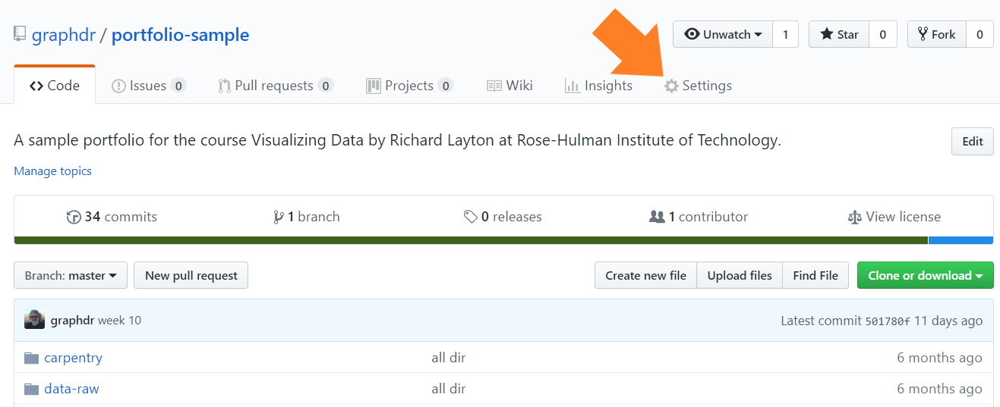
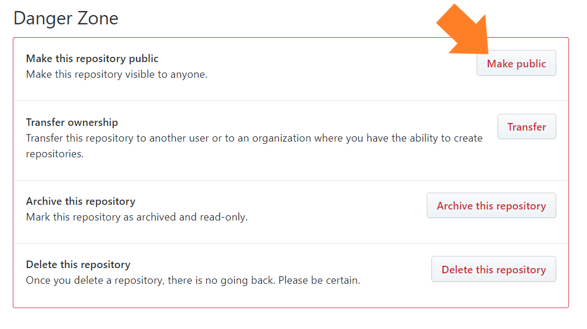
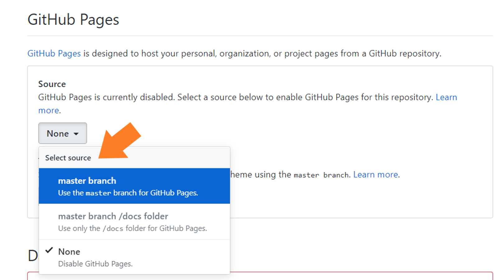
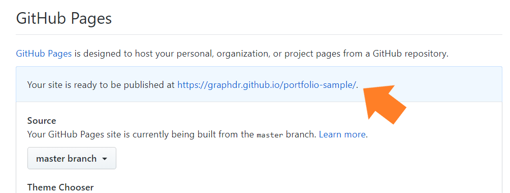
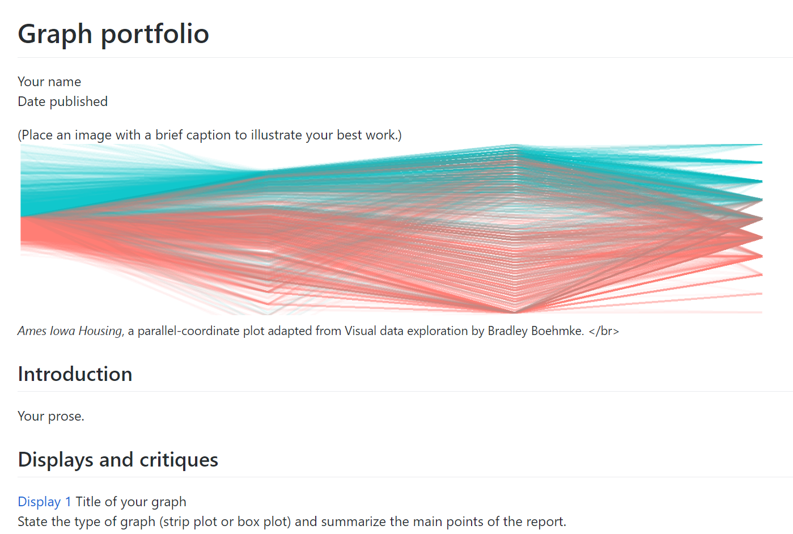

the portfolio after the term
================

## editing before publications

At the end of the term, if you decide to make your portfolio public, you
may wish to

  - Delete the links to the reading and presentation discussions
  - Edit the README for a personalized layout
  - Edit the links to the displays to include only those you wish to
    showcase
  - Edit the portfolio to remove the D1, D2, etc designations that are
    there for my convenience
  - Edit the reports to remove the data and display requirements lists
    that are there for my convenience

Please wait to do any editing until after grades are turned in.

## making your portfolio public

If you decide to make your repo public and you have edited it,

Navigate to your GitHub repo and select the *Settings* tab

   

In the settings window, scroll down the the “Danger Zone” and click
*Make public.*

 

## optional website

You can also convert your public repo into a GitHub webpage.

  - Again, in the *Settings* window, scroll down to GitHub Pages  
  - Under the *Source* pull-down menu, select *Master branch*

   

In a short time, the URL of your website shows up. For example, the URL
for the sample portfolio is show:
<https://graphdr.github.io/portfolio-sample/>.

   

Navigate to my sample, and you would find

## references

Wickham H and Grolemund G (2017) *R for Data Science.* O’Reilly Media,
Inc., Sebastopol, CA <https://r4ds.had.co.nz/>

***
<a href="#top">&#9650; top of page</a>    
[&#9665; calendar](../README.md#calendar)    
[&#9665; index](../README.md#index)
