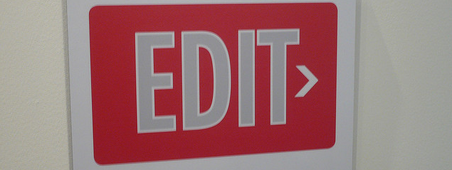

final editing
================

 <small>  
<i>Edit</i> by Matt Hampel licensed under
<a href="https://creativecommons.org/licenses/by/2.0//">CC BY 2.0</a>
  </small>

Having substantially completed the portfolio at this point, it is time
for final editing.

The README introduces the reader to your portfolio. It should start with
a compelling image and an introduction that engages the rteader, giving
them a reason to keep reading. Recall that the intended audience are
professional peers or prospective employers.

  - Have you reviewed all your reading and presentation responses for
    suggestions for improving the displays and the critiques?
  - Does every report begin with an introduction and a summary of the
    requirements?
  - Have you revised your README to engage the reader?
  - Does every critique conclude with references?  
  - Are your assertions supported with evidence?  
  - Have you spell-checked every file?

## references

***
<a href="#top">&#9650; top of page</a>    
[&#9665; calendar](../README.md#calendar)    
[&#9665; index](../README.md#index)
