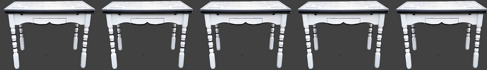

tables
================

 <small> <br>
<i>Mom’s Table</i> by Sara Shuman is licensed under
<a href="https://creativecommons.org/licenses/by/2.0//">CC BY 2.0</a>
<br> </small>

## contents

[introduction](#introduction)  
[start with a data frame](#start-with-a-data-frame)  
[reshape for readability](#reshape-for-readability)  
[select an output type](#select-an-output-type)  
[cells with multiple entries](#cells-with-multiple-entries)  
[cells with links](#cells-with-links)  
[cells with images](#cells-with-images)  
[references](#references)

## introduction

The RStudio [cheat sheet for R
Markdown](https://www.rstudio.com/wp-content/uploads/2016/03/rmarkdown-cheatsheet-2.0.pdf)
suggests three possible packages for creating tables: knitr, stargazer,
and xtable. We will not use xtable because—while it produces very nice
tables in LaTeX or HTML—its HTML output is not rendered particularly
well by GitHub. Because we are using `github_ducument` output, we will
use knitr or stargazer for tables, with `knitr::kable()` being used most
often.

## start with a data frame

``` r
library("xtable")
data(tli)
df <- tli[1:10, ] %>% 
    as.data.frame()
```

## reshape for readability

  - representative sample
  - multiway
  - summary statistics

## select an output type

  - print()
  - glimpse()
  - summary()
  - kable()
  - stargazer()

<!-- end list -->

``` r
knitr::kable(df, caption = "Table with kable()")
```

| grade | sex | disadvg | ethnicty | tlimth |
| ----: | :-- | :------ | :------- | -----: |
|     6 | M   | YES     | HISPANIC |     43 |
|     7 | M   | NO      | BLACK    |     88 |
|     5 | F   | YES     | HISPANIC |     34 |
|     3 | M   | YES     | HISPANIC |     65 |
|     8 | M   | YES     | WHITE    |     75 |
|     5 | M   | NO      | BLACK    |     74 |
|     8 | F   | YES     | HISPANIC |     72 |
|     4 | M   | YES     | BLACK    |     79 |
|     6 | M   | NO      | WHITE    |     88 |
|     7 | M   | YES     | HISPANIC |     87 |

Table with kable()

``` r
library("stargazer")
stargazer(df, 
                    type = "html",
                    title = "Table with stargazer", 
                    summary = FALSE, 
                    rownames = FALSE)
```

<table style="text-align:center">

<caption>

<strong>Table with stargazer</strong>

</caption>

<tr>

<td colspan="5" style="border-bottom: 1px solid black">

</td>

</tr>

<tr>

<td style="text-align:left">

grade

</td>

<td>

sex

</td>

<td>

disadvg

</td>

<td>

ethnicty

</td>

<td>

tlimth

</td>

</tr>

<tr>

<td colspan="5" style="border-bottom: 1px solid black">

</td>

</tr>

<tr>

<td style="text-align:left">

6

</td>

<td>

M

</td>

<td>

YES

</td>

<td>

HISPANIC

</td>

<td>

43

</td>

</tr>

<tr>

<td style="text-align:left">

7

</td>

<td>

M

</td>

<td>

NO

</td>

<td>

BLACK

</td>

<td>

88

</td>

</tr>

<tr>

<td style="text-align:left">

5

</td>

<td>

F

</td>

<td>

YES

</td>

<td>

HISPANIC

</td>

<td>

34

</td>

</tr>

<tr>

<td style="text-align:left">

3

</td>

<td>

M

</td>

<td>

YES

</td>

<td>

HISPANIC

</td>

<td>

65

</td>

</tr>

<tr>

<td style="text-align:left">

8

</td>

<td>

M

</td>

<td>

YES

</td>

<td>

WHITE

</td>

<td>

75

</td>

</tr>

<tr>

<td style="text-align:left">

5

</td>

<td>

M

</td>

<td>

NO

</td>

<td>

BLACK

</td>

<td>

74

</td>

</tr>

<tr>

<td style="text-align:left">

8

</td>

<td>

F

</td>

<td>

YES

</td>

<td>

HISPANIC

</td>

<td>

72

</td>

</tr>

<tr>

<td style="text-align:left">

4

</td>

<td>

M

</td>

<td>

YES

</td>

<td>

BLACK

</td>

<td>

79

</td>

</tr>

<tr>

<td style="text-align:left">

6

</td>

<td>

M

</td>

<td>

NO

</td>

<td>

WHITE

</td>

<td>

88

</td>

</tr>

<tr>

<td style="text-align:left">

7

</td>

<td>

M

</td>

<td>

YES

</td>

<td>

HISPANIC

</td>

<td>

87

</td>

</tr>

<tr>

<td colspan="5" style="border-bottom: 1px solid black">

</td>

</tr>

</table>

## cells with multiple entries

## cells with links

## cells with images

``` r
dat <- data.frame(
  country = c('Canada', 'United Kindom'),
  abbr = c('ca', 'gb'),
  var1 = c(1, 2),
  var2 = rnorm(2)
)
dat$flag <- sprintf('', dat$abbr)
library(knitr)
kable(dat)
```

| country       | abbr | var1 |     var2 | flag                                             |
| :------------ | :--- | ---: | -------: | :----------------------------------------------- |
| Canada        | ca   |    1 | 2.307316 |  |
| United Kindom | gb   |    2 | 1.164249 |  |

## references

<div id="refs">

</div>

***
<a href="#top">&#9650; top of page</a>    
[&#9665; calendar](../README.md#calendar)    
[&#9665; index](../README.md#index)
