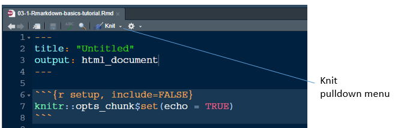

R markdown basics
================

 <small>  *R
Markdown flow* by RStudio from the [R Markdown quick
tour](https://rmarkdown.rstudio.com/authoring_quick_tour.html). Our
final documents are the portfolio reports on GitHub  </small>

## contents

[prerequisites](#prerequisites)  
[create an R markdown script](#create-an-r-markdown-script)

## prerequisites

ALWAYS start your work session by launching the `portfolio.Rproj` file
you created for this course. Using an R Project sets the working
directory to your course folder, making relative file paths easy to use.

## create an R markdown script

From RStudio, create a new R Markdown file:

  - *File \> New File \> R Markdown…*

In the dialog box:

  - Use the default HTML settings for now.

An untitled R Markdown file is created with some default text and R
code. Save the file:

  - *File \> Save As…*
  - Save it to your `practice` directory
  - With the file name `practice/d1-boxplot-nontrad-tutorial.Rmd`

To “render” the document, use the *Knit* pulldown menu:

  - *Knit \> Knit to HTML*

The report appears in your RStudio viewer.

***
<a href="#top">&#9650; top of page</a>    
[&#9665; calendar](../README.md#calendar)    
[&#9665; index](../README.md#index)
