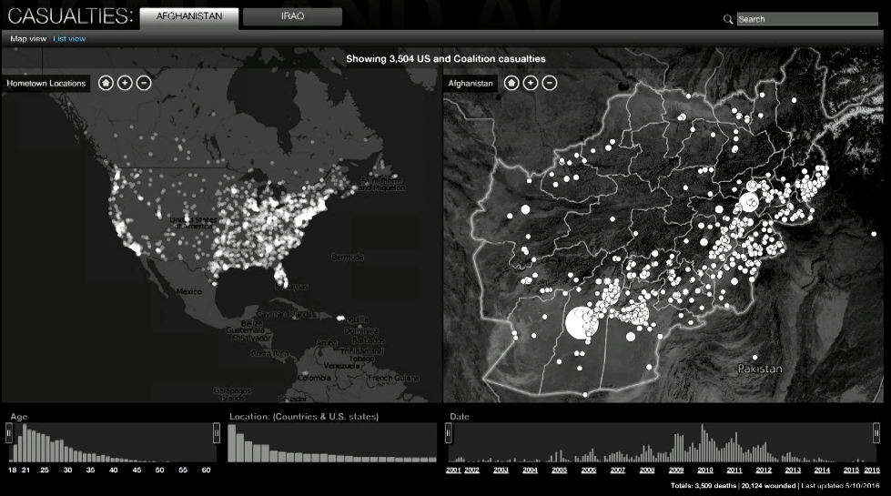
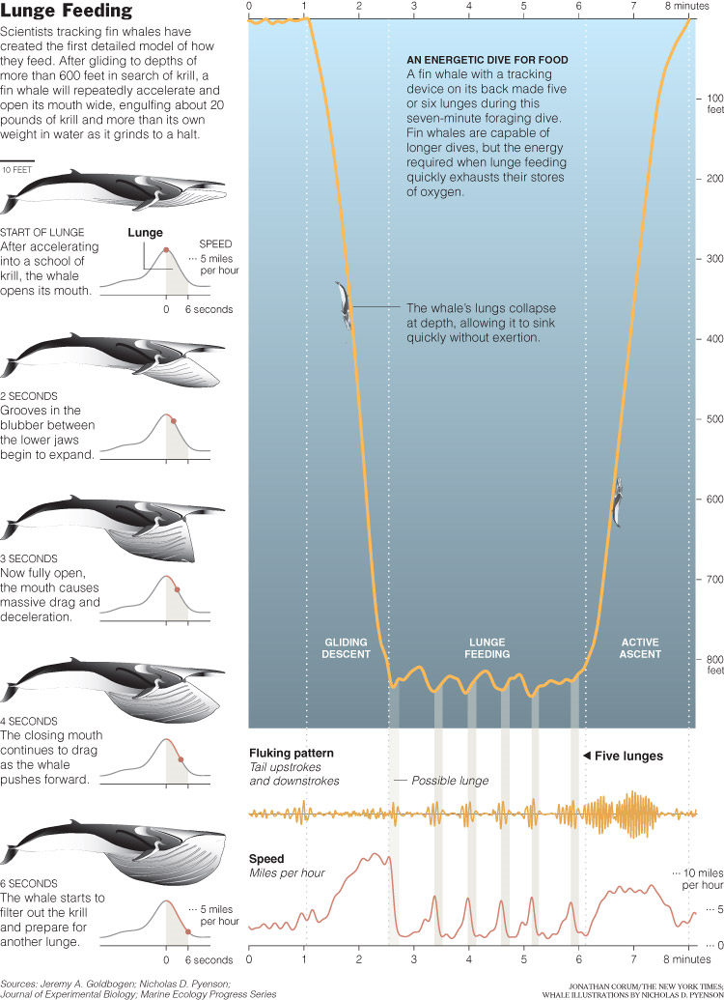
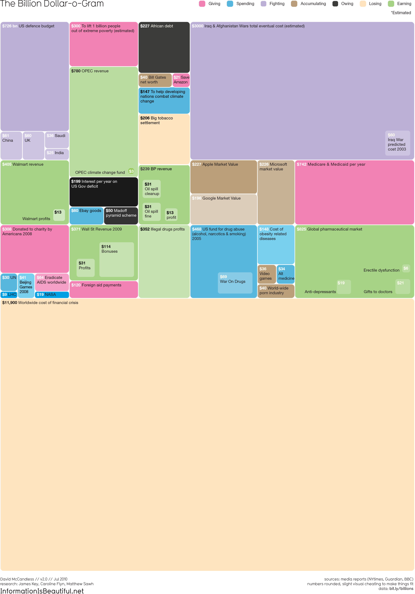
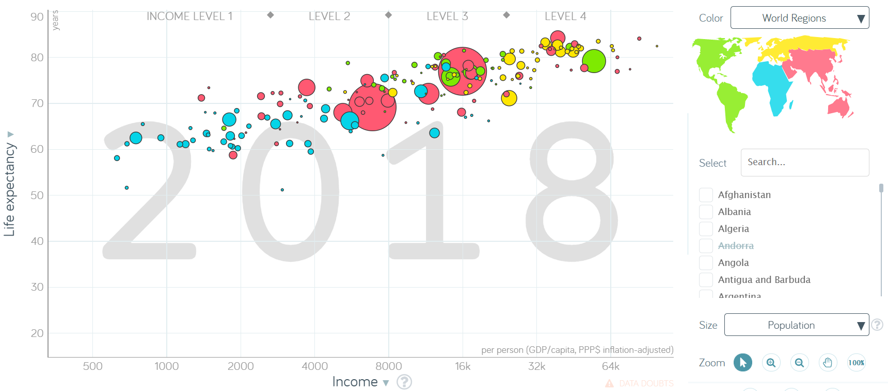

discovering stories
================

## blogs

Cole Nussbaumer Knaflic

[Multifaceted data and
story](http://www.storytellingwithdata.com/blog/2014/01/multifaceted-data-and-story)
or emphasizing one story de-emphasizes another  
[The right amount of
detail](http://www.storytellingwithdata.com/blog/2013/10/the-right-amount-of-detail)
or the importance of context  
[Logic in
order](http://www.storytellingwithdata.com/blog/2013/09/logic-in-order)
or ordering your data deliberately  
[Telling multiple
stories 1](http://www.storytellingwithdata.com/blog/2012/05/telling-multiple-stories-part-1)
or group data to tell a story  
[Telling multiple
stories 2](http://www.storytellingwithdata.com/blog/2012/06/telling-multiple-stories-part-2)  
[And the winner
is…](http://www.storytellingwithdata.com/blog/2012/12/and-winner-is)
or responses to a data visualization challenge

## videos

[Maps of emotion](https://vimeo.com/166948025) (1:40–9:45) Eric
Rodenbeck

  [Show ideas +
evidence](https://www.youtube.com/watch?v=VrQ8rQoOuhA) (7:08–11:44)
Jonathan Corum

  [The beauty of data
visualization](https://www.ted.com/talks/david_mccandless_the_beauty_of_data_visualization/up-next)
(0:00–5:00) David McCandless

  [gapminder](https://www.youtube.com/watch?v=hVimVzgtD6w)
(0:00–5:00) Hans Rosling

  [The images are the same]() (3:00–5:00) Amanda Cox

## references

Wickham H and Grolemund G (2017) *R for Data Science.* O’Reilly Media,
Inc., Sebastopol, CA <https://r4ds.had.co.nz/>

***
<a href="#top">&#9650; top of page</a>    
[&#9665; calendar](../README.md#calendar)    
[&#9665; index](../README.md#index)
