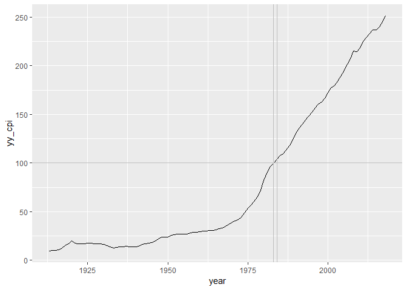
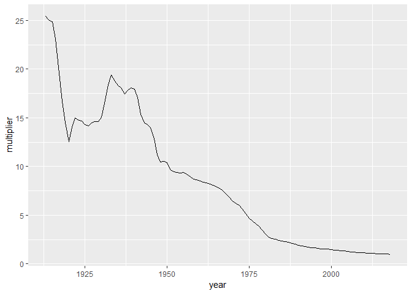

correcting graphical lies
================

 <small>  
<i>Truth</i> by Revise\_Di is licensed under
<a href="https://creativecommons.org/licenses/by-sa/2.0/legalcode">CC
BY-SA 2.0</a>   </small>

## contents

[introduction](#introduction)  
[avoid common deceptive practices](#avoid-common-deceptive-practices)  
[correct for inflation](#correct-for-inflation)  
[correct for ppp](#correct-for-ppp)  
[correct for population](#correct-for-population)  
[correct for lack of context](#correct-for-lack-of-context)  
[references](#references)

## introduction

## avoid common deceptive practices

  - No double-y scales  
  - Start bar chart scales at zero  
  - Do not cherry-pick your data
  - Avoid Simpson’s paradox

## correct for inflation

A graph of money over time that does not correct for inflation is lying.

To adjust for inflation, we convert dollar value (let’s assume we are
discussing US dollars) from one time period to an equivalent value at
another time period. The provess involved using an inflation index,
typicall the Consumer price Index (CPI) published by the US Bureau of
Labor Statitsics (BLS) or the GDP deflator published by he US Burerau of
Econimic Analysis (BEA). We’ll use the CPI.

    #> Observations: 1,275
    #> Variables: 2
    #> $ date   <chr> "1913-01-01", "1913-02-01", "1913-03-01", "1913-04-01",...
    #> $ mm_cpi <dbl> 9.8, 9.8, 9.8, 9.8, 9.7, 9.8, 9.9, 9.9, 10.0, 10.0, 10....

    #> # A tibble: 20 x 2
    #>    date       mm_cpi
    #>    <chr>       <dbl>
    #>  1 1913-01-01    9.8
    #>  2 1913-02-01    9.8
    #>  3 1913-03-01    9.8
    #>  4 1913-04-01    9.8
    #>  5 1913-05-01    9.7
    #>  6 1913-06-01    9.8
    #>  7 1913-07-01    9.9
    #>  8 1913-08-01    9.9
    #>  9 1913-09-01   10  
    #> 10 1913-10-01   10  
    #> 11 1913-11-01   10.1
    #> 12 1913-12-01   10  
    #> 13 1914-01-01   10  
    #> 14 1914-02-01    9.9
    #> 15 1914-03-01    9.9
    #> 16 1914-04-01    9.8
    #> 17 1914-05-01    9.9
    #> 18 1914-06-01    9.9
    #> 19 1914-07-01   10  
    #> 20 1914-08-01   10.2

    #> Observations: 1,272
    #> Variables: 3
    #> $ date   <chr> "1913-01-01", "1913-02-01", "1913-03-01", "1913-04-01",...
    #> $ mm_cpi <dbl> 9.8, 9.8, 9.8, 9.8, 9.7, 9.8, 9.9, 9.9, 10.0, 10.0, 10....
    #> $ year   <dbl> 1913, 1913, 1913, 1913, 1913, 1913, 1913, 1913, 1913, 1...

    #> Observations: 106
    #> Variables: 2
    #> $ year   <dbl> 1913, 1914, 1915, 1916, 1917, 1918, 1919, 1920, 1921, 1...
    #> $ yy_cpi <dbl> 9.88, 10.02, 10.11, 10.88, 12.82, 15.04, 17.33, 20.04, ...

    #> # A tibble: 6 x 2
    #>    year yy_cpi
    #>   <dbl>  <dbl>
    #> 1  2013   233.
    #> 2  2014   237.
    #> 3  2015   237.
    #> 4  2016   240.
    #> 5  2017   245.
    #> 6  2018   251.

## correct for ppp

Similarly, if you are comparing currencies between countries, a graph
that does not corect for the purchasing power of the currency is lying.

## correct for population

Greater numbers of people in a region may inherently mean more of *X* in
the region.

## correct for lack of context

Correcting for lack of context usually means you need to obtain more
data, either more of the same data over a longer time period or
comparable data over the same time period.

## references

***
<a href="#top">&#9650; top of page</a>    
[&#9665; calendar](../README.md#calendar)    
[&#9665; index](../README.md#index)
