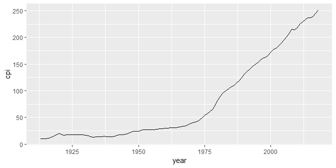
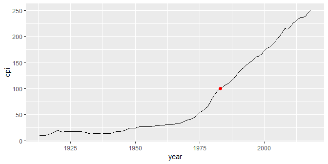
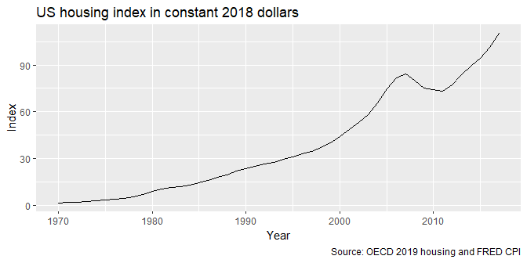
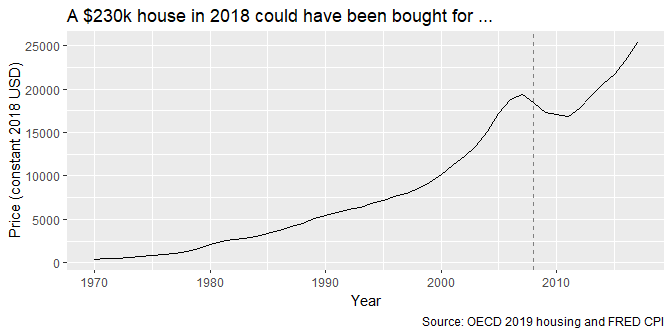

correcting graphical lies
================

 <small> <br>
<i>Truth</i> by Revise\_Di is licensed under
<a href="https://creativecommons.org/licenses/by-sa/2.0/legalcode">CC
BY-SA 2.0</a> <br> </small>

## contents

[introduction](#introduction)  
[follow good design practices](#follow-good-design-practices)  
[beware Simpson’s paradox](#beware-simpsons-paradox)  
[adjust for inflation](#adjust-for-inflation)  
[adjust for ppp](#adjust-for-ppp)  
[adjust for population](#adjust-for-population)  
[adjust for lack of context](#adjust-for-lack-of-context)  
[references](#references)

## introduction

## follow good design practices

Do

  - Show sufficient information to reveal the context of the story
  - Select an aspect ratio to reveal meaningful variation
  - Always label your scales and axes
  - Ensure your numbers add up
  - Start bar chart scales at zero
  - Use constant-interval scales
  - Show all the data

Don’t

  - Do not select an aspect ratio that conceals meaningful variation  
  - Do not cherry-pick your data, do not omit relevant data  
  - Do not use double-y scales
  - Do not use irrelevant data

## beware Simpson’s paradox

If a data graphic tells a compelling story to inform the making of
decisions or public policy, hidden variables must be explored to avoid
Simpson’s paradox—otherwise the decision or policy could be exactly the
opposite of what it should be.

The [video by by Mark
Liddell](https://www.youtube.com/watch?v=sxYrzzy3cq8) compared the
survival rates of patients at hospitals A and B. Below, I show the
numbers he used to illustrate Simpson’s paradox.

A thousand patients each are admitted to hospitals A and B. The data
frame shows the patients’ health when admitted (good or poor), the
number admitted, and the number who survived.

``` r
library("tidyverse")
library("wrapr")
library("seplyr")

df <- wrapr::build_frame(
        "hospital", "patient_health", "admitted", "survived" |
        "A", "good", 900, 870 |
        "A", "poor", 100, 30 |
        "B", "good", 600, 590 |
        "B", "poor", 400, 210)

df <- df %>% 
        mutate(survival_rate = round(survived/admitted, 2)) %>% 
        arrange(desc(survival_rate))
```

For both types of patients, hospital B has a higher survival rate than
hospital A.

``` r
kable(df)
```

| hospital | patient\_health | admitted | survived | survival\_rate |
| :------- | :-------------- | -------: | -------: | -------------: |
| B        | good            |      600 |      590 |           0.98 |
| A        | good            |      900 |      870 |           0.97 |
| B        | poor            |      400 |      210 |           0.52 |
| A        | poor            |      100 |       30 |           0.30 |

If we group and summarize the data by hospital, ignoring the state of
the patients’ health when admitted, hospital A has a higher survival
rate than hospital B.

``` r
grouping_variables <- c("hospital")
df <- seplyr::group_summarise(df, 
                grouping_variables, 
                admitted = sum(admitted), 
                survived = sum(survived), 
                survival_rate = survived/admitted) %>% 
        arrange(desc(survival_rate))
kable(df)
```

| hospital | admitted | survived | survival\_rate |
| :------- | -------: | -------: | -------------: |
| A        |     1000 |      900 |            0.9 |
| B        |     1000 |      800 |            0.8 |

That’s the paradox. When the data are grouped to account for a
particular variable, we get one result. When the data are aggregated and
that variable is hidden, we get the opposite result.

The paradox does occur in actual research. For example,

  - Comparing two treatments for kidney stones, treatment A was more
    effective when used on small stones, and also when used on large
    stones. When the data are grouped and summarized (stone size is now
    a hidden variable), treatment B is more effective. (Charig and
    others, [1986](#ref-Charig+Webb+Payne+Wickham:1986))

  - In a study of gender bias in the 1973 graduate school admissions to
    University of California, Berkeley, when the data were grouped to
    account for the difficulty of admission to a department by either
    sex, a small but statistically significant bias *in favor of women*
    was found, that is, women were admitted at a higher rate than men.
    In contrast, when the data are aggregated (difficulty of entry is
    the hidden variable), only 6 departments of 85 were biased in favor
    of women and 4 departments were biased in favor of men. Ignoring
    departments altogether (both department and the difficulty of entry
    are hidden variables), admissions were biased *in favor of men*
    (Bickel and others, [1975](#ref-Bickel+Hammel+OConnell:1975)).

## adjust for inflation

Over any time period with inflation, a dollar buys less at the end the
period than it did at the beginning of the period. Thus, in 1973 a
single 20-year old could live comfortably on $5/hour but in 2018 (45
years later) that same 20-year-old has to earn $30/hour to achieve the
same modest standard of living.

Thus, a graph of dollar amounts over time that does not adjust for
inflation is lying.

We usually adjust for the effects of inflation in US dollars using the
Consumer Price Index (CPI) published by the US Bureau of Labor
Statistics (BLS). The CPI is available by month from the BLS or from the
Federal Reserve (FRED), from 1913 to the present.

  - Annual CPI is the average of the 12 monthly CPI
  - In general we use the CPI for all urban consumers, all items.
  - You can obtain the CPI for specific items (medical, transportation,
    recreation, etc.) and for specific cities or regions of the country.
  - Seasonally-adjusted CPI is used for short-term price trends in the
    economy due to cyclic influences such as the season or holidays.
    Otherwise, the seasonally unadjusted data are used.

When reading a table from FRED today (2019-04-21) we use the following
table codes:

  - `CPIAUCNS` for Consumer Price Index for All Urban Consumers: All
    Items, Not Seasonally Adjusted (skip the first 13 lines)
  - `CPIAUCSL` for Consumer Price Index for All Urban Consumers: All
    Items, Seasonally Adjusted (skip the first 52 lines)

<!-- end list -->

``` r
library("tidyverse")
library("lubridate") 
```

  - Include the table code `CPIAUCNS` in the URL

<!-- end list -->

``` r
cpi_url  <- "http://research.stlouisfed.org/fred2/data/CPIAUCNS.txt"
```

  - Download and save to the `data-raw` directory

<!-- end list -->

``` r
cpi_file <- "data-raw/cpi.txt"

# update file if more than 4 weeks since last download
if (!file.exists(cpi_file) | now() > file.mtime(cpi_file) + weeks(4)) {
        download.file(cpi_url, cpi_file)
}
```

  - Read the data and omit the meta-data lines

<!-- end list -->

``` r
cpi <- read.table(cpi_file, 
                skip = 13, 
                header = TRUE, 
                stringsAsFactors = FALSE) %>% 
        glimpse()
```

    #> Observations: 1,275
    #> Variables: 2
    #> $ DATE  <chr> "1913-01-01", "1913-02-01", "1913-03-01", "1913-04-01", ...
    #> $ VALUE <dbl> 9.8, 9.8, 9.8, 9.8, 9.7, 9.8, 9.9, 9.9, 10.0, 10.0, 10.1...

  - Change the column names

<!-- end list -->

``` r
cpi <- cpi %>% 
        dplyr::rename(date = DATE, cpi = VALUE) %>% 
        glimpse()
```

    #> Observations: 1,275
    #> Variables: 2
    #> $ date <chr> "1913-01-01", "1913-02-01", "1913-03-01", "1913-04-01", "...
    #> $ cpi  <dbl> 9.8, 9.8, 9.8, 9.8, 9.7, 9.8, 9.9, 9.9, 10.0, 10.0, 10.1,...

  - Convert the date to a date variable and extract the year

<!-- end list -->

``` r
cpi <- cpi %>% 
        mutate(date = ymd(date)) %>% 
        mutate(year = year(date)) %>% 
        glimpse()
```

    #> Observations: 1,275
    #> Variables: 3
    #> $ date <date> 1913-01-01, 1913-02-01, 1913-03-01, 1913-04-01, 1913-05-...
    #> $ cpi  <dbl> 9.8, 9.8, 9.8, 9.8, 9.7, 9.8, 9.9, 9.9, 10.0, 10.0, 10.1,...
    #> $ year <dbl> 1913, 1913, 1913, 1913, 1913, 1913, 1913, 1913, 1913, 191...

  - Omit 2019 data because we don’t have a full year
  - Group and summarize by year to determine the annual CPI (this
    assumes our data we wish to adjust is annual data)

<!-- end list -->

``` r
cpi <- cpi %>% 
        filter(year != 2019) %>% 
        seplyr::group_summarise(., "year", cpi = mean(cpi)) %>% 
        mutate(cpi = round(cpi, 2)) %>% 
        glimpse()
```

    #> Observations: 106
    #> Variables: 2
    #> $ year <dbl> 1913, 1914, 1915, 1916, 1917, 1918, 1919, 1920, 1921, 192...
    #> $ cpi  <dbl> 9.88, 10.02, 10.11, 10.88, 12.82, 15.04, 17.33, 20.04, 17...

To see what the CPI numbers look like, we can graph it

``` r
p <- ggplot(data = cpi, mapping = aes(x = year,y =  cpi)) + 
    geom_line()
p
```



The basis year is the year for which the CPI = 100. In this data, the
basis year is 1983-1984.

``` r
df_note <- cpi %>% 
    filter(near(cpi, 100, tol = 0.5))

p <- p +
    geom_point(data = df_note, aes(x = year, y =  cpi), size = 2, color = "red")
p
```



Inflation-adjusted dollars are often called “constant dollars” with
respect to the basis year. For example, we might say that data are
reported in “constant 1984 dollars” or “constant 2018 dollars”. I
recommend that you always use the most recent basis year because the
purchasing power of recent dollars is what your audience will be most
familiar with.

To use the CPI, we first select a basis year. I’ll use 2018. Divide all
CPI values by the CPI in the basis year.

``` r
cpi_2018 <- cpi$cpi[cpi$year == 2018]
cpi <- cpi %>% 
        mutate(adjust = cpi/cpi_2018) %>% 
    glimpse()
```

    #> Observations: 106
    #> Variables: 3
    #> $ year   <dbl> 1913, 1914, 1915, 1916, 1917, 1918, 1919, 1920, 1921, 1...
    #> $ cpi    <dbl> 9.88, 10.02, 10.11, 10.88, 12.82, 15.04, 17.33, 20.04, ...
    #> $ adjust <dbl> 0.03934531, 0.03990283, 0.04026124, 0.04332763, 0.05105...

Obtain some practice data with dollars recorded as “nominal” dollars.
“Nominal” indicates that the dollars have not been adjusted for
inflation.

I manually downloaded annual US housing price data (OECD,
[2019](#ref-OECD:2019:UShousing)) and saved it in the `data-raw`
directory. You can download it manually from the course `data-raw`
directory.

``` r
data_file <- "data-raw/DP_LIVE_21042019192003239.csv"
housing   <- read_csv(data_file) %>% 
    glimpse()
```

    #> Observations: 48
    #> Variables: 8
    #> $ LOCATION     <chr> "USA", "USA", "USA", "USA", "USA", "USA", "USA", ...
    #> $ INDICATOR    <chr> "HOUSECOST", "HOUSECOST", "HOUSECOST", "HOUSECOST...
    #> $ SUBJECT      <chr> "NOMINAL", "NOMINAL", "NOMINAL", "NOMINAL", "NOMI...
    #> $ MEASURE      <chr> "IDX2015", "IDX2015", "IDX2015", "IDX2015", "IDX2...
    #> $ FREQUENCY    <chr> "A", "A", "A", "A", "A", "A", "A", "A", "A", "A",...
    #> $ TIME         <dbl> 1970, 1971, 1972, 1973, 1974, 1975, 1976, 1977, 1...
    #> $ Value        <dbl> 11.14842, 12.04820, 12.91322, 14.44506, 15.76601,...
    #> $ `Flag Codes` <lgl> NA, NA, NA, NA, NA, NA, NA, NA, NA, NA, NA, NA, N...

  - keep the TIME and Value columns
  - rename the columns

<!-- end list -->

``` r
housing <- housing %>% 
    select(TIME, Value) %>% 
    dplyr::rename(year = TIME, value = Value) %>% 
    glimpse()
```

    #> Observations: 48
    #> Variables: 2
    #> $ year  <dbl> 1970, 1971, 1972, 1973, 1974, 1975, 1976, 1977, 1978, 19...
    #> $ value <dbl> 11.14842, 12.04820, 12.91322, 14.44506, 15.76601, 16.749...

The prices have been normalized with a 2015 basis, that is in 2015, the
price is 100. To convert that to dollars, let’s assume that 100
represents the price of sa $100,000 home.

``` r
housing <- housing %>% 
    mutate(nominal = value) %>% 
  glimpse()
```

    #> Observations: 48
    #> Variables: 3
    #> $ year    <dbl> 1970, 1971, 1972, 1973, 1974, 1975, 1976, 1977, 1978, ...
    #> $ value   <dbl> 11.14842, 12.04820, 12.91322, 14.44506, 15.76601, 16.7...
    #> $ nominal <dbl> 11.14842, 12.04820, 12.91322, 14.44506, 15.76601, 16.7...

  - Join the CPI data to the housing data

<!-- end list -->

``` r
housing <- left_join(housing, cpi, by = "year") %>% 
    glimpse()
```

    #> Observations: 48
    #> Variables: 5
    #> $ year    <dbl> 1970, 1971, 1972, 1973, 1974, 1975, 1976, 1977, 1978, ...
    #> $ value   <dbl> 11.14842, 12.04820, 12.91322, 14.44506, 15.76601, 16.7...
    #> $ nominal <dbl> 11.14842, 12.04820, 12.91322, 14.44506, 15.76601, 16.7...
    #> $ cpi     <dbl> 38.83, 40.49, 41.82, 44.40, 49.31, 53.82, 56.91, 60.61...
    #> $ adjust  <dbl> 0.1546334, 0.1612441, 0.1665406, 0.1768149, 0.1963681,...

  - The house prices in constant 2018 dollars are the product of the
    nominal price and the inflation adjustment

<!-- end list -->

``` r
housing <- housing %>% 
    mutate(adjusted = nominal * adjust) %>% 
    glimpse()
```

    #> Observations: 48
    #> Variables: 6
    #> $ year     <dbl> 1970, 1971, 1972, 1973, 1974, 1975, 1976, 1977, 1978,...
    #> $ value    <dbl> 11.14842, 12.04820, 12.91322, 14.44506, 15.76601, 16....
    #> $ nominal  <dbl> 11.14842, 12.04820, 12.91322, 14.44506, 15.76601, 16....
    #> $ cpi      <dbl> 38.83, 40.49, 41.82, 44.40, 49.31, 53.82, 56.91, 60.6...
    #> $ adjust   <dbl> 0.1546334, 0.1612441, 0.1665406, 0.1768149, 0.1963681...
    #> $ adjusted <dbl> 1.723919, 1.942701, 2.150575, 2.554102, 3.095941, 3.5...

``` r
ggplot(data = housing, mapping = aes(x = year, y =  adjusted)) +
                geom_line() +
    labs(x = "Year", 
             y = "Index", 
             title = "US housing index in constant 2018 dollars", 
             caption = "Source: OECD 2019 housing and FRED CPI"
             )
```



In 2018, the median house price is about $230,000. Multiply the index by
230 to see what that house would have cost in earlier years. I’ve added
a line to indicate the 20087 global financial disaster.

``` r
housing <- housing %>% 
    mutate(median = adjusted * 230) %>% 
    glimpse()
```

    #> Observations: 48
    #> Variables: 7
    #> $ year     <dbl> 1970, 1971, 1972, 1973, 1974, 1975, 1976, 1977, 1978,...
    #> $ value    <dbl> 11.14842, 12.04820, 12.91322, 14.44506, 15.76601, 16....
    #> $ nominal  <dbl> 11.14842, 12.04820, 12.91322, 14.44506, 15.76601, 16....
    #> $ cpi      <dbl> 38.83, 40.49, 41.82, 44.40, 49.31, 53.82, 56.91, 60.6...
    #> $ adjust   <dbl> 0.1546334, 0.1612441, 0.1665406, 0.1768149, 0.1963681...
    #> $ adjusted <dbl> 1.723919, 1.942701, 2.150575, 2.554102, 3.095941, 3.5...
    #> $ median   <dbl> 396.5013, 446.8211, 494.6322, 587.4434, 712.0665, 825...

``` r
ggplot(data = housing, mapping = aes(x = year, y =  median)) +
                geom_line() +
    labs(x = "Year", 
             y = "Price (constant 2018 USD)", 
             title = "A $230k house in 2018 could have been bought for ...", 
             caption = "Source: OECD 2019 housing and FRED CPI"
             ) +
    geom_vline(xintercept = 2008, linetype = 2, color = "gray50")
```



In summary, we have used the OECD housing index to account for the
fluctuations in house prices and we have used the CPI to account for
inflation.

## adjust for ppp

Similarly, if you are comparing currencies between countries, a graph
that does not adjust for the purchasing power of the currency is lying.

## adjust for population

Greater numbers of people in a region may inherently mean more of *X* in
the region.

## adjust for lack of context

adjusting for lack of context usually means you need to obtain more
data, either more of the same data over a longer time period or
comparable data over the same time period.

## references

<div id="refs">

<div id="ref-Bickel+Hammel+OConnell:1975">

Bickel PJ, Hammel EA and O’Connell JW (1975) Sex bias in graduate
admissions: Data from Berkeley. *Science* **187**, 398–404
<https://homepage.stat.uiowa.edu/~mbognar/1030/Bickel-Berkeley.pdf>

</div>

<div id="ref-Charig+Webb+Payne+Wickham:1986">

Charig CR, Webb DR, Payne SR and Wickham JE (1986) Comparison of
treatment of renal calculi by open surgery, percutaneous
nephrolithotomy, and extracorporeal shockwave lithotripsy. *British
Medical Journal (Clinical Research Ed.)* **292**(6524), 879–882
<doi:10.1136/bmj.292.6524.879>

</div>

<div id="ref-OECD:2019:UShousing">

OECD (2019) Housing prices (indicator).
<https://doi.org/10.1787/63008438-en>

</div>

</div>

***
<a href="#top">&#9650; top of page</a>    
[&#9665; calendar](../README.md#calendar)    
[&#9665; index](../README.md#index)
