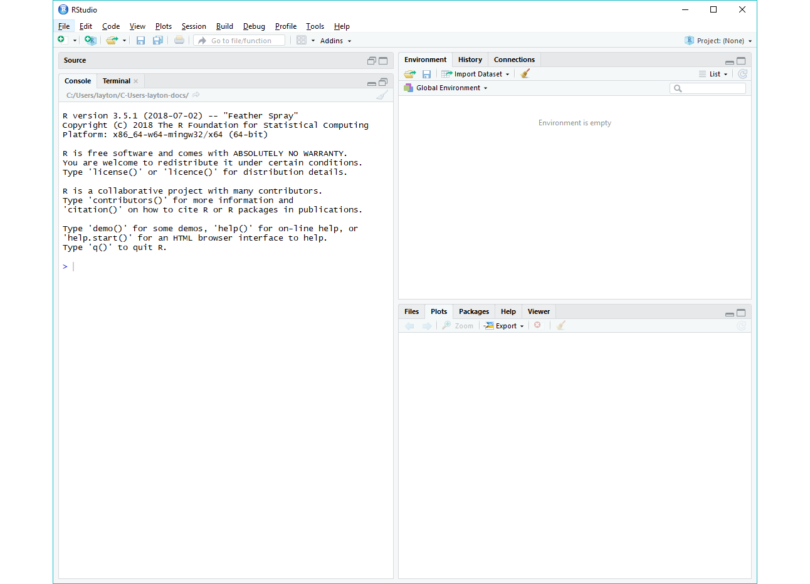

```{r include = FALSE}
library(knitr)
opts_knit$set(root.dir = "../")
opts_chunk$set(echo = FALSE, out.width = "70%", comment = NULL)
```

# install software

Please complete these tasks before our first lab period. 


## install R and RStudio

Windows users may have to login as an Administrator (localmgr) before installing the software. 

- Install R for your OS: <https://cloud.r-project.org> 
- Install RStudio, a user interface for R:  <https://www.rstudio.com/products/rstudio/#Desktop> 

If you already have R and RStudio installed, please update to the most recent releases and update your R packages as well. 

If you need additional assistance for Mac OS or Linux, these links might be useful 

- [Install R and RStudio on Mac OS](https://medium.com/@GalarnykMichael/install-r-and-rstudio-on-mac-e911606ce4f4) by Michael Galarnyk (or you can Google more recent instructions)    
- [How to Install R Ubuntu 16.04 Xenial](https://www.datascienceriot.com//r/install-ubuntu16/) by Kris Eberwein (or you can Google more recent instructions) 


## install git

Git is version control software you install on your machine. Once installed, we access its functionality via the RStudio interface. Jenny Bryan provided these installation instructions for a workshop I attended. I suggest you read all the instructions before starting. 

- [Git already installed?](http://happygitwithr.com/install-git.html#git-already-installed) 
- [Windows](http://happygitwithr.com/install-git.html#install-git-windows) install 
- [Mac OS](http://happygitwithr.com/install-git.html#mac-os) install 
- [Linux](http://happygitwithr.com/install-git.html#linux) install 


Optional reading: If you are interested in why version control is important, read sections 1 and 2 of the following article by Jenny Bryan, [Excuse me, do you have a moment to talk about version control?](https://dx.doi.org/10.7287%2Fpeerj.preprints.3159v2) 


## create a library for packages 

Packages are like "apps" for R. As Hadley Wickham [-@Wickham2014AdvR] states, "Packages are the fundamental units of reproducible R code. They include reusable functions, the documentation that describes how to use them, and sample data."  

If we store packages in a library separate from the base R installation, then when you update R, you don't have to reinstall every package, saving a lot of time.

At the top level of your drive, create a new directory (folder) named "R". In that directory create a new folder named "library", for example,

- Windows: `C:/R/library`    
- Linux: `~/R/library`    


## test the installation

Here we perform some simple checks to determine if the initial software installation is successful. If the test is unsuccessful, don't panic---we'll have some time in lab to make things work. 

- Launch RStudio 

A window should open that looks something like this. 

```{r}

```

You can type R code in the Console pane, and press Enter to run it. For example, 

- in the Console type `2 + 7`  
- press Enter to obtain the result 

```{r}
2 + 7
```

We can draw a simple graph that should appear in the Plots pane. 

- one line at a time, type the following lines and press Enter    

```{r echo = TRUE, out.width = "50%"}
t <- seq(1, 6*pi, pi/16)
y <- sin(t)
plot(t, y)
```

Lastly, let's check if RStudio can see git locally. In RStudio, 

- Tools > Terminal > Move Focus To Terminal  
- In the terminal pane, type  

```
git --version 
```

If RStudio is aware of your git installation, you should see a response in the terminal something like this 

```
git version 2.17.0.windows.1
```

If not, no worries. We'll take care of it in lab. 


## references

<div id="refs"></div>


---    
[Calendar](../README.md#calendar)    
[Index](../README.md#index)    
