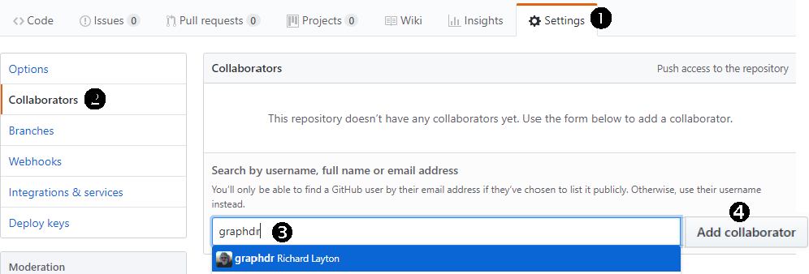

# software lab

  - [prerequisites](#prerequisites)
  - [setup GitHub](#setup-github)
  - [create a repo](#create-a-repo)
  - [create an Rproject](#create-an-rproject)
  - [create the Renviron](#create-the-renviron)
  - [setup directories](#setup-directories)
  - [edit gitignore](#edit-gitignore)
  - [invite collaborator](#invite-collaborator)
  - [edit README](#edit-readme)
  - [setup reading response](#setup-reading-response)
  - [commits](#commits)

## prerequisites

You should already have done the following

  - Installed git locally
  - Obtained a free GitHub account
  - Practiced creating a test repo (when you cached your credentials)

## setup GitHub

GitHub is a hosting service that provides an online home for your
Git-based projects—critically important for sharing with
collaborators. Once you have a GitHub account, you will update your
repositories using the RStudio interface.

  - [Join GitHub
    Education](http://happygitwithr.com/github-acct.html#free-private-repos)
    Follow the links to join GitHub Education — it’s free.

Optional reading: Read section 4 of [Excuse me, do you have a moment to
talk about version
control?](https://dx.doi.org/10.7287%2Fpeerj.preprints.3159v2) for a
good introduction to GitHub repositories.

Setup GitHub following these instructions. I suggest you read the full
instructions for one of the steps before doing that step.

  - Some instructions ask you to type commands in the “shell”. To access
    the shell, open RStudio and use the pulldown menu *Tools \> Shell*.
  - [Introduce yourself to
    Git](http://happygitwithr.com/hello-git.html#hello-git) using the
    name and email you used with your GitHub account
  - [Cache your username and
    password](http://happygitwithr.com/credential-caching.html#credential-caching)
    or so you don’t need to authenticate yourself to GitHub
    interactively ad nauseum. Alternatively, you can [set up SSH
    keys](http://happygitwithr.com/ssh-keys.html#ssh-keys).  
  - [Prove RStudio can find local
    Git](http://happygitwithr.com/rstudio-git-github.html#rstudio-git-github)
    and, therefore, can talk to GitHub

Once everything is working OK, you may delete any temporary test repos
you made.

  - Delete the local test project directories
  - Navigate to the repo on GitHub and go to *Settings \> Danger Zone \>
    Delete this repository*

## create a repo

Create a repo on GitHub called `portfolio-last-first`, replacing `last`
with your last name (family name or surname) and `first` with your first
name (given name or forename)

  - Make the repo private
  - Check the box to *Initialize this repository with a README*
  - Pulldown the *Add gitignore* menu to *R*
  - A license is optional (private repos for classwork don’t generally
    need a license)
  - *Create repository*

## create an Rproject

Instructions adapted from (Bryan, [2018](#ref-Bryan2018))

  - Navigate to your portfolio repo on GitHub  
  - Copy the HTTPS clone URL to your clipboard via the green “Clone or
    Download” button. The URL will look something like this:
    `https://github.com/jennybc/myrepo.git`

In RStudio,

  - *File \> New Project \> Version Control \> Git*
  - Paste the repo URL into the *repository URL* box
  - Select a location on your computer to save the project  
  - Click *Create Project* to create a new directory

The new project directory will be all of these things:

  - a directory or “folder” on your computer
  - a local Git repository linked to a remote GitHub repository
  - an RStudio Project

Check yourself

  - Close RStudio
  - Restart RStudio
  - You should see a `Git` tab in a pane ribbon as well as in the
    RStudio top ribbon

Lastly, let’s check your project directory. While you may have
additional files or folders (for example, when you initialized your repo
you may have created `.gitignore` or `README.md`), you should have at
least the following folders and files,

    portfolio-last-first/
        `-- portfolio-last-first.Rproj

Optional reading if you want to read more about it or if you need to
setup a repo for an existing RStudio Project.

  - [New project, GitHub
    first](http://happygitwithr.com/new-github-first.html) These are the
    steps I summarized above.
  - [Existing project, GitHub
    first](http://happygitwithr.com/existing-github-first.html)
  - [Existing project, GitHub
    last](http://happygitwithr.com/existing-github-last.html)

## create the Renviron

The `.Renviron` file is a text file that directs R packages to be
installed in the `R/library` directory created earlier. To create the
file, with RStudio open,

  - Create a new text file, *File menu \> New File \> Text File*.
  - Save the file to the `portfolio` main directory using the filename
    *.Renviron*

In this file, write the following line of text that tells R the path to
the stand-alone package library you created earlier.

  - Windows: `R_LIBS_USER="C:/R/library"`
  - Linux: `R_LIBS_USER="~/R/library"`

Save and close the file.

Now let’s see if the library path you made works.

  - Close RStudio
  - Re-open the R project for your portfolio  
  - Find the RStudio pane with *Packages* in its ribbon. Select
    *Packages \> Install*
  - In the dialog box that appears, the *Install to Library* strip
    should show `C:/R/library [Default]` (in Windows) or `~/R/library
    [Default]` in Linux

If the *Install to Library* is not correct, check that

  - Your have opened an R project
  - The `.Renviron` file is in the project top level directory
  - The `.Renviron` file has the correct contents described earlier  
  - The file path in the `.Renviron` file agrees with the path to the
    `R/library` directory you made earlier

If the *Install to Library* is correct,

  - Type `tidyverse` in the *Packages* box  
  - *Install*

If all goes well, you’ll see something like this in the R Console

    ## > install.packages("tidyverse")
    ## Installing package into 'C:/R/library' 
    ## (as 'lib' is unspecified)
    ## trying URL 'https://cran.rstudio.com/bin/windows/contrib/3.5/tidyverse_1.2.1.zip'
    ## Content type 'application/zip' length 92547 bytes (90 KB)
    ## downloaded 90 KB
    ## 
    ## package 'tidyverse' successfully unpacked and MD5 sums checked

Let’s check your project directory. While you may have additional files
or folders (for example, when you initialized your repo you may have
created `.gitignore` or `README.md`), you should have at least the
following folders and files,

    portfolio-last-first/
        |-- .Renviron
        `-- portfolio-last-first.Rproj

Remember, every time you create a new project (with or without version
control), paste a copy of the `.Renviron` file at the top level of the
project directory

## setup directories

All we are going to do is create a set of empty sub-directories
(folders).

  - Re-open (if you closed it) the R project for your portfolio

Next, use one of these two approaches

  - In your OS, use your usual method for creating folders manually
  - Or in RStudio, *Files \> New Folder*

Using either approach, create new folders for `carpentry`, `data-raw`,
etc. When done, the directory tree should look like this (you might have
additional files such as `.gitignore` or `README.md`)

    portfolio-last-first/
        |-- carpentry/
        |-- data-raw/
        |-- data/
        |-- design/
        |-- figures/
        |-- practice/
        |-- reports/
        |-- resources/
        |-- .Renviron
        `-- portfolio-last-first.Rproj

## edit gitignore

The `.gitignore` file lists local files excused from version control and
therefore not shared with collaborators.

You originally created the `.gitignore` file when you set up the repo.
In RStudio, open `.gitignore`. If you set it up to ignore R, the first
few lines of your file should look something like this,

    # History files
    .Rhistory
    .Rapp.history
    
    # Session Data files
    .RData
    
    ... (etc) 

If your project directory does not contain `.gitignore` file, you
probably skipped that step when you created the repo. No worries. You
can create the file as follows,

  - In RStudio, *File \> New File \> Text File*  
  - *File \> Save As* to your project main directory with the name
    (starts with a period) `.gitignore`

Once the file exists,

  - Open the `.gitignore` file
  - Add these lines

<!-- end list -->

    # R files not version controlled
    .Rhistory
    .Rapp.history
    .RData
    .Rproj.user/

We can also generally omit rendered documents, e.g., HTML files or docx
files, from version control. Add these lines of code to the `.gitignore`
file.

    # top directory files not version controlled
    *.html
    *.docx
    
    # sub-directory files not version controlled
    */*.html
    */*.docx

Optional: Raw data does not generally have to be version controlled. If
the files are large, some analysts list the raw data directory in
gitignore.

    # raw data files not version controlled 
    data-raw

  - Save and close the gitignore file

Anytime you create a folder or a file you want git to ignore, just add
its path to the `.gitignore` file

  - Check yourself: the `.gitignore` file should be in the top-level
    project directory.

If you select the `Git` tab in the RStudio pane, all files you
identified in `.gitignore` should disappear from the list of unstaged
files.

## invite collaborator

We get two primary benefits from using version control

  - I can easily review and comment on your work  
  - You can easily revert to an earlier version of the project

To invite me to be a collaborator, navigate to your portfolio repo on
GitHub and

1.  Select the *Settings* tab
2.  Select the *Collaborators* menu
3.  In the *Search by user name* box, type my GitHub name, “graphdr”
4.  *Add Collaborator*



## edit README

The README file that resides at the top level of your project directory
is the landing page of your repo. This is the first glimpse a reader has
of your project.

When you created your project repo, if you checked the box for
*Initialize the repo with a README*, then your project should have a
`README.md` file. If not, no worries. We’re going to edit it using R
Markdown anyway.

We’re going to create an R Markdown file to edit or create the README
file.

  - In RStudio, *File \> New File \> R Markdown … \> OK*
  - Delete the default script
  - *Save As* to the top level of your project with the filename
    `README.Rmd`

Add the YAML header for a GitHub document and your name, as follows. You
can edit the title and date to suit yourself.

    ---
    output: github_document
    ---

Create a level-1 heading for the repo title and add your name and date.
By using the inline R code `Sys.Date()`, the date is automatically set
to the current date.

``` 
# Portfolio of data displays  

Your Name  
`r Sys.Date()`  
```

Add some prose that introduces your portfolio.

    ## Introduction
    
    A portfolio documents your professional growth and competence by
    providing tangible evidence of your knowledge and skills in data
    visualization and visual rhetoric. The introduction is the reader's
    first glimpse of your work; give them a reason to keep reading.

In the RStudio menu ribbon, click the *Knit* button. You can also use
the keyboard shortcut Ctrl + Shift + K.

Your project directory should look something like this,

    portfolio-last-first/
        |-- carpentry/
        |-- data-raw/
        |-- data/
        |-- design/
        |-- figures/
        |-- practice/
        |-- reports/
        |-- resources/
        |-- .Renviron
        |-- .gitignore
        |-- README.md
        |-- README.Rmd
        `-- portfolio-last-first.Rproj

For more information on writing a good README file, see
<https://github.com/noffle/art-of-readme>

## setup reading response

The reading response report is the first R markdown document to set up.

  - In RStudio *File \> New File \> R Markdown… \> OK*
  - *Save As* the Untitled file to your `reports` folder with the name
    `reading-responses.Rmd`
  - Delete all the default content
  - Add a YAML header at the top of the file

<!-- end list -->

    ---
    output: github_document
    ---

Next, we’ll add a heading for the page and a heading for the week 2
reading response. You can copy the following lines and paste them into
your Rmd file.

    ## Reading responses 
    
    ## week 2
    
    Tufte, Edward (1997) The decision to launch the space shuttle Challenger.
    In: *Visual and statistical thinking: Displays of evidence for making
    decisions.* Cheshire, CT: Graphics Press, 16--31.

Next we add some prompts and space for your
    responses.

    **Prompt:** Identify one or two of the author's theses. Briefly restate these ideas in your own words.
    
    **Response:** 
    
    **Prompt:** Describe the evidence the author presents to support those ideas.
    
    **Response:**  
    
    **Prompt:** Explain how the author’s argument might be used to support a decision you would make in 
    designing a display. 
    
    **Response:** 

  - Save the file
  - Knit the file to see the rendered output document
  - When you read the article, return to this file and write your
    responses.

## commits

The process of *Commit \> Pull \> Push* is how you upload your latest
version of your project to the GitHub repo.

  - Re-open (if you closed it) the R project for your portfolio  
  - Select the *Git* tab

If there are files shown in the Git pane,

  - Click your cursor in the *git* pane
  - Select all the files using the keyboard shortcut *Ctrl A* (*Command
    A* in the Mac OS)
  - Stage all files by clicking in one of the *Staged* boxes
  - Select *Commit*
  - In the text box, write a short but descriptive message that
    summarizes the nature of the commit
  - *Commit*
  - *Pull* and you will see the message *Current branch master is up to
    date*  
  - *Close*
  - *Push*
  - *Close*

Navigate to your online repo and you should find that it includes all
your changes.

## references

<div id="refs">

<div id="ref-Bryan2018">

Bryan, Jenny (2018) Happy Git and GitHub for the useR
(<http://happygitwithr.com/>).

</div>

</div>

-----

[Calendar](../README.md#calendar)  
[Index](../README.md#index)
