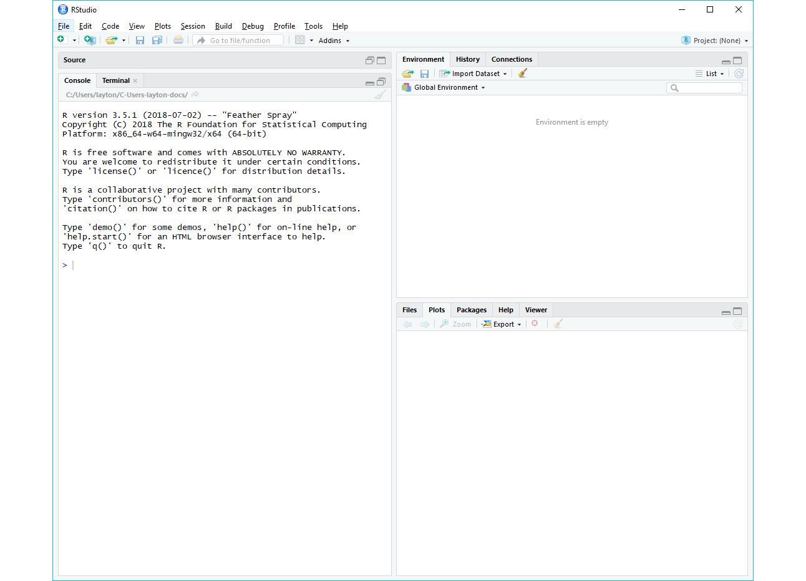

# test initial installation

Here we perform some simple checks to determine if the initial software
installation is successful. If the test is unsuccessful, don’t
panic—we’ll have some time in lab to make things work.

  - Launch RStudio

A window should open that looks something like this.



You can type R code in the Console pane, and press Enter to run it. For
example,

  - in the Console type `2 + 7`  
  - press Enter to obtain the result

<!-- end list -->

    [1] 9

We can draw a simple graph that should appear in the Plots pane.

  - one line at a time, type the following lines and press Enter

<!-- end list -->

``` r
t <- seq(1, 6*pi, pi/16)
y <- sin(t)
plot(t, y)
```


Lastly, let’s check if RStudio can see git locally. In RStudio,

  - Tools \> Terminal \> Move Focus To Terminal  
  - In the terminal pane, type

<!-- end list -->

    git --version 

If RStudio is aware of your git installation, you should see a response
in the terminal something like this

    git version 2.17.0.windows.1

If not, no worries. We’ll take care of it in lab.

-----

[Calendar](../README.md#calendar)  
[Index](../README.md#index)
