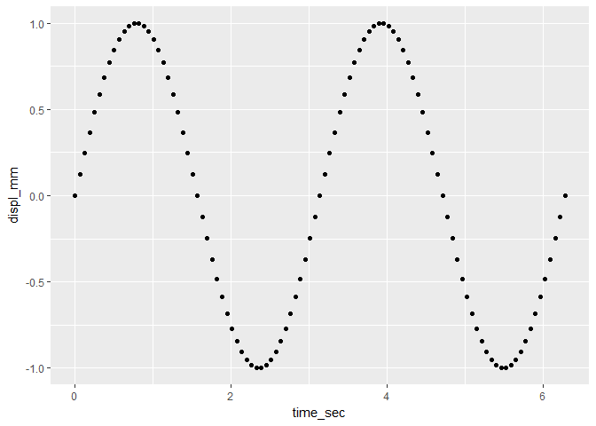

create a scatterplot
--------------------

At this point in the tutorial, we expect you to have a data frame *vibr\_data* in your workspace with columns *time\_sec* and *displ\_mm*. If not, please return to the earlier tutorials.

The structure of our *ggplot2* scatterplot begins with identifying the data frame, the columns assigned as *x* and *y* variables, and using *points* as data markers.

``` r
# basic scatterplot
f1 <- ggplot(data = vibr_data, aes(x = time_sec, y = displ_mm)) +
    geom_point()

print(f1)
```



What the commands mean

-   `ggplot()` initializes a ggplot object
-   `data =` assigns the data frame with our data
-   `aes()` describes the "aesthetic mapping" from data to visual properties
-   `geom_point()` draws points on a scatterplot
-   `print()` prints the graph onscreen in the RStudio *Plots* pane.

Previous tutorial: [create a data frame](tut-0303_create-data-frame.md)<br> Next tutorial: [edit data markers](tut-0305_edit-data-markers.md)

------------------------------------------------------------------------

[main page](../README.md)<br> [topics page](README-by-topic.md)
