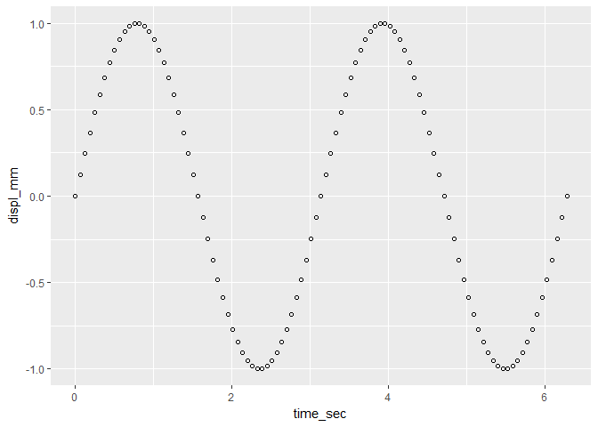

edit the data markers
---------------------

Our scatterplot script to this point consists of

``` r
library(ggplot2)

time_sec  <- seq(0, 2*pi, by = pi/50) # sec
freq      <- 2                        # r/s
displ_mm  <- sin(freq * time_sec)     # mm
vibr_data <- data.frame(time_sec, displ_mm)

f1 <- ggplot(data = vibr_data, aes(x = time_sec, y = displ_mm)) +
    geom_point()
```

Change the data marker using the `shape` argument, taking values between 1 and 25 for the [R default plotting symbols](http://www.cookbook-r.com/Graphs/Shapes_and_line_types/). Shapes numbered 21-25 have both `color` (outline) and `fill` color attributes.

In the `geom_point()` function, add the argument `shape = 21`.

``` r
f1 <- ggplot(data = vibr_data, aes(x = time_sec, y = displ_mm)) +
    geom_point(shape = 21)

print(f1)
```



We edit the attributes of the data marker further by adding `color`, `fill`, and `size` arguments to `geom_point()`.

``` r
f1 <- ggplot(data = vibr_data, aes(x = time_sec, y = displ_mm)) +
    geom_point(shape = 21
        , color = "slateblue4"
        , fill  = "slateblue1"
        , size  = 3
        )
```

In the `geom_point()` argument list, I'm using a "line-break before each comma" style. It may look odd at first, but it has a purpose. I can comment-out a single argument line without affecting the rest of the code. I find that this helps with debugging and reusing code plus makes a long list of arguments easier to read.

``` r
print(f1)
```


We'll treat color in much more detail later, but for now, the document [Colors in R](http://www.stat.columbia.edu/~tzheng/files/Rcolor.pdf) shows the default R colors by name.

Previous tutorial: [create a data frame](tut-0304_create-scatterplot.md)<br> Next tutorial: [create a data frame](tut-0306_edit-axis-labels-title.md)

------------------------------------------------------------------------

[main page](../README.md)<br> [topics page](README-by-topic.md)
