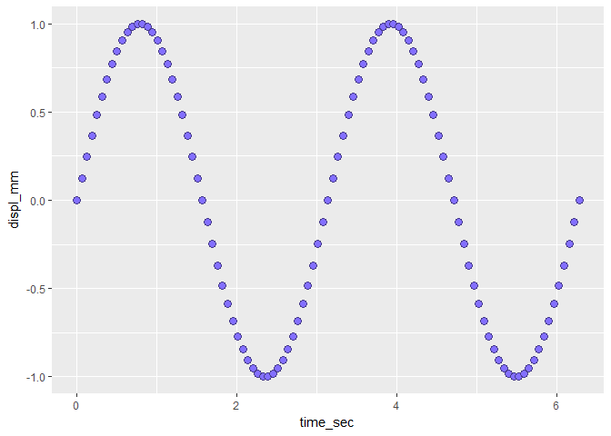
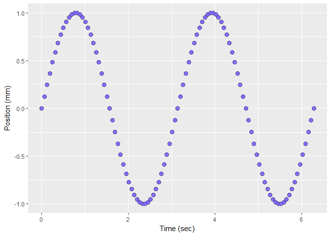
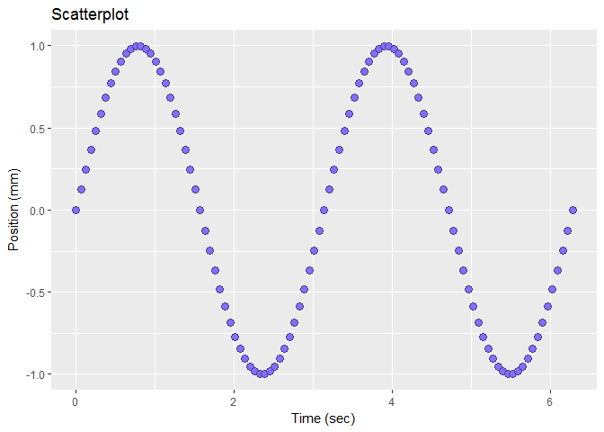

edit axis labels and title
--------------------------

At this point in the tutorial, we expect you to have a *ggplot()* graph object called *f1* that looks like this:

If not, please return to the earlier tutorials.



Label the axes, replacing the default axis labels.

``` r
# add axis labels
f1 <- f1 + 
    xlab("Time (sec)") + 
    ylab("Position (mm)")
print(f1)
```



Add a main title.

``` r
# add a title
f1 <- f1 + 
    ggtitle("Scatterplot")
print(f1)
```



I'm showing you one or two lines of code at a time so you can add the lines, run the script, and see the results one chunk at a time.

In practice, I usually just keep adding lines to the original `ggplot()` function using the plus (+) function, like this.

    # chaining functions together using the plus (+) sign
    f1 <- ggplot(data = vibr_data, aes(x = time_sec, y = displ_mm)) +
        geom_point(shape = 21
            , color = "slateblue4"
            , fill  = "slateblue1"
            , size  = 3
            ) +
        xlab("Time (sec)") + 
        ylab("Position (mm)") +
        ggtitle("Scatterplot")
        
    print(f1)

Previous tutorial: [edit the data markers](tut-0305_edit-data-markers.md)<br> Next tutorial : [edit the scales](tut-0307_edit-scales.md)

------------------------------------------------------------------------

[main page](../README.md)<br> [topics page](README-by-topic.md)
